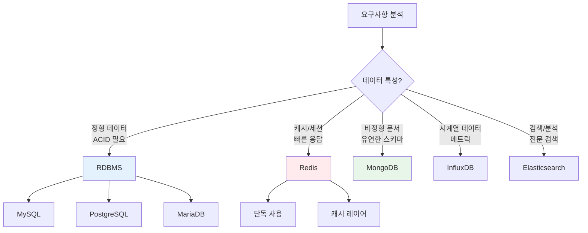
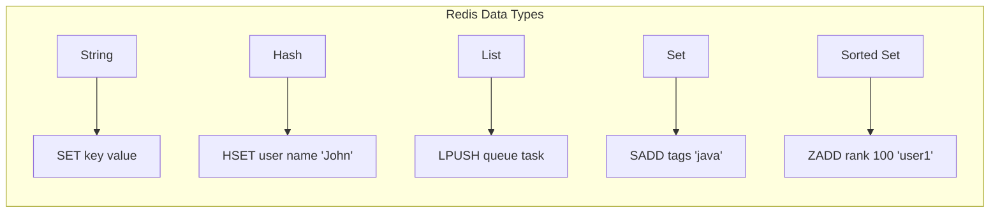
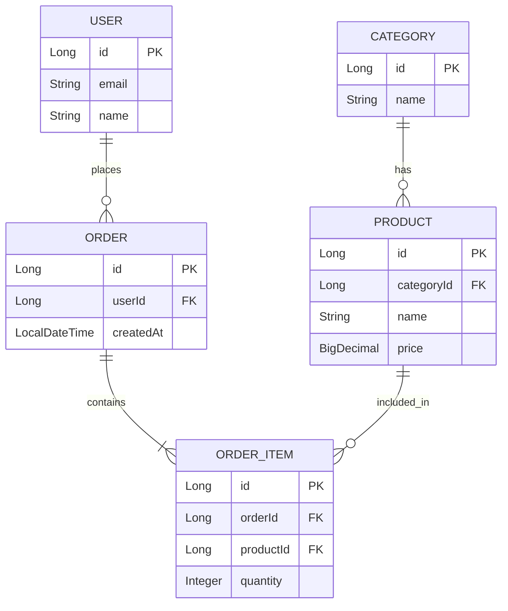

# 데이터베이스 문서

데이터베이스 설치, Redis 캐싱, JPA/QueryDSL 활용에 관한 가이드입니다.

## 문서 경계

- 이 페이지는 현재 문서로 이동하기 위한 인덱스이며 제품 선택이나 운영 준비 완료를 보증하지 않습니다.
- 설치 문서는 OS·DB 버전, 네트워크 노출, 인증서와 백업 조건을 먼저 확인하고 사용합니다.
- ORM·캐시 예시는 데이터 모델, 트랜잭션 경계, 쿼리 계획과 실패 시 일관성을 명시한 뒤 적용합니다.
- 링크·요약·비교표는 대상 문서의 실제 범위가 바뀔 때 함께 갱신합니다.


<div class="compose-hero" markdown>
<span class="compose-kicker">Databases</span>

## 설치부터 캐싱, ORM 활용까지 데이터베이스 문서 모음

RDBMS 선택, Redis 활용, JPA 및 QueryDSL 설계 포인트를 실제 애플리케이션 개발 흐름에 맞춰 빠르게 찾을 수 있도록 정리했습니다.

<div class="landing-meta-list" markdown>
<span>Installation</span>
<span>Redis</span>
<span>JPA</span>
<span>QueryDSL</span>
</div>

<div class="compose-actions" markdown>
[:octicons-arrow-right-24: 설치 가이드](installation.md){ .md-button .md-button--primary }
[:material-cached: Redis 개요](redis/overview.md){ .md-button }
[:material-relation-many-to-many: JPA 개요](jpa/overview.md){ .md-button }
</div>
</div>

## :material-database: 핵심 데이터 영역

<div class="grid cards" markdown>

-   :material-download:{ .lg .middle } **설치 가이드**

    ---

    다양한 RDBMS 설치 및 초기 설정

    [:octicons-arrow-right-24: 데이터베이스 설치](installation.md)

-   :material-cached:{ .lg .middle } **Redis**

    ---

    인메모리 캐시 및 세션 스토어

    - [Redis 개요](redis/overview.md)
    - [Spring Boot 연동](redis/springboot-integration.md)

-   :material-relation-many-to-many:{ .lg .middle } **JPA & Spring Data**

    ---

    Java ORM 표준 및 동적 쿼리

    - [JPA 개요](jpa/overview.md)
    - [관계 매핑](jpa/relationships.md)
    - [QueryDSL 활용](jpa/querydsl.md)
    - [생명주기](jpa/lifecycle.md)

</div>

---

## :material-help-circle: 데이터베이스 선택 가이드



---

## :material-compare: RDBMS 비교

| 특성 | MySQL | PostgreSQL | MariaDB |
|------|-------|------------|---------|
| **라이선스** | GPL + 상용 | BSD | GPL |
| **JSON 지원** | ⭐⭐ | ⭐⭐⭐ | ⭐⭐ |
| **복제** | 비동기/반동기 | 동기/비동기 | 비동기/반동기 |
| **파티셔닝** | Range, Hash | 다양 | Range, Hash |
| **Full-text** | InnoDB, MyISAM | GIN, GiST | InnoDB |
| **추천 용도** | 웹 서비스, OLTP | 복잡한 쿼리, GIS | MySQL 대체 |

---

## :material-memory: Redis 아키텍처

### 데이터 구조



### 캐싱 패턴

| 패턴 | 설명 | 사용 사례 |
|------|------|----------|
| **Cache Aside** | 애플리케이션이 캐시 관리 | 일반적인 캐싱 |
| **Read Through** | 캐시가 DB 조회 | 읽기 중심 |
| **Write Through** | 캐시와 DB 동시 쓰기 | 일관성 중요 |
| **Write Behind** | 캐시만 쓰고 비동기 DB 저장 | 성능 중요 |

---

## :material-relation-one-to-many: JPA 관계 매핑

### 관계 유형



### 어노테이션 요약

| 관계 | 어노테이션 | 예시 |
|------|-----------|------|
| 1:1 | `@OneToOne` | User ↔ Profile |
| 1:N | `@OneToMany` | User → Orders |
| N:1 | `@ManyToOne` | Order → User |
| N:M | `@ManyToMany` | Student ↔ Course |

---

## :material-speedometer: 성능 최적화

### 쿼리 최적화

```sql
-- 인덱스 생성
CREATE INDEX idx_user_email ON users(email);
CREATE INDEX idx_order_user_created ON orders(user_id, created_at);

-- 실행 계획 확인
EXPLAIN ANALYZE SELECT * FROM orders WHERE user_id = 1;
```

### N+1 문제 해결

```java
// ❌ N+1 문제 발생
List<User> users = userRepository.findAll();
users.forEach(u -> u.getOrders().size()); // 각 user마다 쿼리

// ✅ 페치 조인으로 해결
@Query("SELECT u FROM User u JOIN FETCH u.orders")
List<User> findAllWithOrders();
```

### 인덱스 전략

| 인덱스 유형 | 사용 사례 | 주의점 |
|------------|----------|--------|
| **B-Tree** | 범위 검색, 정렬 | 기본값 |
| **Hash** | 등값 비교 | 범위 검색 불가 |
| **Full-text** | 전문 검색 | 대용량 텍스트 |
| **Composite** | 다중 컬럼 검색 | 컬럼 순서 중요 |

---

## :material-wrench: 관리 도구

| 도구 | 지원 DB | 특징 |
|------|---------|------|
| **DBeaver** | 다중 | 무료, 범용 |
| **DataGrip** | 다중 | JetBrains, 유료 |
| **pgAdmin** | PostgreSQL | 공식 도구 |
| **MySQL Workbench** | MySQL | 공식 도구 |
| **Redis Insight** | Redis | GUI 관리 |

---

## :material-link-variant: 관련 문서

- [Java 문서](../java/index.md) - JPA 기반 언어
- [Docker 설치](../development/docker/installation.md) - DB 컨테이너 실행
- [인프라 모니터링](../infrastructure/monitoring/prometheus-grafana-loki.md) - DB 메트릭

---

## :material-book-open-page-variant: 참고 자료

- [MySQL Documentation](https://dev.mysql.com/doc/)
- [PostgreSQL Manual](https://www.postgresql.org/docs/)
- [Redis Documentation](https://redis.io/documentation)
- [Spring Data JPA Reference](https://docs.spring.io/spring-data/jpa/docs/current/reference/html/)
