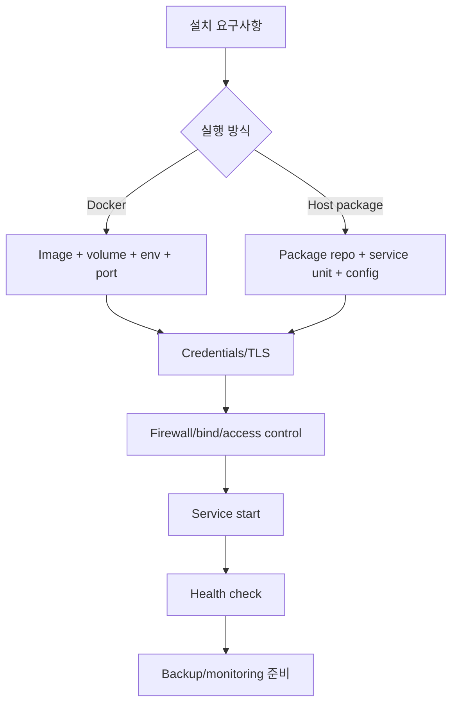
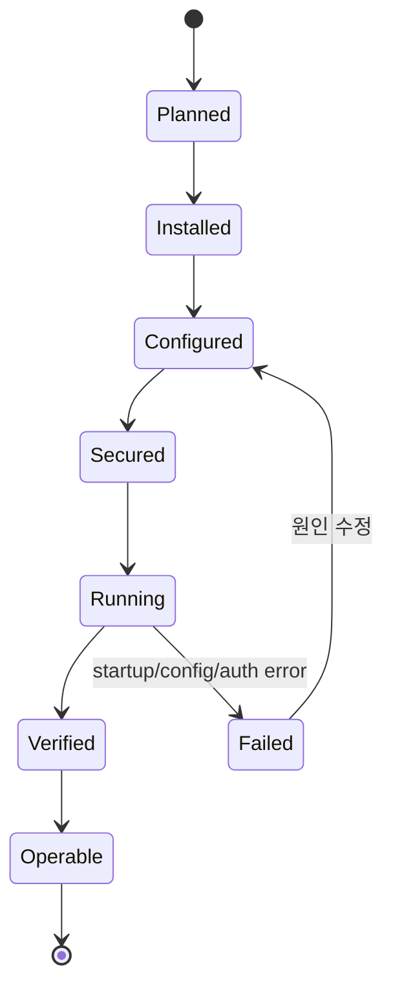

# 데이터베이스 및 애플리케이션 설치 학습 및 기록 노트

## 1. 왜 필요한가? (Pain Point & Motivation)

데이터베이스와 관련 애플리케이션은 단순히 패키지를 설치하거나 컨테이너를 실행하는 것으로 끝나지 않는다. 데이터 볼륨, 인증, TLS 인증서, 포트 노출, 방화벽, 초기 사용자, backup, log 확인이 함께 맞아야 실제로 안전하게 운영할 수 있다. 제품별 명령은 버전과 배포판에 따라 달라지므로, 설치 문서는 고정 명령어보다 상태 전이와 검증 기준을 먼저 잡아야 한다.

이 문서는 원문의 MySQL/MariaDB, PostgreSQL, Redis, RabbitMQ, Kavita 설치 가이드를 container/host installation runbook 관점으로 재작성한다.

## 2. 현재 나의 상태 (Baseline)

- Docker로 DB를 실행하거나 Ubuntu host에 패키지를 설치하는 기본 흐름은 알고 있다.
- SSL/TLS, volume, password, firewall, reverse proxy 설정을 설치 절차 안에서 함께 확인해야 한다.
- 제품별 명령어가 version-specific이라 그대로 복사하기 전에 공식 문서와 현재 환경을 확인해야 한다.
- 설치 후 검증 명령, 로그 확인, 포트 확인, 인증서 권한 점검이 빠지면 장애 원인 파악이 어렵다.

## 3. 도달하고 싶은 목표 (Target State)

- 설치 전에 데이터 경로, 포트, 인증, TLS, backup 요구사항을 결정한다.
- Docker 설치와 host 설치의 책임 경계를 구분한다.
- MySQL/MariaDB, PostgreSQL, Redis, RabbitMQ, Kavita의 기본 runtime state를 확인한다.
- 외부 노출이 필요한 경우 firewall, bind address, TLS, access control을 함께 설정한다.
- 설치 후 `logs`, `ss`, client connection, permission check로 정상 동작을 검증한다.

## 4. 시스템 번역 (Data Flow)



설치 data flow는 실행 파일을 배치하는 단계보다, persistent state와 network/security boundary를 올바르게 연결하는 단계가 더 중요하다.

## 5. 핵심 구성요소 (Building Blocks)

| 구성요소 | 역할 | 확인 기준 |
| --- | --- | --- |
| Data volume | DB 영속 데이터 저장 | container 재시작 후 데이터 유지 |
| Config file | bind, TLS, auth, memory 정책 | 운영 요구와 일치 |
| Credential | root/admin/user password | secret으로 관리, 기본값 금지 |
| TLS certificate | client-server 암호화 | key 권한, CN/SAN, 만료일 |
| Port binding | 외부 접속 경로 | 필요한 interface에만 노출 |
| Firewall | host network 접근 제어 | 허용 CIDR 최소화 |
| Service unit | host 설치 service lifecycle | enable/start/status 확인 |
| Logs | 초기화/오류 확인 | startup error 없음 |
| Health check | client connection 검증 | 실제 query 또는 ping 성공 |
| Backup plan | 복구 가능성 확보 | dump/snapshot/restore 테스트 |

## 6. 상태 전이 (State Transition)



설치는 `Running`에서 끝나지 않는다. 실제 client 접속, 인증, TLS, persistence, backup 가능성이 검증되어야 운영 가능한 상태다.

## 7. 불변식 (Invariant: 절대 깨지면 안 되는 규칙)

- 데이터베이스 영속 데이터는 ephemeral container filesystem에만 두면 안 된다.
- 외부 접속을 열 때는 bind address, firewall, authentication, TLS를 함께 검토해야 한다.
- 기본 관리자 비밀번호나 공개된 예제 비밀번호를 운영 환경에 사용하면 안 된다.
- TLS private key는 서비스 계정만 읽을 수 있도록 권한을 제한해야 한다.
- Docker port publish는 host firewall 정책과 함께 확인해야 한다.
- Host 설치는 package repository와 service unit이 현재 OS 버전과 맞아야 한다.
- 설치 후에는 client로 실제 인증/쿼리/ping을 검증해야 한다.
- Backup은 생성뿐 아니라 restore 테스트까지 확인해야 한다.

## 8. 가장 작은 예제 (Minimal Viable Example)

PostgreSQL 컨테이너 실행의 개념 예시:

```bash
docker volume create pg_data
docker run -d --name postgres \
  -v pg_data:/var/lib/postgresql/data \
  -e POSTGRES_PASSWORD='change-me' \
  -p 5432:5432 \
  postgres:15
```

검증:

```bash
docker logs postgres
ss -tulwn | grep 5432
docker exec -it postgres psql -U postgres -c 'select 1;'
```

이 예제는 설치의 최소 단위가 image 실행이 아니라 volume, credential, port, log, client query까지 포함한다는 점을 보여준다.

## 9. 실패 사례 (What could go wrong?)

- Container volume을 지정하지 않아 재생성 시 데이터가 사라진다.
- `0.0.0.0` bind와 wide-open firewall을 동시에 사용해 DB가 인터넷에 노출된다.
- 인증서 파일 권한이 맞지 않아 PostgreSQL/Redis/RabbitMQ가 TLS 설정으로 시작하지 못한다.
- 패키지 설치 스크립트가 현재 배포판을 지원하지 않아 repository 설정이 깨진다.
- Redis를 password/TLS 없이 외부에 노출한다.
- RabbitMQ management port와 AMQP port를 혼동해 client 접속이 실패한다.
- Reverse proxy 뒤 애플리케이션에서 WebSocket/upgrade header를 전달하지 않아 UI가 깨진다.

## 10. 뇌 확장하기 (Evolution & Variants)

- MySQL/MariaDB는 user, grant, bind address, replication, backup dump를 함께 본다.
- PostgreSQL은 `pg_hba.conf`, `postgresql.conf`, role, database, extension, SSL 설정으로 확장한다.
- Redis는 standalone, sentinel, cluster, persistence RDB/AOF, eviction policy를 비교한다.
- RabbitMQ는 vhost, user permission, TLS, management plugin, queue durability를 함께 다룬다.
- Kavita 같은 애플리케이션 컨테이너는 reverse proxy, persistent config, media volume, backup 기준을 정한다.
- 운영 환경에서는 monitoring, alerting, backup restore drill, patching cadence가 필요하다.

## 11. 최종 체크리스트 (Definition of Done)

- [x] Docker/host 설치의 공통 상태 전이를 정리했다.
- [x] MySQL/MariaDB, PostgreSQL, Redis, RabbitMQ, Kavita를 설치 대상 범위에 포함했다.
- [x] Volume, credential, TLS, firewall, health check 불변식을 정리했다.
- [x] PostgreSQL 컨테이너 최소 예제와 검증 명령을 포함했다.
- [x] 원문 installation 문서를 12개 섹션 템플릿으로 재작성했다.

## 12. 뇌에 새기는 복습 문장 (TL;DR Blank)

데이터베이스 설치는 실행 명령이 아니라 영속 데이터, 인증, 네트워크 노출, TLS, 검증, 백업까지 이어지는 운영 상태 전이다.
