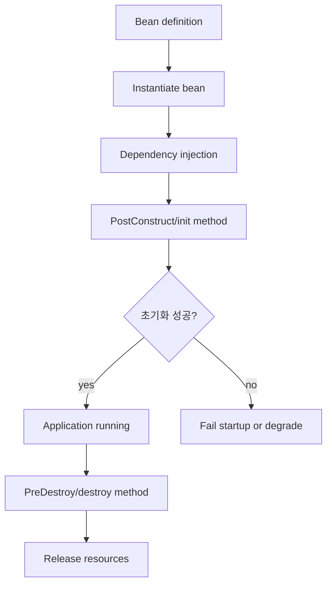
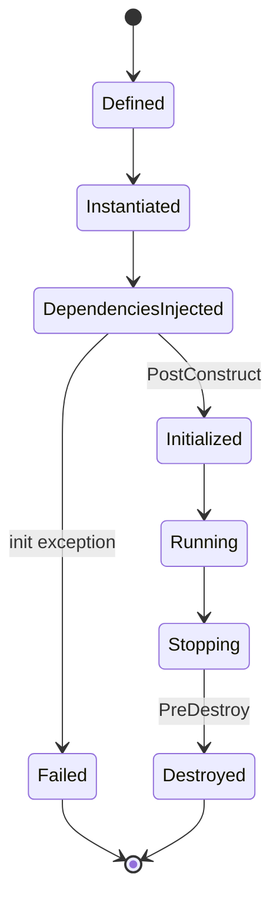

# Spring Bean Lifecycle 관리 학습 및 기록 노트

## 1. 왜 필요한가? (Pain Point & Motivation)

Spring 애플리케이션에서 Bean lifecycle은 database connection, cache warmup, background monitor, 외부 client 같은 리소스의 초기화와 해제를 안전하게 관리하는 기준이다. 초기화 순서나 종료 hook을 잘못 다루면 애플리케이션이 손상된 상태로 시작하거나, connection leak, thread leak, graceful shutdown 실패로 이어질 수 있다.

이 문서는 원문의 Bean lifecycle 관리 내용을 `@PostConstruct`, `@PreDestroy`, `SmartLifecycle`, 초기화 순서, 예외 처리 중심으로 재작성한다.

## 2. 현재 나의 상태 (Baseline)

- Spring Bean이 container에 의해 생성되고 의존성이 주입된다는 점은 알고 있다.
- `@PostConstruct`와 `@PreDestroy`를 어디에 써야 하는지 더 명확히 해야 한다.
- 초기화 중 예외가 발생했을 때 애플리케이션을 계속 실행해도 되는지 판단해야 한다.
- Lazy initialization, async initialization, shutdown order가 리소스 상태에 주는 영향을 이해해야 한다.
- DB/JPA 관련 Bean에서 connection과 transaction boundary를 lifecycle hook에 섞을 때 주의가 필요하다.

## 3. 도달하고 싶은 목표 (Target State)

- Bean 생성, dependency injection, post-construct, running, pre-destroy 흐름을 설명한다.
- 초기화 hook에서 리소스를 열고 종료 hook에서 확실히 닫는 기준을 세운다.
- `@DependsOn`, `@Order`, `SmartLifecycle`로 startup/shutdown order를 조정하는 상황을 구분한다.
- 초기화 실패를 숨기지 않고 명시적으로 fail-fast 또는 degrade 처리한다.
- Lifecycle hook 안에서 오래 걸리는 작업과 DB connection 사용을 안전하게 다룬다.

## 4. 시스템 번역 (Data Flow)



Bean lifecycle의 data flow는 객체 생성보다 이후 단계가 더 중요하다. 의존성이 주입된 뒤 초기화가 실행되고, container 종료 시 cleanup이 실행되어야 한다.

## 5. 핵심 구성요소 (Building Blocks)

| 구성요소 | 역할 | 주의점 |
| --- | --- | --- |
| `@PostConstruct` | 의존성 주입 후 초기화 | 실패를 숨기지 않는다 |
| `@PreDestroy` | container 종료 전 cleanup | thread/connection/resource 해제 |
| `InitializingBean` | Spring interface 기반 init | Spring 결합도 증가 |
| `DisposableBean` | Spring interface 기반 destroy | legacy code에서 주로 사용 |
| `@Bean(initMethod)` | 외부 class init method 연결 | third-party Bean 관리 |
| `@DependsOn` | 특정 Bean 초기화 순서 강제 | 과도한 순서 결합 주의 |
| `SmartLifecycle` | start/stop phase 제어 | graceful shutdown에 유용 |
| `@Lazy` | 실제 사용 시점까지 초기화 지연 | startup 검증이 늦어진다 |
| `TaskExecutor` | 비동기 초기화 실행 | ready state와 실패 전달 필요 |

## 6. 상태 전이 (State Transition)



초기화 실패를 catch만 하고 삼키면 `Failed` 상태가 `Running`처럼 보이게 된다. 이 상태 오염이 가장 위험한 lifecycle 실패다.

## 7. 불변식 (Invariant: 절대 깨지면 안 되는 규칙)

- `@PostConstruct`는 dependency injection이 끝난 뒤 실행된다는 전제를 가져야 한다.
- 초기화가 필수 리소스에 실패하면 애플리케이션 시작을 중단하거나 명시적인 degraded state를 만들어야 한다.
- `@PreDestroy`는 열린 resource, scheduler, thread, connection을 해제해야 한다.
- Lifecycle hook에서 얻은 `Connection`은 반드시 닫아야 하며, 가능하면 try-with-resources를 사용해야 한다.
- Lazy Bean은 실제 사용 시점까지 초기화 검증이 지연될 수 있다.
- 비동기 초기화는 애플리케이션 ready 상태와 실패 전달 방식을 별도로 설계해야 한다.
- `SmartLifecycle.getPhase()`는 startup/shutdown 순서에 영향을 주므로 의존성과 맞아야 한다.

## 8. 가장 작은 예제 (Minimal Viable Example)

```java
@Component
public class CacheWarmupService {
    private final DataSource dataSource;

    public CacheWarmupService(DataSource dataSource) {
        this.dataSource = dataSource;
    }

    @PostConstruct
    public void initialize() throws SQLException {
        try (Connection connection = dataSource.getConnection()) {
            connection.createStatement().execute("select 1");
        }
    }

    @PreDestroy
    public void cleanup() {
        // close background resources if this bean owns any
    }
}
```

이 예제는 Bean lifecycle hook에서 DB 연결 검증을 하되, connection을 즉시 닫고 실패를 숨기지 않는 방식을 보여준다.

## 9. 실패 사례 (What could go wrong?)

- `@PostConstruct`에서 `printStackTrace()`만 호출하고 실패한 Bean을 정상 상태처럼 둔다.
- 초기화 hook에서 오래 걸리는 작업을 동기 실행해 startup time이 과도하게 늘어난다.
- Async initialization 실패를 main application readiness에 반영하지 않는다.
- `@PreDestroy`에서 scheduler나 thread pool을 닫지 않아 shutdown이 지연된다.
- `@DependsOn`을 남용해 Bean 간 숨은 순서 결합이 늘어난다.
- Lazy Bean의 초기화 실패가 첫 요청 시점에 터져 장애처럼 보인다.
- Bean이 직접 connection을 오래 들고 있어 pool 고갈이 발생한다.

## 10. 뇌 확장하기 (Evolution & Variants)

- Bean lifecycle과 JPA entity lifecycle은 다르다. Bean은 Spring container 객체 상태이고, JPA entity는 persistence context 상태다.
- 애플리케이션 readiness/liveness probe는 필수 Bean 초기화 성공 여부와 연결해야 한다.
- Spring Boot에서는 `ApplicationRunner`, `CommandLineRunner`, `SmartLifecycle`, event listener를 초기화 목적별로 비교한다.
- 외부 리소스 client는 connection pool, timeout, retry, circuit breaker와 함께 초기화해야 한다.
- Graceful shutdown은 web server, message consumer, scheduler, DB pool 종료 순서를 함께 설계한다.

## 11. 최종 체크리스트 (Definition of Done)

- [x] 원문이 JPA entity가 아니라 Spring Bean lifecycle 내용을 다룬다는 점을 반영했다.
- [x] `@PostConstruct`, `@PreDestroy`, `SmartLifecycle`, `@DependsOn`, `@Lazy`의 역할을 정리했다.
- [x] DB connection 초기화 예제를 안전한 try-with-resources 형태로 재작성했다.
- [x] 초기화 실패, async init, shutdown leak 실패 사례를 포함했다.
- [x] 원문 lifecycle 문서를 12개 섹션 템플릿으로 재작성했다.

## 12. 뇌에 새기는 복습 문장 (TL;DR Blank)

Bean lifecycle 관리는 객체 생성이 아니라 리소스를 언제 열고, 실패를 어떻게 드러내며, 종료 때 무엇을 확실히 닫을지 정하는 일이다.
