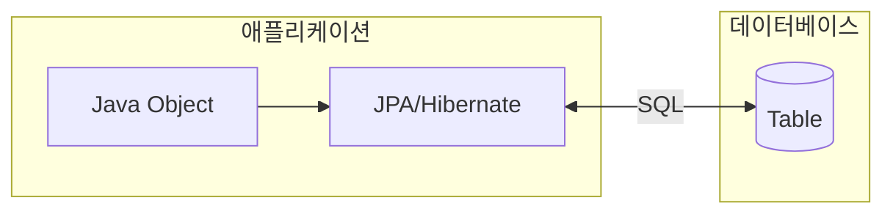
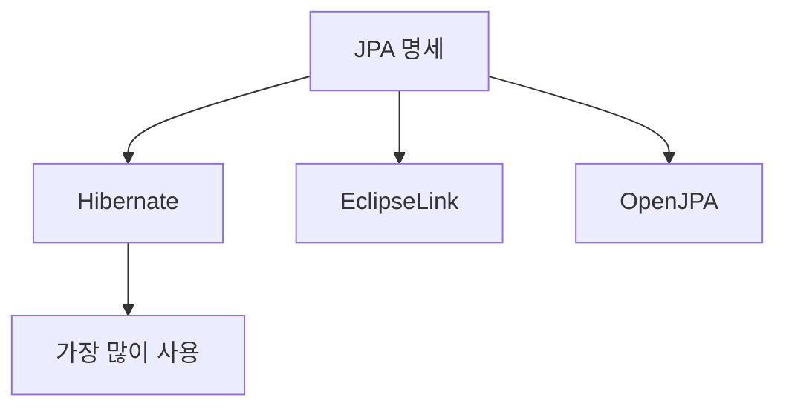
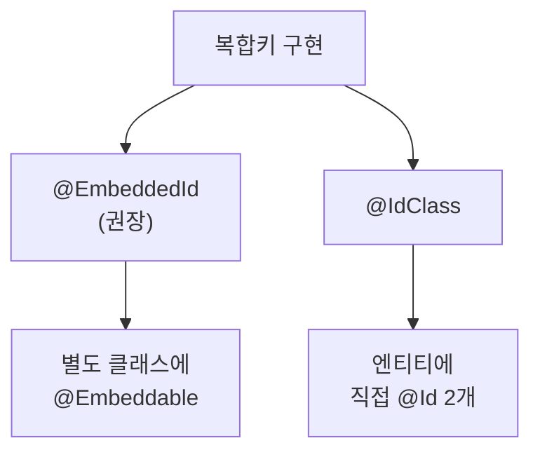
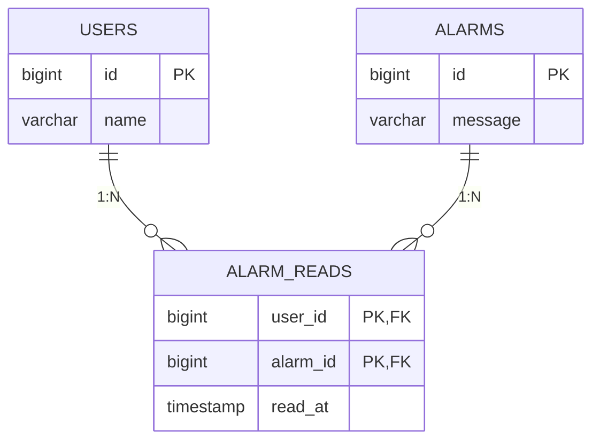

# JPA 개요 및 복합키

Java Persistence API(JPA)의 기본 개념과 복합키 매핑 방법을 설명합니다.

## 적용 범위와 검증 기준

- JPA 명세의 계약과 Hibernate 같은 구현체의 동작을 구분하고, Jakarta/Javax 패키지와 구현 버전을 고정합니다.
- 기본키 생성 전략과 SQL은 데이터베이스 dialect, 시퀀스·identity 지원, 배치 요구에 따라 선택합니다.
- 복합키 클래스는 명세가 요구하는 생성자·직렬화 가능성·`equals`/`hashCode` 계약을 만족해야 합니다. Lombok은 구현 수단 중 하나일 뿐입니다.
- 매핑 완료는 애플리케이션 기동이 아니라 스키마, insert/find/delete, 프록시 경계, 쿼리 수와 트랜잭션 롤백을 통합 테스트로 확인한 상태입니다.

---

## 📋 JPA란?

**JPA (Java Persistence API)**는 자바 객체를 관계형 데이터베이스에 영속화하기 위한 표준 명세입니다.



### 핵심 개념

| 개념 | 설명 |
|------|------|
| **Entity** | DB 테이블과 매핑되는 Java 클래스 |
| **EntityManager** | 엔티티의 생명주기를 관리 |
| **Persistence Context** | 엔티티를 관리하는 환경 |
| **JPQL** | 객체 지향 쿼리 언어 |

### JPA 구현체



---

## 🔑 기본키 전략

### 단일 기본키

```java
@Entity
public class User {
    @Id
    @GeneratedValue(strategy = GenerationType.IDENTITY)
    private Long id;
    
    private String name;
}
```

### 기본키 생성 전략

| 전략 | 설명 | 사용처 |
|------|------|--------|
| `IDENTITY` | DB에 위임 (AUTO_INCREMENT) | MySQL, PostgreSQL |
| `SEQUENCE` | 시퀀스 사용 | Oracle, PostgreSQL |
| `TABLE` | 키 생성 테이블 사용 | 모든 DB |
| `AUTO` | 자동 선택 | 기본값 |

---

## 🔗 복합키 (Composite Key)

두 개 이상의 컬럼을 기본키로 사용하는 경우 복합키를 정의합니다.

### 복합키 구현 방법



---

## 📝 @EmbeddedId 방식 (권장)

### 1. 복합키 클래스 정의

```java
@Embeddable
@NoArgsConstructor
@AllArgsConstructor
@EqualsAndHashCode  // 예시: 식별자 필드만 계약에 맞게 포함
public class AlarmReadsId implements Serializable {
    
    @Column(name = "alarm_id")
    private Long alarmId;
    
    @Column(name = "user_id")
    private Long userId;
}
```

> ⚠️ **중요**: 복합키 클래스는 반드시 `Serializable` 구현하고, `equals()`, `hashCode()` 재정의해야 합니다.

### 2. 엔티티 클래스 정의

```java
@Entity
@NoArgsConstructor
@Table(name = "alarm_reads")
public class AlarmReads {

    @EmbeddedId
    private AlarmReadsId id;

    @MapsId("userId")
    @ManyToOne(fetch = FetchType.LAZY)
    @JoinColumn(name = "user_id", nullable = false)
    private User user;

    @MapsId("alarmId")
    @ManyToOne(fetch = FetchType.LAZY)
    @JoinColumn(name = "alarm_id", nullable = false)
    private Alarm alarm;

    @CreationTimestamp
    @Column(name = "read_at")
    private Timestamp readAt;
}
```

### 3. 사용 예시

```java
// 복합키 객체 생성
AlarmReadsId id = new AlarmReadsId(alarmId, userId);

// 엔티티 생성 및 저장
AlarmReads alarmRead = new AlarmReads();
alarmRead.setId(id);
alarmRead.setUser(user);
alarmRead.setAlarm(alarm);

alarmReadsRepository.save(alarmRead);

// 조회
Optional<AlarmReads> found = alarmReadsRepository.findById(id);
```

### 4. Repository 정의

```java
public interface AlarmReadsRepository 
    extends JpaRepository<AlarmReads, AlarmReadsId> {
    
    // 사용자별 읽은 알람 조회
    List<AlarmReads> findByIdUserId(Long userId);
    
    // 특정 알람을 읽은 사용자 수
    long countByIdAlarmId(Long alarmId);
}
```

---

## 📝 @IdClass 방식

### 1. ID 클래스 정의

```java
@NoArgsConstructor
@AllArgsConstructor
@EqualsAndHashCode
public class AlarmReadsId implements Serializable {
    private Long alarm;  // 엔티티의 필드명과 일치해야 함
    private Long user;
}
```

### 2. 엔티티 정의

```java
@Entity
@Table(name = "alarm_reads")
@IdClass(AlarmReadsId.class)
public class AlarmReads {

    @Id
    @ManyToOne(fetch = FetchType.LAZY)
    @JoinColumn(name = "alarm_id")
    private Alarm alarm;

    @Id
    @ManyToOne(fetch = FetchType.LAZY)
    @JoinColumn(name = "user_id")
    private User user;

    @CreationTimestamp
    @Column(name = "read_at")
    private Timestamp readAt;
}
```

---

## 📊 방식 비교

| 특성 | @EmbeddedId | @IdClass |
|------|-------------|----------|
| **객체지향적** | ✅ 더 객체지향적 | ❌ 덜 객체지향적 |
| **JPQL 접근** | `e.id.alarmId` | `e.alarmId` |
| **식별 관계** | 복잡할 수 있음 | 간단함 |
| **선호도** | 권장 | 레거시 코드 |

---

## 🔄 @MapsId 어노테이션

`@MapsId`는 외래키가 기본키의 일부일 때 사용합니다.



```java
@MapsId("userId")  // AlarmReadsId.userId에 매핑
@ManyToOne(fetch = FetchType.LAZY)
@JoinColumn(name = "user_id")
private User user;
```

**동작 방식:**
1. `@MapsId("userId")`는 `AlarmReadsId.userId` 필드에 매핑
2. `User` 엔티티의 `id` 값이 자동으로 복합키에 설정됨
3. 별도로 `alarmReadsId.setUserId()` 호출 불필요

---

## 💡 실전 팁

### 1. N+1 문제 방지

```java
// 페치 조인 사용
@Query("SELECT ar FROM AlarmReads ar " +
       "JOIN FETCH ar.alarm " +
       "WHERE ar.id.userId = :userId")
List<AlarmReads> findByUserIdWithAlarm(@Param("userId") Long userId);
```

### 2. 복합키로 벌크 삭제

```java
@Modifying
@Query("DELETE FROM AlarmReads ar " +
       "WHERE ar.id.userId = :userId AND ar.id.alarmId IN :alarmIds")
void deleteByUserIdAndAlarmIds(
    @Param("userId") Long userId, 
    @Param("alarmIds") List<Long> alarmIds
);
```

### 3. 존재 여부 확인

```java
// 효율적인 존재 확인
boolean exists = alarmReadsRepository.existsById(
    new AlarmReadsId(alarmId, userId)
);
```

---

## ⚠️ 주의사항

### equals()와 hashCode() 계약 구현

```java
@Embeddable
public class AlarmReadsId implements Serializable {
    
    private Long alarmId;
    private Long userId;
    
    @Override
    public boolean equals(Object o) {
        if (this == o) return true;
        if (o == null || getClass() != o.getClass()) return false;
        AlarmReadsId that = (AlarmReadsId) o;
        return Objects.equals(alarmId, that.alarmId) && 
               Objects.equals(userId, that.userId);
    }
    
    @Override
    public int hashCode() {
        return Objects.hash(alarmId, userId);
    }
}
```

### 프록시 이슈

```java
// LAZY 로딩 시 프록시 비교 주의
// getId()로 비교하거나 Hibernate.initialize() 사용
```

---

## 🔗 관련 문서

- [JPA 관계 매핑](relationships.md)
- [JPA 라이프사이클](lifecycle.md)
- [QueryDSL 가이드](querydsl.md)

---

## 📚 참고 자료

- [JPA 공식 명세](https://jakarta.ee/specifications/persistence/)
- [Hibernate 문서](https://hibernate.org/orm/documentation/)
- [Spring Data JPA](https://spring.io/projects/spring-data-jpa)
