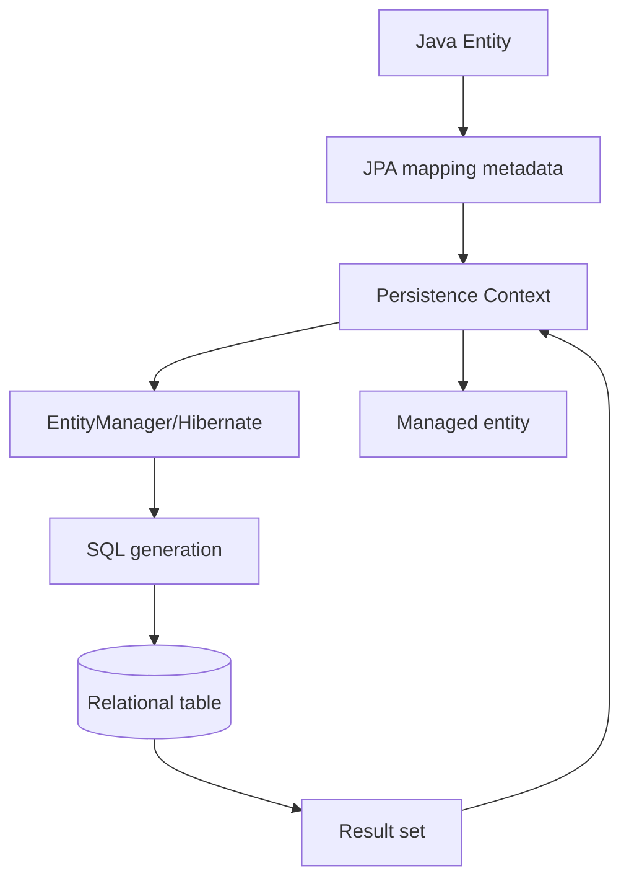
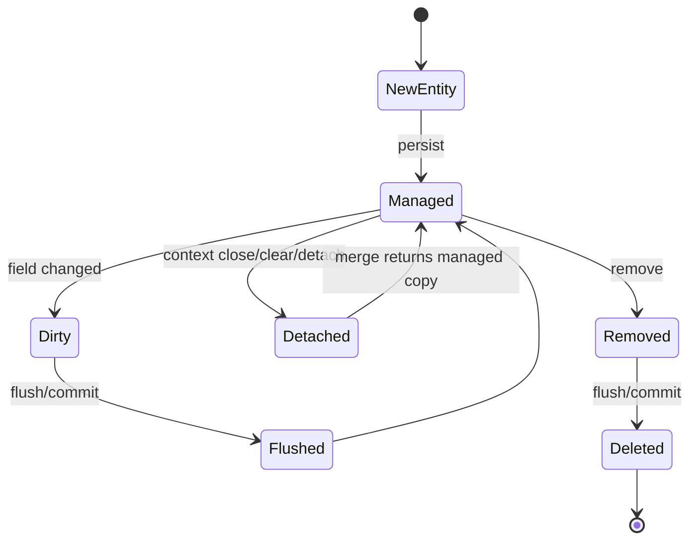

# JPA 개요 및 복합키 학습 및 기록 노트

## 적용 범위와 검증 기준

- JPA 명세의 계약과 Hibernate 같은 구현체의 동작을 구분하고, Jakarta/Javax 패키지와 구현 버전을 고정합니다.
- 기본키 생성 전략과 SQL은 데이터베이스 dialect, 시퀀스·identity 지원, 배치 요구에 따라 선택합니다.
- 복합키 클래스는 명세가 요구하는 생성자·직렬화 가능성·`equals`/`hashCode` 계약을 만족해야 합니다. Lombok은 구현 수단 중 하나일 뿐입니다.
- 매핑 완료는 애플리케이션 기동이 아니라 스키마, insert/find/delete, 프록시 경계, 쿼리 수와 트랜잭션 롤백을 통합 테스트로 확인한 상태입니다.

## 1. 왜 필요한가? (Pain Point & Motivation)

JPA는 Java object와 relational database table 사이의 mapping contract를 제공한다. Entity, primary key, persistence context, association, query abstraction을 이해하지 못하면 object graph와 SQL 실행 결과가 어긋나고, 복합키나 식별 관계에서는 equals/hashCode, lazy loading, repository method까지 함께 깨질 수 있다.

이 문서는 원문의 JPA 개요와 composite key 매핑 내용을 persistence context와 identity mapping 중심으로 재작성한다.

## 2. 현재 나의 상태 (Baseline)

- `@Entity`, `@Id`, `JpaRepository` 사용법은 알고 있다.
- EntityManager와 persistence context가 entity lifecycle을 관리한다는 점을 더 명확히 해야 한다.
- 단일 기본키와 복합키의 repository type이 어떻게 달라지는지 정리해야 한다.
- `@EmbeddedId`, `@IdClass`, `@MapsId`의 선택 기준을 이해해야 한다.
- Composite key class에서 `Serializable`, `equals`, `hashCode`가 필요한 이유를 설명해야 한다.

## 3. 도달하고 싶은 목표 (Target State)

- JPA가 object operation을 SQL로 변환하는 위치를 설명한다.
- Entity identity와 primary key strategy를 구분한다.
- `@EmbeddedId`와 `@IdClass` 방식의 차이를 판단한다.
- Foreign key가 primary key 일부인 경우 `@MapsId`를 사용한다.
- Composite key 기반 조회, 존재 확인, bulk delete를 안전하게 작성한다.

## 4. 시스템 번역 (Data Flow)



JPA의 data flow는 Java object를 바로 table row로 던지는 것이 아니라, mapping metadata와 persistence context를 거쳐 SQL과 managed entity state를 동기화하는 흐름이다.

## 5. 핵심 구성요소 (Building Blocks)

| 구성요소 | 역할 | 주의점 |
| --- | --- | --- |
| `@Entity` | table과 매핑되는 class | 기본 생성자와 identity 필요 |
| `@Id` | primary key 지정 | entity identity 기준 |
| `@GeneratedValue` | key 생성 전략 지정 | DB dialect와 맞아야 함 |
| EntityManager | entity lifecycle 관리 | transaction boundary와 함께 동작 |
| Persistence Context | managed entity 저장소 | 1차 cache와 dirty checking |
| JPQL | entity 중심 query | table/column이 아니라 entity field 기준 |
| `@EmbeddedId` | composite key object 포함 | key class가 value object처럼 동작 |
| `@IdClass` | entity field 여러 개로 key 구성 | field name/type 일치 필요 |
| `@MapsId` | FK를 PK 일부와 연결 | 식별 관계 mapping |

## 6. 상태 전이 (State Transition)



Composite key entity도 이 lifecycle을 따른다. 다만 identity는 key object 또는 여러 `@Id` field로 구성된다. `Dirty`와 `Flushed`는 변경 추적·SQL 동기화를 설명하는 보조 상태이며 JPA의 별도 entity lifecycle 상태가 아니다. `merge`의 반환 객체는 managed지만 전달한 detached 원본은 detached로 남는다.

## 7. 불변식 (Invariant: 절대 깨지면 안 되는 규칙)

- Entity primary key는 persistence context 안에서 identity를 구분하는 기준이다.
- Composite key class는 `Serializable`을 구현하고 `equals`/`hashCode`를 안정적으로 제공해야 한다.
- `@EmbeddedId`는 key object field 경로로 query해야 한다. 예: `id.userId`.
- `@IdClass`는 ID class field name/type이 entity의 ID field와 일치해야 한다.
- `@MapsId`는 association의 FK 값과 embedded ID field를 같은 값으로 유지해야 한다.
- Lazy association을 조회할 때 transaction boundary 밖에서 접근하면 lazy loading 문제가 생길 수 있다.
- Bulk update/delete는 persistence context와 DB 상태를 어긋나게 할 수 있어 clear/flush 전략이 필요하다.

## 8. 가장 작은 예제 (Minimal Viable Example)

```java
@Embeddable
public class AlarmReadsId implements Serializable {
    private Long alarmId;
    private Long userId;

    @Override
    public boolean equals(Object other) {
        if (this == other) return true;
        if (!(other instanceof AlarmReadsId)) return false;
        AlarmReadsId that = (AlarmReadsId) other;
        return java.util.Objects.equals(alarmId, that.alarmId)
                && java.util.Objects.equals(userId, that.userId);
    }

    @Override
    public int hashCode() {
        return java.util.Objects.hash(alarmId, userId);
    }
}

@Entity
public class AlarmReads {
    @EmbeddedId
    private AlarmReadsId id;

    @MapsId("userId")
    @ManyToOne(fetch = FetchType.LAZY)
    @JoinColumn(name = "user_id", nullable = false)
    private User user;

    @MapsId("alarmId")
    @ManyToOne(fetch = FetchType.LAZY)
    @JoinColumn(name = "alarm_id", nullable = false)
    private Alarm alarm;
}
```

```java
public interface AlarmReadsRepository
        extends JpaRepository<AlarmReads, AlarmReadsId> {
    List<AlarmReads> findByIdUserId(Long userId);
}
```

이 예제는 `alarm_id`와 `user_id`가 함께 primary key이면서 각각 association foreign key인 식별 관계를 보여준다. 실제 저장 전에는 ID 값과 연관 객체를 일치하게 설정하고, 영속화 후 key 값을 변경하지 않는다. annotation/import, `User`·`Alarm` 정의와 트랜잭션 테스트는 별도 프로젝트 구성이 필요하다.

## 9. 실패 사례 (What could go wrong?)

- Composite key class에 `equals`/`hashCode`가 없어 persistence context와 collection lookup이 불안정해진다.
- `@EmbeddedId` field 경로를 잘못 써서 repository method parsing이 실패한다.
- `@MapsId` 없이 ID 값과 association FK 값을 따로 관리해 서로 다른 값이 들어간다.
- Lazy association을 view rendering 단계에서 접근해 transaction 밖 lazy loading exception이 발생한다.
- Fetch join 없이 composite key entity 목록에서 association을 반복 접근해 N+1 query가 생긴다.
- Bulk delete 후 persistence context를 정리하지 않아 이미 삭제된 entity가 managed 상태로 남는다.

## 10. 뇌 확장하기 (Evolution & Variants)

- Relationship mapping은 [JPA 관계 매핑](relationships.md)에서 1:1, 1:N, N:1, N:M 기준으로 확장한다.
- [Spring Bean 라이프사이클](lifecycle.md)은 Spring 컨테이너의 자원 초기화·종료를 다루며, JPA entity와 persistence context 생명주기와 구분해서 확인한다.
- QueryDSL은 composite key field와 association path를 type-safe하게 다룰 수 있다.
- ID 전략은 IDENTITY, SEQUENCE, TABLE, AUTO와 database dialect 차이를 비교한다.
- Composite key 대신 surrogate key와 unique constraint를 쓰는 설계도 trade-off로 검토한다.

## 11. 최종 체크리스트 (Definition of Done)

- [x] JPA 기본 구성요소와 persistence context 흐름을 정리했다.
- [x] 단일 key와 composite key의 차이를 설명했다.
- [x] `@EmbeddedId`, `@IdClass`, `@MapsId`의 역할을 포함했다.
- [x] Composite key 최소 예제와 repository type을 제시했다.
- [x] 원문 JPA overview 문서를 12개 섹션 템플릿으로 재작성했다.

## 12. 뇌에 새기는 복습 문장 (TL;DR Blank)

JPA에서 key는 단순 컬럼 값이 아니라 persistence context가 entity identity를 추적하는 계약이다.
