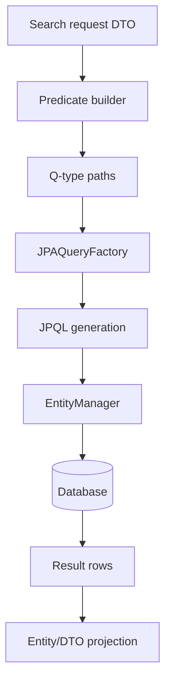
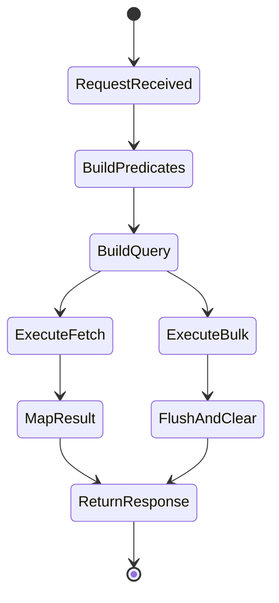

# QueryDSL과 JPA 연동 학습 및 기록 노트

## 1. 왜 필요한가? (Pain Point & Motivation)

Spring Data JPA의 derived query method만으로는 복잡한 검색 조건, 동적 where clause, fetch join, pagination, bulk update/delete를 표현하기 어렵다. QueryDSL은 generated Q-type을 이용해 type-safe JPQL을 만들 수 있게 해주지만, `EntityManager`, `JPAQueryFactory`, custom repository 분리, persistence context 정리 규칙을 제대로 잡지 않으면 유지보수성과 정합성이 깨진다.

이 문서는 원문의 QueryDSL custom repository 구현 내용을 `JPAQueryFactory`, 동적 predicate, Spring Data JPA 통합 중심으로 재작성한다.

## 2. 현재 나의 상태 (Baseline)

- Spring Data JPA repository와 QueryDSL이라는 도구 이름은 알고 있다.
- `QuerydslRepositorySupport`보다 `JPAQueryFactory` 기반 구성이 더 명확한 경우를 이해해야 한다.
- BooleanBuilder와 null-skipping where clause의 차이를 구분해야 한다.
- Custom repository interface와 implementation을 어떻게 붙이는지 정리해야 한다.
- Bulk update/delete 후 persistence context를 정리해야 하는 이유를 알아야 한다.

## 3. 도달하고 싶은 목표 (Target State)

- Q-type을 기반으로 compile-time checked query를 작성한다.
- `EntityManager`를 통해 `JPAQueryFactory`를 주입하거나 Bean으로 등록한다.
- Optional search parameter를 안전하게 predicate로 조합한다.
- Spring Data repository와 custom repository를 역할별로 분리한다.
- Fetch method와 bulk operation의 side effect를 구분한다.

## 4. 시스템 번역 (Data Flow)



QueryDSL data flow는 문자열 JPQL을 직접 조립하는 대신, Q-type path와 predicate object를 조합해 JPQL을 생성하는 방식이다.

## 5. 핵심 구성요소 (Building Blocks)

| 구성요소 | 역할 | 주의점 |
| --- | --- | --- |
| Q-type | entity field의 type-safe path | annotation processing으로 생성 필요 |
| `JPAQueryFactory` | QueryDSL query 생성 진입점 | `EntityManager` 필요 |
| `BooleanBuilder` | 조건을 누적하는 mutable predicate | 조건이 많을 때 명시적 |
| null-skipping where | null predicate를 무시하는 패턴 | 간단한 동적 조건에 적합 |
| Custom repository | 복잡한 query 구현 분리 | interface와 impl naming 일치 |
| Fetch join | association 함께 조회 | pagination과 조합 주의 |
| Projection | entity 대신 DTO 조회 | constructor/fields/bean 방식 |
| Bulk operation | DB 직접 update/delete | persistence context clear 필요 |

## 6. 상태 전이 (State Transition)



조회 query는 결과 mapping으로 끝나지만, bulk update/delete는 persistence context에 남아 있는 managed entity와 DB 상태가 어긋날 수 있어 flush/clear 전략이 필요하다.

## 7. 불변식 (Invariant: 절대 깨지면 안 되는 규칙)

- QueryDSL Q-type은 entity field 변경과 함께 재생성되어야 한다.
- `JPAQueryFactory`는 유효한 `EntityManager`를 통해 생성되어야 한다.
- Optional parameter가 null일 때 전체 조건이 의도치 않게 풀리지 않도록 predicate 조합을 명확히 해야 한다.
- `fetchOne()`은 결과가 0개 또는 2개 이상인 경우의 처리를 고려해야 한다.
- Bulk update/delete는 persistence context를 우회하므로 이후 managed entity 상태를 정리해야 한다.
- Fetch join은 N+1을 줄일 수 있지만 collection fetch join과 pagination 조합은 주의해야 한다.
- Repository custom implementation은 Spring Data가 찾을 수 있는 naming과 package 구조를 지켜야 한다.

## 8. 가장 작은 예제 (Minimal Viable Example)

```java
@Repository
public class UserRepositoryImpl implements UserRepositoryCustom {
    private final JPAQueryFactory queryFactory;

    public UserRepositoryImpl(EntityManager entityManager) {
        this.queryFactory = new JPAQueryFactory(entityManager);
    }

    @Override
    public List<User> findUsers(String firstName, Integer minAge) {
        QUser user = QUser.user;

        return queryFactory
            .selectFrom(user)
            .where(
                firstName == null ? null : user.firstName.eq(firstName),
                minAge == null ? null : user.age.gt(minAge)
            )
            .fetch();
    }
}
```

```java
public interface UserRepository
        extends JpaRepository<User, Long>, UserRepositoryCustom {
}
```

이 예제는 null predicate를 QueryDSL `where` 절에서 생략되게 하여 optional search parameter를 간결하게 처리하는 방식이다.

## 9. 실패 사례 (What could go wrong?)

- `EntityManager` 주입 없이 `QuerydslRepositorySupport`를 상속해 NPE나 초기화 문제를 만든다.
- 문자열 기반 field name을 섞어 Q-type의 type-safety 이점을 잃는다.
- Optional parameter가 모두 null일 때 의도치 않은 full scan query가 실행된다.
- `fetchOne()`을 list 결과가 가능한 query에 사용해 non-unique result 예외가 난다.
- Bulk update 후 persistence context를 clear하지 않아 응답에는 이전 entity 값이 남는다.
- Fetch join으로 collection을 가져오면서 pagination을 적용해 메모리 처리나 결과 왜곡이 생긴다.

## 10. 뇌 확장하기 (Evolution & Variants)

- Predicate helper method를 만들어 `BooleanExpression`을 조합하면 테스트와 재사용이 쉬워진다.
- DTO projection은 `Projections.constructor`, `fields`, `bean`, `@QueryProjection` 방식의 trade-off를 비교한다.
- Subquery, group by, having, aggregation은 reporting query에서 필요하다.
- Window function이나 vendor-specific SQL은 QueryDSL JPA만으로 한계가 있을 수 있어 native query나 SQL module을 검토한다.
- Repository layer는 domain query, read model query, reporting query를 분리해 복잡도를 낮출 수 있다.

## 11. 최종 체크리스트 (Definition of Done)

- [x] QueryDSL과 JPA custom repository의 역할을 정리했다.
- [x] `JPAQueryFactory` 기반 동적 query 예제를 포함했다.
- [x] BooleanBuilder/null predicate, fetch method, bulk operation 주의점을 정리했다.
- [x] Spring Data JPA repository와 custom repository 연결 방식을 설명했다.
- [x] 원문 QueryDSL 문서를 12개 섹션 템플릿으로 재작성했다.

## 12. 뇌에 새기는 복습 문장 (TL;DR Blank)

QueryDSL의 가치는 문자열 쿼리를 줄이는 데서 끝나지 않고, 검색 조건을 type-safe한 predicate 조합으로 관리하는 데 있다.
