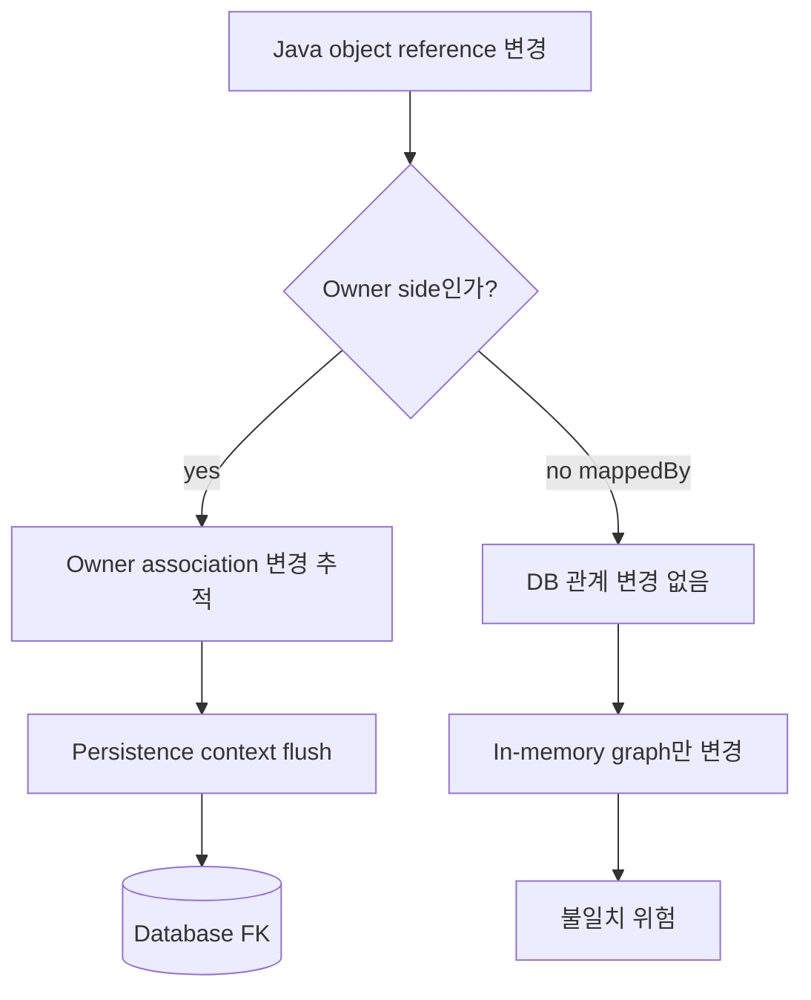
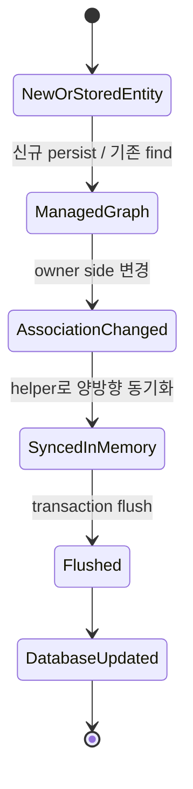

# JPA Entity Relationships 학습 및 기록 노트

## Scope and Verification Contract

- **Scope:** State the JPA specification level, provider and version, enhancement or proxy mode, database dialect, and transaction boundary. Provider behavior must not be presented as a portable JPA guarantee.
- **Assumptions:** Define the owning side, aggregate boundary, nullability, expected cardinality, fetch plan, cascade intent, orphan lifecycle, and serialization boundary before choosing a mapping.
- **Facts and inference:** Annotation semantics are contract claims; generated SQL, join count, proxy initialization, and performance are implementation observations that require logs and tests.
- **Failure and completion:** Test both sides of an association, detached access, delete and orphan behavior, rollback, N+1 queries, and constraint failures. A mapping is complete when database rows and the in-memory graph remain consistent across those paths.

## 1. 왜 필요한가? (Pain Point & Motivation)

JPA 관계 매핑은 Java object reference와 database foreign key를 연결하는 계약이다. 단방향/양방향 관계, owner side, `mappedBy`, fetch type, cascade, orphan removal을 정확히 이해하지 못하면 FK가 갱신되지 않거나 N+1 query, JSON infinite recursion, 의도하지 않은 delete가 발생한다.

이 문서는 원문의 JPA/Hibernate relationship mapping 내용을 owner side와 data consistency 중심으로 재작성한다.

## 2. 현재 나의 상태 (Baseline)

- `@ManyToOne`, `@OneToMany`, `@OneToOne`, `@ManyToMany` annotation은 알고 있다.
- 관계의 주인이 foreign key를 관리한다는 점을 더 명확히 해야 한다.
- `mappedBy`가 붙은 inverse side는 관계 변경 권한이 없다는 점을 습관화해야 한다.
- Lazy loading, fetch join, cascade, orphan removal의 위험을 함께 이해해야 한다.
- 양방향 관계에서 helper method로 양쪽 object graph를 동기화해야 한다.

## 3. 도달하고 싶은 목표 (Target State)

- 관계 유형별 DB FK 위치와 JPA owner side를 구분한다.
- 단방향 `ManyToOne`을 기본 관계로 이해한다.
- 양방향 `OneToMany`/`ManyToOne`에서 `mappedBy`와 helper method를 올바르게 사용한다.
- 필요한 association을 query별 fetch 계획으로 정하고, LAZY 지원·트랜잭션 경계·분리된 객체 접근·쿼리 수를 확인한다.
- Cascade와 orphan removal을 aggregate boundary 안에서만 제한적으로 사용한다.

## 4. 시스템 번역 (Data Flow)



JPA에서 owner side는 association의 DB 관계 값을 결정하며 flush 시 SQL에 반영된다. inverse side 변경만으로 FK가 재설정되지는 않지만, orphanRemoval이나 cascade가 설정된 경우에는 collection 변경에 별도 삭제·전파 효과가 있을 수 있다.

## 5. 핵심 구성요소 (Building Blocks)

| 구성요소 | 역할 | 주의점 |
| --- | --- | --- |
| `@ManyToOne` | 여러 child가 하나의 parent를 참조 | 보통 FK owner side |
| `@OneToMany` | parent가 child collection 보유 | `mappedBy`이면 inverse side |
| `@OneToOne` | 1:1 association | FK 소유 side 결정 필요 |
| `@ManyToMany` | join table 기반 N:M | 실무에서는 join entity 선호 |
| `@JoinColumn` | FK column 지정 | nullable/unique 제약과 일치 |
| `mappedBy` | inverse side 표시 | FK 갱신 기준은 owner, orphanRemoval/cascade 효과는 별도 |
| `FetchType.LAZY` | 지연 로딩을 요청하는 힌트 | provider 지원·프록시·컨텍스트 경계를 확인 |
| Cascade | parent operation 전파 | remove 전파 주의 |
| orphanRemoval | collection에서 빠진 child 삭제 | aggregate 내부에만 적합 |

## 6. 상태 전이 (State Transition)



양방향 관계에서는 DB에 반영되는 owner side와 Java object graph를 편하게 탐색하기 위한 inverse side를 모두 일관되게 맞춰야 한다.

## 7. 불변식 (Invariant: 절대 깨지면 안 되는 규칙)

- 관계의 owner side가 DB association 값의 기준이다. 양방향 N:1에서는 보통 FK를 가진 N 쪽이며, join table 매핑에서는 owner가 연결 테이블을 관리한다.
- `mappedBy`가 붙은 inverse side만 수정하면 DB FK는 바뀌지 않는다.
- 양방향 관계 helper method는 양쪽 reference/collection을 함께 갱신해야 한다.
- 명시적인 fetch 계획을 세운다. LAZY의 적합성은 provider 지원, transaction 경계, aggregate 크기, query 수와 detached 접근으로 판단하고 생성 SQL로 검증한다.
- Cascade remove와 orphan removal은 child lifecycle이 parent에 종속될 때만 사용한다.
- Collection fetch join과 pagination을 함께 사용할 때 결과 왜곡과 메모리 처리 위험을 확인해야 한다.
- Entity를 JSON으로 바로 노출하면 양방향 관계에서 infinite recursion이 생길 수 있다.

## 8. 가장 작은 예제 (Minimal Viable Example)

```java
@Entity
public class Comment {
    @Id
    @GeneratedValue(strategy = GenerationType.IDENTITY)
    private Long id;

    @ManyToOne(fetch = FetchType.LAZY)
    @JoinColumn(name = "post_id", nullable = false)
    private Post post;

    public void setPost(Post post) {
        if (post == null || (this.post != null && this.post != post)) {
            throw new IllegalArgumentException("Comment cannot change its owning Post");
        }
        this.post = post;
    }
}

@Entity
public class Post {
    @Id
    @GeneratedValue(strategy = GenerationType.IDENTITY)
    private Long id;

    @OneToMany(mappedBy = "post", cascade = CascadeType.ALL, orphanRemoval = true)
    private List<Comment> comments = new ArrayList<>();

    public void addComment(Comment comment) {
        java.util.Objects.requireNonNull(comment, "comment");
        comment.setPost(this);
        if (!comments.contains(comment)) {
            comments.add(comment);
        }
    }
}
```

이 예제에서 FK owner는 `Comment.post`다. 추가는 `Post.addComment`를 통해 양쪽을 맞추며 `Comment`는 한 `Post`의 lifecycle에만 속한다고 제한한다. 다른 `Post`로 이동·제거하는 동작은 이 최소 예제에 없고 orphanRemoval·rollback을 포함한 별도 정책과 테스트가 필요하다.

## 9. 실패 사례 (What could go wrong?)

- `post.getComments().add(comment)`만 호출하고 `comment.setPost(post)`를 하지 않아 FK가 null로 남는다.
- 모든 관계를 EAGER로 두어 조회 하나가 큰 object graph 전체를 끌고 온다.
- Fetch join 없이 parent 목록에서 child collection을 반복 접근해 N+1 query가 발생한다.
- CascadeType.REMOVE를 공유 child 관계에 걸어 다른 aggregate의 데이터까지 삭제한다.
- `@ManyToMany`에 추가 속성이 필요한데 join entity 없이 직접 mapping해 확장성이 막힌다.
- Entity를 그대로 JSON serialize해 양방향 관계가 무한 순환한다.

## 10. 뇌 확장하기 (Evolution & Variants)

- N:M 관계는 join entity로 풀어 `StudentCourse` 같은 entity에 생성일, 상태, 역할을 담는 방식을 검토한다.
- Fetch 전략은 fetch join, entity graph, batch size, DTO projection을 비교한다.
- Aggregate boundary를 기준으로 cascade와 orphan removal 사용 범위를 정한다.
- JSON 응답은 entity 직접 노출 대신 DTO projection 또는 mapper를 사용한다.
- QueryDSL과 함께 association path를 type-safe하게 탐색할 수 있다.

## 11. 최종 체크리스트 (Definition of Done)

- [x] JPA relationship type과 owner/inverse side를 정리했다.
- [x] `mappedBy`, `@JoinColumn`, fetch, cascade, orphanRemoval의 역할을 설명했다.
- [x] 양방향 helper method 최소 예제를 포함했다.
- [x] N+1, JSON recursion, cascade delete 같은 실패 사례를 정리했다.
- [x] 원문 relationships 문서를 12개 섹션 템플릿으로 재작성했다.

## 12. 뇌에 새기는 복습 문장 (TL;DR Blank)

JPA 관계 매핑의 DB association 값은 owner side를 기준으로 반영하며, inverse graph·fetch 계획·cascade와 orphan lifecycle은 별도로 일관되게 맞춰야 한다.
