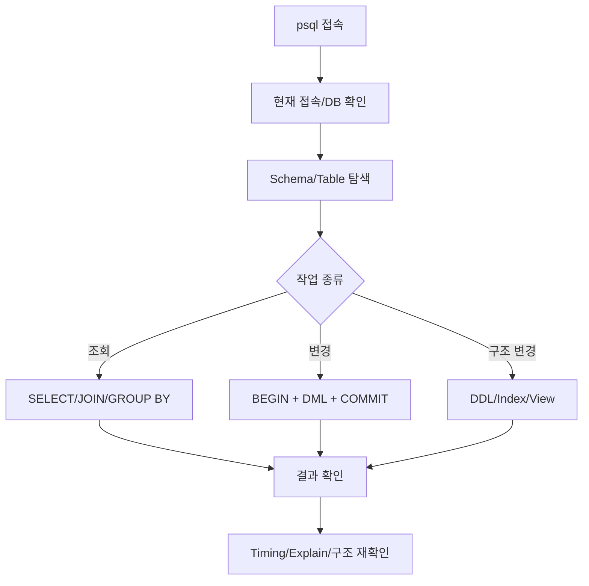
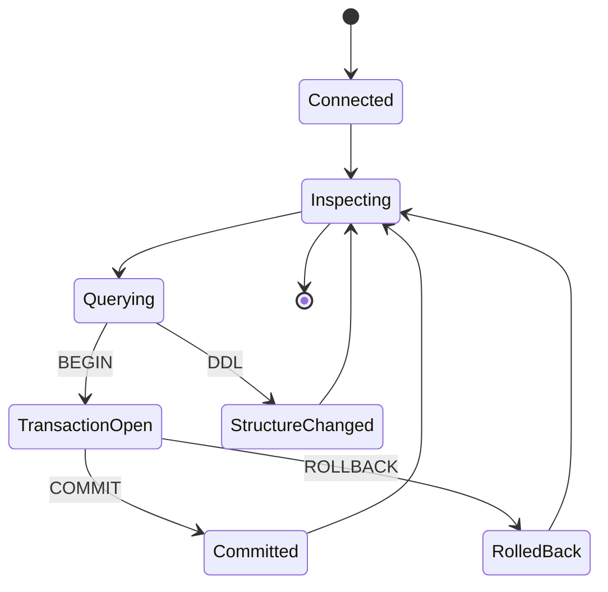

# PostgreSQL 필수 명령어 학습 및 기록 노트

## 1. 왜 필요한가? (Pain Point & Motivation)

PostgreSQL을 사용할 때는 SQL 문법만큼 `psql` 메타 커맨드, schema/table 탐색, transaction, index, JSONB, view, 실행 시간 확인이 중요하다. 장애나 개발 중 데이터 문제를 볼 때 현재 접속 DB, table 구조, role, query plan, transaction 상태를 빠르게 확인하지 못하면 원인 분석이 늦어진다.

이 문서는 원문의 PostgreSQL 필수 명령어와 활용 예제를 `psql` 탐색, DML, DDL, transaction, 운영 확인 흐름으로 재작성한다.

## 2. 현재 나의 상태 (Baseline)

- `SELECT`, `INSERT`, `UPDATE`, `DELETE` 기본 SQL은 알고 있다.
- `psql`에서 database/table/schema/role을 확인하는 메타 커맨드를 빠르게 써야 한다.
- JOIN, GROUP BY, HAVING, subquery, JSONB, view 예제를 실무 흐름으로 연결해야 한다.
- Transaction과 rollback을 데이터 무결성 보호 수단으로 써야 한다.
- Index 생성과 query 실행 시간 확인을 성능 점검과 연결해야 한다.

## 3. 도달하고 싶은 목표 (Target State)

- `psql` 접속 후 현재 DB, table, schema, role, connection 정보를 확인한다.
- 조회/변경 SQL을 transaction과 함께 안전하게 실행한다.
- Table 생성, column 변경, index 생성 같은 DDL 작업의 위험을 구분한다.
- JSONB와 view를 재사용 가능한 query abstraction으로 활용한다.
- Query 실행 시간과 table 구조를 확인하며 성능 병목을 좁힌다.

## 4. 시스템 번역 (Data Flow)



PostgreSQL 작업은 접속 상태를 확인하고, 대상 구조를 확인한 뒤, query 실행과 검증을 반복하는 흐름이다.

## 5. 핵심 구성요소 (Building Blocks)

| 구성요소 | 대표 명령 | 역할 |
| --- | --- | --- |
| Database 목록 | `\l` | 전체 database 확인 |
| Database 이동 | `\c dbname` | 특정 DB로 접속 전환 |
| Table 목록 | `\dt`, `\dt+` | table과 크기 확인 |
| Table 구조 | `\d table_name` | column, index, constraint 확인 |
| Role 목록 | `\du` | user/role 권한 확인 |
| Schema 목록 | `\dn` | namespace 확인 |
| 접속 정보 | `\conninfo` | host, port, database, user 확인 |
| Expanded display | `\x` | 긴 row를 세로로 보기 |
| 실행 시간 | `\timing` | query latency 확인 |
| Shell 실행 | `\! command` | psql 안에서 shell command 실행 |

## 6. 상태 전이 (State Transition)



변경 작업은 transaction 안에서 실행하고, 적용 전후 상태를 다시 inspect하는 습관이 중요하다.

## 7. 불변식 (Invariant: 절대 깨지면 안 되는 규칙)

- 변경 쿼리를 실행하기 전 현재 접속 database와 schema를 확인해야 한다.
- 대량 `UPDATE`/`DELETE`는 `WHERE` 조건과 영향 row 수를 먼저 검증해야 한다.
- Migration 없이 운영 DB에서 임의 DDL을 실행하면 안 된다.
- Index는 read 성능만 보지 말고 write cost와 disk 사용량도 고려해야 한다.
- Transaction은 성공 시 `COMMIT`, 문제 시 `ROLLBACK`으로 명확히 종료해야 한다.
- JSONB query는 필요한 경우 GIN index 등 access path를 함께 검토해야 한다.
- `DROP ... CASCADE`는 연관 object까지 삭제하므로 영향 범위를 먼저 확인해야 한다.

## 8. 가장 작은 예제 (Minimal Viable Example)

```sql
BEGIN;

UPDATE accounts
SET balance = balance - 1000
WHERE id = 1;

UPDATE accounts
SET balance = balance + 1000
WHERE id = 2;

COMMIT;
```

점검 흐름:

```text
1. \conninfo 로 접속 DB 확인
2. \d accounts 로 table 구조 확인
3. BEGIN 으로 transaction 시작
4. UPDATE 실행
5. 영향 row 수 확인
6. COMMIT 또는 ROLLBACK
```

이 예제는 PostgreSQL 변경 작업이 SQL 실행뿐 아니라 접속 확인, 구조 확인, transaction 종료까지 포함한다는 점을 보여준다.

## 9. 실패 사례 (What could go wrong?)

- 잘못된 database에 접속한 상태에서 DDL/DML을 실행한다.
- `DELETE FROM table`에 `WHERE`를 빼고 실행한다.
- `DROP TABLE ... CASCADE`로 예상보다 많은 view/constraint를 삭제한다.
- Index 없이 `ORDER BY`, `WHERE`, pagination query를 운영 데이터에서 반복 실행한다.
- Transaction을 열어 둔 채 종료하지 않아 lock이 오래 유지된다.
- JSONB 필드에 대한 검색이 full scan으로 동작하는데 index 전략을 확인하지 않는다.
- `SELECT *`를 대량 table에 습관적으로 사용해 network와 memory 비용이 커진다.

## 10. 뇌 확장하기 (Evolution & Variants)

- Query 성능은 `EXPLAIN`과 `EXPLAIN ANALYZE`로 execution plan을 확인한다.
- Schema 관리는 migration tool과 code review를 통해 변경 이력을 남긴다.
- JSONB는 document flexibility와 relational constraint 사이의 trade-off를 판단한다.
- View는 query 재사용에 유용하지만 성능과 permission boundary를 함께 본다.
- 운영은 backup/restore, replication, vacuum, connection pool, lock monitoring으로 확장된다.

## 11. 최종 체크리스트 (Definition of Done)

- [x] `psql` 메타 커맨드를 운영 탐색 기준으로 정리했다.
- [x] DML, DDL, transaction, JSONB, view 사용 흐름을 포함했다.
- [x] 변경 작업 전 접속/구조/transaction 확인 불변식을 정리했다.
- [x] 안전한 transaction 최소 예제를 제시했다.
- [x] 원문 PostgreSQL guide 문서를 12개 섹션 템플릿으로 재작성했다.

## 12. 뇌에 새기는 복습 문장 (TL;DR Blank)

PostgreSQL 작업은 query를 치는 일이 아니라 현재 접속, 대상 구조, transaction, 실행 결과를 계속 확인하는 운영 루프다.
