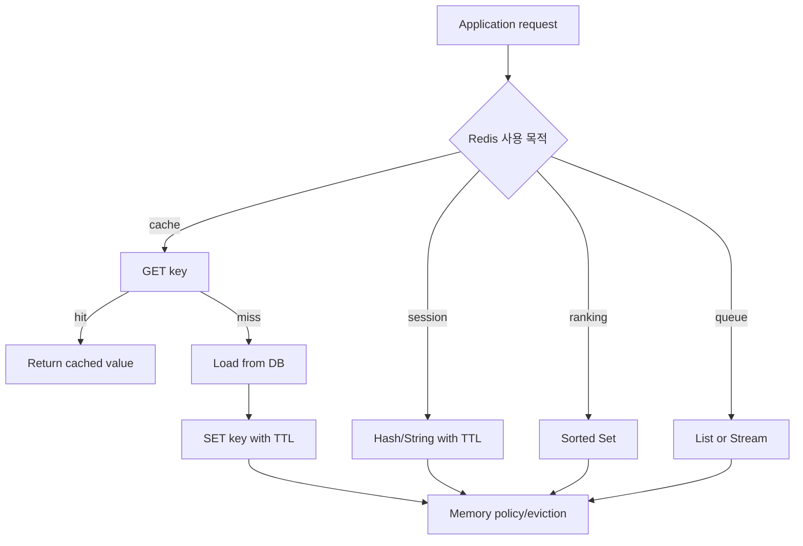
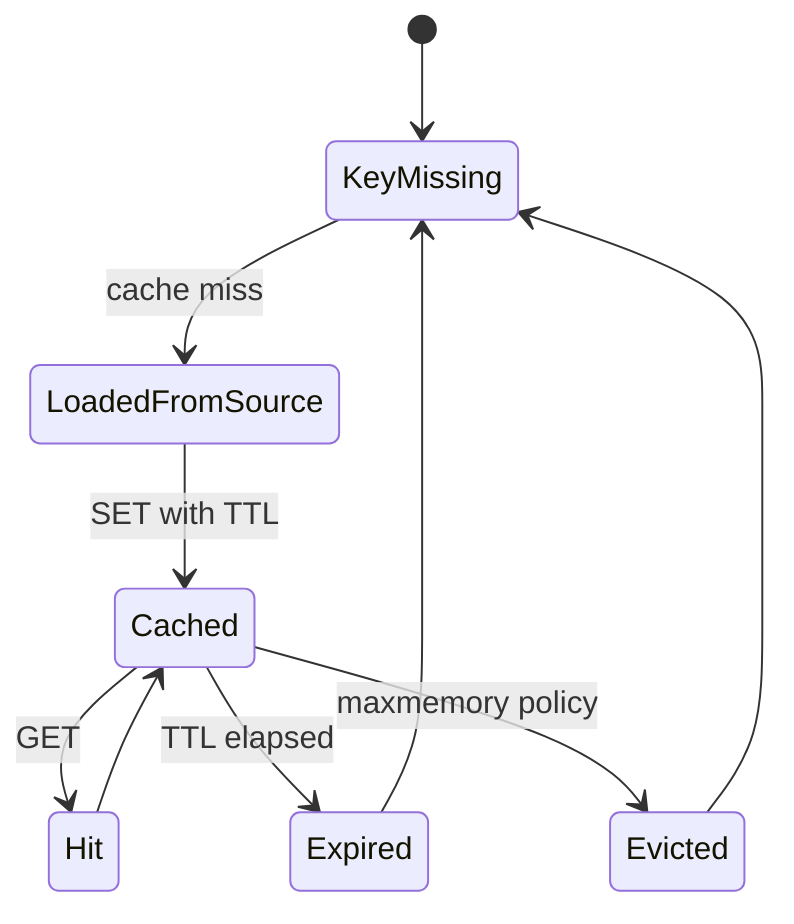

# Redis 개요 학습 및 기록 노트

## 1. 왜 필요한가? (Pain Point & Motivation)

Redis는 빠른 in-memory data structure store로 cache, session store, ranking, queue, pub/sub에 자주 쓰인다. 하지만 Redis를 단순 key-value cache로만 이해하면 TTL, eviction, persistence, memory limit, security, hot key, cache invalidation 문제를 놓치게 된다. Redis는 빠른 만큼 운영 정책을 명확히 잡아야 한다.

이 문서는 원문의 Redis 설정 가이드를 Redis 역할, data type, Docker 실행, persistence, eviction, CLI, monitoring, security 중심으로 재작성한다.

## 2. 현재 나의 상태 (Baseline)

- Redis가 in-memory cache로 쓰인다는 점은 알고 있다.
- String, Hash, List, Set, Sorted Set, Stream/PubSub의 사용 기준을 더 명확히 해야 한다.
- `maxmemory`와 eviction policy가 데이터 손실과 오류 동작을 바꾼다는 점을 이해해야 한다.
- RDB와 AOF persistence가 cache와 source-of-truth 시나리오에서 다르게 의미를 갖는다는 점을 정리해야 한다.
- 운영 환경에서 외부 노출, password, protected mode, dangerous command 관리가 필요하다.

## 3. 도달하고 싶은 목표 (Target State)

- Redis를 cache, session, queue, ranking, pub/sub 용도별로 선택한다.
- Docker 또는 host에서 Redis를 실행할 때 volume, config, password, port를 함께 설정한다.
- TTL과 eviction policy를 데이터 특성에 맞게 고른다.
- `redis-cli`, `INFO`, `CLIENT LIST`, memory metrics로 상태를 확인한다.
- 운영 노출 시 bind, firewall, auth, TLS, command rename 같은 보안 기준을 적용한다.

## 4. 시스템 번역 (Data Flow)



Redis data flow는 application이 어떤 consistency와 lifetime을 기대하는지에 따라 key design, TTL, persistence, eviction 동작이 달라진다.

## 5. 핵심 구성요소 (Building Blocks)

| 구성요소 | 대표 명령 | 사용 사례 |
| --- | --- | --- |
| String | `SET`, `GET`, `EXPIRE` | API response cache, simple value |
| Hash | `HSET`, `HGETALL` | session/profile field 저장 |
| List | `LPUSH`, `RPOP` | 단순 queue |
| Set | `SADD`, `SMEMBERS` | tag, membership |
| Sorted Set | `ZADD`, `ZRANGE` | ranking, leaderboard |
| Pub/Sub | `PUBLISH`, `SUBSCRIBE` | 실시간 알림 |
| Stream | `XADD`, `XREADGROUP` | consumer group 기반 event stream |
| RDB | snapshot persistence | 빠른 재시작, snapshot 손실 가능 |
| AOF | append-only persistence | 더 강한 durability, write overhead |
| Eviction policy | `allkeys-lru` 등 | memory limit 도달 시 동작 |

## 6. 상태 전이 (State Transition)



Cache key는 영구 상태가 아니다. TTL 만료, eviction, explicit delete가 모두 정상 상태 전이에 포함된다.

## 7. 불변식 (Invariant: 절대 깨지면 안 되는 규칙)

- Redis가 source of truth인지 cache layer인지 먼저 정해야 한다.
- Cache key에는 TTL과 invalidation 전략이 있어야 한다.
- 운영 환경에서 Redis를 인증 없이 외부에 노출하면 안 된다.
- `maxmemory`와 eviction policy는 workload 특성에 맞아야 한다.
- `KEYS pattern`은 큰 keyspace에서 blocking 위험이 있으므로 운영에서는 `SCAN` 계열을 우선한다.
- AOF/RDB 설정은 성능과 복구 지점 목표를 함께 고려해야 한다.
- `FLUSHDB`, `FLUSHALL`, `CONFIG`, `DEBUG` 같은 위험 명령은 운영 접근 제어가 필요하다.

## 8. 가장 작은 예제 (Minimal Viable Example)

Docker Compose 개념 예시:

```yaml
services:
  redis:
    image: redis:7.2
    ports:
      - "6379:6379"
    volumes:
      - redis_data:/data
    command: redis-server --appendonly yes --requirepass change-me

volumes:
  redis_data:
```

검증:

```bash
docker exec -it redis redis-cli
AUTH change-me
PING
INFO memory
```

이 예제는 Redis 실행의 최소 단위가 image 실행뿐 아니라 data volume, password, persistence, health check까지 포함한다는 점을 보여준다.

## 9. 실패 사례 (What could go wrong?)

- `maxmemory` 없이 Redis를 운영해 host memory pressure가 발생한다.
- `noeviction` 정책에서 write가 실패하는데 애플리케이션이 cache write 실패를 처리하지 않는다.
- Cache TTL이 없어 stale data가 오래 남거나 memory가 계속 증가한다.
- `allkeys-lru`를 source-of-truth 데이터에 적용해 필요한 key가 제거된다.
- 운영에서 `MONITOR`를 장시간 실행해 성능에 영향을 준다.
- `KEYS *`를 대량 keyspace에서 실행해 Redis event loop를 막는다.
- Redis를 password/firewall 없이 외부에 노출한다.

## 10. 뇌 확장하기 (Evolution & Variants)

- Spring Boot 연동은 [Spring Boot 연동](springboot-integration.md)에서 cache annotation과 `RedisTemplate` 기준으로 다룬다.
- High availability는 Sentinel, Cluster, managed Redis로 확장한다.
- Cache pattern은 cache-aside, write-through, write-behind, refresh-ahead를 비교한다.
- Serialization은 JSON, String, binary, Java serialization의 호환성과 크기를 비교한다.
- Observability는 hit ratio, used memory, evicted keys, blocked clients, latency monitor를 함께 본다.

## 11. 최종 체크리스트 (Definition of Done)

- [x] Redis의 주요 data type과 사용 사례를 정리했다.
- [x] Persistence, eviction, TTL, security 불변식을 포함했다.
- [x] Docker Compose 기반 최소 실행 예제를 제시했다.
- [x] CLI와 monitoring에서 확인할 핵심 지표를 설명했다.
- [x] 원문 Redis overview 문서를 12개 섹션 템플릿으로 재작성했다.

## 12. 뇌에 새기는 복습 문장 (TL;DR Blank)

Redis는 빠른 저장소이지만, key lifetime과 memory policy를 정하지 않으면 가장 빠르게 장애를 퍼뜨리는 계층이 된다.
