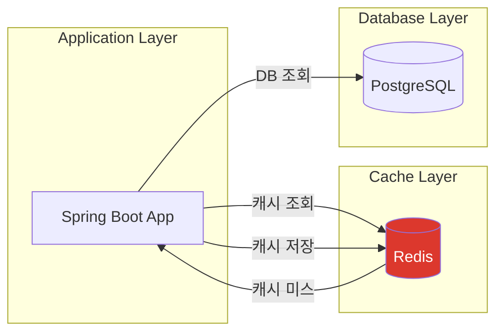
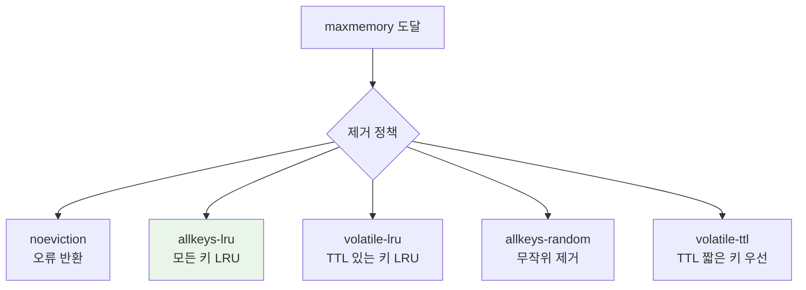

# Redis 설정 가이드

Redis를 Docker로 설치하고 Spring Boot와 연동하는 방법을 설명합니다.

## 적용 범위와 검증 기준

- **범위:** Redis 버전, standalone·Sentinel·Cluster 모드, Docker image tag, persistence, eviction, ACL/TLS와 Spring client 버전을 명시합니다.
- **환경 전제:** 메모리 한도, 데이터 크기와 TTL 분포, 연결 수, network, durability 목표와 장애 시 허용 가능한 손실량을 먼저 정합니다.
- **근거와 불확실성:** latency, hit rate, memory 비율과 client 수는 workload별 관측값입니다. 고정 임계값보다 baseline과 SLO 대비 추세로 alert를 설계합니다.
- **실패·완료:** 인증 실패, timeout, eviction, OOM, restart, persistence 손상과 failover를 시험하고 key·TTL·권한·복구 시간·허용 손실이 기준을 만족할 때 완료로 판정합니다.

---

## 개요

Redis는 오픈소스 인메모리 데이터 구조 저장소로, 데이터베이스, 캐시, 메시지 브로커로 사용됩니다.



### Redis 사용 사례

| 사용 사례 | 설명 | 데이터 구조 |
|-----------|------|-------------|
| 세션 스토어 | 사용자 세션 관리 | Hash |
| 캐싱 | API 응답, DB 쿼리 결과 | String |
| 실시간 순위표 | 게임 리더보드 | Sorted Set |
| 메시지 큐 | 비동기 작업 처리 | List, Stream |
| Pub/Sub | 실시간 알림 | Pub/Sub |

## Docker로 Redis 설치

### 기본 설치

```bash
# Redis 이미지 다운로드
docker pull redis:7.2

# 기본 실행
docker run -d \
  --name redis \
  -p 6379:6379 \
  redis:7.2
```

### 프로덕션 환경 설정

```bash
docker run -d \
  --name redis \
  --restart=always \
  -p 6379:6379 \
  -e TZ=Asia/Seoul \
  -v /srv/redis/data:/data \
  -v /srv/redis/redis.conf:/usr/local/etc/redis/redis.conf \
  redis:7.2 redis-server /usr/local/etc/redis/redis.conf
```

### Docker Compose 구성

```yaml
# docker-compose.yml
version: '3.8'

services:
  redis:
    image: redis:7.2
    container_name: redis
    restart: always
    ports:
      - "6379:6379"
    environment:
      - TZ=Asia/Seoul
    volumes:
      - redis_data:/data
      - ./redis.conf:/usr/local/etc/redis/redis.conf
    command: redis-server /usr/local/etc/redis/redis.conf
    healthcheck:
      test: ["CMD", "redis-cli", "ping"]
      interval: 10s
      timeout: 5s
      retries: 3

volumes:
  redis_data:
```

## Redis 설정 파일

### 기본 redis.conf

```conf
# /srv/redis/redis.conf

# 네트워크
bind 0.0.0.0
port 6379
protected-mode yes

# 보안
requirepass your_secure_password

# 메모리 관리
maxmemory 256mb
maxmemory-policy allkeys-lru

# 지속성 (RDB)
save 900 1
save 300 10
save 60 10000
dbfilename dump.rdb
dir /data

# AOF (Append Only File)
appendonly yes
appendfilename "appendonly.aof"
appendfsync everysec

# 로깅
loglevel notice
logfile ""

# 기타
daemonize no
```

### 메모리 정책 옵션



| 정책 | 설명 | 권장 사용 |
|------|------|-----------|
| `noeviction` | 메모리 부족 시 오류 반환 | 데이터 손실 불가 |
| `allkeys-lru` | 모든 키 중 LRU 제거 | 일반 캐시 |
| `volatile-lru` | TTL 설정된 키 중 LRU | 세션 스토어 |
| `allkeys-random` | 무작위 제거 | 균등 접근 |
| `volatile-ttl` | TTL 짧은 키 우선 제거 | TTL 기반 캐시 |

## Spring Boot 연동

### 의존성 추가

```gradle
// build.gradle
dependencies {
    implementation 'org.springframework.boot:spring-boot-starter-data-redis'
}
```

```xml
<!-- pom.xml -->
<dependency>
    <groupId>org.springframework.boot</groupId>
    <artifactId>spring-boot-starter-data-redis</artifactId>
</dependency>
```

### 설정 파일

```yaml
# application.yml
spring:
  redis:
    host: localhost
    port: 6379
    password: your_secure_password
    timeout: 3000ms
    lettuce:
      pool:
        max-active: 8
        max-idle: 8
        min-idle: 2
        max-wait: -1ms
```

### Redis Configuration

```java
@Configuration
@EnableCaching
public class RedisConfig {

    @Value("${spring.redis.host}")
    private String host;

    @Value("${spring.redis.port}")
    private int port;

    @Value("${spring.redis.password}")
    private String password;

    @Bean
    public RedisConnectionFactory redisConnectionFactory() {
        RedisStandaloneConfiguration config = new RedisStandaloneConfiguration();
        config.setHostName(host);
        config.setPort(port);
        config.setPassword(password);
        return new LettuceConnectionFactory(config);
    }

    @Bean
    public RedisTemplate<String, Object> redisTemplate() {
        RedisTemplate<String, Object> template = new RedisTemplate<>();
        template.setConnectionFactory(redisConnectionFactory());
        
        // 직렬화 설정
        template.setKeySerializer(new StringRedisSerializer());
        template.setValueSerializer(new GenericJackson2JsonRedisSerializer());
        template.setHashKeySerializer(new StringRedisSerializer());
        template.setHashValueSerializer(new GenericJackson2JsonRedisSerializer());
        
        return template;
    }

    @Bean
    public CacheManager cacheManager(RedisConnectionFactory factory) {
        RedisCacheConfiguration config = RedisCacheConfiguration.defaultCacheConfig()
            .entryTtl(Duration.ofMinutes(30))
            .serializeKeysWith(
                RedisSerializationContext.SerializationPair.fromSerializer(
                    new StringRedisSerializer()))
            .serializeValuesWith(
                RedisSerializationContext.SerializationPair.fromSerializer(
                    new GenericJackson2JsonRedisSerializer()));
        
        return RedisCacheManager.builder(factory)
            .cacheDefaults(config)
            .build();
    }
}
```

### 사용 예제

#### 캐싱 어노테이션 사용

```java
@Service
public class UserService {

    @Cacheable(value = "users", key = "#id")
    public User findById(Long id) {
        // DB 조회 (캐시 미스 시에만 실행)
        return userRepository.findById(id).orElse(null);
    }

    @CacheEvict(value = "users", key = "#user.id")
    public User update(User user) {
        return userRepository.save(user);
    }

    @CacheEvict(value = "users", allEntries = true)
    public void clearCache() {
        // 모든 캐시 삭제
    }
}
```

#### RedisTemplate 직접 사용

```java
@Service
@RequiredArgsConstructor
public class SessionService {

    private final RedisTemplate<String, Object> redisTemplate;

    public void saveSession(String sessionId, UserSession session) {
        redisTemplate.opsForValue().set(
            "session:" + sessionId,
            session,
            Duration.ofHours(1)
        );
    }

    public UserSession getSession(String sessionId) {
        return (UserSession) redisTemplate.opsForValue()
            .get("session:" + sessionId);
    }

    public void deleteSession(String sessionId) {
        redisTemplate.delete("session:" + sessionId);
    }
}
```

## Redis CLI 사용법

```bash
# Redis 컨테이너 접속
docker exec -it redis redis-cli

# 인증
AUTH your_secure_password

# 기본 명령어
SET key "value"
GET key
DEL key
KEYS pattern*
TTL key
EXPIRE key 3600

# 데이터 구조별 명령어
# Hash
HSET user:1 name "John" age 30
HGET user:1 name
HGETALL user:1

# List
LPUSH queue "item1"
RPOP queue

# Set
SADD tags "redis" "cache"
SMEMBERS tags

# Sorted Set
ZADD leaderboard 100 "player1"
ZRANGE leaderboard 0 -1 WITHSCORES

# 모니터링
INFO
INFO memory
MONITOR
```

## 모니터링

### Redis 상태 확인

```bash
# 메모리 사용량
redis-cli INFO memory

# 연결된 클라이언트
redis-cli CLIENT LIST

# 명령어 통계
redis-cli INFO commandstats

# 실시간 명령어 모니터링
redis-cli MONITOR
```

### 주요 메트릭

| 메트릭 | 설명 | 경고 임계값 |
|--------|------|-------------|
| `used_memory` | 사용 중인 메모리 | 고정 80%가 아니라 eviction 여유, fragmentation과 workload baseline 대비 추세 |
| `connected_clients` | 연결된 클라이언트 수 | 1000+ |
| `blocked_clients` | 블록된 클라이언트 | 0 초과 자체보다 command 유형, 지속 시간과 SLO 영향으로 판정 |
| `evicted_keys` | 제거된 키 수 | 증가 추세 |
| `keyspace_hits/misses` | 캐시 히트율 | 목표 workload의 baseline·비용 모델과 miss 원인으로 판정 |

## 보안 설정

!!! danger "배포 전 보안 검토 항목"
    - 강력한 비밀번호 설정 (`requirepass`)
    - 외부 접근 제한 (`bind` 설정)
    - `protected-mode yes` 활성화
    - 방화벽으로 6379 포트 제한

```conf
# 보안 강화 설정
bind 127.0.0.1 192.168.1.0/24
requirepass "복잡한_비밀번호_32자_이상"
protected-mode yes

# 위험한 명령어 비활성화
rename-command FLUSHDB ""
rename-command FLUSHALL ""
rename-command CONFIG ""
rename-command DEBUG ""
```

## 관련 문서

- [JPA 개요](../jpa/overview.md)
- [Docker 설치](../../development/docker/installation.md)
