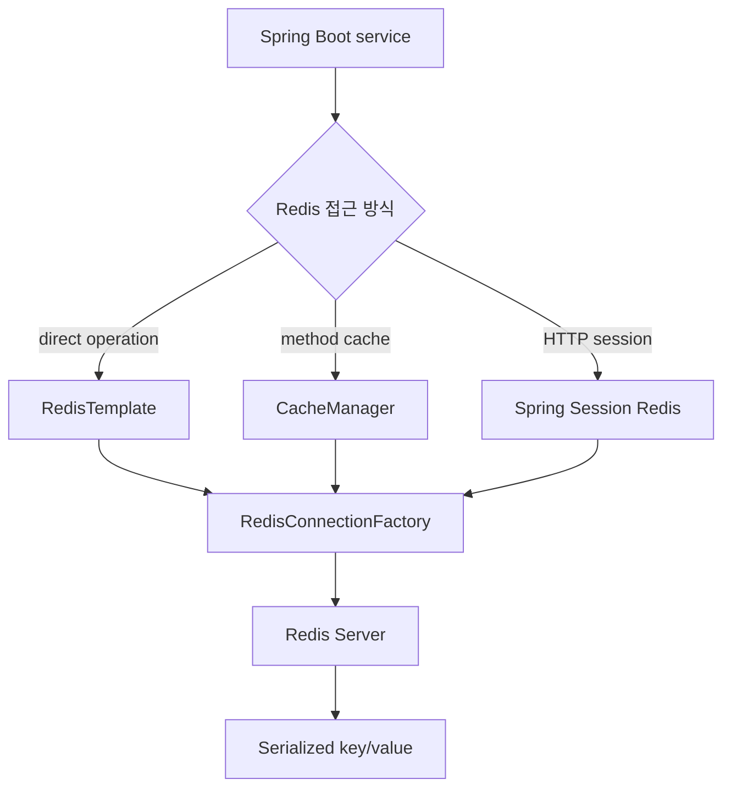
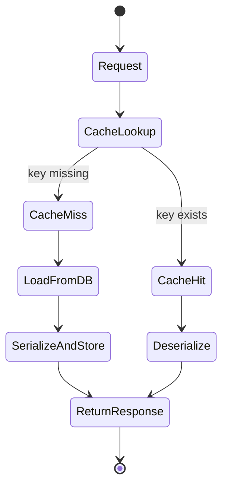

# Redis Spring Boot Integration 학습 및 기록 노트

## 1. 왜 필요한가? (Pain Point & Motivation)

Spring Boot에서 Redis를 붙이면 cache, session, temporary value store를 빠르게 만들 수 있다. 하지만 connection 설정, serializer, TTL, cache invalidation, session namespace, connection pool을 명확히 잡지 않으면 serialization error, stale cache, memory growth, connection timeout이 생긴다.

이 문서는 원문의 Redis Spring Boot 연동 내용을 dependency, `RedisConnectionFactory`, `RedisTemplate`, `CacheManager`, session, troubleshooting 중심으로 재작성한다.

## 2. 현재 나의 상태 (Baseline)

- `spring-boot-starter-data-redis`를 추가하면 Redis 연동이 가능하다는 점은 알고 있다.
- `RedisTemplate`과 Spring Cache abstraction의 역할 차이를 구분해야 한다.
- Key/value serializer를 명시하지 않으면 데이터 호환성 문제가 생길 수 있음을 이해해야 한다.
- `@Cacheable`, `@CacheEvict`의 key와 TTL 설계가 중요하다.
- Redis session을 쓸 때 namespace와 timeout이 애플리케이션 운영에 미치는 영향을 정리해야 한다.

## 3. 도달하고 싶은 목표 (Target State)

- Spring Boot에서 Redis connection factory와 template을 구성한다.
- CacheManager에 기본 TTL과 serializer를 지정한다.
- `RedisTemplate` 직접 사용과 cache annotation 사용을 구분한다.
- Session store를 Redis로 옮길 때 timeout과 namespace를 명확히 설정한다.
- Connection refused, serialization error, memory issue, slow query를 빠르게 진단한다.

## 4. 시스템 번역 (Data Flow)



Spring Boot Redis 연동의 핵심은 application object를 어떤 serializer로 Redis key/value에 저장하고, 언제 만료시키며, 어떤 connection으로 접근하는지 정하는 것이다.

## 5. 핵심 구성요소 (Building Blocks)

| 구성요소 | 역할 | 주의점 |
| --- | --- | --- |
| Redis starter | Redis client와 auto-configuration 제공 | Boot 버전에 맞는 dependency |
| Lettuce | 기본 Redis client | timeout/pool 설정 확인 |
| `RedisConnectionFactory` | Redis connection 생성 | host, port, password, TLS |
| `RedisTemplate` | Redis operation 직접 실행 | serializer 일관성 필요 |
| `StringRedisSerializer` | key/hash key 직렬화 | 사람이 읽기 쉬운 key |
| JSON serializer | value/hash value 직렬화 | class metadata와 호환성 주의 |
| `RedisCacheManager` | Spring Cache 저장소 | TTL, prefix, null value 정책 |
| `@Cacheable` | method result cache | key expression과 invalidation 필요 |
| `@CacheEvict` | cache 제거 | update/delete와 함께 실행 |
| Spring Session | HTTP session Redis 저장 | namespace, timeout, security |

## 6. 상태 전이 (State Transition)



Cache miss에서는 source DB를 조회한 뒤 serializer를 통해 Redis에 저장한다. Cache hit에서는 Redis value를 역직렬화해 application object로 되돌린다.

## 7. 불변식 (Invariant: 절대 깨지면 안 되는 규칙)

- Redis key naming과 prefix는 충돌을 피할 수 있게 설계해야 한다.
- Cache TTL은 데이터 변경 주기와 stale 허용 범위에 맞아야 한다.
- Serializer는 배포 버전 간 호환성을 고려해야 한다.
- `@Cacheable` key와 `@CacheEvict` key는 같은 규칙을 사용해야 한다.
- Redis 장애 시 cache miss 또는 fallback 동작을 애플리케이션에서 감당할 수 있어야 한다.
- Session Redis를 쓰면 Redis 장애가 login/session 장애로 이어질 수 있다.
- Connection timeout과 pool 크기는 request concurrency와 Redis latency에 맞춰야 한다.

## 8. 가장 작은 예제 (Minimal Viable Example)

```yaml
spring:
  data:
    redis:
      host: localhost
      port: 6379
      timeout: 2000ms
```

```java
@Configuration
@EnableCaching
public class RedisCacheConfig {
    @Bean
    public CacheManager cacheManager(RedisConnectionFactory connectionFactory) {
        RedisCacheConfiguration config = RedisCacheConfiguration.defaultCacheConfig()
            .entryTtl(Duration.ofMinutes(30))
            .serializeKeysWith(
                RedisSerializationContext.SerializationPair.fromSerializer(
                    new StringRedisSerializer()))
            .serializeValuesWith(
                RedisSerializationContext.SerializationPair.fromSerializer(
                    new GenericJackson2JsonRedisSerializer()));

        return RedisCacheManager.builder(connectionFactory)
            .cacheDefaults(config)
            .build();
    }
}
```

```java
@Service
public class UserService {
    @Cacheable(value = "users", key = "#id")
    public User findById(Long id) {
        return userRepository.findById(id).orElse(null);
    }

    @CacheEvict(value = "users", key = "#user.id")
    public User update(User user) {
        return userRepository.save(user);
    }
}
```

이 예제는 cache read path와 update invalidation path가 같은 cache name/key 규칙을 공유해야 함을 보여준다.

## 9. 실패 사례 (What could go wrong?)

- Serializer를 바꾼 뒤 기존 Redis value를 읽지 못해 deserialization error가 발생한다.
- `@Cacheable` key와 `@CacheEvict` key가 달라 update 후 stale cache가 남는다.
- TTL이 없는 cache가 계속 쌓여 Redis memory가 증가한다.
- Redis 장애를 DB fallback 없이 그대로 사용자 오류로 노출한다.
- Session store를 Redis로 옮긴 뒤 Redis 장애가 전체 로그인 장애로 확대된다.
- Connection pool이 작거나 timeout이 길어 request thread가 Redis 대기에서 밀린다.
- Local/dev와 prod의 Redis namespace가 같아 key 충돌이 발생한다.

## 10. 뇌 확장하기 (Evolution & Variants)

- `RedisTemplate`은 low-level operation, Spring Cache는 method result caching에 적합하다.
- Reactive Redis는 reactive application stack에서 backpressure와 함께 설계한다.
- Cache warmup, cache-aside, write-through, refresh-ahead 패턴을 비교한다.
- Observability는 cache hit ratio, Redis latency, command count, pool usage를 함께 본다.
- Redis Cluster/Sentinel/managed Redis를 쓰면 connection factory와 topology 설정이 달라진다.

## 11. 최종 체크리스트 (Definition of Done)

- [x] Spring Boot Redis 연동의 핵심 구성요소를 정리했다.
- [x] `RedisTemplate`과 `CacheManager`의 역할 차이를 설명했다.
- [x] TTL, serializer, cache key, session timeout 불변식을 포함했다.
- [x] Spring Cache 최소 예제를 제시했다.
- [x] 원문 Redis Spring Boot integration 문서를 12개 섹션 템플릿으로 재작성했다.

## 12. 뇌에 새기는 복습 문장 (TL;DR Blank)

Spring Boot에서 Redis 캐시는 연결보다 key, TTL, serializer, invalidation 규칙이 맞아야 안정적으로 동작한다.
