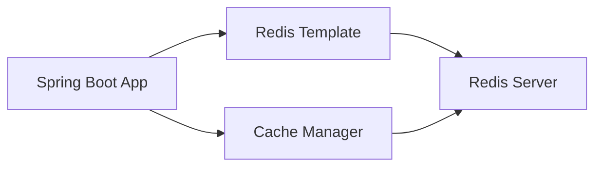

# Redis Spring Boot Integration

> Practical guide to one Redis and Spring Boot integration path

---

## Scope and Verification Contract

- **Scope:** Pin Spring Boot, Spring Data Redis, client library, Redis server, serializer, cache and session modules, and deployment mode. Configuration keys and defaults vary by release.
- **Assumptions:** Define key ownership, TTL, serialization compatibility, cache consistency, connection and command timeouts, retry policy, pooling, and behavior when Redis is unavailable.
- **Facts and inference:** A successful connection and emitted command are facts; a latency or cache-benefit claim needs application metrics, Redis statistics, and a controlled baseline.
- **Failure and completion:** Test missing and malformed values, expiry, reconnect, timeout, failover, serializer migration, stale cache, and session loss. Completion requires passing integration tests and bounded fallback or failure behavior.

---

## Overview

Redis integration can support caching, session management, and latency-sensitive data access in Spring Boot applications; the benefit and consistency behavior depend on the workload and configuration.



---

## Dependencies

### Gradle

```groovy
dependencies {
    implementation 'org.springframework.boot:spring-boot-starter-data-redis'
    // Optional: For reactive Redis
    implementation 'org.springframework.boot:spring-boot-starter-data-redis-reactive'
}
```

### Maven

```xml
<dependency>
    <groupId>org.springframework.boot</groupId>
    <artifactId>spring-boot-starter-data-redis</artifactId>
</dependency>
```

---

## Configuration

### Application Properties

```yaml
# application.yml
spring:
  data:
    redis:
      host: localhost
      port: 6379
      password: your-password  # Optional
      timeout: 2000ms
      lettuce:
        pool:
          max-active: 8
          max-idle: 8
          min-idle: 0
```

### Java Configuration

```java
@Configuration
public class RedisConfig {

    @Value("${spring.data.redis.host}")
    private String host;

    @Value("${spring.data.redis.port}")
    private int port;

    @Bean
    public RedisConnectionFactory redisConnectionFactory() {
        RedisStandaloneConfiguration config = new RedisStandaloneConfiguration();
        config.setHostName(host);
        config.setPort(port);
        return new LettuceConnectionFactory(config);
    }

    @Bean
    public RedisTemplate<String, Object> redisTemplate() {
        RedisTemplate<String, Object> template = new RedisTemplate<>();
        template.setConnectionFactory(redisConnectionFactory());
        
        // Key serializer
        template.setKeySerializer(new StringRedisSerializer());
        template.setHashKeySerializer(new StringRedisSerializer());
        
        // Value serializer (JSON)
        template.setValueSerializer(new GenericJackson2JsonRedisSerializer());
        template.setHashValueSerializer(new GenericJackson2JsonRedisSerializer());
        
        return template;
    }
}
```

---

## Usage Examples

### Basic Operations

```java
@Service
@RequiredArgsConstructor
public class CacheService {
    
    private final RedisTemplate<String, Object> redisTemplate;
    
    // Set value
    public void set(String key, Object value) {
        redisTemplate.opsForValue().set(key, value);
    }
    
    // Set with TTL
    public void setWithTTL(String key, Object value, Duration ttl) {
        redisTemplate.opsForValue().set(key, value, ttl);
    }
    
    // Get value
    public Object get(String key) {
        return redisTemplate.opsForValue().get(key);
    }
    
    // Delete key
    public void delete(String key) {
        redisTemplate.delete(key);
    }
    
    // Check if key exists
    public boolean exists(String key) {
        return Boolean.TRUE.equals(redisTemplate.hasKey(key));
    }
}
```

### Spring Cache Abstraction

```java
@Configuration
@EnableCaching
public class CacheConfig {
    
    @Bean
    public CacheManager cacheManager(RedisConnectionFactory connectionFactory) {
        RedisCacheConfiguration config = RedisCacheConfiguration.defaultCacheConfig()
            .entryTtl(Duration.ofMinutes(30))
            .serializeKeysWith(
                RedisSerializationContext.SerializationPair.fromSerializer(new StringRedisSerializer()))
            .serializeValuesWith(
                RedisSerializationContext.SerializationPair.fromSerializer(new GenericJackson2JsonRedisSerializer()));
        
        return RedisCacheManager.builder(connectionFactory)
            .cacheDefaults(config)
            .build();
    }
}

@Service
public class UserService {
    
    @Cacheable(value = "users", key = "#id")
    public User findById(Long id) {
        // Database query - cached automatically
        return userRepository.findById(id).orElse(null);
    }
    
    @CacheEvict(value = "users", key = "#user.id")
    public User update(User user) {
        return userRepository.save(user);
    }
    
    @CacheEvict(value = "users", allEntries = true)
    public void clearCache() {
        // Clears all user cache entries
    }
}
```

---

## Session Management

```yaml
# application.yml
spring:
  session:
    store-type: redis
    timeout: 30m
    redis:
      namespace: spring:session
```

```java
@Configuration
@EnableRedisHttpSession(maxInactiveIntervalInSeconds = 1800)
public class SessionConfig {
}
```

---

## Connection Pooling

```java
@Configuration
public class RedisPoolConfig {
    
    @Bean
    public LettucePoolingClientConfiguration lettucePoolConfig() {
        GenericObjectPoolConfig<?> poolConfig = new GenericObjectPoolConfig<>();
        poolConfig.setMaxTotal(10);
        poolConfig.setMaxIdle(5);
        poolConfig.setMinIdle(1);
        
        return LettucePoolingClientConfiguration.builder()
            .poolConfig(poolConfig)
            .commandTimeout(Duration.ofSeconds(2))
            .build();
    }
}
```

---

## Troubleshooting

| Issue | Solution |
|-------|----------|
| Connection refused | Check Redis server running, host/port config |
| Serialization error | Ensure consistent serializers |
| Memory issues | Set TTL, use eviction policies |
| Slow performance | Enable connection pooling |

---

## Related Documentation

- [Redis Overview](overview.md)
- [Database Installation](../installation.md)
