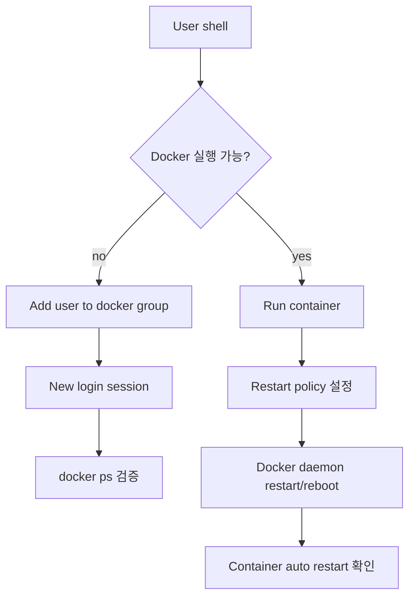
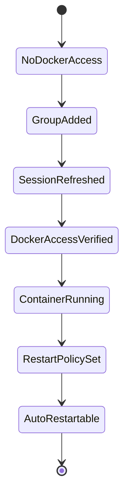

# Docker 권한 및 재시작 명령 학습 및 기록 노트

## 1. 왜 필요한가? (Pain Point & Motivation)

Docker 설치 직후에는 일반 사용자가 Docker daemon에 접근하지 못하거나, 컨테이너가 서버 재부팅 후 자동으로 올라오지 않는 문제가 자주 생긴다. 반대로 `docker` 그룹 권한은 사실상 root 수준의 권한이므로 무심코 부여하면 host 보안 경계가 약해진다. `sudoers` 수정도 잘못하면 관리자 권한을 잃을 수 있다.

이 문서는 원문의 Docker 권한 설정, container restart policy, `visudo` 사용법을 안전한 운영 절차 중심으로 재작성한다.

## 2. 현재 나의 상태 (Baseline)

- Docker 명령을 실행하려면 Docker daemon 권한이 필요하다는 점은 알고 있다.
- `sudo usermod -aG docker $USER` 실행 후 재로그인이 필요하다는 점을 명확히 해야 한다.
- `--restart always`와 restart policy가 container lifecycle에 미치는 영향을 정리해야 한다.
- `visudo`로 sudoers를 수정할 때 구문 오류를 피해야 한다.
- Docker 권한 부여가 root-equivalent risk라는 점을 운영 기준에 포함해야 한다.

## 3. 도달하고 싶은 목표 (Target State)

- 일반 사용자가 Docker CLI를 실행할 수 있도록 그룹 권한을 설정하고 검증한다.
- Container가 crash나 host reboot 후 자동 재시작되도록 restart policy를 설정한다.
- Sudo 권한 변경은 `visudo`를 통해 안전하게 적용한다.
- 권한 부여 후 새 login session에서 실제 권한을 확인한다.
- Docker group과 sudoers 변경의 보안 영향을 이해한다.

## 4. 시스템 번역 (Data Flow)



Docker 권한 data flow는 명령 하나로 끝나지 않는다. group membership은 새 session에 반영되어야 하고, container restart policy는 container 생성 또는 update 상태에 반영되어야 한다.

## 5. 핵심 구성요소 (Building Blocks)

| 구성요소 | 명령/파일 | 역할 |
| --- | --- | --- |
| Docker group | `sudo usermod -aG docker $USER` | 일반 사용자에게 daemon socket 접근 허용 |
| New session | logout/login 또는 `newgrp docker` | group membership 반영 |
| 권한 검증 | `docker ps` | sudo 없이 Docker 접근 확인 |
| Restart policy | `--restart always` | 종료/재부팅 후 자동 재시작 |
| Existing container update | `docker update --restart always name` | 이미 만든 container policy 변경 |
| sudoers 편집 | `sudo visudo` | `/etc/sudoers` 구문 검증 편집 |
| sudo rule | `user ALL=(ALL:ALL) ALL` | 사용자 sudo 권한 정의 |

## 6. 상태 전이 (State Transition)



권한 설정은 `GroupAdded`에서 끝나지 않는다. 새 session에서 `docker ps`가 성공해야 실제 사용 가능한 상태다.

## 7. 불변식 (Invariant: 절대 깨지면 안 되는 규칙)

- `docker` 그룹 권한은 host root 권한에 준하므로 신뢰할 수 있는 사용자에게만 부여해야 한다.
- `usermod -aG`에서 `-a`를 빼면 기존 보조 그룹이 덮일 수 있으므로 사용하면 안 된다.
- Group 변경 후에는 새 login session을 시작해야 한다.
- Restart policy는 stateless/service container와 stateful container의 종료 의도에 맞게 선택해야 한다.
- `/etc/sudoers`는 직접 편집하지 말고 `visudo`로 수정해야 한다.
- Passwordless sudo rule은 허용 명령을 최소화해야 한다.

## 8. 가장 작은 예제 (Minimal Viable Example)

Docker group 권한 부여:

```bash
sudo usermod -aG docker "$USER"
newgrp docker
docker ps
```

Container 자동 재시작:

```bash
docker run -d --name nginx --restart always nginx
docker update --restart always nginx
```

`sudoers` 안전 편집:

```bash
sudo visudo
```

```text
john ALL=(ALL:ALL) NOPASSWD: /usr/bin/systemctl restart docker
```

이 예제는 권한 변경, session 반영, container restart policy, sudoers 편집을 각각 검증 가능한 작은 단계로 나눈다.

## 9. 실패 사례 (What could go wrong?)

- `docker` 그룹에 불필요한 사용자를 넣어 host root 권한 우회 경로를 만든다.
- `usermod -G docker user`처럼 `-a` 없이 실행해 사용자의 기존 그룹을 잃는다.
- 로그아웃/로그인 없이 바로 `docker ps`를 실행해 권한 변경이 안 된 것으로 오해한다.
- `--restart always`를 임시 test container에 붙여 재부팅 때 원치 않게 살아난다.
- `visudo` 대신 sudoers 파일을 직접 편집해 구문 오류로 sudo 권한이 깨진다.
- `NOPASSWD: ALL`을 넓게 부여해 audit와 권한 경계가 약해진다.

## 10. 뇌 확장하기 (Evolution & Variants)

- Restart policy는 `no`, `on-failure`, `always`, `unless-stopped`를 container 성격에 맞게 비교한다.
- Docker daemon socket 접근은 rootless Docker 또는 제한된 CI runner와 비교할 수 있다.
- 운영 서비스는 `docker run`보다 Compose 또는 systemd unit으로 lifecycle을 명시할 수 있다.
- 권한 관리는 user group, sudoers, SSH 접근, audit log를 함께 본다.

## 11. 최종 체크리스트 (Definition of Done)

- [x] Docker group 권한 부여와 검증 흐름을 정리했다.
- [x] Container restart policy 설정 예제를 포함했다.
- [x] `visudo` 기반 sudoers 수정 기준을 설명했다.
- [x] Docker group의 root-equivalent 보안 위험을 불변식으로 명시했다.
- [x] 원문 Docker commands 문서를 12개 섹션 템플릿으로 재작성했다.

## 12. 뇌에 새기는 복습 문장 (TL;DR Blank)

Docker 권한 설정은 편의 기능이 아니라 Docker daemon socket에 누가 root 수준으로 접근할 수 있는지 정하는 보안 경계다.
