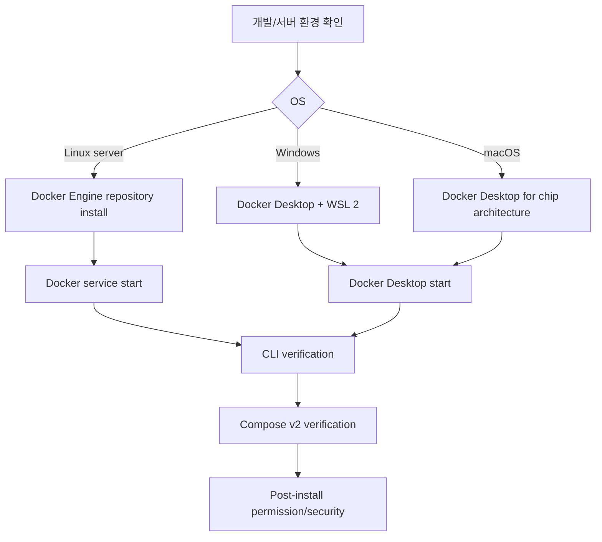
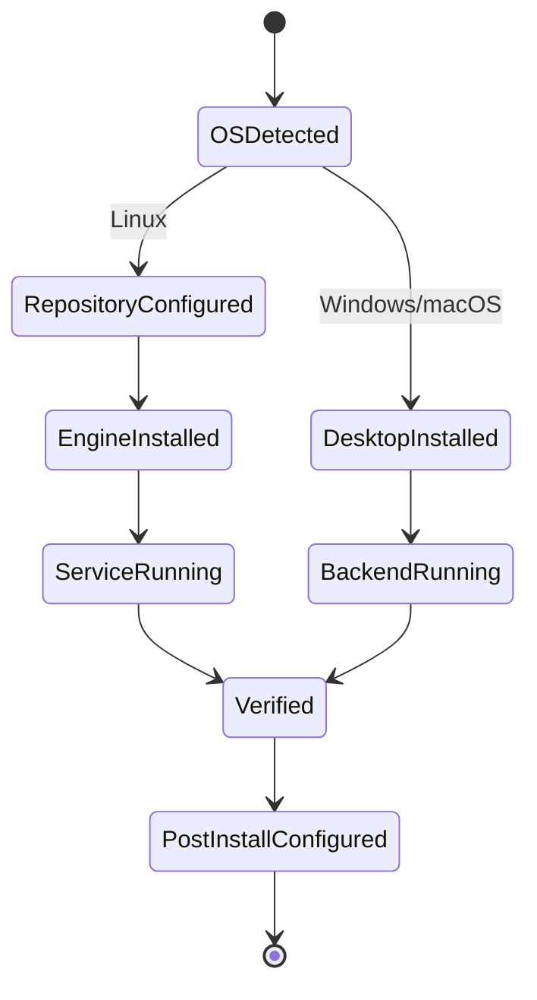

# Docker 설치 가이드 학습 및 기록 노트

## 1. 왜 필요한가? (Pain Point & Motivation)

Docker 설치는 운영체제마다 경로가 다르다. Linux server에서는 Docker Engine과 Compose plugin을 package repository로 설치하는 경우가 많고, Windows/macOS 개발 환경에서는 Docker Desktop이 WSL 2 또는 lightweight VM을 관리한다. 설치 후에는 daemon 실행, 권한, Compose v2, hello-world 검증, Desktop license/권한 조건까지 확인해야 한다.

이 문서는 원문의 Linux, Windows, macOS Docker 설치 가이드를 OS별 설치 선택과 post-install validation 중심으로 재작성한다.

## 2. 현재 나의 상태 (Baseline)

- Docker Engine과 Docker Desktop이 모두 Docker CLI를 제공한다는 점은 알고 있다.
- Linux에서는 오래된 package 충돌 제거와 공식 repository 설정이 필요할 수 있다.
- Windows는 WSL 2 backend와 Docker Desktop installation mode가 중요하다.
- macOS는 Apple silicon/Intel installer와 Docker Desktop 권한 설정이 필요하다.
- 설치 후 `docker run --rm hello-world`와 `docker compose version`으로 검증해야 한다.

## 3. 도달하고 싶은 목표 (Target State)

- Linux server와 Desktop 개발 환경의 설치 방식을 구분한다.
- Ubuntu/Debian 계열에서 공식 apt repository 기반 설치 흐름을 이해한다.
- Windows Docker Desktop에서 WSL 2 backend와 per-user/all-users installation 차이를 판단한다.
- macOS Docker Desktop에서 supported macOS, chip architecture, privileged setting을 확인한다.
- 설치 후 Docker daemon, CLI, Compose plugin, user permission을 검증한다.

## 4. 시스템 번역 (Data Flow)



Docker 설치 data flow는 package 설치에서 끝나지 않고, daemon/backend가 실제로 실행되고 CLI가 그 backend와 통신할 수 있는지 검증해야 완료된다.

## 5. 핵심 구성요소 (Building Blocks)

| 구성요소 | 역할 | 확인 기준 |
| --- | --- | --- |
| Docker Engine | Linux daemon과 CLI | `systemctl status docker` |
| Docker Desktop | Windows/macOS 통합 개발 환경 | Desktop app 실행 및 backend ready |
| containerd | container runtime 계층 | Engine package와 함께 설치 |
| Buildx plugin | modern build 기능 | `docker buildx version` |
| Compose plugin | Compose v2 | `docker compose version` |
| WSL 2 backend | Windows Linux container backend | WSL version과 integration 확인 |
| Docker group | Linux non-root CLI 접근 | root-equivalent 권한 주의 |
| hello-world | 설치 smoke test | image pull/run/exit 성공 |

## 6. 상태 전이 (State Transition)



설치는 `EngineInstalled`나 `DesktopInstalled`가 아니라 `Verified` 이후 권한과 Compose 사용까지 확인되어야 끝난다.

## 7. 불변식 (Invariant: 절대 깨지면 안 되는 규칙)

- OS별 공식 설치 문서는 수시로 바뀌므로 실행 전 현재 Docker 공식 문서를 확인해야 한다.
- Linux에서 오래된 `docker`, `docker.io`, `docker-engine` package가 충돌하면 제거 후 설치해야 한다.
- Docker Desktop의 상업적 사용 조건은 조직 규모와 용도에 따라 확인해야 한다.
- Windows에서는 WSL 2 version과 virtualization 지원을 확인해야 한다.
- macOS에서는 현재 및 이전 주요 macOS 지원 범위를 확인해야 한다.
- Linux에서 `docker` group 권한은 host root 수준 접근이 가능하므로 신뢰된 사용자에게만 부여해야 한다.
- Compose v2는 일반적으로 `docker-compose`가 아니라 `docker compose` 명령으로 확인한다.

## 8. 가장 작은 예제 (Minimal Viable Example)

Ubuntu 계열 공식 repository 설치 흐름의 개념 예시:

```bash
sudo apt-get update
sudo apt-get install ca-certificates curl
sudo install -m 0755 -d /etc/apt/keyrings
sudo curl -fsSL https://download.docker.com/linux/ubuntu/gpg \
  -o /etc/apt/keyrings/docker.asc
sudo chmod a+r /etc/apt/keyrings/docker.asc
```

```bash
sudo apt-get update
sudo apt-get install docker-ce docker-ce-cli containerd.io \
  docker-buildx-plugin docker-compose-plugin
sudo systemctl start docker
sudo docker run --rm hello-world
docker compose version
```

이 예제는 repository setup, Engine package, service start, smoke test, Compose v2 확인을 분리한다. 실제 repository source line은 OS codename과 architecture에 따라 공식 문서를 따라 작성한다.

## 9. 실패 사례 (What could go wrong?)

- 배포판 repository의 오래된 Docker package와 공식 repository package가 섞인다.
- WSL 2가 오래되었거나 비활성화되어 Windows Docker Desktop backend가 시작되지 않는다.
- macOS에서 chip architecture에 맞지 않는 installer를 선택한다.
- Docker Desktop license 조건을 확인하지 않고 조직 환경에 배포한다.
- `docker compose` plugin이 설치되지 않아 compose 파일 실행이 실패한다.
- Linux에서 일반 사용자에게 Docker 권한을 부여하지 않아 매번 `sudo`가 필요하거나, 반대로 불필요한 사용자에게 docker group을 준다.
- 설치 후 hello-world 검증 없이 바로 업무 container를 올려 daemon/backend 문제를 뒤늦게 발견한다.

## 10. 뇌 확장하기 (Evolution & Variants)

- Linux server는 rootless Docker, Docker Engine, Podman, containerd 단독 사용을 비교할 수 있다.
- Windows는 WSL 2 backend, Hyper-V backend, per-user/all-users installation mode를 요구사항에 맞게 고른다.
- macOS Docker Desktop은 symlink 위치, privileged port mapping, default socket 설정을 security policy와 맞춘다.
- CI 환경에서는 Docker-in-Docker, remote Docker host, rootless buildkit의 trade-off를 별도로 검토한다.
- 공식 문서 진입점은 Docker Engine install, Docker Desktop Windows/Mac install, Compose plugin install 페이지다.

## 11. 최종 체크리스트 (Definition of Done)

- [x] Linux, Windows, macOS 설치 경로를 구분했다.
- [x] Docker Engine, Desktop, WSL 2, Compose v2 검증 포인트를 정리했다.
- [x] Ubuntu repository 설치의 현재 공식 흐름을 개념 예제로 반영했다.
- [x] Docker group과 Desktop license/권한 조건을 불변식에 포함했다.
- [x] 원문 Docker installation 문서를 12개 섹션 템플릿으로 재작성했다.

## 12. 뇌에 새기는 복습 문장 (TL;DR Blank)

Docker 설치의 완료 기준은 파일이 설치된 상태가 아니라, daemon/backend가 실행되고 CLI와 Compose가 실제 container를 실행할 수 있는 상태다.
