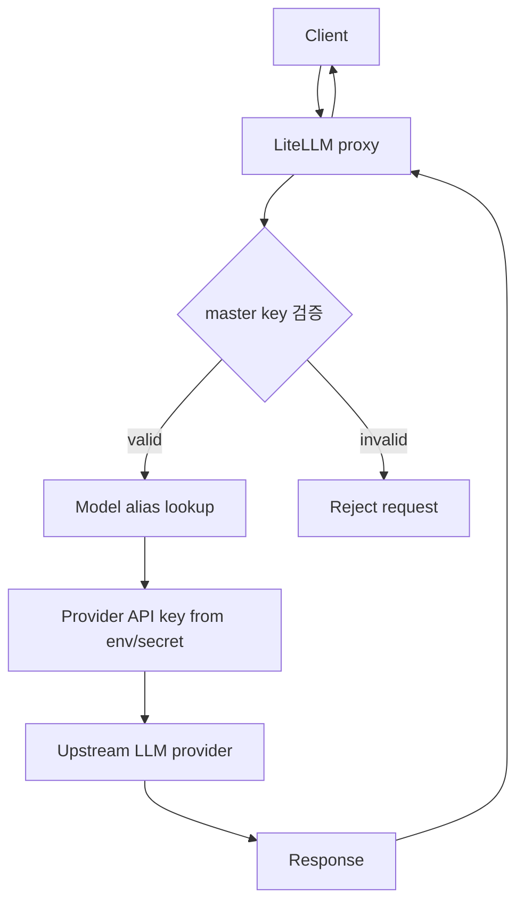
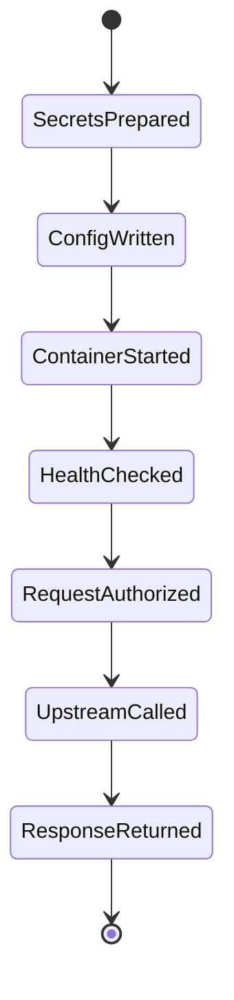

# LiteLLM Proxy 안전 구성 학습 및 기록 노트

## 1. 왜 필요한가? (Pain Point & Motivation)

LiteLLM proxy는 여러 LLM provider를 OpenAI-compatible endpoint처럼 라우팅할 수 있는 gateway다. 하지만 provider credential, proxy master key, model alias, Docker secret, network exposure를 잘못 다루면 개인 IDE token 유출, 무단 사용, 비용 폭증, audit 누락으로 이어질 수 있다. 특히 로컬 IDE나 Copilot 세션 token을 스크래핑해 자동 주입하는 방식은 안전한 운영 패턴이 아니다.

이 문서는 원문의 LiteLLM Docker 구성 의도를 유지하되, token scraping 대신 공식 provider key와 secret management를 사용하는 안전한 proxy 구성 흐름으로 재작성한다.

## 2. 현재 나의 상태 (Baseline)

- LiteLLM이 LLM proxy/gateway 역할을 한다는 점은 알고 있다.
- `config.yaml`의 `model_list`와 proxy `master_key`가 어떤 역할을 하는지 정리해야 한다.
- `.env`에 API key를 둘 때 git tracking, file permission, rotation을 함께 고려해야 한다.
- Docker Compose에서 config file과 environment variable을 container에 전달하는 흐름을 이해해야 한다.
- IDE local token이나 internal endpoint를 자동 추출하는 방식은 피해야 한다.

## 3. 도달하고 싶은 목표 (Target State)

- LiteLLM proxy를 Docker Compose로 실행하고 config file을 mount한다.
- Provider API key는 `.env` 또는 secret store에서 주입한다.
- `model_list`에서 사용자에게 노출할 model alias와 provider model을 분리한다.
- Client는 LiteLLM master key로 proxy에 인증하고, proxy는 provider key로 upstream에 요청한다.
- Token scraping, internal API 호출, secret commit, wide-open proxy 노출을 방지한다.

## 4. 시스템 번역 (Data Flow)



LiteLLM data flow는 client credential과 provider credential을 분리한다. Client는 proxy key만 알고, provider API key는 container environment나 secret store 안에 있어야 한다.

## 5. 핵심 구성요소 (Building Blocks)

| 구성요소 | 역할 | 주의점 |
| --- | --- | --- |
| `config.yaml` | model alias와 provider 설정 | secret literal을 직접 넣지 않는다 |
| `model_list` | proxy에 노출할 model 목록 | 사용자-facing 이름과 provider model 분리 |
| Provider API key | upstream 호출 인증 | env/secret으로 주입, rotation 필요 |
| `LITELLM_MASTER_KEY` | client가 proxy에 붙을 때 쓰는 key | 외부 노출 시 반드시 강하게 설정 |
| Docker Compose | proxy container 실행 | config mount, env file, port 제한 |
| `.env` | local secret injection | `.gitignore`, permission 관리 |
| Network binding | proxy listen/publish 범위 | public exposure 최소화 |
| Logs | request/error 추적 | secret redaction 확인 |

## 6. 상태 전이 (State Transition)



`SecretsPrepared` 전에 container를 띄우면 proxy는 시작되어도 upstream 인증에서 실패한다. 반대로 secret을 config에 평문으로 고정하면 rotation과 유출 대응이 어려워진다.

## 7. 불변식 (Invariant: 절대 깨지면 안 되는 규칙)

- IDE, Copilot, browser session token을 자동 추출해 proxy credential로 쓰지 않는다.
- 문서화되지 않은 internal API endpoint에 의존하지 않는다.
- Provider API key와 proxy master key는 git에 commit하지 않는다.
- `config.yaml`에는 가능하면 `os.environ/KEY_NAME` 형태로 secret reference만 둔다.
- Proxy를 외부에 노출할 때는 master key, TLS, firewall, rate limit, logging을 함께 고려한다.
- Client-facing model alias는 변경 가능하지만 upstream provider key는 secret boundary 안에 있어야 한다.
- Token/key rotation 절차는 container restart 또는 secret reload 방법까지 포함해야 한다.

## 8. 가장 작은 예제 (Minimal Viable Example)

`.env`:

```dotenv
LITELLM_MASTER_KEY=sk-change-me
PROVIDER_API_KEY=provider-key-from-official-console
```

`config.yaml`:

```yaml
model_list:
  - model_name: team-chat-model
    litellm_params:
      model: openai/<provider-model-name>
      api_key: os.environ/PROVIDER_API_KEY

general_settings:
  master_key: os.environ/LITELLM_MASTER_KEY
```

`docker-compose.yaml`:

```yaml
services:
  litellm:
    image: docker.litellm.ai/berriai/litellm:main-latest
    ports:
      - "127.0.0.1:4000:4000"
    volumes:
      - ./config.yaml:/app/config.yaml:ro
    env_file:
      - .env
    command: ["--config", "/app/config.yaml"]
    restart: unless-stopped
```

검증:

```bash
curl http://127.0.0.1:4000/chat/completions \
  -H "Authorization: Bearer sk-change-me" \
  -H "Content-Type: application/json" \
  -d '{"model":"team-chat-model","messages":[{"role":"user","content":"hello"}]}'
```

이 예제는 provider key를 container environment로만 전달하고, proxy client에게는 별도 master key만 노출하는 최소 흐름이다.

## 9. 실패 사례 (What could go wrong?)

- VS Code/Copilot local token을 `.env`에 추출해 저장하고 git에 실수로 commit한다.
- 문서화되지 않은 internal token endpoint가 바뀌어 proxy가 갑자기 인증 실패한다.
- `LITELLM_MASTER_KEY`를 기본값으로 두고 proxy port를 외부에 공개한다.
- `config.yaml`에 provider key를 평문으로 넣어 config 백업/공유 과정에서 유출된다.
- `0.0.0.0:4000`으로 공개하면서 firewall, TLS, rate limit을 적용하지 않는다.
- Model alias와 provider model mapping을 변경했는데 client contract를 공지하지 않는다.
- Logs에 Authorization header나 upstream key가 남는다.

## 10. 뇌 확장하기 (Evolution & Variants)

- Secret 관리는 `.env`에서 Docker secrets, Vault, cloud secret manager로 확장한다.
- 운영 배포는 Postgres-backed LiteLLM, virtual keys, usage tracking, rate limits를 검토한다.
- 여러 provider를 쓸 때는 model alias, fallback, budget, routing policy를 명시한다.
- 로컬 개발 proxy와 team/shared proxy는 network exposure와 audit 요구사항이 다르다.
- 공식 LiteLLM 문서의 `model_list`, Docker run, `master_key` 설정을 기준으로 현재 버전에 맞게 검증한다.

## 11. 최종 체크리스트 (Definition of Done)

- [x] 원문의 자동 Copilot token 추출 절차를 안전한 secret 주입 패턴으로 대체했다.
- [x] LiteLLM `config.yaml`, `model_list`, `master_key`, Docker Compose 흐름을 정리했다.
- [x] Provider key와 client proxy key의 경계를 분리했다.
- [x] Token scraping, internal API 의존, secret commit, public exposure 실패 사례를 포함했다.
- [x] 원문 LiteLLM guide 문서를 12개 섹션 템플릿으로 재작성했다.

## 12. 뇌에 새기는 복습 문장 (TL;DR Blank)

LiteLLM proxy의 핵심은 여러 모델을 한 endpoint로 묶는 것이지만, 안전성은 provider key와 client key를 분리하고 secret을 절대 스크래핑하지 않는 데서 시작한다.
