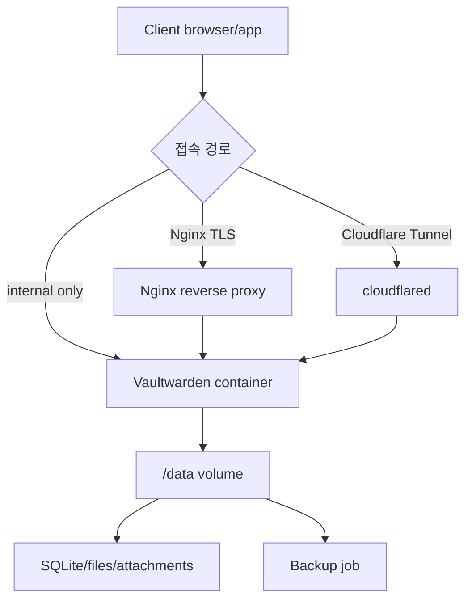
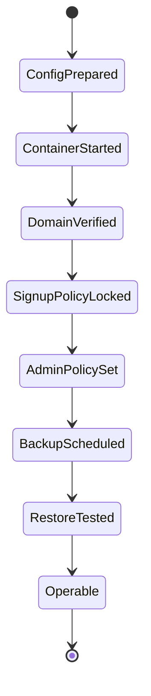

# Vaultwarden Docker Compose 배포 학습 및 기록 노트

## 적용 범위와 보안 검증 기준

- **범위:** Vaultwarden·database·proxy·tunnel·backup image의 version 또는 digest, Docker/Compose, domain, TLS 종료 지점과 외부 노출 경계를 기록합니다.
- **보안 전제:** secret은 repository와 image에서 분리하고 registration·admin endpoint·2FA·rate limit·proxy header·ACL을 위협 모델에 맞게 설정합니다. 예제 구성이 production readiness를 보장하지 않습니다.
- **근거와 불확실성:** image health, HTTPS 접속과 backup 생성은 일부 근거일 뿐입니다. proxy chain, mail, WebSocket, update 호환성, third-party backup image와 restore 가능성은 별도 검증합니다.
- **실패·완료:** 인증 우회, 잘못된 header 신뢰, secret 노출, database 손상, backup 유실과 update rollback을 시험합니다. 암호화된 backup의 독립 restore와 계정 복구까지 성공해야 배포 완료입니다.

## 1. 왜 필요한가? (Pain Point & Motivation)

Vaultwarden은 비밀번호와 2FA secret 같은 고위험 데이터를 다루는 서비스다. Docker Compose로 쉽게 실행할 수 있지만, 도메인, HTTPS, signup 정책, admin page, backup, restore, reverse proxy, Cloudflare Tunnel을 잘못 설정하면 credential vault 전체가 위험해진다. 특히 `DISABLE_ADMIN_TOKEN`은 admin page 비활성화가 아니라 admin token 요구를 끄는 설정이라 매우 주의해야 한다.

이 문서는 원문의 Vaultwarden Docker Compose 가이드를 보안 경계, 배포 시나리오, backup/restore, admin page 정책 중심으로 재작성한다.

## 2. 현재 나의 상태 (Baseline)

- Vaultwarden을 Docker container로 실행할 수 있다는 점은 알고 있다.
- 내부망, Nginx reverse proxy, Cloudflare Tunnel 배포 방식의 차이를 구분해야 한다.
- `DOMAIN`, `SIGNUPS_ALLOWED`, `ADMIN_TOKEN`, `DISABLE_ADMIN_TOKEN`의 의미를 정확히 이해해야 한다.
- `/data` volume과 backup/restore 절차가 vault 데이터 보존에 중요하다.
- WebSocket, HTTPS, proxy header, Cloudflare 521 같은 장애 지점을 확인해야 한다.

## 3. 도달하고 싶은 목표 (Target State)

- Vaultwarden container를 persistent data volume과 함께 실행한다.
- Signup은 기본적으로 닫고 필요한 계정만 초대/생성한다.
- Admin page는 비활성화하거나, 강한 `ADMIN_TOKEN`과 외부 접근 제한을 함께 적용한다.
- HTTPS는 Nginx reverse proxy 또는 Cloudflare Tunnel 등으로 보장한다.
- Backup은 자동화하고, restore 절차를 별도 환경에서 검증한다.

## 4. 시스템 번역 (Data Flow)



Vaultwarden 배포 data flow에서 가장 중요한 상태는 `/data` volume이다. container는 재생성 가능하지만 vault 데이터와 backup은 반드시 보존되어야 한다.

## 5. 핵심 구성요소 (Building Blocks)

| 구성요소 | 역할 | 주의점 |
| --- | --- | --- |
| Vaultwarden container | Bitwarden-compatible server | image update와 migration 확인 |
| `/data` volume | DB, attachment, config 저장 | backup 필수 |
| `DOMAIN` | 외부 URL 설정 | HTTPS URL과 일치 |
| `SIGNUPS_ALLOWED` | 공개 가입 허용 여부 | 운영 기본값은 `false` |
| `ADMIN_TOKEN` | `/admin` 인증 token | 강한 secret, HTTPS 필수 |
| `DISABLE_ADMIN_TOKEN` | admin token 요구 비활성화 | 외부 보호 없으면 사용 금지 |
| Nginx reverse proxy | TLS 종료와 proxy header | WebSocket/large upload 설정 |
| Cloudflare Tunnel | inbound port 없이 외부 접근 | tunnel token 보호 |
| Backup container/job | 데이터 백업 자동화 | restore test 필요 |

## 6. 상태 전이 (State Transition)



Vaultwarden은 `ContainerStarted`만으로 운영 준비가 된 것이 아니다. signup, admin page, backup, restore 검증까지 끝나야 한다.

## 7. 불변식 (Invariant: 절대 깨지면 안 되는 규칙)

- `/data`는 named volume 또는 host bind mount로 영속화해야 한다.
- 운영 환경에서 `SIGNUPS_ALLOWED`는 기본적으로 `false`로 둔다.
- Admin page를 비활성화하려면 `ADMIN_TOKEN`과 `DISABLE_ADMIN_TOKEN`을 모두 설정하지 않고, 기존 `config.json`의 admin token도 제거해야 한다.
- `DISABLE_ADMIN_TOKEN=true`는 admin token 없이 admin page 접근을 허용할 수 있으므로 외부 인증/접근 제어 없이는 사용하면 안 된다.
- Admin page를 활성화할 경우 HTTPS와 강한 `ADMIN_TOKEN`, IP 제한 또는 Zero Trust 정책을 함께 적용한다.
- Backup은 생성뿐 아니라 restore test로 검증해야 한다.
- Tunnel token, admin token, SMTP password는 git에 commit하지 않는다.

## 8. 가장 작은 예제 (Minimal Viable Example)

내부 reverse proxy 뒤에 둘 최소 Compose 예시:

```yaml
services:
  vaultwarden:
    image: "${VAULTWARDEN_IMAGE:?set reviewed Vaultwarden tag or digest}"
    container_name: vaultwarden
    restart: unless-stopped
    security_opt:
      - no-new-privileges:true
    environment:
      DOMAIN: "https://vault.example.com"
      SIGNUPS_ALLOWED: "false"
    volumes:
      - ./data:/data
    ports:
      - "127.0.0.1:8080:80"
```

검증:

```bash
docker compose config --quiet && docker compose up -d
docker compose logs --tail 100 vaultwarden
curl --fail --silent --show-error --connect-timeout 5 --max-time 15 \
  http://127.0.0.1:8080/alive
```

이 예제는 container port를 localhost에만 bind하고, TLS는 별도 reverse proxy에서 처리한다는 전제를 둔다.

## 9. 실패 사례 (What could go wrong?)

- `DISABLE_ADMIN_TOKEN=true`를 admin page 비활성화로 오해해 `/admin`을 무방비로 노출한다.
- Signup을 열어 둔 채 public domain에 배포해 임의 계정이 생성된다.
- `/data`를 bind/volume으로 보존하지 않아 container 재생성 시 vault 데이터가 사라진다.
- Backup 파일이 같은 host에만 있고 restore test를 하지 않아 장애 시 복구하지 못한다.
- Cloudflare Tunnel token이나 admin token을 Compose 파일과 함께 git에 올린다.
- Reverse proxy가 WebSocket upgrade header를 전달하지 않아 실시간 동기화가 실패한다.
- HTTPS 없이 admin page 또는 login page를 노출한다.

## 10. 뇌 확장하기 (Evolution & Variants)

- Nginx, Caddy, Traefik, Cloudflare Tunnel은 TLS 종료와 접근 제어 모델이 다르다.
- Cloudflare Zero Trust를 쓰면 `/admin` 경로에 별도 access policy를 둘 수 있다.
- Backup은 SQLite database, attachments, config file, RSA/session 관련 파일을 모두 고려한다.
- Image update는 release note 확인, backup, staging restore, rollout 순서로 진행한다.
- SMTP, organization invite, emergency access, 2FA 정책은 운영 보안 기준과 함께 정한다.

## 11. 최종 체크리스트 (Definition of Done)

- [x] Vaultwarden 배포 시나리오를 보안 경계 중심으로 정리했다.
- [x] `DISABLE_ADMIN_TOKEN` 오해를 바로잡고 admin page 비활성화 조건을 명시했다.
- [x] Persistent `/data`, signup policy, HTTPS, backup/restore 불변식을 포함했다.
- [x] localhost-bound Compose 최소 예제를 제시했다.
- [x] 원문 Vaultwarden 문서를 12개 섹션 템플릿으로 재작성했다.

## 12. 뇌에 새기는 복습 문장 (TL;DR Blank)

Vaultwarden 운영의 핵심은 container를 띄우는 것이 아니라 vault 데이터, admin page, signup, HTTPS, backup을 동시에 안전한 상태로 묶는 것이다.
