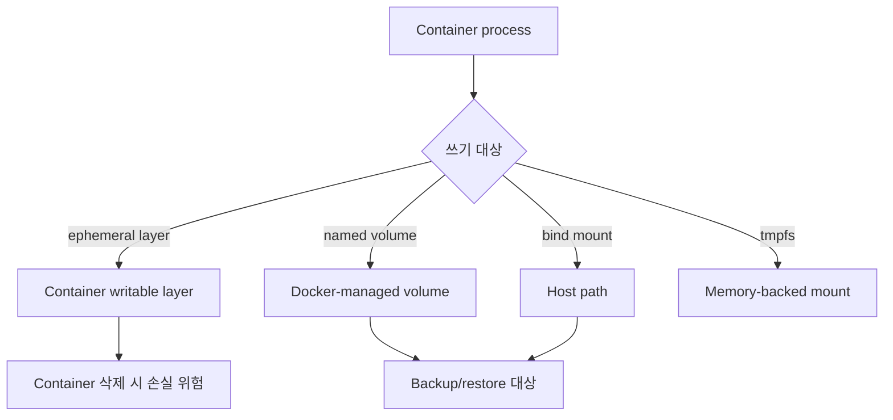
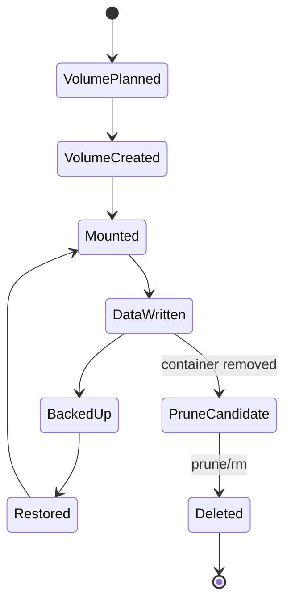

# Docker Volumes 학습 및 기록 노트

## Scope and Data-Safety Contract

- **Scope:** Pin Docker Engine/Desktop, host OS, filesystem, volume driver, container user, SELinux/AppArmor mode, and backup mechanism. Named volumes and bind mounts differ across platforms.
- **Assumptions:** Define data ownership, permissions, consistency during backup, capacity and inode limits, encryption, retention, and what happens when a container, volume, host, or driver is removed.
- **Facts and inference:** Persistence across a container replacement is narrower than durability. Performance, portability, and safety claims require filesystem and workload evidence.
- **Failure and completion:** Test permission errors, full disk, abrupt stop, concurrent writes, migration, accidental deletion, and restore on an independent target. Completion requires verified data and application consistency after that restore.

## 1. 왜 필요한가? (Pain Point & Motivation)

Container filesystem은 container lifecycle과 함께 사라질 수 있다. Database, upload file, application config 같은 데이터를 container 내부에만 두면 재생성, update, migration, crash recovery 때 데이터가 손실된다. Docker volume과 bind mount는 데이터를 host 또는 외부 storage에 분리하지만, 권한, backup, cleanup 정책을 잘못 잡으면 또 다른 장애가 된다.

이 문서는 원문의 Docker volumes 가이드를 persistent data, mount type, backup/restore, permission, cleanup 중심으로 재작성한다.

## 2. 현재 나의 상태 (Baseline)

- `docker run -v`로 host와 container 경로를 연결할 수 있다는 점은 알고 있다.
- Named volume과 bind mount의 관리 주체와 사용처를 구분해야 한다.
- `docker volume prune`이 unused volume을 삭제하므로 데이터 손실 위험이 있다는 점을 기억해야 한다.
- Volume backup/restore는 container를 거쳐 tar로 수행할 수 있음을 이해해야 한다.
- Permission mismatch가 container user와 host filesystem 사이에서 자주 발생한다.

## 3. 도달하고 싶은 목표 (Target State)

- 중요한 데이터는 named volume 또는 명시적 bind mount로 영속화한다.
- 개발용 live reload와 운영 데이터 저장소의 mount 방식을 구분한다.
- Read-only config mount와 writable data mount를 분리한다.
- Volume backup과 restore를 검증 가능한 절차로 수행한다.
- Permission issue와 dangling volume cleanup을 안전하게 처리한다.

## 4. 시스템 번역 (Data Flow)



Volume data flow의 핵심은 애플리케이션이 쓰는 데이터가 container layer가 아니라 의도한 persistent mount로 가는지 확인하는 것이다.

## 5. 핵심 구성요소 (Building Blocks)

| 유형 | 위치/관리 | 사용 사례 |
| --- | --- | --- |
| Named volume | Docker daemon/driver가 관리; 실제 경로는 data-root·platform·driver와 inspect 결과로 확인 | 운영 데이터, DB storage |
| Anonymous volume | Docker가 자동 생성 | image-declared 임시 persistence |
| Bind mount | 사용자가 지정한 host path | 개발 source, config file |
| Read-only mount | `:ro` option | 설정 파일, certificate |
| tmpfs mount | 메모리 기반; host swap 정책의 영향을 받을 수 있음 | 수명과 swap 경계를 검토한 임시 파일 |
| Volume driver | local/NFS/plugin | 외부 storage 연결 |
| External volume | Compose 밖에서 생성 | production data 재사용 |
| `docker volume prune` | unused volume 정리 | 사전 확인 필수 |

## 6. 상태 전이 (State Transition)



Container를 삭제해도 named volume은 남을 수 있다. 반대로 volume을 prune하면 container가 없어도 남아 있던 데이터가 삭제될 수 있다.

## 7. 불변식 (Invariant: 절대 깨지면 안 되는 규칙)

- 중요한 데이터는 container writable layer에 저장하면 안 된다.
- 운영 DB 데이터는 anonymous volume보다 named volume 또는 명시적 external volume으로 관리한다.
- Config와 certificate mount는 가능하면 read-only로 둔다.
- `docker volume prune` 전에는 삭제 대상과 backup 여부를 확인해야 한다.
- Raw volume backup은 DB를 정상 종료하거나 DB가 보장하는 일관된 snapshot 절차를 먼저 적용한다. `:ro`는 backup 컨테이너의 쓰기만 막으며 다른 writer를 멈추거나 snapshot을 만들지 않는다. 복원은 독립 대상에서 검증한다.
- Bind mount는 host path permission과 container user UID/GID가 맞아야 한다.
- Cross-platform 개발에서는 bind mount path와 filesystem 성능 차이를 고려해야 한다.

## 8. 가장 작은 예제 (Minimal Viable Example)

새로운 PostgreSQL 15 학습용 volume과 컨테이너에만 적용한다. 기존 이름이 있으면 재사용하지 말고 먼저 소유자와 데이터를 확인한다. `PG_IMAGE`는 검토한 PostgreSQL 15 tag/digest, `TAR_IMAGE`는 검토한 tar 도구 이미지다. 저장 경로가 다른 PostgreSQL major에 그대로 적용하지 않는다. `PG_PASSWORD_FILE`은 저장소 밖의 제한된 절대 경로이며 빈 비밀번호를 허용하지 않는다.

```bash
: "${PG_IMAGE:?set reviewed PostgreSQL 15 image}"
: "${PG_PASSWORD_FILE:?set protected absolute password file}"
test -s "$PG_PASSWORD_FILE" || exit 1
docker volume create postgres-data
docker run -d --name volume-demo-postgres \
  -e POSTGRES_PASSWORD_FILE=/run/secrets/pg_password \
  --mount "type=bind,src=$PG_PASSWORD_FILE,dst=/run/secrets/pg_password,readonly" \
  -v postgres-data:/var/lib/postgresql/data \
  "$PG_IMAGE"
```

제한된 시간 안에 `docker exec volume-demo-postgres pg_isready -U postgres`가 성공하는지 확인하고, 시험 테이블과 행을 만든 뒤 내용을 기록한다. 초기화 실패 시 volume을 지우거나 컨테이너를 반복 생성하지 말고 로그와 상태를 확인한다.

Backup은 DB를 정상 종료한 다음 수행한다. 아래 Bash 블록은 실패 시 멈추며 전용 backup directory를 사용한다.

```bash
(
  set -eu
  umask 077
  : "${TAR_IMAGE:?set reviewed tar-capable image}"
  : "${PG_BACKUP_DIR:?set private absolute backup directory}"
  test -d "$PG_BACKUP_DIR"
  test ! -e "$PG_BACKUP_DIR/postgres-data.tar"
  docker stop --time 60 volume-demo-postgres
  test "$(docker inspect -f '{{.State.Running}}' volume-demo-postgres)" = false
  docker run --rm \
    -v postgres-data:/source:ro \
    --mount "type=bind,src=$PG_BACKUP_DIR,dst=/backup" \
    "$TAR_IMAGE" tar -C /source -cf /backup/postgres-data.tar .
  test -s "$PG_BACKUP_DIR/postgres-data.tar"
  chmod 600 "$PG_BACKUP_DIR/postgres-data.tar"
)
```

`docker stop`이 제한 시간 후 강제 종료했는지는 DB 로그에서 따로 확인한다. 강제 종료된 데이터는 정상 종료 backup으로 승인하지 않는다. backup 동안 해당 volume을 쓰는 다른 컨테이너도 없어야 한다.

Restore는 새롭고 빈 `postgres-data-restored` volume에만 한다. 운영 volume을 덮어쓰지 않는다.

```bash
(
  set -eu
  : "${PG_IMAGE:?set the same PostgreSQL image used for backup}"
  : "${TAR_IMAGE:?set reviewed tar-capable image}"
  : "${PG_BACKUP_DIR:?set backup directory}"
  docker volume create postgres-data-restored
  docker run --rm \
    -v postgres-data-restored:/target \
    --mount "type=bind,src=$PG_BACKUP_DIR,dst=/backup,readonly" \
    "$TAR_IMAGE" tar -C /target -xf /backup/postgres-data.tar
  docker run -d --name volume-demo-restored \
    -v postgres-data-restored:/var/lib/postgresql/data "$PG_IMAGE"
)
```

동일 major·image로 독립 DB를 시작한 뒤 readiness, 원본 시험 행, 테이블 수와 필요한 제약을 비교한다. 기존 DB 데이터에 보존된 자격 증명을 사용하며 환경 변수 변경만으로 비밀번호가 회전된다고 가정하지 않는다. archive 생성이나 컨테이너 시작만으로 복원을 완료 처리하지 않는다.

## 9. 실패 사례 (What could go wrong?)

- DB container를 volume 없이 실행해 container 재생성 시 데이터가 사라진다.
- `docker volume prune -f`를 습관적으로 실행해 사용 중이 아닌 production volume backup을 삭제한다.
- Bind mount host directory 권한이 맞지 않아 application이 파일을 쓰지 못한다.
- Config 파일을 writable로 mount해 container 내부 프로세스가 설정을 바꿔버린다.
- Backup tar를 만들었지만 restore test를 하지 않아 실제 장애 때 압축 구조가 맞지 않는다.
- Named volume과 bind mount를 같은 target path에 겹쳐 의도한 data path가 가려진다.

## 10. 뇌 확장하기 (Evolution & Variants)

- Compose에서는 `volumes:` top-level block과 service-level mount를 분리해 읽는다.
- 외부 storage는 NFS, CIFS, cloud volume plugin, Kubernetes PV/PVC로 확장된다.
- Database backup은 volume snapshot보다 database-native dump/restore가 더 안전한 경우가 많다.
- tmpfs는 scratch space 후보이며 재시작 후 mount 내용은 사라진다. 민감 자료에는 host swap·암호화·접근 정책도 확인한다.
- Related: [Docker Installation](installation.md), [Docker Commands](commands.md)

## 11. 최종 체크리스트 (Definition of Done)

- [x] Named volume, bind mount, tmpfs의 차이를 정리했다.
- [x] 데이터 수명과 container lifecycle의 분리를 설명했다.
- [x] Backup/restore 최소 명령 예제를 포함했다.
- [x] Permission, prune, overlapping mount 실패 사례를 정리했다.
- [x] 원문 Docker volumes 문서를 12개 섹션 템플릿으로 재작성했다.

## 12. 뇌에 새기는 복습 문장 (TL;DR Blank)

Docker volume 설계의 핵심은 container를 버려도 살아야 할 데이터와 container와 함께 사라져도 되는 데이터를 명확히 나누는 것이다.
