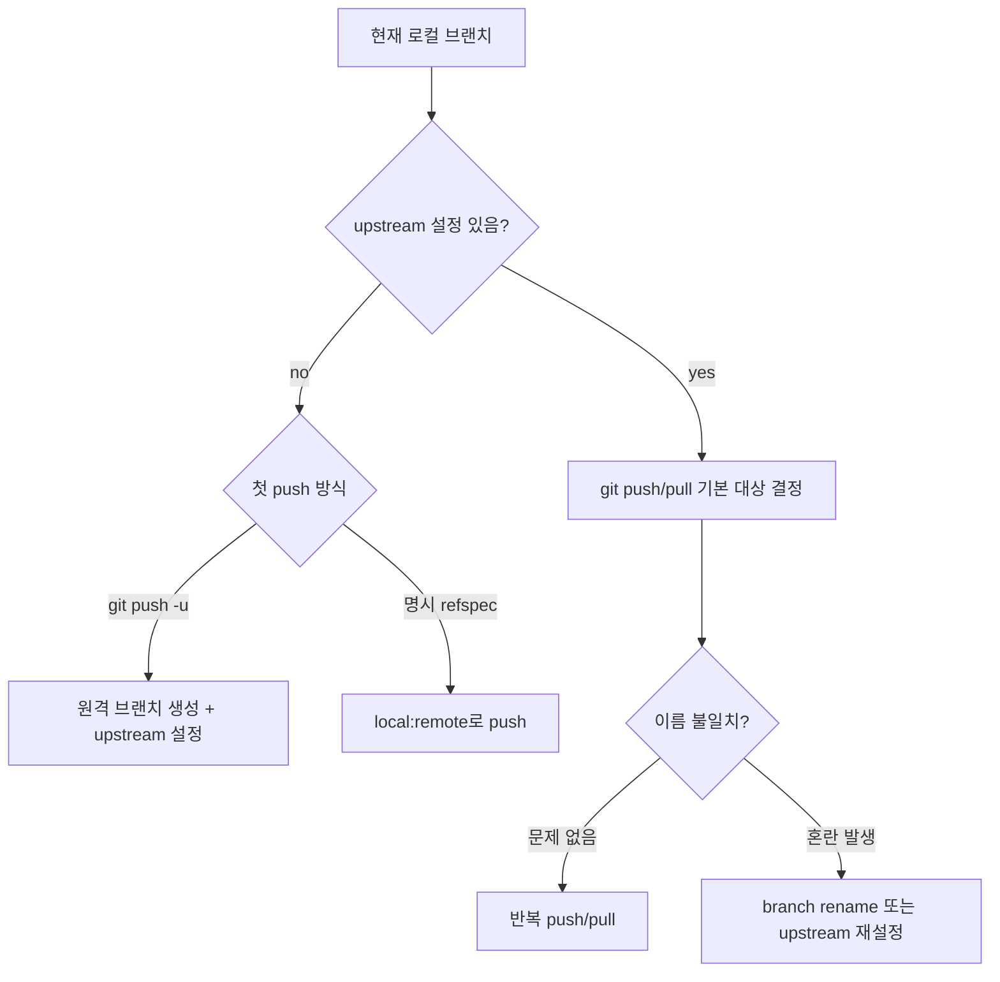
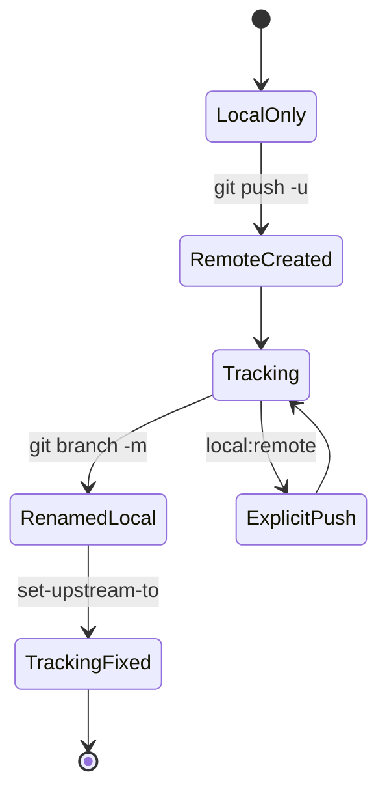

# Git 브랜치 업스트림 관리 학습 및 기록 노트

## 1. 왜 필요한가? (Pain Point & Motivation)

로컬 브랜치와 원격 브랜치 이름이 다르거나 upstream이 설정되지 않으면 `git push`가 예상과 다른 원격 브랜치를 만들 수 있다. 특히 여러 feature branch를 다루는 프로젝트에서는 "현재 브랜치가 어디로 push/pull되는가"를 명확히 하지 않으면 PR 대상이 꼬이거나 중복 브랜치가 생긴다.

이 문서는 원문의 GitHub 원격 저장소와 로컬 브랜치 이름 불일치 해결법을 upstream tracking, push refspec, branch rename, Git 설정 중심으로 재작성한다.

## 2. 현재 나의 상태 (Baseline)

- `git branch`, `git push`, `git pull` 기본 사용법은 알고 있다.
- Upstream branch가 현재 브랜치의 기본 push/pull 대상이라는 점을 더 명확히 해야 한다.
- 로컬 브랜치 이름과 원격 브랜치 이름이 다를 수 있음을 이해해야 한다.
- `git push origin local:remote` refspec이 언제 필요한지 정리해야 한다.
- `push.autoSetupRemote`, `push.default`, `branch.autoSetupMerge` 설정의 영향을 구분해야 한다.

## 3. 도달하고 싶은 목표 (Target State)

- 현재 브랜치의 upstream을 확인하고 수정한다.
- 로컬 브랜치 이름을 원격 브랜치와 일치시킨다.
- 한 번만 다른 원격 브랜치로 push할 때 명시적 refspec을 사용한다.
- 첫 push에서 `-u`로 upstream을 설정한다.
- 전역 Git 설정이 push behavior에 미치는 영향을 이해한다.

## 4. 시스템 번역 (Data Flow)



Git push data flow의 핵심은 현재 브랜치 이름이 아니라 upstream과 push 설정이 최종 원격 ref를 결정한다는 점이다.

## 5. 핵심 구성요소 (Building Blocks)

| 구성요소 | 명령/설정 | 역할 |
| --- | --- | --- |
| Upstream 확인 | `git branch -vv` | 로컬 브랜치가 추적하는 원격 branch 확인 |
| Upstream 설정 | `git branch --set-upstream-to=origin/name local` | 기존 branch 추적 대상 변경 |
| 첫 push | `git push -u origin branch` | 원격 생성과 upstream 설정 |
| Branch rename | `git branch -m old new` | 로컬 브랜치 이름 변경 |
| Push refspec | `git push origin local:remote` | 한 번만 명시 대상 push |
| Auto setup remote | `push.autoSetupRemote true` | 첫 push 시 upstream 자동 설정 |
| Push default | `push.default current` | 같은 이름의 원격 branch로 push |
| Auto setup merge | `branch.autoSetupMerge` | 새 branch 생성 시 tracking 설정 |

## 6. 상태 전이 (State Transition)



로컬 이름을 바꾸면 upstream이 자동으로 의도와 맞는지 확인해야 한다. 이름 변경과 추적 대상 변경은 별도 작업이다.

## 7. 불변식 (Invariant: 절대 깨지면 안 되는 규칙)

- Push 전에 `git branch -vv`로 현재 branch와 upstream을 확인할 수 있어야 한다.
- 로컬/원격 이름이 다르면 팀에서 이해할 수 있는 이유가 있어야 한다.
- 반복 작업에는 명시적 refspec보다 upstream 설정을 사용하는 편이 안전하다.
- 전역 Git 설정은 모든 repository에 영향을 주므로 변경 전 의도를 확인해야 한다.
- `push.default current`는 같은 이름의 원격 브랜치를 만들 수 있으므로 이름 정책과 맞아야 한다.
- PR branch를 rename한 뒤에는 remote branch와 PR 대상도 함께 확인해야 한다.

## 8. 가장 작은 예제 (Minimal Viable Example)

현재 로컬 branch `feature`를 원격 `new-feature`에 연결:

```bash
git branch --set-upstream-to=origin/new-feature feature
git branch -vv
git push
```

원격과 이름을 맞추고 싶을 때:

```bash
git branch -m feature new-feature
git push -u origin new-feature
```

한 번만 명시적으로 push할 때:

```bash
git push origin feature:new-feature
```

이 예제는 반복 push 대상은 upstream으로 고정하고, 임시 push만 refspec으로 명시하는 기준을 보여준다.

## 9. 실패 사례 (What could go wrong?)

- Upstream 없이 `git push`를 실행해 원하지 않는 새 remote branch가 생긴다.
- 로컬 branch만 rename하고 remote branch와 PR branch를 정리하지 않는다.
- `git push origin local:remote`를 매번 쓰다가 대상 branch 이름을 오타 낸다.
- `push.default current`를 전역 설정한 뒤 같은 이름 remote branch가 자동 생성된다.
- 팀 convention과 다른 branch naming을 사용해 CI/PR rule이 적용되지 않는다.
- Upstream이 삭제된 원격 branch를 가리켜 pull/push가 실패한다.

## 10. 뇌 확장하기 (Evolution & Variants)

- `git remote show origin`으로 remote tracking branch와 stale branch를 확인한다.
- `git fetch --prune`으로 삭제된 remote tracking branch를 정리한다.
- Branch 전략은 trunk-based, GitFlow, release branch 전략과 함께 정한다.
- Protected branch와 PR workflow에서는 force push, branch delete 권한을 별도로 관리한다.
- Related: [배포 워크플로우](deployment.md), [삭제 복구](restore-deletion.md)

## 11. 최종 체크리스트 (Definition of Done)

- [x] 로컬/원격 브랜치 이름 불일치 문제를 upstream 관점으로 설명했다.
- [x] `set-upstream-to`, `push -u`, branch rename, push refspec 예제를 포함했다.
- [x] 전역 Git 설정의 영향을 불변식과 실패 사례로 정리했다.
- [x] 원문 branch management 문서를 12개 섹션 템플릿으로 재작성했다.

## 12. 뇌에 새기는 복습 문장 (TL;DR Blank)

Git에서 현재 브랜치가 어디로 push되는지는 이름만이 아니라 upstream과 push 설정이 함께 결정한다.
