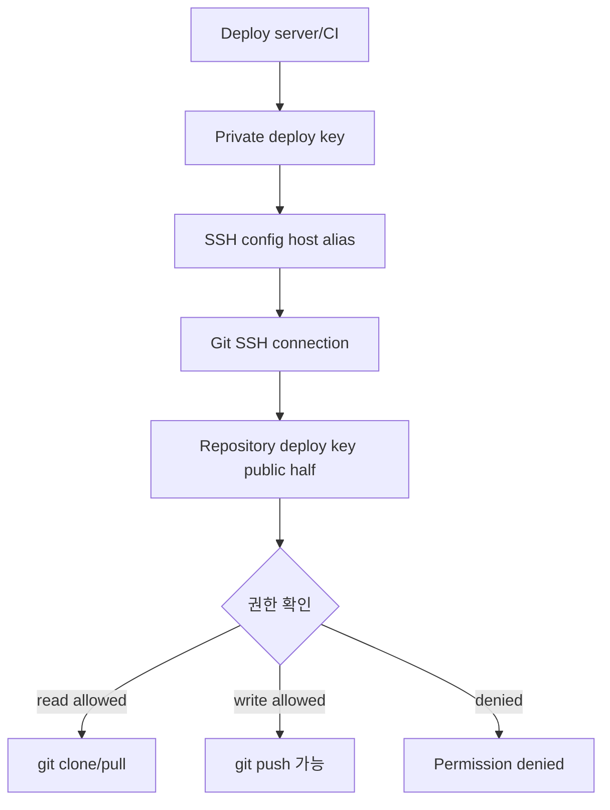
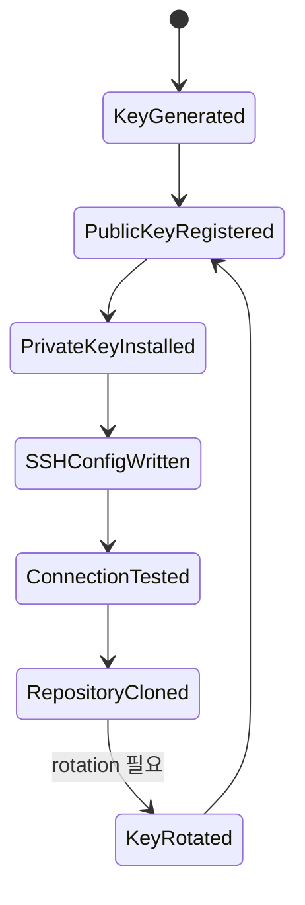

# Git Deploy Keys 설정 학습 및 기록 노트

## 적용 범위와 보안 검증 기준

- **범위:** Deploy Key의 재사용·쓰기 권한·소유 모델은 GitHub, GitLab과 hosting 버전에 따라 다릅니다. 이 문서의 예제를 공급자 공통 보장으로 해석하지 않습니다.
- **권한 전제:** repository와 작업별로 read/write 필요성을 분리하고 key algorithm, host key 검증, secret 저장소, 실행 사용자와 CI log redaction을 정합니다.
- **불확실성:** 고정 rotation 주기만으로 안전을 보장하지 않습니다. 노출 징후, 인력·시스템 변경, algorithm 정책과 공급자 감사 기록에 따라 즉시 폐기할 수 있어야 합니다.
- **실패·완료:** 잘못된 저장소 접근, 과도한 쓰기 권한, host key 오류, secret 유출과 key 폐기 뒤 잔존 접근을 시험합니다. fingerprint·최소 권한·감사 log·revocation을 확인해야 완료입니다.

---

## 1. 왜 필요한가? (Pain Point & Motivation)

배포 서버나 CI가 Git 저장소를 clone/pull할 때 개인 SSH key를 복사하면 그 계정에 부여된 여러 저장소 권한이 함께 노출될 수 있다. 아래 구체적인 명령은 GitHub의 repository별 Deploy Key를 전제로 한다. 다른 hosting 제품의 key 재사용·소유·쓰기 권한 모델은 별도로 확인한다.

이 문서는 원문의 Git Deploy Keys 설정 가이드를 repository-scoped SSH access와 최소 권한 배포 흐름 중심으로 재작성한다.

## 2. 현재 나의 상태 (Baseline)

- SSH key로 GitHub/GitLab에 접속할 수 있다는 점은 알고 있다.
- Deploy Key가 사용자 계정 key가 아니라 repository에 붙는 key라는 점을 명확히 해야 한다.
- 여러 repository에 접근할 때 SSH config host alias가 왜 필요한지 이해해야 한다.
- CI/CD secret으로 private key를 주입할 때 file permission과 known_hosts를 설정해야 한다.
- Read-only와 write access를 배포 목적에 맞게 구분해야 한다.

## 3. 도달하고 싶은 목표 (Target State)

- Repository별 deploy key pair를 생성하고 공개 key만 repository에 등록한다.
- Private key는 서버 또는 CI secret에만 저장한다.
- SSH config에서 host alias와 `IdentityFile`을 명시해 올바른 key를 사용한다.
- Clone/pull 접속을 테스트하고 문제 발생 시 verbose log로 진단한다.
- 사용하지 않는 key를 제거하고 정기적으로 rotation한다.

## 4. 시스템 번역 (Data Flow)



Deploy key data flow는 private key를 들고 있는 실행 환경이 repository에 등록된 public key와 매칭되어 단일 repository 권한만 얻는 구조다.

## 5. 핵심 구성요소 (Building Blocks)

| 구성요소 | 명령/설정 | 역할 |
| --- | --- | --- |
| Key pair | `ssh-keygen -t ed25519` | deploy 전용 SSH key 생성 |
| Public key | `*.pub` | GitHub/GitLab repository에 등록 |
| Private key | `id_deploy_*` | 서버/CI secret에만 보관 |
| SSH config | `Host`, `IdentityFile` | repository별 key 선택 |
| `IdentitiesOnly yes` | SSH key 후보 제한 | 다른 agent key 오사용 방지 |
| Known hosts | `known_hosts` | 원격 host identity 검증 |
| Read-only key | default deploy access | clone/pull 전용 |
| Write access | 선택 권한 | push가 필요한 자동화에만 허용 |

## 6. 상태 전이 (State Transition)



Private key를 배포 서버에 두기 전에 public key를 repository에 등록하고, clone 전에 connection test를 수행하면 실패 지점을 분리하기 쉽다.

## 7. 불변식 (Invariant: 절대 깨지면 안 되는 규칙)

- Private key는 절대 repository에 commit하지 않는다.
- Deploy key는 가능하면 repository별, 환경별로 분리한다.
- Read-only로 충분하면 write access를 켜지 않는다.
- Key file은 `chmod 600`, `.ssh` directory는 `chmod 700` 수준으로 제한한다.
- CI secret에 저장한 private key는 log에 출력되지 않아야 한다.
- `ssh-keyscan` 출력 자체를 신뢰 근거로 삼지 않고, 등록 전에 공식 문서나 별도 신뢰 경로의 host fingerprint와 대조한다.
- 권한이 더 이상 필요 없는 deploy key는 repository settings에서 제거한다.

## 8. 가장 작은 예제 (Minimal Viable Example)

Key 생성:

```bash
ssh-keygen -t ed25519 -C "deploy-key-project" -f ~/.ssh/id_deploy_project
chmod 600 ~/.ssh/id_deploy_project
cat ~/.ssh/id_deploy_project.pub
```

SSH config:

```sshconfig
Host github-project
    HostName github.com
    User git
    IdentityFile ~/.ssh/id_deploy_project
    IdentitiesOnly yes
```

Clone:

```bash
ssh -T git@github-project
git clone git@github-project:owner/repository.git
```

이 예제는 repository settings에는 public key만 등록하고, 서버에는 private key와 SSH alias만 두는 최소 구성을 보여준다.

## 9. 실패 사례 (What could go wrong?)

- 개인 SSH key를 production server에 복사해 그 계정에 부여된 저장소 권한을 과도하게 노출한다.
- 하나의 deploy key를 여러 환경에서 공유해 사고 발생 시 영향 범위를 좁히지 못한다.
- Write access를 불필요하게 켜서 배포 서버가 repository를 push할 수 있게 된다.
- SSH agent가 다른 key를 먼저 제시해 인증이 실패한다.
- `known_hosts` 검증 없이 자동으로 host key를 신뢰해 MITM 탐지 기회를 잃는다.
- CI log에 private key 또는 clone URL secret이 출력된다.

## 10. 뇌 확장하기 (Evolution & Variants)

- GitHub Actions에서는 repository secret 또는 environment secret에 private key를 저장한다.
- 여러 repository를 한 서버에서 clone할 때는 host alias를 repository별로 분리한다.
- 배포가 push를 요구하지 않는다면 read-only deploy key와 pull-based deployment를 우선한다.
- 더 넓은 자동화가 필요하면 deploy key 대신 GitHub App, machine user, fine-grained token을 비교한다.
- Related: [Git 브랜치 관리](./branch-management.md), [삭제 복구](./restore-deletion.md)

## 11. 최종 체크리스트 (Definition of Done)

- [x] Deploy Key와 개인 SSH key의 권한 범위 차이를 정리했다.
- [x] Key 생성, public key 등록, SSH config, clone 테스트 흐름을 설명했다.
- [x] CI/CD private key 주입과 known_hosts 검증 주의점을 포함했다.
- [x] 최소 권한, key rotation, write access 위험을 불변식으로 명시했다.
- [x] 원문 deploy key 문서를 12개 섹션 템플릿으로 재작성했다.

## 12. 뇌에 새기는 복습 문장 (TL;DR Blank)

GitHub Deploy Key는 배포 자동화에 필요한 Git 접근을 등록한 repository 범위로 제한하는 수단이며, 다른 공급자의 재사용·소유 모델은 별도로 확인한다.
