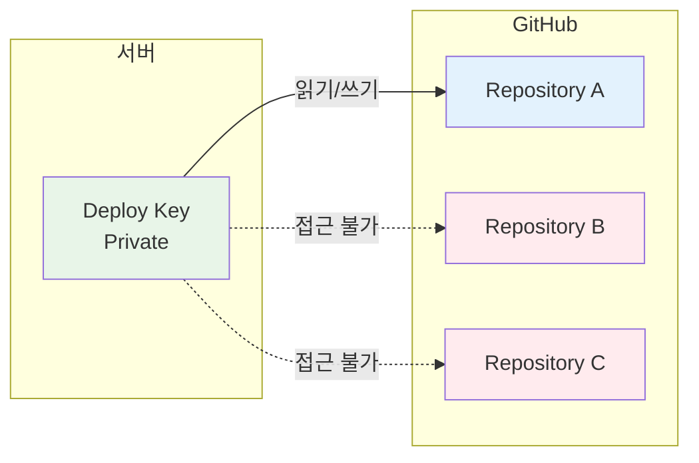
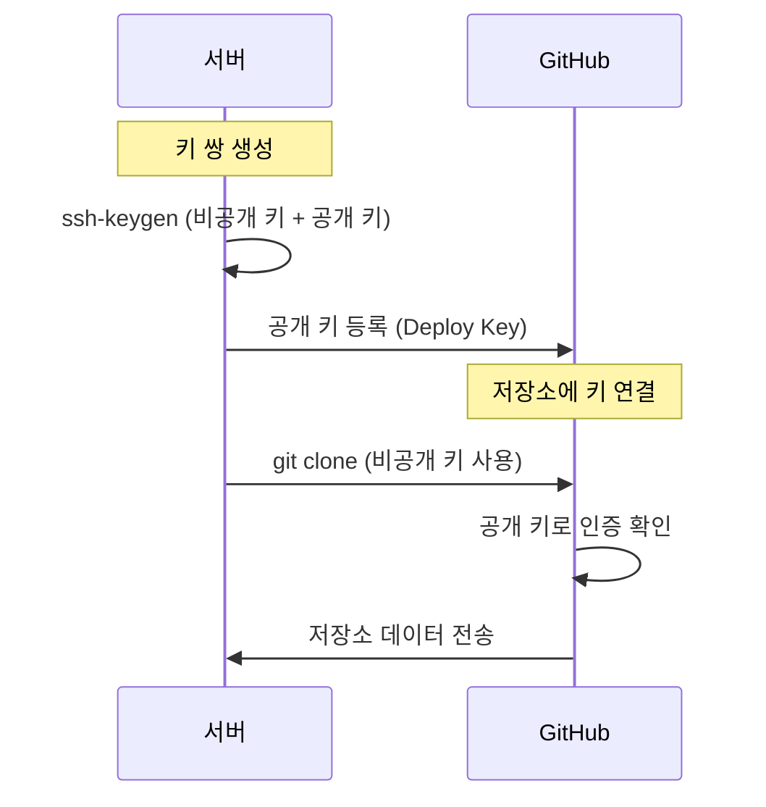
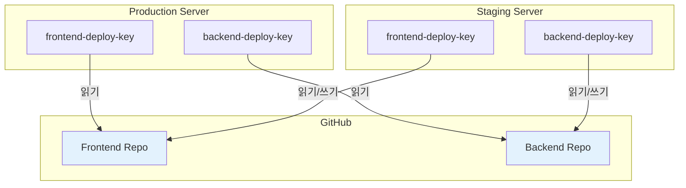

# Git Deploy Keys 설정

Deploy Keys를 사용하여 특정 저장소에 안전하게 접근하는 방법을 설명합니다.

## 개요

Deploy Keys는 단일 GitHub/GitLab 저장소에 대한 읽기 전용(또는 쓰기 가능) SSH 접근을 제공합니다. 서버 배포나 CI/CD 파이프라인에서 전체 계정 접근 권한 없이 특정 저장소만 접근할 때 유용합니다.



## Deploy Key vs 개인 SSH Key

| 특성 | Deploy Key | 개인 SSH Key |
|------|------------|--------------|
| 접근 범위 | 단일 저장소 | 계정의 모든 저장소 |
| 보안 | 제한된 권한 | 전체 계정 권한 |
| 사용 사례 | 서버, CI/CD | 개발 환경 |
| 키 소유 | 저장소 | 사용자 계정 |

## Deploy Key 설정

### 1. SSH 키 생성

```bash
# Ed25519 키 생성 (권장)
ssh-keygen -t ed25519 -C "deploy-key-project-name" -f ~/.ssh/id_deploy_projectname

# RSA 키 (레거시 시스템용)
ssh-keygen -t rsa -b 4096 -C "deploy-key-project-name" -f ~/.ssh/id_rsa_projectname
```

!!! tip "키 이름 규칙"
    키 파일명에 용도를 명시하면 관리가 쉬워집니다:
    - `id_deploy_frontend` - 프론트엔드 저장소용
    - `id_deploy_backend` - 백엔드 저장소용
    - `id_deploy_infra` - 인프라 저장소용

### 2. GitHub에 공개 키 등록

```bash
# 공개 키 내용 확인
cat ~/.ssh/id_deploy_projectname.pub
```

GitHub 저장소에서:

1. **Settings** → **Deploy keys** → **Add deploy key**
2. Title: 의미 있는 이름 (예: `Production Server`)
3. Key: 공개 키 내용 붙여넣기
4. **Allow write access** 체크 (push 필요 시)



### 3. SSH 설정 파일 구성

`~/.ssh/config` 파일에 호스트 별칭 추가:

```bash
# ~/.ssh/config

# 프로젝트 A - 프론트엔드
Host github-frontend
    HostName github.com
    User git
    IdentityFile ~/.ssh/id_deploy_frontend
    IdentitiesOnly yes

# 프로젝트 B - 백엔드
Host github-backend
    HostName github.com
    User git
    IdentityFile ~/.ssh/id_deploy_backend
    IdentitiesOnly yes

# 프로젝트 C - 인프라
Host github-infra
    HostName github.com
    User git
    IdentityFile ~/.ssh/id_deploy_infra
    IdentitiesOnly yes
```

!!! warning "IdentitiesOnly yes"
    이 옵션은 지정된 키만 사용하도록 강제합니다. 없으면 SSH 에이전트의 다른 키를 시도할 수 있습니다.

### 4. 저장소 클론 및 사용

```bash
# 호스트 별칭을 사용하여 클론
git clone git@github-frontend:username/frontend-repo.git
git clone git@github-backend:username/backend-repo.git
git clone git@github-infra:username/infra-repo.git

# 기존 저장소의 리모트 URL 변경
git remote set-url origin git@github-frontend:username/frontend-repo.git
```

## 다중 저장소 설정 예제

여러 서버에서 여러 저장소에 접근하는 구성:



### SSH Config 전체 예제

```bash
# ~/.ssh/config

# === Production Server ===
# 프론트엔드 (읽기 전용)
Host github-prod-frontend
    HostName github.com
    User git
    IdentityFile ~/.ssh/id_deploy_prod_frontend
    IdentitiesOnly yes

# 백엔드 (읽기 전용)
Host github-prod-backend
    HostName github.com
    User git
    IdentityFile ~/.ssh/id_deploy_prod_backend
    IdentitiesOnly yes

# === 공통 설정 ===
Host github.com
    AddKeysToAgent yes
    IdentitiesOnly yes
```

## CI/CD 환경 설정

### GitHub Actions

```yaml
# .github/workflows/deploy.yml
name: Deploy

on:
  push:
    branches: [main]

jobs:
  deploy:
    runs-on: ubuntu-latest
    steps:
      - name: Setup SSH
        env:
          SSH_PRIVATE_KEY: ${{ secrets.DEPLOY_KEY }}
        run: |
          mkdir -p ~/.ssh
          echo "$SSH_PRIVATE_KEY" > ~/.ssh/deploy_key
          chmod 600 ~/.ssh/deploy_key
          ssh-keyscan github.com >> ~/.ssh/known_hosts
          
      - name: Clone and Deploy
        run: |
          GIT_SSH_COMMAND="ssh -i ~/.ssh/deploy_key" git clone git@github.com:org/repo.git
```

### GitLab CI

```yaml
# .gitlab-ci.yml
deploy:
  stage: deploy
  before_script:
    - eval $(ssh-agent -s)
    - echo "$SSH_PRIVATE_KEY" | tr -d '\r' | ssh-add -
    - mkdir -p ~/.ssh
    - chmod 700 ~/.ssh
    - ssh-keyscan github.com >> ~/.ssh/known_hosts
  script:
    - git clone git@github.com:org/repo.git
```

## 연결 테스트

```bash
# 특정 호스트 별칭으로 연결 테스트
ssh -T git@github-frontend

# 디버그 모드로 문제 진단
ssh -vT git@github-frontend

# 에이전트에 키 추가 확인
ssh-add -l
```

예상 출력:
```
Hi username/repo-name! You've successfully authenticated, but GitHub does not provide shell access.
```

## 보안 모범 사례

!!! danger "비공개 키 보호"
    - 비공개 키를 절대 공유하거나 커밋하지 마세요
    - 키 파일 권한: `chmod 600 ~/.ssh/id_*`
    - 정기적으로 키 교체 (6-12개월)

!!! tip "최소 권한 원칙"
    - 읽기 전용이 충분한 경우 쓰기 권한 부여 금지
    - 각 서버/환경별로 별도의 Deploy Key 사용
    - 사용하지 않는 키는 즉시 제거

### 키 관리 체크리스트

- [ ] 각 저장소별 별도의 Deploy Key 생성
- [ ] 의미 있는 키 이름 사용
- [ ] 필요한 최소 권한만 부여
- [ ] `~/.ssh/config`에 호스트 별칭 설정
- [ ] 키 파일 권한 확인 (600)
- [ ] 연결 테스트 완료
- [ ] 비공개 키 백업 (안전한 위치)

## 문제 해결

### 권한 거부 오류

```bash
# 키 파일 권한 확인
ls -la ~/.ssh/

# 올바른 권한 설정
chmod 700 ~/.ssh
chmod 600 ~/.ssh/id_*
chmod 644 ~/.ssh/*.pub
chmod 644 ~/.ssh/config
```

### 잘못된 키 사용

```bash
# SSH가 사용하는 키 확인
ssh -vT git@github-frontend 2>&1 | grep "Offering"

# SSH 에이전트 초기화 후 특정 키만 추가
ssh-add -D
ssh-add ~/.ssh/id_deploy_frontend
```

## 관련 문서

- [SSH 설정](../../security/ssh/configuration.md)
- [Git 브랜치 관리](./branch-management.md)
