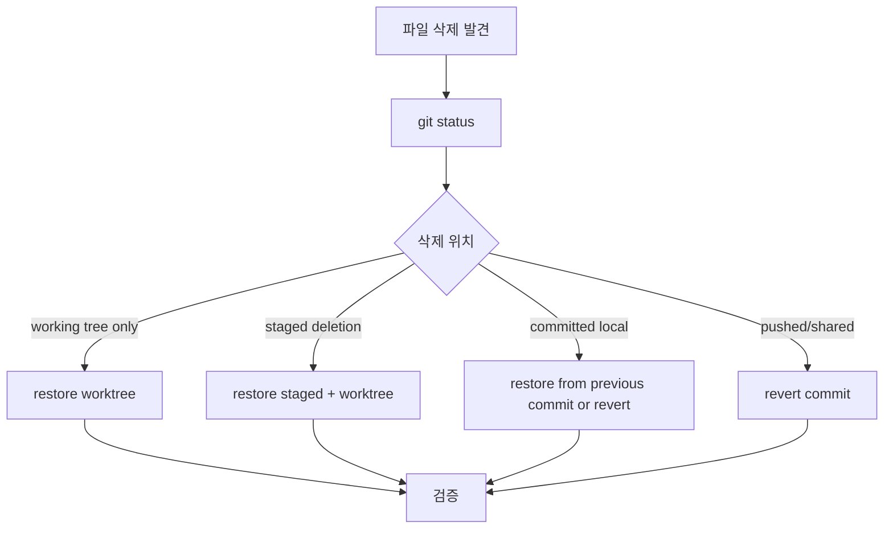
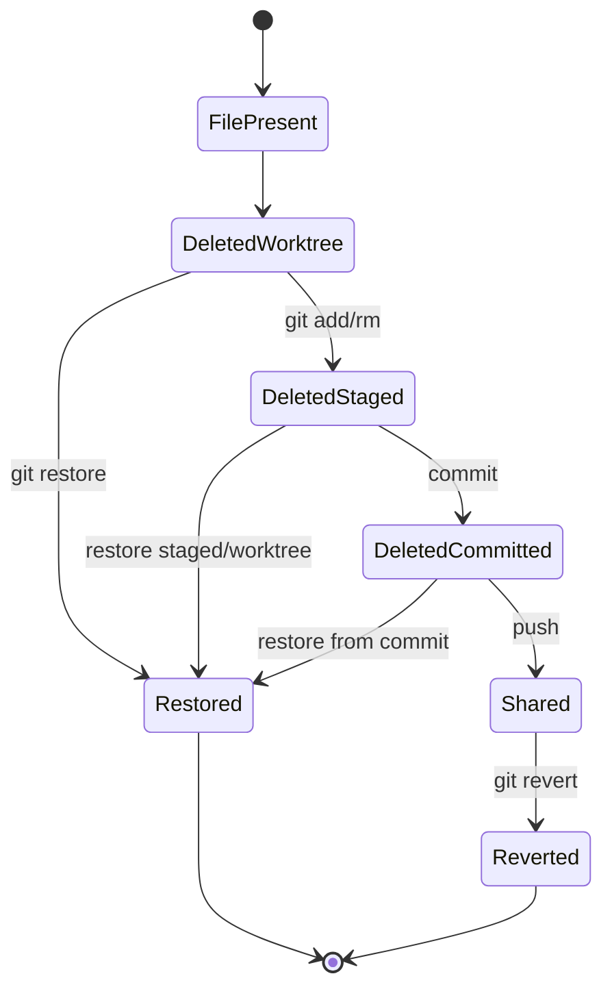

# Git 삭제 복구 및 고아 브랜치 학습 및 기록 노트

## 1. 왜 필요한가? (Pain Point & Motivation)

Git에서 파일 삭제를 복구할 때는 "삭제가 staged 되었는가", "아직 commit 전인가", "이미 삭제 commit이 공유되었는가"에 따라 안전한 방법이 달라진다. 무작정 `reset --hard`를 쓰면 다른 작업까지 날릴 수 있다. 또한 완전히 새 history가 필요한 orphan branch는 일반 branch와 merge semantics가 달라 별도 주의가 필요하다.

이 문서는 원문의 Git 삭제 취소와 빈 브랜치 생성 방법을 안전한 복구 상태 전이 중심으로 재작성한다.

## 2. 현재 나의 상태 (Baseline)

- `git status`, `git restore`, `git checkout`, `git revert`의 이름은 알고 있다.
- 삭제가 working tree, index, commit history 중 어디에 반영되었는지 먼저 확인해야 한다.
- 이미 공유된 삭제 commit은 history rewrite보다 revert가 안전하다는 점을 이해해야 한다.
- 삭제된 파일의 과거 위치를 `git log --diff-filter=D`로 찾을 수 있다.
- Orphan branch는 기존 history와 연결되지 않는 새 root commit을 만든다는 점을 정리해야 한다.

## 3. 도달하고 싶은 목표 (Target State)

- 삭제 상태를 `git status`로 확인하고 working tree/index를 구분한다.
- Commit 전 삭제는 `git restore`로 안전하게 되돌린다.
- 이미 commit된 삭제는 `git revert` 또는 특정 commit에서 파일 복원으로 처리한다.
- 삭제 시점을 모를 때 log에서 삭제 commit을 찾는다.
- Orphan branch 생성 시 기존 파일 제거가 현재 branch에 어떤 영향을 주는지 이해한다.

## 4. 시스템 번역 (Data Flow)



복구 data flow의 첫 단계는 복구 명령이 아니라 현재 삭제가 어느 Git 상태에 기록되어 있는지 확인하는 것이다.

## 5. 핵심 구성요소 (Building Blocks)

| 구성요소 | 명령 | 역할 |
| --- | --- | --- |
| 상태 확인 | `git status` | 삭제가 staged인지 확인 |
| Working tree 복원 | `git restore path` | commit 전 파일 내용 복원 |
| Index 복원 | `git restore --staged path` | staged deletion 해제 |
| 특정 commit에서 복원 | `git restore --source=commit -- path` | 과거 버전 가져오기 |
| 삭제 commit 찾기 | `git log --diff-filter=D -- path` | 파일 삭제 이력 확인 |
| Revert | `git revert commit` | 공유된 삭제 commit을 새 commit으로 되돌림 |
| Orphan branch | `git switch --orphan name` | 새 root history 생성 |
| Unrelated histories | `--allow-unrelated-histories` | 서로 다른 root history 병합 |

## 6. 상태 전이 (State Transition)



공유된 history에서는 삭제 commit을 없애기보다 반대 변경을 담은 새 revert commit을 만드는 편이 협업에 안전하다.

## 7. 불변식 (Invariant: 절대 깨지면 안 되는 규칙)

- 복구 전에는 `git status`와 필요한 경우 `git diff`로 현재 변경을 확인한다.
- 다른 미커밋 작업이 있으면 복구 전에 stash 또는 별도 commit으로 보호한다.
- 공유된 branch에서는 history rewrite보다 `git revert`를 우선한다.
- `git reset --hard`는 현재 작업 전체를 버릴 수 있으므로 일반 복구 절차의 기본값으로 사용하지 않는다.
- Orphan branch에서 파일을 제거하기 전 현재 branch와 작업 트리를 반드시 확인한다.
- 삭제된 파일을 특정 commit에서 복원하면 그 내용이 현재 branch의 새 변경으로 들어온다는 점을 이해한다.

## 8. 가장 작은 예제 (Minimal Viable Example)

Commit 전 staged 삭제 복구:

```bash
git status
git restore --staged path/to/file.md
git restore path/to/file.md
```

삭제 commit 찾고 직전 버전 복원:

```bash
git log --diff-filter=D --summary -- path/to/file.md
git restore --source=<delete-commit>~1 -- path/to/file.md
git status
```

공유된 삭제 commit 되돌리기:

```bash
git revert <delete-commit>
```

이 예제는 destructive reset 없이 삭제 위치별로 필요한 변경만 되돌리는 경로를 보여준다.

## 9. 실패 사례 (What could go wrong?)

- 삭제된 파일 하나만 복구하려다 `git reset --hard`로 다른 작업까지 잃는다.
- 이미 push한 삭제 commit을 강제로 rewrite해 동료 branch와 충돌을 만든다.
- `git restore --source`에 삭제 commit 자체를 지정해 빈 상태를 가져온다.
- 파일 경로가 rename된 것을 삭제로 오해하고 이전 경로만 찾는다.
- Orphan branch 생성 후 작업 디렉터리의 기존 파일을 실수로 모두 제거한다.
- unrelated history merge를 이해하지 못한 채 orphan branch를 일반 feature branch처럼 병합한다.

## 10. 뇌 확장하기 (Evolution & Variants)

- `git reflog`는 branch 이동, reset, commit reference를 추적해 더 넓은 복구에 쓸 수 있다.
- `git restore`는 file-level 복구, `git revert`는 commit-level 반대 변경에 적합하다.
- Orphan branch는 GitHub Pages, 분리된 docs/artifact history 같은 특수 목적에 적합하다.
- 삭제 복구 후에는 test와 build를 돌려 파일 참조가 정상인지 확인한다.
- Related: [Git 브랜치 관리](./branch-management.md), [Deploy Keys](./deployment.md)

## 11. 최종 체크리스트 (Definition of Done)

- [x] 삭제 상태별 복구 경로를 working tree, staged, committed, shared로 나눴다.
- [x] `git restore`, `git log --diff-filter=D`, `git revert` 중심의 안전한 예제를 포함했다.
- [x] `reset --hard`와 orphan branch의 위험을 불변식으로 명시했다.
- [x] 원문 삭제 복구 및 빈 브랜치 문서를 12개 섹션 템플릿으로 재작성했다.

## 12. 뇌에 새기는 복습 문장 (TL;DR Blank)

Git 삭제 복구의 첫 질문은 어떤 명령을 쓸지가 아니라 삭제가 working tree, index, commit, remote 중 어디까지 반영되었는지다.
