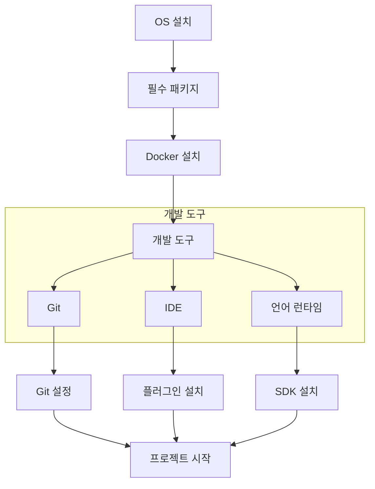
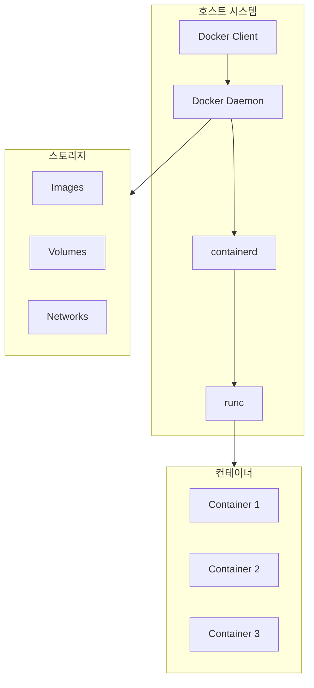
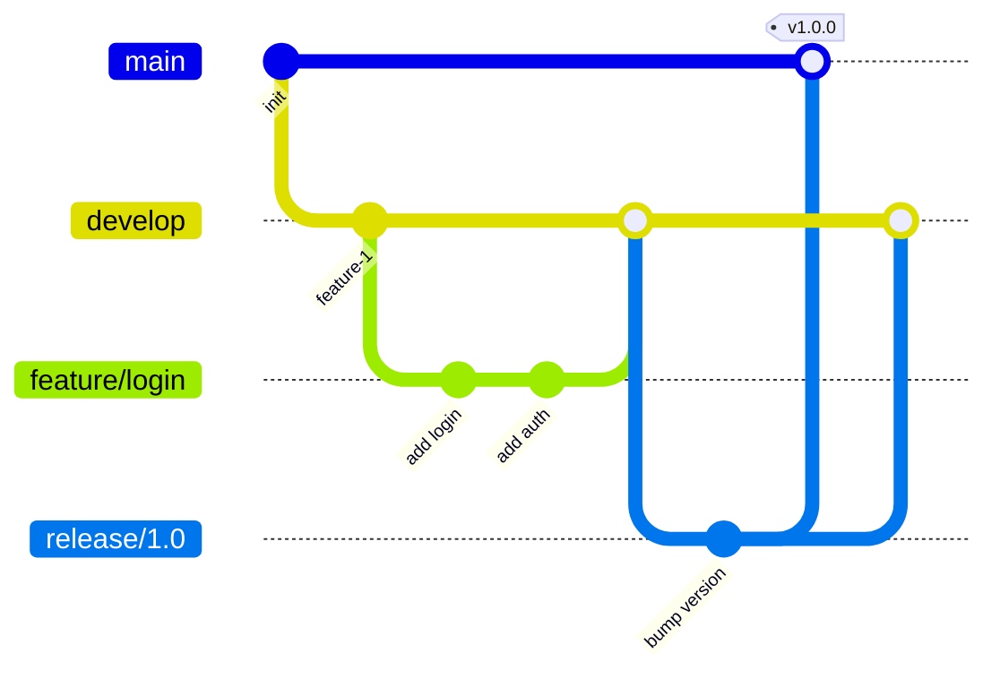

# 개발 문서

Docker, Git, IDE 설정, 프로그래밍 언어 환경 구성에 관한 가이드입니다.


<div class="compose-hero" markdown>
<span class="compose-kicker">Development</span>

## 개발 환경을 빠르게 구성할 수 있는 핵심 가이드 모음

컨테이너 기반 개발, Git 워크플로우, IDE 설정, 언어 런타임 구성을 실제 개발 환경 준비 순서에 맞춰 정리했습니다.

<div class="landing-meta-list" markdown>
<span>Docker</span>
<span>Git</span>
<span>IDE</span>
<span>Languages</span>
</div>

<div class="compose-actions" markdown>
[:octicons-arrow-right-24: Docker 설치](docker/installation.md){ .md-button .md-button--primary }
[:material-source-branch: 브랜치 관리](git/branch-management.md){ .md-button }
[:material-microsoft-visual-studio-code: VS Code 플러그인](ide/vscode-plugins.md){ .md-button }
</div>
</div>

## :material-code-braces: 핵심 개발 영역

<div class="grid cards" markdown>

-   :material-docker:{ .lg .middle } **Docker**

    ---

    컨테이너 기반 개발 및 배포

    - [설치 가이드](docker/installation.md)
    - [명령어 가이드](docker/commands.md)
    - [네트워킹](docker/networking.md)
    - [볼륨 마운트](docker/volumes.md)
    - [Vaultwarden](docker/vaultwarden.md)

-   :material-git:{ .lg .middle } **Git**

    ---

    버전 관리 및 협업

    - [브랜치 관리](git/branch-management.md)
    - [배포 설정](git/deployment.md)
    - [삭제 복구](git/restore-deletion.md)

-   :material-microsoft-visual-studio-code:{ .lg .middle } **IDE**

    ---

    통합 개발 환경 설정

    - [VS Code 플러그인](ide/vscode-plugins.md)
    - [Code Server](ide/code-server.md)

-   :material-language-java:{ .lg .middle } **프로그래밍 언어**

    ---

    개발 언어 환경 구성

    - [Java 설치](languages/java-install.md)
    - [GCC 설정](languages/gcc.md)

</div>

---

## :material-rocket-launch: 개발 환경 구성 가이드



### 설치 순서 체크리스트

1. [ ] 운영체제 설치 및 업데이트
2. [ ] 기본 패키지 설치 (curl, wget, git)
3. [ ] Docker & Docker Compose 설치
4. [ ] 개발 언어 런타임 (JDK, Node.js, Python)
5. [ ] IDE 설치 및 설정
6. [ ] Git 설정 (이름, 이메일, SSH 키)

---

## :material-docker: Docker 생태계

### Docker 아키텍처



### Docker Compose 예시

```yaml
version: '3.8'
services:
  app:
    build: .
    ports:
      - "3000:3000"
    volumes:
      - .:/app
    depends_on:
      - db
      - redis
  
  db:
    image: postgres:15
    environment:
      POSTGRES_PASSWORD: secret
    volumes:
      - db-data:/var/lib/postgresql/data
  
  redis:
    image: redis:7-alpine
    
volumes:
  db-data:
```

---

## :material-source-branch: Git 워크플로우

### Git Flow



### 브랜치 전략

| 브랜치 | 용도 | 생명주기 |
|--------|------|----------|
| `main` | 프로덕션 코드 | 영구 |
| `develop` | 개발 통합 | 영구 |
| `feature/*` | 기능 개발 | 임시 |
| `release/*` | 릴리즈 준비 | 임시 |
| `hotfix/*` | 긴급 수정 | 임시 |

### 자주 쓰는 명령어

```bash
# 브랜치 생성 및 전환
git checkout -b feature/new-feature

# 원격 브랜치 가져오기
git fetch origin
git checkout -b feature origin/feature

# 리베이스
git rebase develop

# 대화형 리베이스 (커밋 정리)
git rebase -i HEAD~3

# 스태시
git stash
git stash pop

# 커밋 수정
git commit --amend
```

---

## :material-microsoft-visual-studio-code: VS Code 필수 확장

### 범용

| 확장 | 용도 |
|------|------|
| **GitLens** | Git 히스토리 시각화 |
| **Prettier** | 코드 포맷팅 |
| **ESLint** | JavaScript 린팅 |
| **Docker** | Docker 통합 |
| **Remote - SSH** | 원격 개발 |

### 언어별

| 언어 | 확장 |
|------|------|
| **Java** | Extension Pack for Java |
| **Python** | Python, Pylance |
| **TypeScript** | TypeScript Hero |
| **Go** | Go |
| **Rust** | rust-analyzer |

### settings.json 예시

```json
{
  "editor.formatOnSave": true,
  "editor.defaultFormatter": "esbenp.prettier-vscode",
  "editor.tabSize": 2,
  "editor.minimap.enabled": false,
  "files.autoSave": "onFocusChange",
  "terminal.integrated.defaultProfile.linux": "zsh",
  "[java]": {
    "editor.defaultFormatter": "redhat.java"
  }
}
```

---

## :material-language-python: 개발 언어 환경

### 버전 관리자

| 언어 | 버전 관리자 | 설치 명령 |
|------|------------|----------|
| **Node.js** | nvm | `nvm install 20` |
| **Python** | pyenv | `pyenv install 3.12` |
| **Java** | SDKMAN! | `sdk install java 21-tem` |
| **Ruby** | rbenv | `rbenv install 3.3` |
| **Go** | gvm | `gvm install go1.22` |

### SDKMAN! 사용법

```bash
# 설치
curl -s "https://get.sdkman.io" | bash

# Java 버전 목록
sdk list java

# 특정 버전 설치
sdk install java 21-tem

# 버전 전환
sdk use java 17-tem

# 기본 버전 설정
sdk default java 21-tem
```

---

## :material-folder-cog: 프로젝트 구조 템플릿

### Spring Boot 프로젝트

```
project/
├── src/
│   ├── main/
│   │   ├── java/com/example/
│   │   │   ├── controller/
│   │   │   ├── service/
│   │   │   ├── repository/
│   │   │   ├── entity/
│   │   │   ├── dto/
│   │   │   └── config/
│   │   └── resources/
│   │       ├── application.yml
│   │       └── static/
│   └── test/
├── docker/
├── docs/
├── build.gradle
└── docker-compose.yml
```

### React/Next.js 프로젝트

```
project/
├── src/
│   ├── app/           # App Router (Next.js 13+)
│   ├── components/
│   ├── hooks/
│   ├── lib/
│   ├── stores/
│   └── types/
├── public/
├── tests/
├── .env.local
├── package.json
└── docker-compose.yml
```

---

## :material-link-variant: 관련 문서

- [Java 문서](../java/index.md) - JDK 상세 가이드
- [데이터베이스](../databases/index.md) - DB 연동
- [Linux 명령어](../linux/commands.md) - 터미널 기초
- [SSH 설정](../security/ssh/configuration.md) - Git SSH 키

---

## :material-book-open-page-variant: 참고 자료

- [Docker Documentation](https://docs.docker.com/)
- [Git Book](https://git-scm.com/book/ko/v2)
- [VS Code Documentation](https://code.visualstudio.com/docs)
- [SDKMAN!](https://sdkman.io/)
