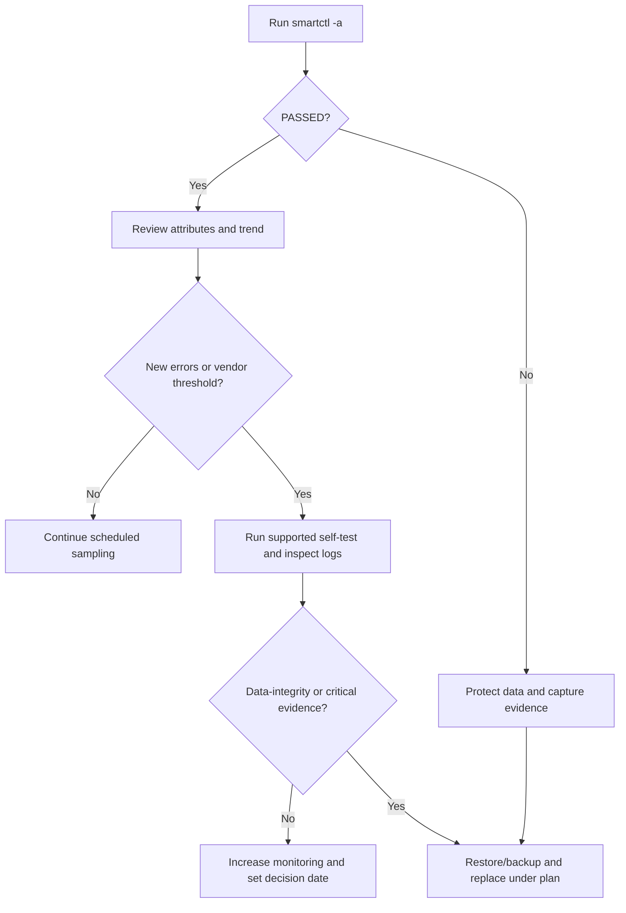

# SSD/NVMe Health Analysis Guide

> SMARTCTL-based evidence collection and trend-analysis guide

## Diagnostic boundary

- SMART attributes and normalized raw values are vendor-, model-, firmware-, and interface-specific. Use the drive data sheet and vendor threshold before a generic table.
- A `PASSED` summary does not predict continued operation, and a warning does not prove immediate failure. Correlate trends, self-tests, kernel errors, controller logs, workload, and backups.
- Record device identity, firmware, power-on hours, temperature context, `smartctl` version, command, and timestamp for each sample.
- Health review is complete only when current backups are restorable and replacement criteria, owner, spare, and maintenance window are defined.

---

## Overview

This guide shows how to collect SSD/NVMe evidence with `smartctl` and interpret changes over time for storage decisions.

---

## Quick Reference

### Basic Commands

```bash
# Check drive health
sudo smartctl -H /dev/sdX

# Full drive information
sudo smartctl -a /dev/sdX

# For NVMe drives
sudo smartctl -a /dev/nvme0n1

# Run self-test (long)
sudo smartctl -t long /dev/sdX
```

---

## Key Health Indicators

### SATA SSD Indicators

| Indicator | Interpretation | Escalation evidence |
|-----------|----------------|---------------------|
| **Reallocated Sectors** | Model-specific media-remap counter | New growth, failed self-test, or uncorrectable I/O |
| **Power-On Hours** | Context for age and duty cycle | No universal failure threshold; combine with warranty and workload |
| **Temperature** | Compare with the model's operating specification | Sustained excursion, thermal throttling, or critical-temperature event |
| **Wear Leveling Count** | Vendor-specific normalized or raw endurance signal | Trend toward the vendor threshold or rated write endurance |
| **ATA Error Count** | Includes command/link events as well as possible media issues | Increasing correlated errors with timestamps and kernel logs |

### NVMe Indicators

| Indicator | Interpretation | Escalation evidence |
|-----------|----------------|---------------------|
| **Percentage Used** | Controller estimate of rated endurance consumed | Approaching the organization's replacement policy or 100%, with workload trend |
| **Available Spare** | Remaining spare capacity percentage | At or below the device's reported spare threshold |
| **Unsafe Shutdowns** | Power-loss history, not a failure count by itself | Unexpected growth tied to power or filesystem events |
| **Media Errors** | Detected unrecovered data-integrity errors | Any new error requires investigation; growth or data loss escalates replacement |
| **Temperature** | Composite/sensor temperature | Warning/critical flag or model-specific limit, especially when sustained |

---

## Analysis Workflow



---

## Drive Recommendations by Use Case

### Storage Type Selection

| Use Case | Recommended Type | Reason |
|----------|-----------------|--------|
| **Proxmox Boot** | NVMe (Samsung, WD) | High IOPS, reliability |
| **VM Storage** | SATA SSD (RAID) | Capacity vs cost balance |
| **Cache** | Budget SSD | High write, replaceable |
| **NAS/Archive** | HDD or QLC SSD | Cost per TB |

---

## Monitoring Setup

### Automated Health Check Script

```bash
#!/bin/bash
# /usr/local/bin/check-drives.sh

DRIVES="/dev/sda /dev/sdb /dev/nvme0n1"
ALERT_EMAIL="admin@example.com"

for drive in $DRIVES; do
    if ! smartctl -H $drive | grep -q "PASSED"; then
        echo "ALERT: $drive health check failed!" | \
        mail -s "Drive Health Alert" $ALERT_EMAIL
    fi
done
```

### Crontab Entry

```bash
# Run daily at 6 AM
0 6 * * * /usr/local/bin/check-drives.sh
```

---

## Troubleshooting

### Common Issues

#### ATA Errors on New Drive
- **Cause**: Initial burn-in period instability
- **Action**: Run long self-test, monitor for 30 days
- **If persists**: Consider RMA

#### Temperature Sensor Shows Fixed Value
- **Cause**: Budget controller dummy value
- **Action**: Use external monitoring if critical workload

#### High Unsafe Shutdowns (NVMe)
- **Cause**: Power loss, improper "safe remove"
- **Action**: Add UPS, enable fsck on boot

---

## References

- [Smartmontools Documentation](https://www.smartmontools.org/)
- [Proxmox Storage Documentation](https://pve.proxmox.com/wiki/Storage)
