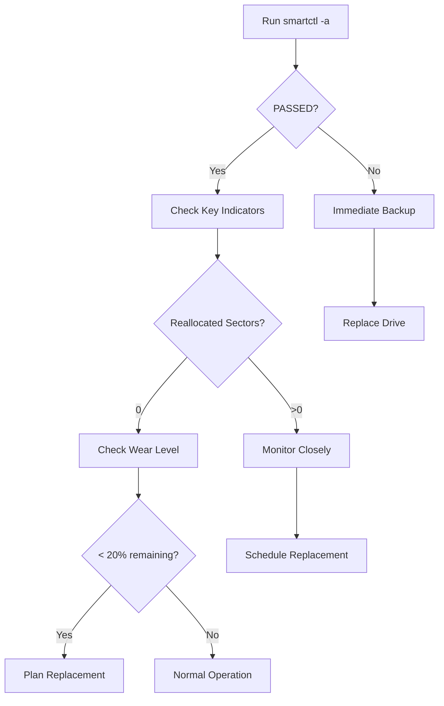

# SSD/NVMe Health Analysis Guide

> SMARTCTL-based drive analysis and management guide

---

## Overview

This guide covers how to analyze SSD/NVMe drive health using `smartctl` and interpret the results for optimal storage management.

---

## Quick Reference

### Basic Commands

```bash
# Check drive health
sudo smartctl -H /dev/sdX

# Full drive information
sudo smartctl -a /dev/sdX

# For NVMe drives
sudo smartctl -a /dev/nvme0n1

# Run self-test (long)
sudo smartctl -t long /dev/sdX
```

---

## Key Health Indicators

### SATA SSD Indicators

| Indicator | Normal Value | Warning Threshold | Critical |
|-----------|-------------|-------------------|----------|
| **Reallocated Sectors** | 0 | > 0 | > 10 |
| **Power-On Hours** | - | > 20,000h | > 40,000h |
| **Temperature** | 30-50°C | > 60°C | > 70°C |
| **Wear Leveling Count** | 100% | < 20% | < 10% |
| **ATA Error Count** | 0 | > 0 | > 5 |

### NVMe Indicators

| Indicator | Normal Value | Warning Threshold | Critical |
|-----------|-------------|-------------------|----------|
| **Percentage Used** | < 10% | > 80% | > 95% |
| **Available Spare** | 100% | < 20% | < 10% |
| **Unsafe Shutdowns** | 0 | > 50 | > 200 |
| **Media Errors** | 0 | > 0 | > 5 |
| **Temperature** | 30-50°C | > 70°C | > 80°C |

---

## Analysis Workflow



---

## Drive Recommendations by Use Case

### Storage Type Selection

| Use Case | Recommended Type | Reason |
|----------|-----------------|--------|
| **Proxmox Boot** | NVMe (Samsung, WD) | High IOPS, reliability |
| **VM Storage** | SATA SSD (RAID) | Capacity vs cost balance |
| **Cache** | Budget SSD | High write, replaceable |
| **NAS/Archive** | HDD or QLC SSD | Cost per TB |

---

## Monitoring Setup

### Automated Health Check Script

```bash
#!/bin/bash
# /usr/local/bin/check-drives.sh

DRIVES="/dev/sda /dev/sdb /dev/nvme0n1"
ALERT_EMAIL="admin@example.com"

for drive in $DRIVES; do
    if ! smartctl -H $drive | grep -q "PASSED"; then
        echo "ALERT: $drive health check failed!" | \
        mail -s "Drive Health Alert" $ALERT_EMAIL
    fi
done
```

### Crontab Entry

```bash
# Run daily at 6 AM
0 6 * * * /usr/local/bin/check-drives.sh
```

---

## Troubleshooting

### Common Issues

#### ATA Errors on New Drive
- **Cause**: Initial burn-in period instability
- **Action**: Run long self-test, monitor for 30 days
- **If persists**: Consider RMA

#### Temperature Sensor Shows Fixed Value
- **Cause**: Budget controller dummy value
- **Action**: Use external monitoring if critical workload

#### High Unsafe Shutdowns (NVMe)
- **Cause**: Power loss, improper "safe remove"
- **Action**: Add UPS, enable fsck on boot

---

## References

- [Smartmontools Documentation](https://www.smartmontools.org/)
- [Proxmox Storage Documentation](https://pve.proxmox.com/wiki/Storage)
