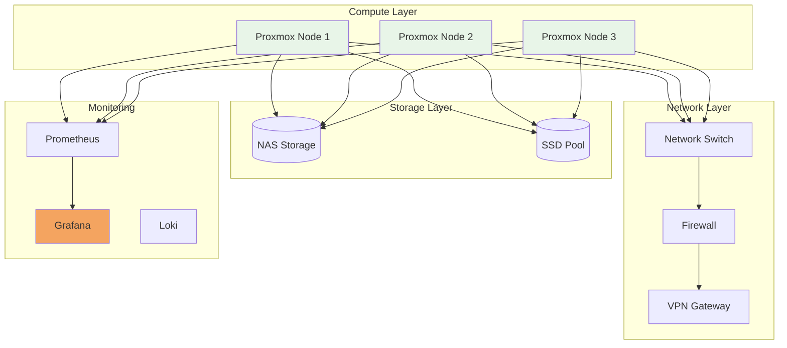
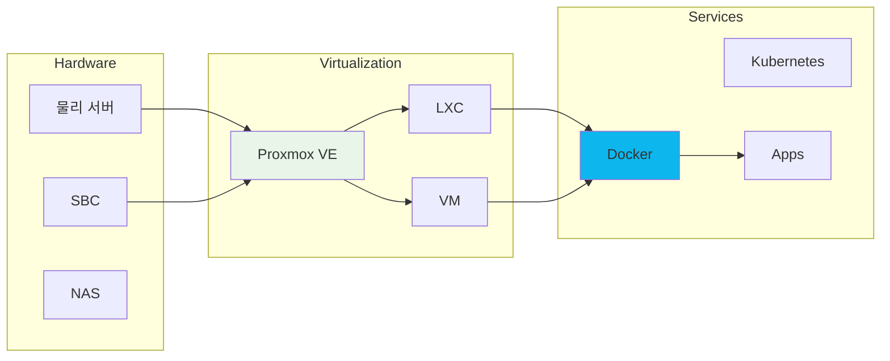

# 인프라 문서

서버 구성, 네트워크 설정, 스토리지 관리, 모니터링에 관한 종합 가이드입니다.

## 인덱스와 운영 경계

- 이 페이지는 문서 탐색용 개요이며 현재 환경의 구성·보안·가용성 완료를 보증하지 않습니다.
- 명령 실행 전 대상 호스트, OS·제품 버전, 영향 범위, 권한, 백업과 콘솔·롤백 경로를 기록합니다.
- 운영 완료는 설정 파일 저장이 아니라 상태·로그·지표·외부 접근과 장애 복구 결과로 판정합니다.
- 링크나 포트 요약이 대상 문서와 달라지면 대상 문서를 근거로 인덱스를 함께 갱신합니다.

<div class="compose-hero" markdown>
<span class="compose-kicker">Infrastructure</span>

## 운영 환경을 구성할 때 가장 자주 찾는 인프라 문서 모음

서버 가상화부터 네트워크, 스토리지, 모니터링까지 실제 운영 흐름에 맞춰 빠르게 찾아볼 수 있도록 정리했습니다.

<div class="landing-meta-list" markdown>
<span>Proxmox</span>
<span>네트워킹</span>
<span>스토리지</span>
<span>모니터링</span>
</div>

<div class="compose-actions" markdown>
[:octicons-arrow-right-24: Proxmox 클러스터](proxmox/cluster.md){ .md-button .md-button--primary }
[:material-lan: 네트워크 설정](networking/network-settings.md){ .md-button }
[:material-chart-line: 모니터링 스택](monitoring/prometheus-grafana-loki.md){ .md-button }
</div>
</div>

## 핵심 인프라 영역

<div class="grid cards" markdown>

-   :material-server-network:{ .lg .middle } **Proxmox 가상화**

    ---

    Proxmox VE 클러스터, 고가용성 구성

    [:octicons-arrow-right-24: 클러스터 설정](proxmox/cluster.md)

-   :material-lan:{ .lg .middle } **네트워킹**

    ---

    네트워크 구성, 파일 동기화

    [:octicons-arrow-right-24: 네트워크 설정](networking/network-settings.md)

-   :material-harddisk:{ .lg .middle } **스토리지**

    ---

    디스크 관리, 마운트, 원격 파일시스템

    [:octicons-arrow-right-24: 스토리지 가이드](storage/mounting.md)

-   :material-chart-line:{ .lg .middle } **모니터링**

    ---

    Prometheus, Grafana, Loki 스택

    [:octicons-arrow-right-24: 모니터링 스택](monitoring/prometheus-grafana-loki.md)

</div>

---

## 인프라 개요



---

## 카테고리별 문서

### :material-server-network: Proxmox 가상화

| 문서 | 설명 |
|------|------|
| [클러스터 구성](proxmox/cluster.md) | Proxmox VE 클러스터 설정 |
| [이메일 알림](proxmox/email-alerts.md) | 시스템 알림 구성 |
| [SBC 클러스터](proxmox/cluster-with-sbc.md) | Raspberry Pi/NanoPi 쿼럼 디바이스 |

### :material-lan: 네트워킹

| 문서 | 설명 |
|------|------|
| [네트워크 설정](networking/network-settings.md) | Linux 네트워크 구성 |
| [Rsync 동기화](networking/rsync.md) | 파일 동기화 가이드 |
| [이메일 설정](networking/email-config.md) | 시스템 메일 구성 |

### :material-harddisk: 스토리지

| 문서 | 설명 |
|------|------|
| [디스크 포맷](storage/disk-format.md) | 파일시스템 관리 |
| [마운트](storage/mounting.md) | 스토리지 마운트 가이드 |
| [SSHFS](storage/sshfs.md) | SSH 기반 파일시스템 |

### :material-chart-line: 모니터링

| 문서 | 설명 |
|------|------|
| [Prometheus/Grafana/Loki](monitoring/prometheus-grafana-loki.md) | 모니터링 스택 |
| [프로세스 관리](monitoring/process-management.md) | 백그라운드 프로세스 |

### :material-chip: 하드웨어

| 문서 | 설명 |
|------|------|
| [NanoPi Neo3](hardware/nano-pi-neo3.md) | SBC 설정 가이드 |

---

## 인프라 스택



---

## 빠른 참조

### 시스템 상태 확인

```bash
# 디스크 사용량
df -h

# 메모리 상태
free -h

# CPU 정보
lscpu

# 네트워크 인터페이스
ip addr show

# 실행 중인 서비스
systemctl list-units --type=service --state=running
```

### Proxmox 클러스터 상태

```bash
# 클러스터 상태
pvecm status

# 노드 목록
pvecm nodes

# 쿼럼 상태
pvecm expected 1
```

### 모니터링 포트

| 서비스 | 기본 포트 | 용도 |
|--------|-----------|------|
| Prometheus | 9090 | 메트릭 수집 |
| Grafana | 3000 | 대시보드 |
| Loki | 3100 | 로그 수집 |
| Node Exporter | 9100 | 호스트 메트릭 |

---

## 관련 문서

- [Docker 설치](../development/docker/installation.md)
- [보안 설정](../security/index.md)
- [Nginx 설정](../nginx/index.md)
