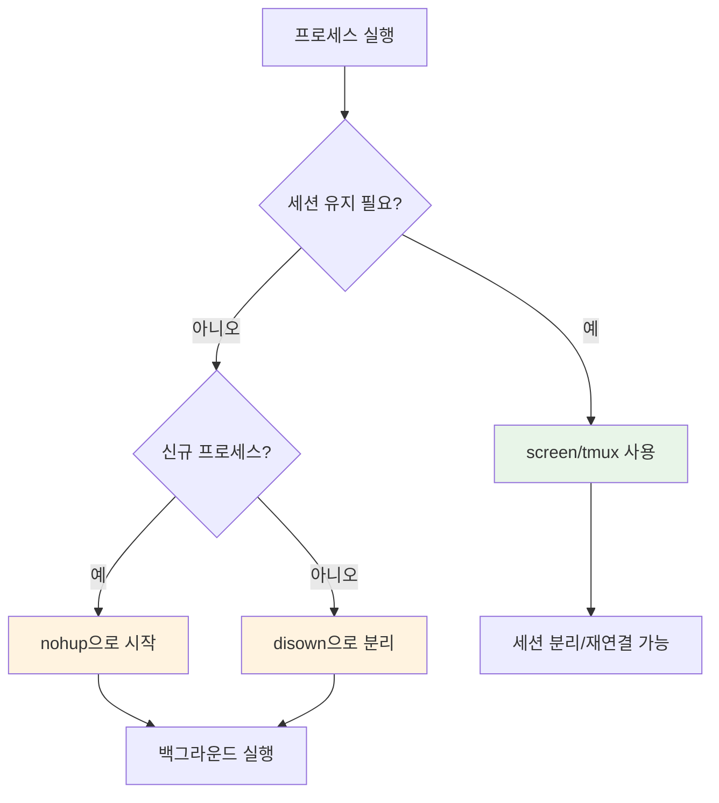
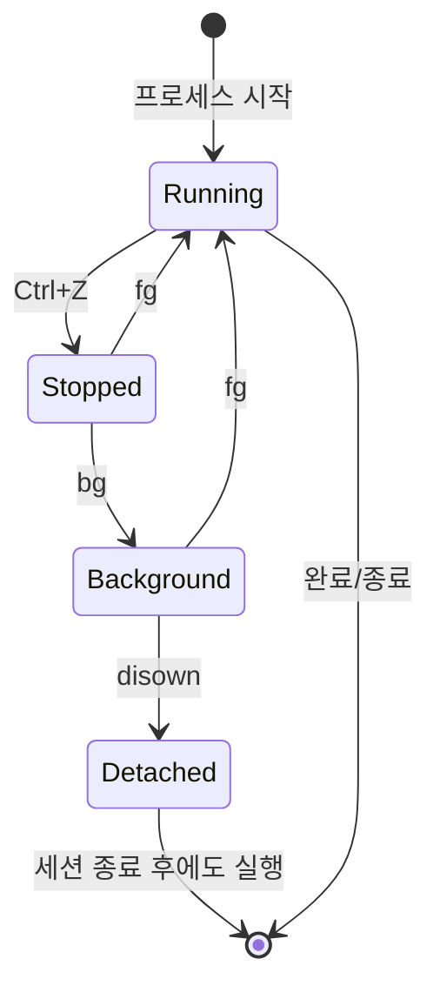
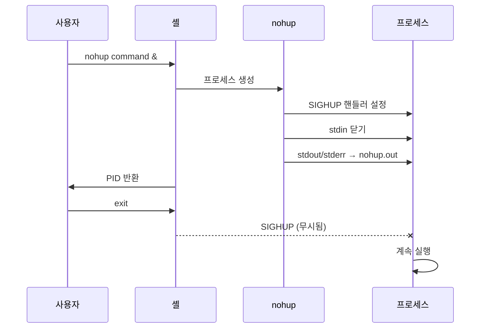

# 백그라운드 프로세스 관리

세션을 종료해도 프로세스가 계속 실행되도록 관리하는 방법을 설명합니다.

## 개요

SSH 세션이나 터미널을 닫을 때, 기본적으로 실행 중인 프로세스는 SIGHUP 신호를 받아 종료됩니다. 장기 실행 작업의 경우, 프로세스를 세션과 분리하여 계속 실행되도록 해야 합니다.



## 프로세스 제어 명령어

### 기본 작업 제어

| 명령어 | 단축키 | 설명 |
|--------|--------|------|
| `Ctrl+Z` | - | 현재 프로세스 일시 중지 (SIGTSTP) |
| `bg` | - | 중지된 프로세스를 백그라운드에서 재개 |
| `fg` | - | 백그라운드 프로세스를 포어그라운드로 이동 |
| `jobs` | - | 현재 셸의 작업 목록 표시 |
| `disown` | - | 셸에서 작업 분리 |

### 프로세스 상태 흐름



## 실행 중인 프로세스 백그라운드 전환

이미 실행 중인 프로세스를 세션과 분리하는 방법:

### 방법 1: disown 사용

```bash
# 1. 실행 중인 프로세스 일시 중지
Ctrl+Z

# 2. 작업 번호 확인
jobs
# [1]+  Stopped                 python long_running_script.py

# 3. 백그라운드로 전환
bg %1

# 4. 셸에서 분리 (SIGHUP 무시)
disown -h %1
```

!!! tip "disown 옵션"
    - `disown`: 작업을 작업 테이블에서 제거
    - `disown -h`: 작업을 유지하되 SIGHUP 무시
    - `disown -a`: 모든 작업에 대해 적용

### 방법 2: reptyr로 프로세스 마이그레이션

실행 중인 프로세스를 다른 터미널(screen/tmux)로 이동:

```bash
# reptyr 설치
sudo apt install reptyr

# 프로세스 PID 확인
ps aux | grep process_name

# 새 터미널/screen 세션에서
reptyr <PID>
```

!!! warning "ptrace 설정"
    reptyr 사용 시 다음 설정이 필요할 수 있습니다:
    ```bash
    echo 0 | sudo tee /proc/sys/kernel/yama/ptrace_scope
    ```

## 새 프로세스 시작 방법

### nohup 명령어

`nohup`은 프로세스가 SIGHUP 신호를 무시하도록 합니다:

```bash
# 기본 사용법
nohup command &

# 출력을 특정 파일로 리디렉션
nohup command > output.log 2>&1 &

# PID 확인
echo $!
```

#### nohup 동작 원리



### setsid 명령어

새 세션을 생성하여 프로세스를 완전히 분리:

```bash
# 새 세션에서 명령 실행
setsid command > output.log 2>&1

# nohup과 결합
setsid nohup command > output.log 2>&1 &
```

## 터미널 멀티플렉서

### tmux

tmux는 세션 관리와 창 분할 기능을 제공합니다:

```bash
# 새 세션 시작
tmux new -s session_name

# 세션 분리
Ctrl+B, D

# 세션 목록 확인
tmux ls

# 세션 재연결
tmux attach -t session_name

# 특정 명령으로 세션 시작
tmux new -d -s backup "rsync -avz /src /dest"
```

#### tmux 주요 단축키

| 단축키 | 기능 |
|--------|------|
| `Ctrl+B, D` | 세션 분리 |
| `Ctrl+B, C` | 새 창 생성 |
| `Ctrl+B, N` | 다음 창 |
| `Ctrl+B, P` | 이전 창 |
| `Ctrl+B, %` | 수평 분할 |
| `Ctrl+B, "` | 수직 분할 |
| `Ctrl+B, [` | 스크롤 모드 |

### screen

GNU Screen도 비슷한 기능을 제공합니다:

```bash
# 새 세션 시작
screen -S session_name

# 세션 분리
Ctrl+A, D

# 세션 목록 확인
screen -ls

# 세션 재연결
screen -r session_name

# 분리된 세션이 있을 때 강제 재연결
screen -dr session_name
```

## systemd 서비스로 관리

장기 실행 프로세스는 systemd 서비스로 관리하는 것이 가장 안정적입니다:

```ini
# /etc/systemd/system/myapp.service
[Unit]
Description=My Application
After=network.target

[Service]
Type=simple
User=appuser
WorkingDirectory=/opt/myapp
ExecStart=/opt/myapp/run.sh
Restart=on-failure
RestartSec=10

# 로그 설정
StandardOutput=journal
StandardError=journal

[Install]
WantedBy=multi-user.target
```

```bash
# 서비스 시작
sudo systemctl start myapp

# 부팅 시 자동 시작
sudo systemctl enable myapp

# 상태 확인
sudo systemctl status myapp

# 로그 확인
journalctl -u myapp -f
```

## 방법 비교

| 방법 | 장점 | 단점 | 사용 사례 |
|------|------|------|-----------|
| **nohup** | 간단함, 추가 설치 불필요 | 출력 확인 어려움 | 일회성 장기 작업 |
| **disown** | 실행 중 프로세스에 적용 가능 | stdin/stdout 관리 필요 | 긴급한 세션 분리 |
| **tmux/screen** | 출력 확인, 재연결 가능 | 추가 학습 필요 | 대화형 작업, 모니터링 |
| **systemd** | 자동 재시작, 로깅, 의존성 | 설정 복잡 | 프로덕션 서비스 |

## 실전 예제

### 백업 스크립트 실행

```bash
# tmux 세션에서 백업 실행
tmux new -d -s backup "bash /opt/scripts/backup.sh >> /var/log/backup.log 2>&1"

# 진행 상황 확인
tmux attach -t backup

# 또는 nohup 사용
nohup /opt/scripts/backup.sh >> /var/log/backup.log 2>&1 &
echo "Backup started with PID: $!"
```

### Python 스크립트 백그라운드 실행

```bash
# 가상환경과 함께 사용
nohup /opt/venv/bin/python /opt/app/main.py > /var/log/app.log 2>&1 &

# PID 파일 생성
nohup python main.py > app.log 2>&1 & echo $! > app.pid
```

### 실행 중인 프로세스 안전하게 분리

```bash
#!/bin/bash
# save_process.sh - 실행 중인 프로세스를 안전하게 백그라운드로 전환

# 1. 현재 작업 저장
jobs -l

# 2. 모든 작업을 백그라운드로
for job in $(jobs -p); do
    disown -h $job
    echo "Detached PID: $job"
done

# 3. 확인
ps aux | grep "your_process"
```

## 주의사항

!!! danger "출력 리디렉션"
    백그라운드 프로세스는 터미널에 출력을 시도할 수 있습니다. 반드시 출력을 파일로 리디렉션하세요:
    ```bash
    command > output.log 2>&1 &
    ```

!!! warning "리소스 모니터링"
    백그라운드 프로세스도 시스템 리소스를 사용합니다. 정기적으로 확인하세요:
    ```bash
    # CPU/메모리 사용량 확인
    ps aux | grep process_name
    
    # 실시간 모니터링
    htop -p $(pgrep -f process_name)
    ```

## 관련 문서

- [Tmux 가이드](../../tools/terminal/tmux.md)
- [Prometheus/Grafana/Loki](./prometheus-grafana-loki.md)
