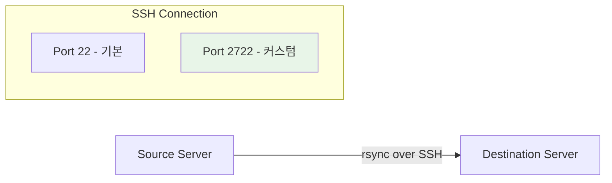
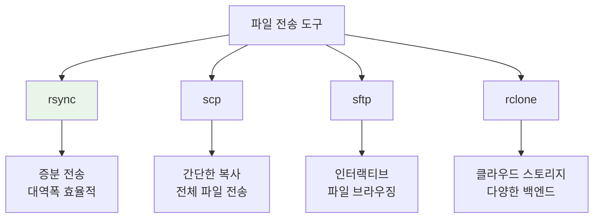

# Rsync와 SSH 커스텀 포트 사용법

GNU rsync를 OpenSSH 원격 셸 위에서 실행할 때 SSH 포트를 지정하고 결과를 판정하는 방법입니다. rsync 버전, 양쪽 파일 시스템, 권한, 링크와 ACL/xattr 요구사항을 먼저 확인하세요.

## 개요

`user@host:/path` 형식에서 `--port`는 SSH 포트 옵션이 아닙니다. `-e "ssh -p PORT"` 또는 `~/.ssh/config`를 사용합니다.



## 일반적인 실수

### 잘못된 명령어

```bash
# ❌ 잘못된 사용법 - Connection refused 오류 발생
sudo rsync -avz /source/* --port 2722 user@host:/destination/
```

`--port` 옵션은 rsync 데몬 프로토콜용이며, SSH 연결의 포트를 지정하지 않습니다.

### 올바른 명령어

```bash
# ✅ 올바른 사용법
sudo rsync -avz -e "ssh -p 2722" /source/* user@host:/destination/
```

## rsync 기본 옵션

| 옵션 | 설명 |
|------|------|
| `-a` | Archive 모드 (권한, 소유자, 타임스탬프 보존) |
| `-v` | Verbose 출력 |
| `-z` | 전송 중 압축 |
| `-e` | 원격 셸 지정 |
| `-P` | 진행률 표시 + 부분 전송 유지 |
| `--delete` | 소스에 없는 파일 삭제 |
| `--dry-run` | 실제 전송 없이 테스트 |

!!! danger "삭제와 일관성"
    `--delete`는 대상의 추가 파일을 제거합니다. 먼저 `--dry-run --itemize-changes`로 대상과 trailing slash 의미를 확인하세요. 변경 중인 데이터베이스나 VM 이미지는 rsync만으로 시점 일관성이 보장되지 않습니다.

## 커스텀 SSH 포트 사용

### 기본 문법

```bash
rsync -avz -e "ssh -p PORT" /source/ user@host:/destination/
```

### 실제 예제

```bash
# 포트 2722로 백업
rsync -avz -e "ssh -p 2722" /mnt/nas/backup/ nodove@192.168.1.100:/mnt/backup/

# 진행률 표시와 함께
rsync -avzP -e "ssh -p 2722" /home/user/data/ user@server:/backup/

# 특정 SSH 키 사용
rsync -avz -e "ssh -p 2722 -i ~/.ssh/backup_key" /data/ user@server:/backup/
```

## SSH 설정으로 간소화

### ~/.ssh/config 설정

반복적으로 같은 서버에 접속한다면 SSH 설정 파일을 사용하세요:

```bash
# ~/.ssh/config
Host backup-server
    HostName 192.168.1.100
    User nodove
    Port 2722
    IdentityFile ~/.ssh/backup_key
```

### 간소화된 rsync 명령

```bash
# SSH config 사용 시
rsync -avz /source/ backup-server:/destination/
```

## 고급 사용법

### 대역폭 제한

```bash
# 10 MB/s로 제한
rsync -avz --bwlimit=10000 -e "ssh -p 2722" /source/ user@host:/dest/
```

### 제외 패턴

```bash
# 특정 파일/폴더 제외
rsync -avz -e "ssh -p 2722" \
  --exclude='*.log' \
  --exclude='node_modules/' \
  --exclude='.git/' \
  /project/ user@host:/backup/
```

### 미러링 (동기화)

```bash
# 소스와 동일하게 만들기 (추가 파일 삭제)
rsync -avz --delete -e "ssh -p 2722" /source/ user@host:/dest/
```

## 일반적인 시나리오

### 서버 백업

```bash
#!/bin/bash
# backup.sh

REMOTE="backup-server"
SOURCE="/var/www/html/"
DEST="/backups/web/$(date +%Y%m%d)/"
LOG="/var/log/backup.log"

if rsync -avz --delete \
  -e "ssh -p 2722" \
  --exclude='*.log' \
  --exclude='cache/' \
  "$SOURCE" "$REMOTE:$DEST" >> "$LOG" 2>&1; then
  echo "Backup completed: $(date -Is)" >> "$LOG"
else
  status=$?
  echo "Backup failed with exit $status: $(date -Is)" >> "$LOG"
  exit "$status"
fi
```

### 전송 방향 선택

아래 두 명령은 각각 단방향 복사이며, 둘을 연속 실행해도 충돌 탐지와 삭제 병합을 제공하는 양방향 동기화가 되지 않습니다.

```bash
# 로컬 → 원격
rsync -avz -e "ssh -p 2722" /local/data/ user@server:/remote/data/

# 원격 → 로컬
rsync -avz -e "ssh -p 2722" user@server:/remote/data/ /local/data/
```

### 여러 서버로 배포

```bash
#!/bin/bash
SERVERS=("server1" "server2" "server3")
SOURCE="/app/release/"

for server in "${SERVERS[@]}"; do
  echo "Deploying to $server..."
  rsync -avz -e "ssh -p 2722" "$SOURCE" "$server:/opt/app/"
done
```

## 문제 해결

### Connection refused

```bash
# SSH 연결 먼저 테스트
ssh -p 2722 user@host

# 방화벽 확인
sudo ufw status
sudo iptables -L -n | grep 2722
```

### Permission denied

```bash
# SSH 키 권한 확인
chmod 600 ~/.ssh/id_*
chmod 700 ~/.ssh

# verbose 모드로 디버깅
rsync -avvz -e "ssh -p 2722 -v" /source/ user@host:/dest/
```

### 느린 전송 속도

```bash
# 압축 비활성화 (이미 압축된 파일)
rsync -av -e "ssh -p 2722 -c aes128-gcm@openssh.com" /source/ user@host:/dest/

# 체크섬 대신 크기+시간 비교
rsync -avz --size-only -e "ssh -p 2722" /source/ user@host:/dest/
```

## rsync vs 다른 도구



| 도구 | 장점 | 단점 | 사용 사례 |
|------|------|------|-----------|
| **rsync** | 증분 전송, 효율적 | 설정 복잡 | 대용량 백업, 동기화 |
| **scp** | 간단함 | 전체 파일 전송 | 단일 파일 복사 |
| **sftp** | 인터랙티브 | 자동화 어려움 | 수동 파일 관리 |
| **rclone** | 클라우드 지원 | 로컬 전용 복잡 | 클라우드 동기화 |

## 완료, 재시도 및 복구 증거

종료 코드와 부분 성공 코드를 보존하고 파일 수·총 바이트·표본 체크섬을 비교합니다. 중요한 백업은 별도 위치로 실제 복원해 애플리케이션이 열리는지 확인해야 완료입니다. `-P`의 부분 파일은 재시도 수단일 뿐 완료 증거가 아니며, 잘못된 `--delete`는 rsync로 되돌릴 수 없으므로 대상 측 스냅샷이나 버전 보존이 필요합니다.

## 관련 문서

- [SSH 설정](../../security/ssh/configuration.md)
- [스토리지 마운트](../storage/mounting.md)
