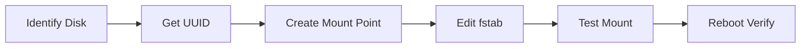

# Disk Mounting Guide

> Permanent disk mounting configuration for Linux systems

---

## Prerequisites

- Root/sudo access
- Target disk identified (`/dev/sdX`)
- Filesystem already created on the disk

---

## Workflow



---

## Step-by-Step Guide

### 1. Identify Available Disks

```bash
# List all block devices
sudo lsblk

# Show detailed disk information
sudo fdisk -l

# Show disk partitions with filesystem types
lsblk -f
```

### 2. Get Disk UUID

```bash
# Get UUID for specific disk
sudo blkid /dev/sdX1

# Example output:
# /dev/sdb1: UUID="a1b2c3d4-5678-90ab-cdef-1234567890ab" TYPE="ext4"
```

### 3. Create Mount Point

```bash
# Create directory for mounting
sudo mkdir -p /mnt/data

# Or use descriptive name
sudo mkdir -p /mnt/storage
```

### 4. Configure Permanent Mount

Edit `/etc/fstab`:

```bash
sudo nano /etc/fstab
```

Add entry:

```bash
# Format: UUID=<uuid> <mount-point> <type> <options> <dump> <pass>
UUID=a1b2c3d4-5678-90ab-cdef-1234567890ab /mnt/data ext4 defaults 0 2
```

**One-liner:**

```bash
echo "UUID=a1b2c3d4-5678-90ab-cdef-1234567890ab /mnt/data ext4 defaults 0 2" | sudo tee -a /etc/fstab
```

### 5. Test the Configuration

```bash
# Test fstab without reboot
sudo mount -a

# Verify mount
df -h | grep /mnt/data

# Check mount details
mount | grep /mnt/data
```

---

## Mount Options Reference

| Option | Description |
|--------|-------------|
| `defaults` | rw, suid, dev, exec, auto, nouser, async |
| `noatime` | Don't update access time (performance) |
| `nofail` | Don't fail boot if device missing |
| `ro` | Read-only |
| `rw` | Read-write |
| `user` | Allow non-root users to mount |
| `x-systemd.automount` | Mount on first access |

### Common Configurations

**SSD/NVMe (performance):**
```bash
UUID=xxx /mnt/ssd ext4 defaults,noatime,discard 0 2
```

**Network share (NFS):**
```bash
server:/share /mnt/nfs nfs defaults,nofail 0 0
```

**External drive (optional):**
```bash
UUID=xxx /mnt/external ext4 defaults,nofail,x-systemd.automount 0 2
```

---

## Troubleshooting

### Mount Failed After Reboot

```bash
# Check fstab syntax
sudo findmnt --verify

# Check system logs
journalctl -b | grep mount
```

### Permission Issues

```bash
# Set ownership
sudo chown -R $USER:$USER /mnt/data

# Or set permissions
sudo chmod 755 /mnt/data
```

---

## Related Documentation

- [Disk Format Guide](disk-format.md)
- [SSHFS Guide](sshfs.md)
