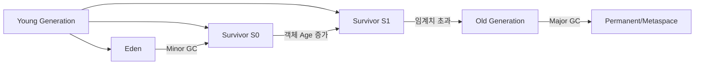

# 자바 메모리 관리, 람다, GC 및 OOP 개념 심층 분석

JDK 17·21의 일반적인 HotSpot 동작을 중심으로 한 개념 문서입니다. Java 명세의 보장과 HotSpot/javac 구현 관찰을 구분하며, 다른 JVM·collector·압축 참조 옵션에서는 배치와 용어가 달라질 수 있습니다.

## 1. 객체 생성과 메모리 관리 구조

### 1.1 힙 인스턴스 참조 저장 위치

`new` 연산자로 생성된 객체는 **힙 영역**에 저장되며, 이 인스턴스를 가리키는 참조 값은 다음 두 위치에 저장됩니다:

```java
public class MemoryExample {
    private Object instanceField = new Object();  // 힙 내 객체의 참조 저장

    public void method() {
        Object localVar = new Object();  // 스택 프레임에 참조 저장
        System.out.println(localVar);
    }
}
```

- **지역 변수**: 실행 프레임의 local-variable slot으로 다뤄집니다. 실제 참조 크기와 네이티브 배치는 JVM과 compressed oops 설정에 따라 달라집니다.
- **인스턴스 필드**: 객체 상태의 일부이며 객체 레이아웃과 정렬은 JVM 구현에 따라 달라집니다.

메모리 구조
*(출처: JVM 메모리 구조 도식화)[^1]*

### 1.2 잘못된 참조 관리 예시

```java
public class ReferenceLeak {
    private static List<byte[]> leakList = new ArrayList<>();

    public void generateData() {
        while(true) {
            byte[] data = new byte[10_000_000];  // 매회 10MB 할당
            leakList.add(data);  // 정적 컬렉션에 참조 유지 → GC 불가
        }
    }
}
```

이 코드는 **메모리 누수**를 유발하며, `OutOfMemoryError` 발생[^4][^9]

---

## 2. Private 메서드 vs Lambda 표현식

### 2.1 핵심 차이점 비교

| 특성 | Private 메서드 | Lambda 표현식 |
| :-- | :-- | :-- |
| 접근 제어 | 클래스 내부에서만 호출 가능 | 함수형 인터페이스 구현 |
| 상태 접근 | 인스턴스 변수 직접 접근 | `this`와 필드 접근 가능. 캡처한 지역 변수만 final/effectively final 필요 |
| 바이트코드 생성 | 일반 메서드로 컴파일 | invokedynamic 사용[^3][^11] |
| 직렬화 | 기본 지원 | SAM 인터페이스 구현 필요 |

### 2.2 코드 예시

```java
public class LambdaVsPrivate {
    private int counter = 0;

    private void increment() {
        counter++;  // 인스턴스 변수 직접 수정 가능
    }

    public Runnable getLambda() {
        int localCounter = 0;
        return () -> {
            counter++;  // 인스턴스 필드는 수정 가능
            // localCounter++;  // 캡처한 지역 변수 수정은 컴파일 오류
            System.out.println("Lambda executed");
        };
    }
}
```

---

## 3. 가비지 컬렉션 메커니즘

### 3.1 세대별 수집 전략



- **Minor GC**: Young 영역 (Eden → Survivor)[^9]
- **Major/Full GC**: 용어와 mark·sweep·compact 단계는 collector마다 다르므로 실제 GC 로그로 해석
- **G1 GC**: 많은 HotSpot JDK 9+ 서버 구성의 기본값이지만 옵션, 플랫폼, 공급업체에 따라 다름


### 3.2 GC 최적화 예시

```java
// 비효율적 코드
List<Data> processData(List<RawData> inputs) {
    return inputs.stream()
        .map(raw -> new DataParser().parse(raw))  // 매번 parser 생성
        .collect(Collectors.toList());
}

// 최적화 코드
public class DataProcessor {
    private static final DataParser PARSER = new DataParser();  // 재사용

    List<Data> optimizedProcess(List<RawData> inputs) {
        return inputs.stream()
            .map(PARSER::parse)  // 정적 파서 재사용
            .collect(Collectors.toList());
    }
}
```

---

## 4. OOP 개념과 Spring Boot 구현

### 4.1 인터페이스/클래스 활용

```java
// 제네릭 인터페이스
public interface CrudRepository<T, ID> {
    T save(T entity);
    Optional<T> findById(ID id);
}

// 구현 클래스
@Service
public class UserRepositoryImpl implements CrudRepository<User, Long> {
    @Override
    public User save(User user) {
        // JPA/Hibernate 구현
        return entityManager.merge(user);
    }
}

// Spring Data JPA 활용
public interface UserRepository extends JpaRepository<User, Long> {
    @Query("SELECT u FROM User u WHERE u.email = ?1")
    Optional<User> findByEmail(String email);
}
```


### 4.2 의존성 주입 예시

```java
@RestController
@RequiredArgsConstructor
public class UserController {
    private final UserService userService;  // 생성자 주입

    @PostMapping("/users")
    public ResponseEntity<User> createUser(@RequestBody UserDto dto) {
        return ResponseEntity.ok(userService.createUser(dto));
    }
}
```

---

## 5. 성능 최적화 기법

### 5.1 인스턴스 생성 비용 관리

```java
// 비효율적
@GetMapping("/report")
public Report generateReport() {
    return new ReportGenerator().generate();  // 매번 생성자 호출
}

// 최적화
@Service
@Scope("prototype")  // 필요시 인스턴스 생성
public class ReportGenerator {
    @PostConstruct
    public void init() {
        // 무거운 초기화 작업
    }
}

@RestController
@RequiredArgsConstructor
public class ReportController {
    private final ObjectFactory<ReportGenerator> generatorFactory;

    @GetMapping("/report")
    public Report generate() {
        return generatorFactory.getObject().generate();
    }
}
```


### 5.2 캐싱 전략

```java
@Configuration
@EnableCaching
public class CacheConfig extends CachingConfigurerSupport {
    @Bean
    public CacheManager cacheManager() {
        return new ConcurrentMapCacheManager("users");
    }
}

@Service
public class UserService {
    @Cacheable("users")
    public User getUserById(Long id) {
        // DB 조회 로직
        return repository.findById(id).orElseThrow();
    }
}
```

---

## 6. 결론: 핵심 개념 요약

| 구분 | 주요 내용 | 성능 영향 요소 |
| :-- | :-- | :-- |
| 메모리 관리 | 스택·힙의 개념적 역할, GC root 도달 가능성 기반 추적 | 객체 생명주기와 도달 가능성 |
| 람다 특성 | 캡처 변수의 불변성 유지, 함수형 인터페이스 구현 | 스택 트레이스 복잡도 증가 |
| GC 전략 | 세대별 분리 수집, Stop-The-World 시간 최소화 | Full GC 발생 빈도 |
| OOP 설계 | 인터페이스 분리 원칙(ISP), 의존성 역전(DIP) | 클래스 결합도 |
| Spring 최적화 | 빈 스코프 관리, 캐싱, 연결 풀 설정 | 컨텍스트 로드 시간 |

**성능 개선을 위한 체크리스트**:

1. 불필요한 객체 생성 줄이기 (예: 정적 팩토리 메서드)
2. `@Cacheable`을 활용한 반복 작업 캐싱
3. 스레드 풀 적절한 설정 (`TaskExecutor` 튜닝)
4. JPA N+1 문제 방지 (페치 조인 사용)
5. GC 로그 분석을 통한 힙 크기 조정

## 근거, 완료 및 불확실성

아래 링크 대부분은 2차 블로그입니다. 언어 규칙은 JLS/JVMS, collector는 대상 JDK 공식 문서와 JEP, Spring은 사용 버전의 공식 reference를 우선합니다. 성능 변경은 동일 부하에서 allocation rate, pause, p95/p99 지연, 처리량, 오류율을 전후 비교하고 회귀 시 되돌릴 수 있어야 완료입니다.

<div style="text-align: center">⁂</div>

[^1]: https://inblog.ai/muaga/jvm-실행-시-저장-진행-상황static-heap-stack-20575

[^2]: https://8iggy.tistory.com/230

[^3]: https://velog.io/@redjen/lambda-vs-inner-anonymous-class

[^4]: https://kim-oriental.tistory.com/48

[^5]: https://velog.io/@gale4739/Spring-Boot-Interface-골격-구현-클래스-클래스-구조-변경Feat.-Composition

[^6]: https://www.lgcns.com/blog/cns-tech/aws-ambassador/49072/

[^7]: https://meal-coding.tistory.com/16

[^8]: https://velog.io/@newd/실전-스프링-부트와-JPA-활용2-API-개발과-성능-최적화-정리4

[^9]: https://sharplee7.tistory.com/54

[^10]: https://velog.io/@dmchoi224/참조형-변수-짚고-가기

[^11]: https://inpa.tistory.com/entry/☕-Lambda-Expression

[^12]: https://devloo.tistory.com/entry/Spring-Boot-의-성능을-향상시키는-10가지-방법

[^13]: https://sjh836.tistory.com/173

[^14]: https://bbidag.tistory.com/27

[^15]: https://tech.kakaopay.com/post/spring-batch-performance/

[^16]: https://cbjh-4.tistory.com/79

[^17]: https://inpa.tistory.com/entry/JAVA-☕-그림으로-보는-자바-코드의-메모리-영역스택-힙

[^18]: https://lealea.tistory.com/273

[^19]: https://lucas-owner.tistory.com/38

[^20]: https://velog.io/@devnoong/JAVA-Stack-과-Heap에-대해서

[^21]: https://inpa.tistory.com/entry/☕-Lambda-Expression

[^22]: https://velog.io/@haminggu/Java-가비지-컬렉션-동작-원리

[^23]: https://gnidinger.tistory.com/entry/Java인터페이스의-활용-예제

[^24]: https://devloo.tistory.com/entry/Spring-Boot-의-성능을-향상시키는-10가지-방법

[^25]: https://blog.naver.com/senshig/221759831074

[^26]: https://jerrys-ai-lab.tistory.com/34

[^27]: https://breakcoding.tistory.com/4

[^28]: https://inpa.tistory.com/entry/JAVA-☕-가비지-컬렉션GC-동작-원리-알고리즘-💯-총정리

[^29]: https://velog.io/@songsunkook/함수형-인터페이스와-표준-API

[^30]: https://codegym.cc/ko/groups/posts/ko.250.javaui-lamda-pyohyeonsig-e-daehan-seolmyeong-ibnida-yejewa-jag-eob-i-issseubnida-1-bu

[^31]: https://www.inflearn.com/blogs/6665

[^32]: https://nohriter.tistory.com/166

[^33]: https://butter-shower.tistory.com/85

[^34]: https://velog.io/@koo8624/Spring-JPA-성능-최적화

[^35]: https://devloo.tistory.com/entry/스프링-부트-지금-당장-적용해야-할-25가지-Spring-Boot-모범-사례

[^36]: https://yoonseon.tistory.com/35

[^37]: https://nightsky-stars.tistory.com/entry/springboot-실전-스프링부트와-JPA-활용2-API-개발과-성능-최적화-2-API-개발-고급-준비-지연-로딩과-조회-성능-최적화

[^38]: https://youseong.tistory.com/29

[^39]: https://aspring.tistory.com/entry/스프링부트-실전-스프링-부트와-JPA-활용2-컬렉션-조회-최적화-31-페이징과-한계-돌파

