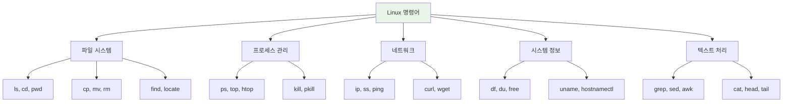
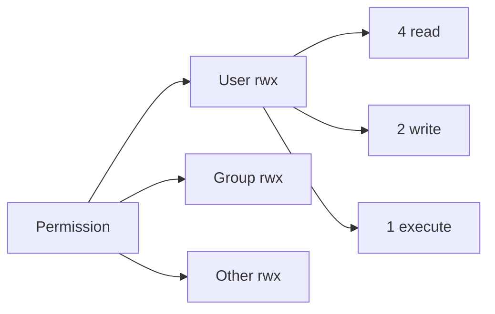

# Linux 명령어 참조

시스템 관리를 위한 필수 Linux 명령어 가이드입니다.

!!! tip "상세 가이드"
    더 자세한 내용은 [Complete Linux Commands Guide](../tools/terminal/linux-commands.md)를 참조하세요.

---

## 명령어 카테고리



---

## 파일 시스템 탐색

### 기본 탐색

| 명령어 | 설명 | 예제 |
|--------|------|------|
| `ls` | 디렉토리 내용 표시 | `ls -la` |
| `cd` | 디렉토리 이동 | `cd /var/log` |
| `pwd` | 현재 경로 표시 | `pwd` |
| `tree` | 트리 구조 표시 | `tree -L 2` |

### ls 옵션

```bash
ls -l      # 상세 정보
ls -a      # 숨김 파일 포함
ls -h      # 사람이 읽기 쉬운 크기
ls -R      # 재귀적 표시
ls -ltr    # 시간순 정렬 (오래된 것 먼저)
ls -lSr    # 크기순 정렬
```

---

## 파일 작업

### 기본 작업

| 명령어 | 설명 | 예제 |
|--------|------|------|
| `cp` | 파일 복사 | `cp -r src/ dest/` |
| `mv` | 파일 이동/이름 변경 | `mv old.txt new.txt` |
| `rm` | 파일 삭제 | `rm -rf dirname/` |
| `mkdir` | 디렉토리 생성 | `mkdir -p path/to/dir` |
| `touch` | 빈 파일 생성 | `touch newfile.txt` |

### 파일 찾기

```bash
# find - 다양한 조건으로 검색
find /var -name "*.log"              # 이름으로 찾기
find . -type f -mtime -7             # 7일 이내 수정된 파일
find . -size +100M                   # 100MB 이상 파일
find . -name "*.tmp" -delete         # 찾아서 삭제

# locate - 데이터베이스 기반 빠른 검색
locate nginx.conf
sudo updatedb                        # DB 업데이트
```

---

## 텍스트 처리

### 파일 내용 보기

| 명령어 | 설명 | 예제 |
|--------|------|------|
| `cat` | 전체 내용 표시 | `cat file.txt` |
| `head` | 처음 N줄 표시 | `head -20 file.txt` |
| `tail` | 마지막 N줄 표시 | `tail -f /var/log/syslog` |
| `less` | 페이지 단위 보기 | `less large_file.txt` |

### 텍스트 검색 및 처리

```bash
# grep - 패턴 검색
grep "error" logfile.txt             # 기본 검색
grep -r "pattern" /path              # 재귀 검색
grep -i "case" file.txt              # 대소문자 무시
grep -v "exclude" file.txt           # 반전 매칭
grep -c "count" file.txt             # 일치 횟수

# sed - 스트림 편집기
sed 's/old/new/g' file.txt           # 문자열 치환
sed -i 's/old/new/g' file.txt        # 파일 직접 수정
sed '1,10d' file.txt                 # 1-10줄 삭제
sed -n '5,10p' file.txt              # 5-10줄만 출력

# awk - 패턴 처리
awk '{print $1}' file.txt            # 첫 번째 필드
awk -F: '{print $1, $3}' /etc/passwd # 구분자 지정
awk '$3 > 100' file.txt              # 조건 필터링
```

---

## 프로세스 관리

### 프로세스 확인

```bash
# ps - 프로세스 스냅샷
ps aux                               # 모든 프로세스
ps aux | grep nginx                  # 특정 프로세스 찾기
ps -ef --forest                      # 트리 구조로 표시

# top/htop - 실시간 모니터링
top                                  # 기본 모니터
htop                                 # 향상된 인터페이스

# pgrep/pkill - 프로세스 검색/종료
pgrep -f "pattern"                   # PID 찾기
pkill -f "pattern"                   # 프로세스 종료
```

### 프로세스 제어

| 시그널 | 번호 | 설명 |
|--------|------|------|
| `SIGTERM` | 15 | 정상 종료 요청 |
| `SIGKILL` | 9 | 강제 종료 |
| `SIGHUP` | 1 | 재시작/설정 리로드 |
| `SIGSTOP` | 19 | 일시 중지 |

```bash
kill PID                             # SIGTERM 전송
kill -9 PID                          # 강제 종료
killall process_name                 # 이름으로 종료
```

---

## 시스템 정보

### 리소스 모니터링

| 명령어 | 설명 | 예제 |
|--------|------|------|
| `df` | 디스크 사용량 | `df -h` |
| `du` | 디렉토리 크기 | `du -sh *` |
| `free` | 메모리 상태 | `free -h` |
| `uptime` | 시스템 가동 시간 | `uptime` |

### 시스템 정보 확인

```bash
# 시스템 정보
uname -a                             # 커널 정보
hostnamectl                          # 호스트 정보
lsb_release -a                       # 배포판 정보

# 하드웨어 정보
lscpu                                # CPU 정보
lsmem                                # 메모리 정보
lsblk                                # 블록 디바이스
lspci                                # PCI 디바이스
lsusb                                # USB 디바이스
```

---

## 네트워크

### 네트워크 상태

```bash
# IP 및 인터페이스
ip addr show                         # IP 주소 확인
ip route                             # 라우팅 테이블
ip link show                         # 인터페이스 상태

# 연결 상태
ss -tuln                             # 열린 포트 확인
ss -tp                               # TCP 연결 + 프로세스
netstat -tuln                        # (구형) 포트 확인

# 연결 테스트
ping -c 4 google.com                 # 연결 테스트
traceroute google.com                # 경로 추적
dig google.com                       # DNS 조회
curl -I https://example.com          # HTTP 헤더
```

---

## 권한 관리

### 파일 권한



```bash
# chmod - 권한 변경
chmod 755 script.sh                  # rwxr-xr-x
chmod +x script.sh                   # 실행 권한 추가
chmod -R 644 /path                   # 재귀적 적용

# chown - 소유자 변경
chown user:group file.txt
chown -R www-data:www-data /var/www
```

### 권한 숫자 계산

| 권한 | 값 | 의미 |
|------|-----|------|
| r | 4 | 읽기 |
| w | 2 | 쓰기 |
| x | 1 | 실행 |

예: `755` = `rwxr-xr-x` (7=4+2+1, 5=4+1)

---

## 유용한 조합

### 로그 분석

```bash
# 실시간 로그 모니터링
tail -f /var/log/syslog | grep ERROR

# 로그에서 IP 추출 및 카운트
grep -oE '[0-9]+\.[0-9]+\.[0-9]+\.[0-9]+' access.log | sort | uniq -c | sort -rn | head

# 특정 시간대 로그 필터링
awk '/2024-01-15 14:/ {print}' application.log
```

### 디스크 정리

```bash
# 큰 파일 찾기
find / -type f -size +1G 2>/dev/null | head -20

# 오래된 로그 삭제
find /var/log -name "*.log" -mtime +30 -delete

# 디렉토리별 사용량 정렬
du -h --max-depth=1 | sort -hr
```

---

## 관련 문서

- [Tmux 가이드](../tools/terminal/tmux.md)
- [Vim 가이드](../tools/terminal/vim.md)
- [쉘 스크립팅](../tools/terminal/linux-commands.md#쉘-환경-및-스크립팅)
