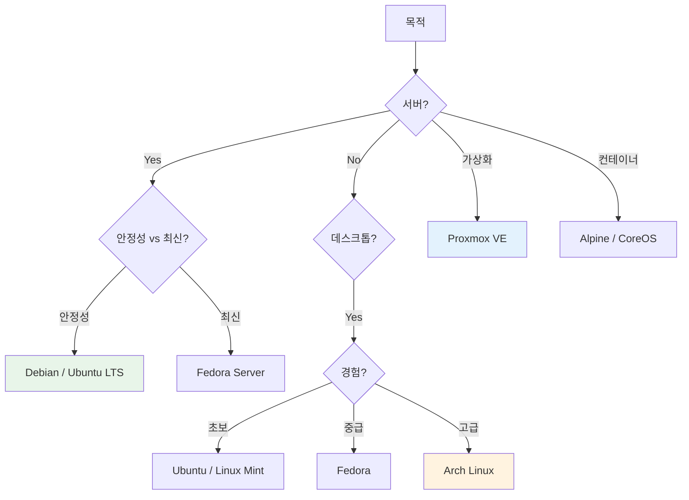

# Linux 문서

Linux 시스템 관리, 배포판별 가이드, 멀티미디어 도구에 관한 문서입니다.

---

## :material-penguin: 문서 목록

<div class="grid cards" markdown>

-   :material-console:{ .lg .middle } **시스템 기초**

    ---

    필수 명령어와 파일시스템 구조

    - [명령어 가이드](commands.md)
    - [파일시스템](filesystem.md)

-   :material-arch:{ .lg .middle } **Arch Linux**

    ---

    롤링 릴리즈 배포판 설치 및 관리

    - [설치 가이드](arch/installation.md)
    - [KDE 테마](arch/kde-theme.md)
    - [문제 해결](arch/troubleshooting.md)

-   :material-server:{ .lg .middle } **Proxmox VE**

    ---

    가상화 플랫폼 설정 및 관리

    - [드라이브 마운트](proxmox/drive-mount.md)
    - [마이그레이션](proxmox/migration.md)
    - [WireGuard VPN](proxmox/wireguard-vpn.md)

-   :material-video:{ .lg .middle } **멀티미디어**

    ---

    비디오/오디오 처리 도구

    - [FFmpeg](multimedia/ffmpeg.md)

</div>

---

## :material-chart-pie: Linux 배포판 선택 가이드



---

## :material-folder-multiple: 파일시스템 계층 (FHS)

```
/
├── bin/       # 필수 명령어 바이너리
├── boot/      # 부트로더 파일
├── dev/       # 디바이스 파일
├── etc/       # 시스템 설정 파일
├── home/      # 사용자 홈 디렉토리
├── lib/       # 공유 라이브러리
├── media/     # 이동식 미디어 마운트
├── mnt/       # 임시 마운트 포인트
├── opt/       # 추가 응용 프로그램
├── proc/      # 프로세스 정보 (가상)
├── root/      # root 사용자 홈
├── run/       # 런타임 데이터
├── sbin/      # 시스템 바이너리
├── srv/       # 서비스 데이터
├── sys/       # 시스템 정보 (가상)
├── tmp/       # 임시 파일
├── usr/       # 사용자 프로그램
└── var/       # 가변 데이터 (로그, 캐시)
```

---

## :material-terminal: 필수 명령어 카테고리

### 파일 관리

| 명령어 | 설명 | 예시 |
|--------|------|------|
| `ls` | 디렉토리 목록 | `ls -la` |
| `cd` | 디렉토리 이동 | `cd /var/log` |
| `cp` | 파일 복사 | `cp -r src/ dst/` |
| `mv` | 파일 이동/이름변경 | `mv old.txt new.txt` |
| `rm` | 파일 삭제 | `rm -rf dir/` |
| `find` | 파일 검색 | `find . -name "*.log"` |

### 프로세스 관리

| 명령어 | 설명 | 예시 |
|--------|------|------|
| `ps` | 프로세스 목록 | `ps aux` |
| `top` / `htop` | 실시간 모니터링 | `htop` |
| `kill` | 프로세스 종료 | `kill -9 PID` |
| `systemctl` | 서비스 관리 | `systemctl status nginx` |
| `journalctl` | 로그 조회 | `journalctl -u nginx -f` |

### 네트워크

| 명령어 | 설명 | 예시 |
|--------|------|------|
| `ip` | 네트워크 설정 | `ip addr show` |
| `ss` | 소켓 통계 | `ss -tulpn` |
| `curl` | HTTP 요청 | `curl -I https://example.com` |
| `ping` | 연결 확인 | `ping -c 4 8.8.8.8` |
| `traceroute` | 경로 추적 | `traceroute google.com` |

---

## :material-harddisk: 디스크 관리

### 마운트 과정


### fstab 예시

```bash
# /etc/fstab
# <device>        <mount>    <type>  <options>       <dump> <pass>
UUID=xxx-xxx      /data      ext4    defaults        0      2
/dev/sdb1         /backup    xfs     defaults,nofail 0      2
192.168.1.10:/nfs /nfs       nfs     defaults        0      0
```

---

## :material-shield-check: 권한 시스템

### 파일 권한

```
-rwxr-xr-x  1 user group 4096 Jan 10 10:00 script.sh
│├─┼──┼──┤
││ │  │  └── others: r-x (5)
││ │  └───── group: r-x (5)
││ └──────── user: rwx (7)
│└────────── 파일 타입 (- = 파일, d = 디렉토리)
└─────────── 권한 = 755
```

### chmod 사용법

| 명령 | 결과 | 설명 |
|------|------|------|
| `chmod 755 file` | rwxr-xr-x | 실행 파일 |
| `chmod 644 file` | rw-r--r-- | 일반 파일 |
| `chmod 600 file` | rw-------| 비밀 파일 |
| `chmod +x file` | 실행 권한 추가 | |
| `chmod -R 755 dir` | 재귀적 적용 | |

---

## :material-compare: 배포판 비교

| 배포판 | 베이스 | 패키지 관리자 | 릴리즈 | 추천 용도 |
|--------|--------|---------------|--------|----------|
| **Ubuntu** | Debian | apt | Fixed | 서버, 데스크톱 |
| **Debian** | - | apt | Fixed | 서버 (안정) |
| **Arch** | - | pacman | Rolling | 데스크톱 (고급) |
| **Fedora** | - | dnf | Fixed | 데스크톱 (최신) |
| **CentOS/Rocky** | RHEL | dnf | Fixed | 기업 서버 |
| **Alpine** | - | apk | Rolling | 컨테이너 |

---

## :material-link-variant: 관련 문서

- [Proxmox 클러스터](../infrastructure/proxmox/cluster.md)
- [네트워크 설정](../infrastructure/networking/network-settings.md)
- [SSH 설정](../security/ssh/configuration.md)
- [Vim 가이드](../tools/terminal/vim.md)
- [Tmux 가이드](../tools/terminal/tmux.md)

---

## :material-book-open-page-variant: 참고 자료

- [Arch Wiki](https://wiki.archlinux.org/) - 최고의 Linux 문서
- [Linux Documentation Project](https://tldp.org/)
- [Proxmox Wiki](https://pve.proxmox.com/wiki/Main_Page)
- [Linux Journey](https://linuxjourney.com/) - 초보자용 튜토리얼
