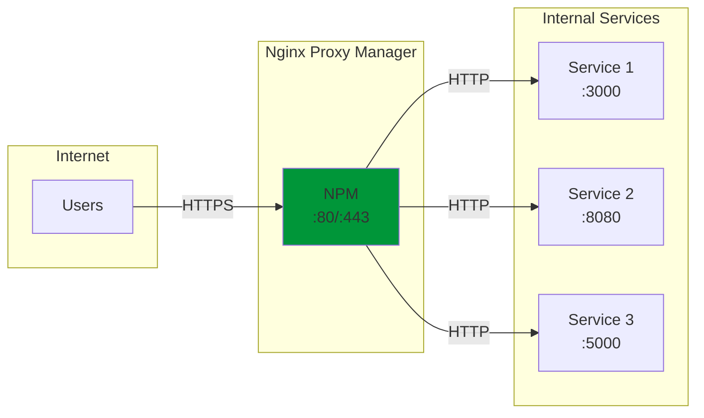
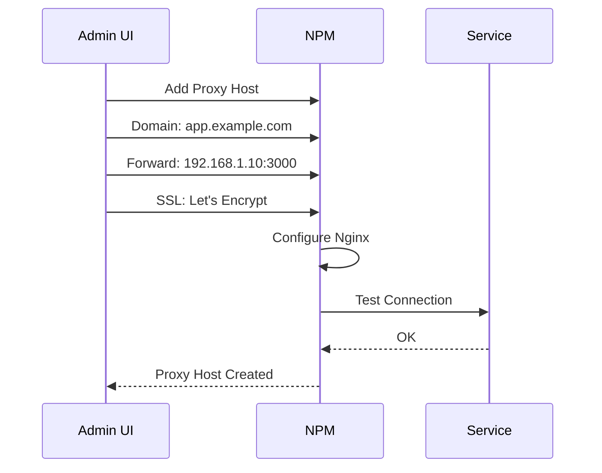

# Nginx Proxy Manager

Nginx Proxy Manager를 사용한 리버스 프록시 설정 가이드입니다.

## 개요

Nginx Proxy Manager는 웹 기반 UI를 통해 Nginx 리버스 프록시를 쉽게 관리할 수 있는 도구입니다. Let's Encrypt SSL 인증서 자동 발급을 지원합니다.



### 주요 기능

| 기능 | 설명 |
|------|------|
| **리버스 프록시** | 내부 서비스로 트래픽 라우팅 |
| **SSL 인증서** | Let's Encrypt 자동 발급/갱신 |
| **접근 제어** | IP 화이트리스트, 인증 |
| **리다이렉션** | URL 리다이렉트 관리 |
| **스트림** | TCP/UDP 프록시 |

---

## Docker Compose 설정

### 기본 구성 (SQLite)

```yaml
# docker-compose.yml
version: '3.8'

services:
  nginx-proxy-manager:
    image: 'jc21/nginx-proxy-manager:latest'
    container_name: nginx-proxy-manager
    restart: unless-stopped
    ports:
      - '80:80'     # HTTP
      - '81:81'     # Admin UI
      - '443:443'   # HTTPS
    volumes:
      - ./data:/data
      - ./letsencrypt:/etc/letsencrypt
    healthcheck:
      test: ["CMD", "/bin/check-health"]
      interval: 10s
      timeout: 3s
```

### MySQL/MariaDB 사용

```yaml
# docker-compose.yml
version: '3.8'

services:
  app:
    image: 'jc21/nginx-proxy-manager:latest'
    container_name: nginx-proxy-manager
    restart: unless-stopped
    ports:
      - '80:80'
      - '81:81'
      - '443:443'
    environment:
      DB_MYSQL_HOST: "db"
      DB_MYSQL_PORT: 3306
      DB_MYSQL_USER: "npm"
      DB_MYSQL_PASSWORD: "${DB_PASSWORD}"
      DB_MYSQL_NAME: "npm"
    volumes:
      - npm_data:/data
      - npm_letsencrypt:/etc/letsencrypt
    depends_on:
      - db
    networks:
      - npm-network

  db:
    image: 'mariadb:10.11'
    container_name: npm-db
    restart: unless-stopped
    environment:
      MYSQL_ROOT_PASSWORD: "${DB_ROOT_PASSWORD}"
      MYSQL_DATABASE: "npm"
      MYSQL_USER: "npm"
      MYSQL_PASSWORD: "${DB_PASSWORD}"
    volumes:
      - npm_mysql:/var/lib/mysql
    networks:
      - npm-network

volumes:
  npm_data:
  npm_letsencrypt:
  npm_mysql:

networks:
  npm-network:
    driver: bridge
```

### 환경 변수 파일

```bash
# .env
DB_PASSWORD=your_secure_password
DB_ROOT_PASSWORD=your_root_password
```

---

## 초기 설정

### 1. 디렉토리 구조 생성

```bash
mkdir -p /opt/nginx-proxy-manager/{data,letsencrypt}
cd /opt/nginx-proxy-manager
```

### 2. 컨테이너 실행

```bash
# docker-compose.yml 생성 후
docker compose up -d

# 로그 확인
docker compose logs -f
```

### 3. 웹 UI 접속

- URL: `http://your-server-ip:81`
- 기본 로그인 정보:
  - **Email**: `admin@example.com`
  - **Password**: `changeme`

!!! warning "보안 주의"
    첫 로그인 후 반드시 관리자 이메일과 비밀번호를 변경하세요!

---

## 프록시 호스트 설정

### 새 프록시 호스트 추가



### 설정 단계

1. **Dashboard** → **Proxy Hosts** → **Add Proxy Host**

2. **Details 탭**:
   - Domain Names: `app.example.com`
   - Scheme: `http` (또는 `https`)
   - Forward Hostname/IP: `192.168.1.10`
   - Forward Port: `3000`
   - Cache Assets: 활성화 (선택)
   - Block Common Exploits: 활성화 (권장)
   - Websockets Support: 필요시 활성화

3. **SSL 탭**:
   - SSL Certificate: Request a new SSL Certificate
   - Force SSL: 활성화 (권장)
   - HTTP/2 Support: 활성화
   - HSTS Enabled: 활성화 (권장)
   - Email: SSL 인증서용 이메일

4. **Advanced 탭** (선택):
   ```nginx
   # 커스텀 Nginx 설정
   proxy_read_timeout 300;
   proxy_connect_timeout 300;
   proxy_send_timeout 300;
   ```

---

## 고급 설정

### 접근 제한

```nginx
# Advanced 탭에서 IP 제한
allow 192.168.1.0/24;
allow 10.0.0.0/8;
deny all;
```

### 기본 인증 (Basic Auth)

1. **Access Lists** → **Add Access List**
2. 사용자 이름/비밀번호 추가
3. 프록시 호스트에서 Access List 선택

### Websocket 프록시

```nginx
# Advanced 탭
location /ws {
    proxy_pass http://192.168.1.10:3000;
    proxy_http_version 1.1;
    proxy_set_header Upgrade $http_upgrade;
    proxy_set_header Connection "upgrade";
}
```

---

## 리다이렉션 설정

### HTTP → HTTPS 리다이렉트

SSL 인증서 설정 시 "Force SSL" 옵션으로 자동 처리됩니다.

### 도메인 리다이렉트

**Redirection Hosts** → **Add Redirection Host**

- Domain Names: `old.example.com`
- Scheme: `$scheme` (자동)
- Forward Domain: `new.example.com`
- Preserve Path: 활성화

---

## 스트림 (TCP/UDP) 프록시

데이터베이스나 게임 서버 등 TCP/UDP 트래픽 프록시:

**Streams** → **Add Stream**

- Incoming Port: `3306`
- Forward Host: `192.168.1.20`
- Forward Port: `3306`
- TCP Forwarding: 활성화

---

## 문제 해결

### SSL 인증서 발급 실패

```bash
# DNS 확인
dig app.example.com

# 80 포트 외부 접근 확인
curl -I http://app.example.com

# Let's Encrypt 로그 확인
docker compose logs app | grep -i "letsencrypt\|acme"
```

### 502 Bad Gateway

```bash
# 내부 서비스 연결 테스트
docker exec nginx-proxy-manager curl -I http://192.168.1.10:3000

# DNS 해결 확인 (호스트명 사용 시)
docker exec nginx-proxy-manager nslookup service-name
```

### 포트 충돌

```bash
# 사용 중인 포트 확인
ss -tuln | grep -E ':80|:443|:81'

# 다른 Nginx/Apache 중지
sudo systemctl stop nginx apache2
```

---

## 백업 및 복원

### 백업

```bash
# 데이터 디렉토리 백업
tar -czvf npm-backup-$(date +%Y%m%d).tar.gz \
  /opt/nginx-proxy-manager/data \
  /opt/nginx-proxy-manager/letsencrypt

# Docker 볼륨 백업 (volumes 사용 시)
docker run --rm \
  -v npm_data:/data \
  -v $(pwd):/backup \
  alpine tar -czvf /backup/npm-data.tar.gz /data
```

### 복원

```bash
# 컨테이너 중지
docker compose down

# 데이터 복원
tar -xzvf npm-backup.tar.gz -C /

# 컨테이너 시작
docker compose up -d
```

---

## 보안 권장 사항

!!! danger "필수 보안 조치"
    - 관리자 포트 (81) 외부 노출 금지
    - 강력한 관리자 비밀번호 설정
    - 정기적인 SSL 인증서 갱신 확인

### 관리 UI 보호

```yaml
# 내부 네트워크에서만 관리 UI 접근
ports:
  - '80:80'
  - '127.0.0.1:81:81'  # localhost만 허용
  - '443:443'
```

### VPN 뒤에서 관리

관리 UI는 Tailscale이나 WireGuard VPN을 통해서만 접근하도록 설정하세요.

---

## 관련 문서

- [Nginx 설정](./configuration.md)
- [Docker 가이드](../development/docker/installation.md)
- [Cloudflare Zero Trust](../security/zerotrust/cloudflare.md)
