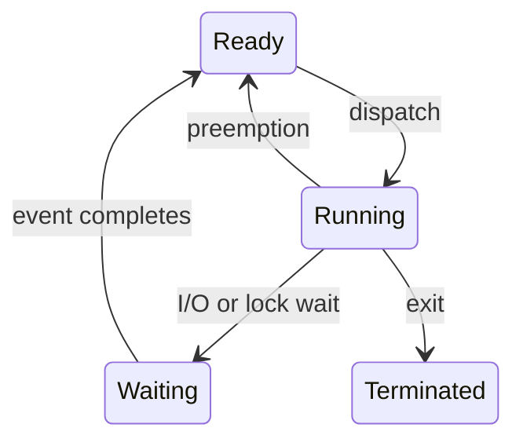

# CPU Scheduling

CPU 스케줄링은 ready 상태의 프로세스와 스레드 중 누가 다음에 CPU를 사용할지 결정하는 정책이다. 운영체제의 응답성, 처리량, 공정성은 이 결정의 반복으로 만들어진다.

## 문서 범위와 검증 기준

- **범위**: 단일 논리 CPU의 교과서형 작업 모델과 정책 비교에서 시작하며 다중처리기·실시간 스케줄링은 확장 학습 주제입니다. 계산 예제를 실제 OS 구현의 성능 순위로 일반화하지 않습니다.
- **전제**: 아래 계산 예제는 모든 작업이 동시에 준비되고 CPU burst가 알려져 있으며 I/O·context switch·cache·NUMA 비용이 없는 비선점 단일 CPU 모델입니다. RM·EDF를 확장 학습할 때는 주기, deadline, 선점과 blocking 조건을 별도로 명시해야 합니다.
- **근거 상태와 환경**: 실제 OS 정책은 대상 커널/제품 버전의 공식 문서와 trace로 확인합니다. 측정 환경 없는 지연·처리량 값은 SLA가 아니며 이 노트는 고정 성능 개선율을 제시하지 않습니다.
- **실패/재시도**: 시뮬레이션은 잘못된 입력, 빈 ready queue, deadline miss와 과부하를 명시적 상태로 기록합니다. 실패한 태스크를 무한 재실행하지 말고 재시도 한도·취소·격리 정책을 둡니다.
- **완료 증거**: 비교 결과에는 workload, 도착/burst/deadline, quantum, CPU 수, 선점·오버헤드 모델, OS/커널 버전, 반복 횟수와 원시 trace를 남깁니다. 평균값뿐 아니라 starvation과 deadline miss가 없는지 확인해야 완료입니다.

## 1. 왜 필요한가? (Pain Point & Motivation)

CPU는 한 순간에 제한된 실행 흐름만 처리할 수 있다. 그런데 시스템에는 대화형 프로그램, 배치 작업, I/O 대기 작업, 실시간 작업이 동시에 존재한다.

스케줄링 정책이 나쁘면 CPU는 놀고 있는데 사용자는 느리다고 느끼거나, 짧은 작업이 긴 작업 뒤에서 오래 기다리거나, 우선순위가 낮은 작업이 영원히 실행되지 못한다. 스케줄링은 "누가 먼저 실행되는가"의 문제가 아니라 "시스템이 어떤 성격의 일을 잘 처리하는가"의 문제다.

## 2. 현재 나의 상태 (Baseline)

흔한 출발점은 다음과 같다.

- FCFS, SJF, RR 같은 이름은 알지만 언제 유리한지 구분하지 못한다.
- waiting time, turnaround time, response time을 헷갈린다.
- 선점형과 비선점형의 차이를 timer interrupt와 연결하지 못한다.
- Round Robin의 time quantum을 작게 잡으면 항상 좋다고 생각한다.
- MLFQ를 단순한 여러 큐 목록으로만 이해한다.

## 3. 도달하고 싶은 목표 (Target State)

목표는 workload와 정책을 함께 보는 것이다.

- CPU burst와 I/O burst가 번갈아 나타나는 실행 모델을 설명한다.
- 스케줄링 지표를 계산하고 trade-off를 해석한다.
- FCFS, SJF, SRTF, Priority, RR, MLFQ의 장단점을 비교한다.
- 선점형 정책이 응답성을 높이는 대신 context switch 비용을 만든다는 점을 설명한다.
- starvation과 aging의 관계를 설명한다.
- 실시간 스케줄링에서 deadline과 priority가 왜 중요한지 이해한다.

## 4. 시스템 번역 (Data Flow)

스케줄링 흐름은 다음과 같다.

```text
running process blocks, exits, or is preempted
  -> kernel saves CPU context
  -> scheduler inspects ready queue
  -> policy selects next runnable task
  -> dispatcher restores selected task context
  -> selected task enters running state
```

스케줄러는 주로 다음 사건에서 호출된다.

- running 프로세스가 I/O를 요청해 waiting으로 이동할 때.
- waiting 프로세스가 I/O 완료로 ready가 될 때.
- timer interrupt가 현재 실행을 선점할 때.
- 프로세스가 종료될 때.
- 더 높은 우선순위 작업이 ready가 될 때.

## 5. 핵심 구성요소 (Building Blocks)

- CPU burst: 프로세스가 CPU를 연속으로 사용하는 구간.
- I/O burst: 디스크, 네트워크, lock 등 외부 사건을 기다리는 구간.
- Ready queue: 실행 가능하지만 CPU를 기다리는 작업 목록.
- Scheduler: ready queue에서 다음 실행 대상을 선택하는 정책.
- Dispatcher: 선택된 작업의 context를 복원하고 사용자 모드로 넘기는 실행 장치.
- Context switch: CPU 레지스터와 커널 상태를 저장하고 다른 작업 상태를 복원하는 비용.
- Time quantum: Round Robin에서 한 번에 실행할 수 있는 최대 시간 조각.
- Aging: 오래 기다린 작업의 우선순위를 올려 starvation을 줄이는 기법.

주요 지표는 다음과 같다.

```text
turnaround time = completion time - arrival time
waiting time = turnaround time - CPU burst time
response time = first run time - arrival time
throughput = completed jobs / elapsed time
CPU utilization = CPU busy time / elapsed time
```

## 6. 상태 전이 (State Transition)

CPU 스케줄링은 프로세스 상태 전이 중 `Ready -> Running`을 결정한다.



정책별 선택 기준은 다음처럼 달라진다.

| 정책 | 선택 기준 | 선점 | 핵심 위험 |
| --- | --- | --- | --- |
| FCFS | 먼저 도착한 작업 | 아니오 | convoy effect |
| SJF | 가장 짧은 CPU burst | 보통 아니오 | 긴 작업 starvation |
| SRTF | 남은 시간이 가장 짧은 작업 | 예 | 예측 비용과 잦은 선점 |
| Priority | 가장 높은 우선순위 | 둘 다 가능 | 낮은 우선순위 starvation |
| Round Robin | 큐 순서와 time quantum | 예 | quantum 설정 민감 |
| MLFQ | 행동에 따라 큐 이동 | 예 | 정책 파라미터 복잡성 |

## 7. 불변식 (Invariant: 절대 깨지면 안 되는 규칙)

- 실행 가능한 작업은 ready queue에서 사라지면 안 된다.
- 한 논리 CPU의 스케줄링 모델에서는 같은 순간 하나의 작업을 실행한다. SMT를 제공하는 물리 core는 여러 논리 CPU를 가질 수 있다.
- context switch는 이전 작업이 나중에 같은 지점에서 이어질 수 있게 저장해야 한다.
- 선점은 커널 자료구조의 일관성을 깨뜨리지 않는 지점에서 처리되어야 한다.
- 실시간 작업은 deadline 위반 가능성을 정책 수준에서 드러내야 한다.
- starvation이 허용되지 않는 시스템은 aging이나 공정성 보정이 있어야 한다.

## 8. 가장 작은 예제 (Minimal Viable Example)

세 작업이 동시에 도착했다고 가정한다.

| Process | Burst |
| --- | ---: |
| P1 | 8 |
| P2 | 4 |
| P3 | 2 |

FCFS 순서가 `P1 -> P2 -> P3`이면 평균 waiting time은 다음과 같다.

```text
P1 waits 0
P2 waits 8
P3 waits 12
average waiting time = (0 + 8 + 12) / 3 = 6.67
```

SJF 순서가 `P3 -> P2 -> P1`이면 평균 waiting time은 다음과 같다.

```text
P3 waits 0
P2 waits 2
P1 waits 6
average waiting time = (0 + 2 + 6) / 3 = 2.67
```

이 유한 동시 도착 예제는 알려진 burst를 오름차순으로 실행하는 SJF의 평균 대기 시간 최소화를 보여준다. starvation은 여기서 발생하지 않으며 짧은 작업이 계속 새로 도착하는 다른 workload에서 긴 작업이 밀릴 수 있다는 별도 위험이다.

## 9. 실패 사례 (What could go wrong?)

- FCFS는 긴 CPU-bound 작업 뒤에 짧은 I/O-bound 작업이 줄줄이 막히는 convoy effect를 만든다.
- 짧은 작업이나 높은 우선순위 작업이 계속 도착하면 SJF/Priority에서 긴 작업·낮은 우선순위 작업이 starvation에 빠질 수 있다.
- Round Robin의 quantum이 너무 작으면 context switch 비중이 커진다.
- Round Robin의 quantum이 너무 크면 FCFS처럼 동작한다.
- MLFQ의 승격 규칙이 약하면 interactive 작업만 유리하고 batch 작업이 굶을 수 있다.
- CPU affinity를 무시하면 cache locality가 깨지고 성능이 흔들릴 수 있다.

## 10. 뇌 확장하기 (Evolution & Variants)

- Linux fair class의 역사적 CFS 모델과 virtual runtime을 학습하고, EEVDF를 도입한 릴리스는 대상 kernel/sched/fair.c와 문서에서 선택·선점 정책을 확인한다.
- real-time scheduling에서 Rate Monotonic과 Earliest Deadline First를 비교한다.
- multi-core 환경에서 per-core run queue와 load balancing의 trade-off를 본다.
- scheduler latency와 context switch count를 시스템 관측 지표와 연결한다.
- user-level thread scheduler와 kernel scheduler가 만날 때 생기는 차이를 비교한다.

## 11. 최종 체크리스트 (Definition of Done)

- [ ] CPU burst와 I/O burst 모델을 설명할 수 있다.
- [ ] waiting, turnaround, response time을 계산할 수 있다.
- [ ] 선점형과 비선점형 정책의 차이를 설명할 수 있다.
- [ ] FCFS, SJF, RR, Priority, MLFQ의 장단점을 비교할 수 있다.
- [ ] convoy effect와 starvation을 예제로 설명할 수 있다.
- [ ] time quantum 변화가 응답성과 overhead에 주는 영향을 설명할 수 있다.

## 12. 뇌에 새기는 복습 문장 (TL;DR Blank)

CPU 스케줄링은 ready queue에서 다음 running 작업을 고르는 정책이며, 좋은 정책은 응답성, 처리량, 공정성, context switch 비용 사이의 균형을 잡는다.
