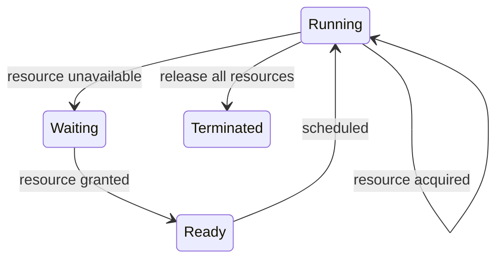

# Deadlocks

교착 상태는 둘 이상의 실행 주체가 서로가 가진 자원을 기다리며 더 이상 진행하지 못하는 상태다. 운영체제에서는 lock, 파일, 장치, 메모리, 트랜잭션 같은 자원 관리에서 반복해서 나타난다.

## 1. 왜 필요한가? (Pain Point & Motivation)

동시성 문제는 데이터가 틀리는 race condition만 있는 것이 아니다. 공유 자원을 보호하려고 lock과 자원 요청 순서를 추가하면, 이번에는 작업이 영원히 진행되지 않는 문제가 생긴다.

교착 상태 분석의 목적은 "누가 멈췄는가"를 찾는 데서 끝나지 않는다. 네 가지 필요 조건 중 어떤 조건을 깨뜨릴지, 예방할지, 회피할지, 탐지 후 복구할지를 설계 단계에서 결정하는 것이다.

## 2. 현재 나의 상태 (Baseline)

흔한 출발점은 다음과 같다.

- deadlock을 단순한 무한 대기라고만 이해한다.
- 네 조건을 외웠지만 실제 코드나 그래프에 적용하지 못한다.
- resource allocation graph와 wait-for graph를 구분하지 못한다.
- unsafe state와 deadlocked state를 같은 말로 생각한다.
- 은행가 알고리즘을 계산 문제로만 외우고 전제 조건을 놓친다.

## 3. 도달하고 싶은 목표 (Target State)

목표는 교착 상태를 조건, 그래프, 정책으로 분석하는 것이다.

- mutual exclusion, hold and wait, no preemption, circular wait를 실제 사례에 적용한다.
- 자원 할당 그래프에서 요청 간선과 할당 간선을 구분한다.
- 단일 인스턴스 자원에서는 wait-for graph cycle이 교착 상태를 의미함을 안다.
- 여러 인스턴스 자원에서는 cycle이 가능성이지 항상 확정은 아님을 안다.
- prevention, avoidance, detection and recovery의 비용을 비교한다.
- safe sequence가 무엇인지 설명한다.

## 4. 시스템 번역 (Data Flow)

교착 상태 분석 흐름은 다음과 같다.

```text
process requests resource
  -> resource manager checks availability
  -> if unavailable, process waits
  -> wait relation is added
  -> cycle may appear in wait graph
  -> policy prevents, avoids, detects, or ignores the cycle
```

자원 사용의 일반 흐름은 다음과 같다.

```text
request
  -> acquire
  -> use
  -> release
```

문제는 `acquire` 이후 다른 자원을 기다리는 동안 첫 번째 자원을 계속 들고 있을 때 커진다.

## 5. 핵심 구성요소 (Building Blocks)

- Mutual exclusion: 한 번에 하나의 프로세스만 사용할 수 있는 자원이 있다.
- Hold and wait: 이미 자원을 가진 프로세스가 다른 자원을 추가로 기다린다.
- No preemption: 운영체제가 해당 자원을 강제로 빼앗을 수 없다.
- Circular wait: 프로세스들이 원형으로 서로의 자원을 기다린다.
- Resource allocation graph: 프로세스, 자원, 요청 간선, 할당 간선을 표현한 그래프.
- Wait-for graph: 자원 노드를 제거하고 "프로세스가 프로세스를 기다림"만 남긴 그래프.
- Safe state: 모든 프로세스를 완료시킬 수 있는 순서가 존재하는 상태.
- Banker's algorithm: 최대 요구량을 알고 있을 때 요청 승인 후에도 안전 상태인지 검사하는 회피 기법.

## 6. 상태 전이 (State Transition)

자원 요청 관점의 상태 전이는 다음과 같다.



교착 상태는 `Waiting`에 있는 프로세스들이 서로의 release를 기다리는 cycle을 만들 때 발생한다.

```text
P1 holds R1 and waits R2
P2 holds R2 and waits R1
P1 cannot continue
P2 cannot continue
```

## 7. 불변식 (Invariant: 절대 깨지면 안 되는 규칙)

- lock이나 자원 요청 순서는 시스템 전체에서 일관되어야 한다.
- 자원 관리자는 대기 관계를 관찰하거나, 설계상 cycle이 생기지 않게 제한해야 한다.
- 교착 상태 회피 알고리즘은 최대 자원 요구량을 신뢰할 수 있을 때만 의미가 있다.
- 복구 정책은 어떤 프로세스를 중단할지와 손실 보상 방식을 정의해야 한다.
- timeout은 교착 상태 증명이 아니라 증상 완화임을 구분해야 한다.
- unsafe state는 교착 상태가 아니라 교착 상태로 갈 수 있는 상태다.

## 8. 가장 작은 예제 (Minimal Viable Example)

두 mutex를 서로 다른 순서로 잡으면 cycle이 생긴다.

```c
void thread_a(void) {
    lock(A);
    lock(B);
    unlock(B);
    unlock(A);
}

void thread_b(void) {
    lock(B);
    lock(A);
    unlock(A);
    unlock(B);
}
```

해결책은 전역 순서를 정하고 모든 코드가 같은 순서로 lock을 잡는 것이다.

```text
allowed order: A before B
thread_a: lock A, then B
thread_b: lock A, then B
```

## 9. 실패 사례 (What could go wrong?)

- lock 순서가 일부 코드 경로에서만 뒤집혀도 드문 교착 상태가 생긴다.
- 자원 회피 정책은 최대 요구량을 모르면 적용하기 어렵다.
- 탐지 주기가 너무 길면 시스템이 오래 멈춰 있고, 너무 짧으면 검사 비용이 커진다.
- 복구를 위해 프로세스를 강제 종료하면 트랜잭션, 파일, 외부 시스템 상태가 중간에 남을 수 있다.
- 여러 인스턴스 자원에서 cycle만 보고 교착 상태라고 단정하면 오탐이 생길 수 있다.
- timeout 기반 재시도는 livelock이나 부하 폭증을 만들 수 있다.

## 10. 뇌 확장하기 (Evolution & Variants)

- 은행가 알고리즘의 `Available`, `Max`, `Allocation`, `Need` 행렬을 손으로 계산해 본다.
- 데이터베이스의 row lock과 트랜잭션 deadlock detector를 운영체제 자원 그래프와 비교한다.
- 분산 시스템에서 지연된 메시지가 phantom deadlock을 만들 수 있는 이유를 살펴본다.
- lock hierarchy, try-lock, timeout, two-phase locking의 trade-off를 비교한다.
- deadlock, starvation, livelock을 진행 가능성 관점에서 구분한다.

## 11. 최종 체크리스트 (Definition of Done)

- [ ] 교착 상태의 네 조건을 실제 사례에 적용할 수 있다.
- [ ] resource allocation graph에서 요청 간선과 할당 간선을 구분할 수 있다.
- [ ] 단일 인스턴스 자원에서 cycle의 의미를 설명할 수 있다.
- [ ] prevention, avoidance, detection and recovery를 비교할 수 있다.
- [ ] safe state와 unsafe state를 구분할 수 있다.
- [ ] lock 순서 정책으로 circular wait를 끊는 방법을 설명할 수 있다.

## 12. 뇌에 새기는 복습 문장 (TL;DR Blank)

교착 상태는 네 조건이 동시에 성립할 때 생기며, 해결 전략은 조건을 미리 깨뜨리거나 안전 상태만 허용하거나 발생 후 탐지하고 복구하는 것이다.
