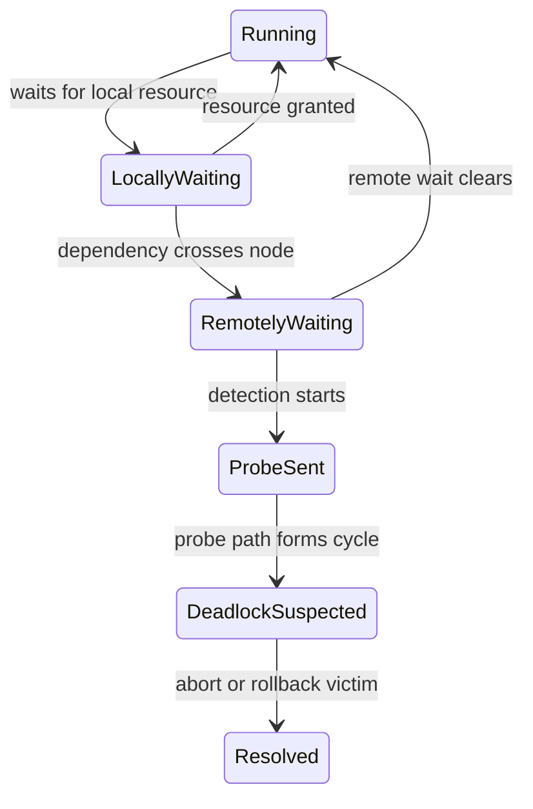

# Distributed Deadlocks

분산 교착 상태는 여러 노드에 흩어진 프로세스나 트랜잭션이 서로의 자원을 기다리며 전체 진행이 멈추는 상태다. 단일 머신과 달리 전역 상태를 즉시 알 수 없기 때문에 탐지 자체가 어려워진다.

## 1. 왜 필요한가? (Pain Point & Motivation)

단일 운영체제 안에서는 커널이 자원 대기 관계를 한곳에서 관찰할 수 있다. 분산 시스템에서는 각 노드가 자기 일부 상태만 알고, 메시지는 지연되며, 이미 해소된 대기 관계가 늦게 도착할 수 있다.

그래서 분산 교착 상태는 "cycle이 있는가"뿐 아니라 "그 cycle이 지금도 실제로 존재하는가"를 따져야 한다. 잘못 탐지하면 정상 트랜잭션을 중단시키는 phantom deadlock이 생긴다.

## 2. 현재 나의 상태 (Baseline)

흔한 출발점은 다음과 같다.

- 단일 머신 deadlock detector를 그대로 분산 시스템에 쓰면 된다고 생각한다.
- wait-for graph를 전역으로 항상 정확히 만들 수 있다고 가정한다.
- edge chasing을 단순한 그래프 순회로만 이해한다.
- phantom deadlock이 왜 생기는지 설명하지 못한다.
- 탐지 후 victim 선택과 rollback 비용을 고려하지 않는다.

## 3. 도달하고 싶은 목표 (Target State)

목표는 분산 대기 관계를 불완전한 관찰 문제로 이해하는 것이다.

- 로컬 WFG와 글로벌 WFG의 차이를 설명한다.
- prevention, avoidance, detection의 분산 환경 비용을 비교한다.
- edge chasing이 전역 그래프를 만들지 않고 cycle을 찾는 방식을 설명한다.
- Chandy-Misra-Haas probe의 `(initiator, sender, receiver)` 의미를 이해한다.
- phantom deadlock과 중복 abort 위험을 설명한다.
- 탐지 이후 victim 선택 기준을 설계 관점에서 말할 수 있다.

## 4. 시스템 번역 (Data Flow)

분산 대기 관계는 다음 흐름으로 생긴다.

```text
transaction T1 on node A holds resource R1
transaction T2 on node B holds resource R2
T1 waits for R2
T2 waits for R1
each node sees only part of the wait relation
detector exchanges messages to infer a cycle
```

edge chasing은 probe 메시지를 대기 간선을 따라 전달한다.

```text
initiator creates probe
probe follows local wait relation
remote wait sends probe to another node
probe returns to initiator
cycle is reported
```

## 5. 핵심 구성요소 (Building Blocks)

- Local wait-for graph: 한 노드가 알고 있는 프로세스나 트랜잭션 대기 관계.
- Global wait-for graph: 모든 노드의 대기 관계를 합친 개념적 그래프.
- Probe: cycle 탐지를 위해 대기 간선을 따라 전달되는 작은 메시지.
- Initiator: 탐지를 시작한 프로세스나 트랜잭션.
- Edge chasing: 전역 그래프를 수집하지 않고 probe를 간선 방향으로 보내 cycle을 찾는 방식.
- Path pushing: 로컬 WFG 정보를 다른 노드로 보내 경로 정보를 확장하는 방식.
- Phantom deadlock: 메시지 지연이나 오래된 상태 때문에 실제로는 없는 교착 상태를 탐지하는 오탐.
- Victim selection: 교착 상태 해소를 위해 중단하거나 rollback할 대상을 고르는 정책.

## 6. 상태 전이 (State Transition)

분산 교착 상태 탐지의 상태 흐름은 다음과 같다.



오탐을 줄이려면 `DeadlockSuspected`에서 바로 중단하지 않고 timestamp, dependency freshness, 중복 탐지 여부를 확인할 수 있다.

## 7. 불변식 (Invariant: 절대 깨지면 안 되는 규칙)

- 탐지 메시지는 어떤 대기 관계를 근거로 만들어졌는지 식별 가능해야 한다.
- 이미 사라진 대기 관계가 새 교착 상태처럼 사용되지 않도록 freshness를 관리해야 한다.
- 같은 cycle에 대해 여러 노드가 동시에 victim을 중복 중단하지 않게 조정해야 한다.
- victim rollback은 보유 자원을 실제로 해제해야 한다.
- 분산 탐지 비용은 정상 요청 처리 경로를 압도하면 안 된다.
- 탐지 알고리즘은 메시지 지연과 재전송을 전제로 설계되어야 한다.

## 8. 가장 작은 예제 (Minimal Viable Example)

세 트랜잭션이 세 노드에 흩어져 있다고 가정한다.

```text
Node A: T1 waits for T2
Node B: T2 waits for T3
Node C: T3 waits for T1
```

Chandy-Misra-Haas 스타일 probe는 다음처럼 이동한다.

```text
probe(T1, T1, T2)
probe(T1, T2, T3)
probe(T1, T3, T1)
```

probe가 initiator인 `T1`로 돌아오면 `T1 -> T2 -> T3 -> T1` cycle이 관찰된 것이다.

## 9. 실패 사례 (What could go wrong?)

- probe가 이동하는 동안 대기 관계가 해소되면 phantom deadlock이 탐지될 수 있다.
- 네트워크 지연이 크면 탐지 결과가 실제 상태보다 늦다.
- 여러 initiator가 같은 cycle을 동시에 탐지하면 과도한 abort가 발생할 수 있다.
- victim 선택이 단순 PID 기준이면 큰 작업을 반복적으로 rollback할 수 있다.
- rollback이 외부 side effect를 되돌리지 못하면 시스템 상태가 불일치할 수 있다.
- 탐지 메시지에 epoch이나 timestamp가 없으면 오래된 probe가 새 판단에 섞인다.

## 10. 뇌 확장하기 (Evolution & Variants)

- 중앙 집중형 detector, 계층형 detector, 완전 분산 detector를 비교한다.
- 데이터베이스의 distributed transaction deadlock과 microservice saga의 보상 트랜잭션을 비교한다.
- vector clock이나 logical timestamp가 dependency freshness 판단에 어떻게 쓰일 수 있는지 살펴본다.
- phantom deadlock을 줄이는 확인 단계와 탐지 지연 증가 사이의 trade-off를 분석한다.
- timeout 기반 해소와 그래프 기반 탐지의 장단점을 비교한다.

## 11. 최종 체크리스트 (Definition of Done)

- [ ] 로컬 WFG와 글로벌 WFG의 차이를 설명할 수 있다.
- [ ] 분산 환경에서 전역 상태가 어려운 이유를 설명할 수 있다.
- [ ] edge chasing의 probe 흐름을 예제로 설명할 수 있다.
- [ ] phantom deadlock이 생기는 이유를 말할 수 있다.
- [ ] victim selection 기준을 최소 두 가지 이상 제시할 수 있다.
- [ ] 탐지 비용과 오탐 위험의 trade-off를 설명할 수 있다.

## 12. 뇌에 새기는 복습 문장 (TL;DR Blank)

분산 교착 상태는 전역 대기 그래프를 즉시 알 수 없는 문제이며, edge chasing은 대기 간선을 따라 probe를 보내 cycle을 추론한다.
