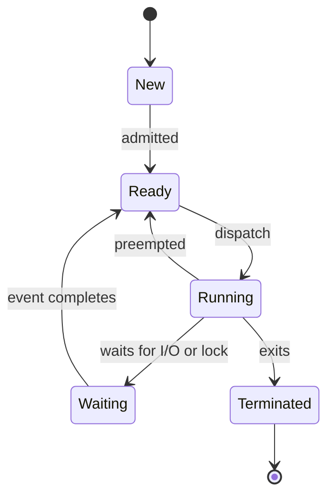

# Operating Systems

운영체제 문서는 프로세스, 스케줄링, 동기화, 교착 상태, 메모리, 가상화처럼 서로 이어지는 개념을 한 번에 외우는 대신 실행 흐름으로 이해하기 위한 학습 지도다.

## 1. 왜 필요한가? (Pain Point & Motivation)

운영체제 개념은 용어를 따로 외우면 금방 흩어진다. CPU 스케줄링은 프로세스 상태와 연결되고, 동기화는 교착 상태와 연결되며, 메모리 관리는 가상화와 연결된다.

이 문서의 목적은 각 주제의 위치를 먼저 잡는 것이다. 어떤 문제가 어떤 운영체제 기능으로 이어지는지 알면 세부 알고리즘을 공부할 때 기준이 생긴다.

## 2. 현재 나의 상태 (Baseline)

학습을 시작할 때 흔한 상태는 다음과 같다.

- `process`, `thread`, `program`의 차이를 말로는 알지만 상태 전이를 그리지 못한다.
- FCFS, SJF, RR 같은 스케줄링 이름은 알지만 평가 지표와 연결하지 못한다.
- mutex, semaphore, monitor를 도구 이름으로만 기억한다.
- deadlock의 네 조건은 외웠지만 실제 자원 대기 그래프에서 찾지 못한다.
- paging, frame, TLB, address translation이 한 흐름으로 정리되지 않았다.

## 3. 도달하고 싶은 목표 (Target State)

목표는 운영체제를 "자원을 안전하게 나누는 상태 기계"로 설명하는 것이다.

- 프로세스가 생성되어 종료될 때까지의 상태 전이를 설명한다.
- CPU 스케줄러가 어떤 기준으로 다음 실행 대상을 고르는지 비교한다.
- 공유 데이터 접근에서 race condition이 생기는 이유와 방지 도구를 구분한다.
- 교착 상태를 조건, 그래프, 대응 전략으로 분석한다.
- 논리 주소가 물리 주소로 바뀌는 과정을 페이지 단위로 계산한다.
- VM과 컨테이너의 격리 경계가 왜 다른지 설명한다.

## 4. 시스템 번역 (Data Flow)

운영체제 학습 흐름은 다음 순서로 잡으면 연결이 쉽다.

```text
프로그램 실행
  -> 프로세스 생성
  -> ready/running/waiting 상태 전이
  -> CPU 스케줄링
  -> 공유 자원 접근
  -> 동기화와 교착 상태 분석
  -> 주소 변환과 메모리 보호
  -> VM/컨테이너 격리 이해
```

## 5. 핵심 구성요소 (Building Blocks)

주요 문서는 다음 순서로 읽는다.

- [Process Management](process.md): 프로세스 생성, 상태, `fork`, `exec`, IPC의 기본 흐름.
- [CPU Scheduling](cpu-scheduling.md): FCFS, SJF, Priority, Round Robin, MLFQ와 평가 지표.
- [Synchronization](synchronization.md): 임계 구역, mutex, semaphore, monitor, 조건 변수.
- [Deadlocks](deadlocks.md): 교착 상태 조건, 자원 할당 그래프, 예방, 회피, 탐지.
- [Distributed Deadlocks](distributed-deadlocks.md): 분산 대기 그래프와 probe 기반 탐지.
- [Memory Management](memory.md): 주소 바인딩, 페이징, 페이지 테이블, TLB, 스와핑.
- [Virtualization](virtualization.md): 하이퍼바이저, VM, 컨테이너 격리 경계.

## 6. 상태 전이 (State Transition)

운영체제의 대표 상태 전이는 프로세스 상태 전이에서 시작한다.



스케줄링은 `Ready -> Running` 전이를 고르는 정책이고, 동기화와 교착 상태는 `Running -> Waiting` 전이가 잘못 묶였을 때의 문제다.

## 7. 불변식 (Invariant: 절대 깨지면 안 되는 규칙)

운영체제 사고에서 지켜야 할 불변식은 다음과 같다.

- 커널은 프로세스가 자기 권한 밖의 메모리와 장치에 직접 접근하지 못하게 해야 한다.
- 스케줄러는 실행 가능한 작업을 잃어버리면 안 된다.
- 동기화 도구는 공유 데이터의 불변식을 깨뜨리는 interleaving을 막아야 한다.
- 자원 관리자는 순환 대기가 시스템 전체 정지로 번지지 않도록 관찰하거나 제한해야 한다.
- 주소 변환은 보호와 성능을 동시에 만족해야 한다.

## 8. 가장 작은 예제 (Minimal Viable Example)

운영체제 개념을 한 예제로 줄이면 다음과 같다.

```text
프로세스 A와 B가 있다.
A는 CPU를 쓰다가 디스크 I/O를 기다린다.
커널은 A를 waiting으로 옮기고 B를 running으로 dispatch한다.
B가 공유 큐에 접근할 때 lock을 잡는다.
A가 돌아와 같은 lock을 요청하면 ready가 아니라 waiting에 머문다.
lock이 해제되면 A는 ready로 돌아간다.
```

이 예제 안에 프로세스 상태, 스케줄링, 동기화, 대기, 자원 관리가 모두 들어 있다.

## 9. 실패 사례 (What could go wrong?)

- time quantum이 너무 크면 대화형 응답성이 나빠진다.
- time quantum이 너무 작으면 context switch 비용이 커진다.
- lock 순서가 통일되지 않으면 교착 상태가 생긴다.
- semaphore 카운트를 잘못 관리하면 wake-up이 사라지거나 과도하게 허용된다.
- 페이지 테이블과 TLB를 이해하지 못하면 메모리 성능 병목을 잘못 진단한다.
- 컨테이너를 VM과 같은 격리 수준으로 착각하면 보안 경계가 약해진다.

## 10. 뇌 확장하기 (Evolution & Variants)

기본 개념을 익힌 뒤에는 다음 방향으로 확장한다.

- Linux CFS, 실시간 스케줄링, CPU affinity를 비교한다.
- mutex와 semaphore를 실제 언어의 런타임 구현과 연결한다.
- page fault, copy-on-write, memory-mapped file을 운영체제 호출과 연결한다.
- VM의 하드웨어 가상화와 컨테이너의 namespace/cgroup 격리를 비교한다.
- 단일 머신 교착 상태와 분산 교착 상태의 관찰 가능성 차이를 비교한다.

## 11. 최종 체크리스트 (Definition of Done)

- [ ] 프로세스 상태 전이를 그림 없이 설명할 수 있다.
- [ ] 스케줄링 알고리즘별 장단점과 지표를 연결할 수 있다.
- [ ] 임계 구역 문제의 세 조건을 설명할 수 있다.
- [ ] 교착 상태의 네 조건을 실제 대기 상황에 적용할 수 있다.
- [ ] 가상 주소를 페이지 번호와 오프셋으로 나눌 수 있다.
- [ ] VM과 컨테이너의 격리 단위를 구분할 수 있다.

## 12. 뇌에 새기는 복습 문장 (TL;DR Blank)

운영체제는 `프로세스`를 상태 전이로 관리하고, `CPU`를 스케줄링하며, `공유 자원`을 동기화하고, `메모리`를 주소 변환으로 보호하는 시스템이다.
