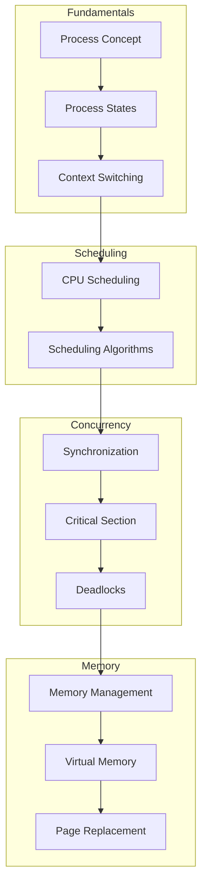
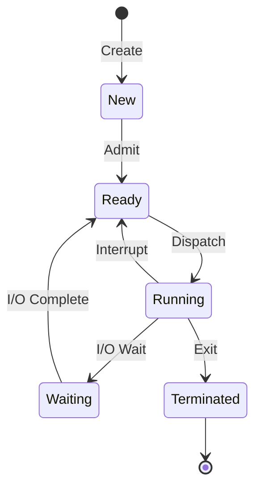

# Operating Systems

> Operating system theory and concepts for computer science studies

## Scope and use

This index links to teaching models, not configuration advice for a specific kernel. Algorithm properties assume the workload stated in each guide; implementation claims and timings require an OS/kernel version, hardware, workload, and trace. A lab is complete only when inputs, assumptions, failure states, commands, and raw results are recorded. Retry failed experiments only after preserving the error and changing one controlled condition.

---

## Topics

<div class="grid cards" markdown>

-   :material-clock-fast:{ .lg .middle } **CPU Scheduling**

    ---

    Process scheduling algorithms: FCFS, SJF, Priority, Round Robin, MLFQ.

    [:octicons-arrow-right-24: View Guide](cpu-scheduling.md)

-   :material-sync:{ .lg .middle } **Synchronization**

    ---

    Mutex, semaphores, monitors, and critical section problems.

    [:octicons-arrow-right-24: View Guide](synchronization.md)

-   :material-lock:{ .lg .middle } **Deadlocks**

    ---

    Deadlock conditions, prevention, avoidance, and detection.

    [:octicons-arrow-right-24: View Guide](deadlocks.md)

-   :material-memory:{ .lg .middle } **Memory Management**

    ---

    Virtual memory, paging, segmentation, and page replacement.

    [:octicons-arrow-right-24: View Guide](memory.md)

-   :material-application-cog:{ .lg .middle } **Process Management**

    ---

    Process creation, fork(), exec(), and inter-process communication.

    [:octicons-arrow-right-24: View Guide](process.md)

-   :material-server-network:{ .lg .middle } **Virtualization**

    ---

    Hypervisor mechanisms and Docker vs VM isolation comparison.

    [:octicons-arrow-right-24: View Guide](virtualization.md)

-   :material-graph:{ .lg .middle } **Distributed Deadlocks**

    ---

    Deadlock handling in distributed systems and Edge Chasing algorithm.

    [:octicons-arrow-right-24: View Guide](distributed-deadlocks.md)

</div>

---

## Learning Path



---

## Key Concepts

### Process States



### Scheduling Algorithms Comparison

| Algorithm | Preemptive | Starvation | Best For |
|-----------|------------|------------|----------|
| **FCFS** | No | Possible with an unbounded/unstable arrival model | Simple arrival-ordered workloads |
| **SJF / SRTF** | SJF: No; SRTF: Yes | Yes, without aging/admission bounds | Workloads with known or estimated bursts |
| **Priority** | Policy-dependent | Yes, without aging or reservation | Explicit service classes; not sufficient alone for real-time guarantees |
| **Round Robin** | Yes | Avoided only under finite runnable set, positive quantum, and equal service class | Time-sharing |
| **MLFQ** | Yes | Possible without periodic boost or allocation bounds | Adaptive general-purpose scheduling |

### Deadlock Conditions

For the classic reusable, non-preemptible resource model, all four Coffman conditions are necessary for deadlock:

1. **Mutual Exclusion** - Resource held exclusively
2. **Hold and Wait** - Process holding while waiting
3. **No Preemption** - Cannot forcibly remove
4. **Circular Wait** - Circular chain of processes

---

## Quick Formulas

These formulas use the simplified single-CPU examples in the guides. Waiting time equals turnaround minus CPU burst only when omitted I/O/service intervals and overhead are handled consistently. Address formulas assume integer page/frame numbering and the stated page size.

### CPU Scheduling

```
Turnaround Time = Completion Time - Arrival Time
Waiting Time = Turnaround Time - Burst Time
Response Time = First Response - Arrival Time
Throughput = Number of Processes / Total Time
CPU Utilization = (CPU Busy Time / Total Time) × 100%
```

### Memory Management

```
Page Number = Virtual Address / Page Size
Page Offset = Virtual Address % Page Size
Physical Address = (Frame Number × Page Size) + Offset
```

---

## Related Documentation

- [Linux Process Management](../infrastructure/monitoring/process-management.md)
- [Compiler Theory](../compiler/index.md)
