# Main Memory

메모리 관리는 프로세스가 자기만의 연속된 주소 공간을 가진 것처럼 보이게 하면서, 실제 물리 메모리를 안전하고 효율적으로 나누는 운영체제 기능이다.

## 문서 범위와 검증 기준

- **범위**: 연속 할당, 단순 paging과 swapping을 설명하는 교과서형 모델입니다. 실제 x86-64/ARM MMU, Linux page reclaim, NUMA, huge page와 보안 완화의 전체 구현을 대신하지 않습니다.
- **전제**: 주소·TLB 계산은 문제에 명시된 주소 폭, page/PTE 크기, page-walk 횟수와 cache 미적중 모델을 사용합니다. 의사 코드는 kernel code가 아니며 race, overflow와 오류 처리가 생략될 수 있습니다.
- **근거 상태와 환경**: page table 형식, canonical virtual-address 폭, TLB와 swap 정책은 CPU·OS·커널 버전별 공식 문서로 확인합니다. ns, MB/s, hit ratio와 임계값은 예제 입력이지 현대 시스템의 기본값이 아닙니다.
- **실패/재시도**: page fault, allocation 실패, swap I/O 오류와 OOM은 구분해 기록합니다. 재시도는 회수 가능한 page가 생길 조건과 상한을 두고, 무한 reclaim/thrashing은 실패 상태로 전환합니다.
- **완료 증거**: 계산에는 bit 분할과 단위를, 실험에는 CPU/커널, page size, NUMA·huge-page 설정, workload와 page-fault/TLB/swap trace를 남깁니다. 보호는 허용 접근과 거부 접근을 모두 관측해야 완료입니다.

## 1. 왜 필요한가? (Pain Point & Motivation)

여러 프로세스가 동시에 실행되면 모두 메모리를 필요로 한다. 각 프로세스가 실제 물리 주소를 직접 다루면 서로의 데이터를 덮어쓰거나 커널 영역을 침범할 수 있다.

운영체제와 하드웨어는 논리 주소를 물리 주소로 변환하고, 접근 권한을 검사하고, 부족한 메모리를 디스크와 조합한다. 이 흐름을 이해해야 page fault, swap, TLB miss, copy-on-write 같은 현상을 정확히 해석할 수 있다.

## 2. 현재 나의 상태 (Baseline)

흔한 출발점은 다음과 같다.

- 가상 주소와 물리 주소를 구분하지 못한다.
- paging이 외부 단편화를 줄이는 이유를 설명하지 못한다.
- page와 frame을 같은 말처럼 사용한다.
- TLB가 왜 필요한지 단순 캐시라는 말 이상으로 설명하지 못한다.
- swapping과 paging, page fault를 한 흐름으로 연결하지 못한다.

## 3. 도달하고 싶은 목표 (Target State)

목표는 주소 변환을 계산 가능한 흐름으로 이해하는 것이다.

- 논리 주소, 가상 주소, 물리 주소를 구분한다.
- MMU가 페이지 테이블과 TLB를 이용해 주소를 변환하는 과정을 설명한다.
- page number와 offset을 계산할 수 있다.
- 내부 단편화와 외부 단편화의 차이를 설명한다.
- 다단계 페이지 테이블이 필요한 이유를 이해한다.
- page fault와 swap이 성능에 주는 영향을 설명한다.

## 4. 시스템 번역 (Data Flow)

메모리 접근은 다음 흐름으로 번역된다.

```text
CPU generates virtual address
  -> MMU splits page number and offset
  -> TLB lookup
  -> if TLB hit, frame number is found
  -> if TLB miss, page table is consulted
  -> permission bits are checked
  -> physical address is formed
  -> memory is accessed
```

매핑은 유효하지만 page가 아직 resident하지 않은 demand fault라면 다음과 같이 처리할 수 있다. invalid mapping·접근 권한 위반은 별도 오류이고 모든 fault가 disk I/O로 이어지지는 않는다.

```text
page table entry says not present
  -> page fault trap and mapping/permission validation
  -> kernel chooses free frame or victim frame
  -> page is loaded from disk if needed
  -> page table and TLB are updated
  -> faulting instruction restarts
```

## 5. 핵심 구성요소 (Building Blocks)

- Logical address: 프로그램이 생성하는 주소.
- Virtual address: 논리 주소와 거의 같은 의미로 쓰이며, 프로세스별 주소 공간 안의 주소.
- Physical address: 실제 메모리 하드웨어의 주소.
- MMU: 가상 주소를 물리 주소로 변환하고 권한을 검사하는 하드웨어 장치.
- Page: 가상 주소 공간을 나눈 고정 크기 블록.
- Frame: 물리 메모리를 page와 같은 크기로 나눈 블록.
- Page table: page number를 frame number와 권한 정보로 매핑하는 테이블.
- TLB: 최근 주소 변환 결과를 저장하는 고속 캐시.
- Internal fragmentation: 할당된 블록 내부에서 남는 공간.
- External fragmentation: 총 여유 공간은 충분하지만 연속 공간이 부족한 상태.
- Swap: 메모리 압박 시 일부 내용을 보조 저장소로 밀어내는 방식.

## 6. 상태 전이 (State Transition)

페이지 접근 상태는 다음처럼 전이된다.

```mermaid
stateDiagram-v2
    Access --> TLBHit: translation cached
    Access --> TLBMiss: translation absent
    TLBMiss --> PageTableHit: page present
    PageTableHit --> CheckRights: cache translation
    TLBHit --> CheckRights
    CheckRights --> AccessMemory: access permitted
    CheckRights --> PageFault: protection fault
    TLBMiss --> PageFault: page not present
    PageFault --> ValidateFault
    ValidateFault --> AccessDenied: invalid mapping or denied access
    ValidateFault --> LoadPage: valid demand/COW fault
    LoadPage --> Access: mapping updated; retry instruction
    LoadPage --> RecoveryFailed: allocation or I/O failure
```



보존해야 할 dirty victim page를 reclaim하려면 적합한 file·swap backing에 반영해야 한다. clean file-backed page는 버린 뒤 다시 읽을 수 있고 익명 page의 swap·압축 정책과 allocation/I/O 실패 처리는 커널 구성에 따라 다르다.

## 7. 불변식 (Invariant: 절대 깨지면 안 되는 규칙)

- MMU 권한과 OS page-table 관리는 user process의 허용되지 않은 접근을 제한해야 한다. 공유 mapping, DMA/IOMMU와 hardware/kernel 결함까지 포함한 완전한 격리를 이 장치 하나로 보장하지는 않는다.
- page table entry의 권한 비트는 실제 접근 권한과 일치해야 한다.
- page와 frame 크기는 주소 변환 계산에서 동일해야 한다.
- TLB entry는 page table 변경 후 stale 상태로 남으면 안 된다.
- 이후에도 내용을 보존해야 하는 dirty page는 reclaim 전에 backing file/swap 등에 반영한다. 매핑 폐기·프로세스 종료로 더 이상 필요 없는 내용은 별도 조건이다.
- copy-on-write에서는 쓰기 결과가 다른 private mapping에 보이지 않아야 한다. 실제 복사는 공유 상태에 따라 필요하며 이미 독점된 page는 안전하게 재사용할 수 있다.

## 8. 가장 작은 예제 (Minimal Viable Example)

page size가 4 KiB이고 가상 주소가 `0x12345`라고 하자.

```text
page size = 4096 = 0x1000
virtual address = 0x12345
page number = 0x12
offset = 0x345
```

페이지 테이블이 `page 0x12 -> frame 0xAB`를 가리키면 물리 주소는 다음과 같다.

```text
physical address = frame base + offset
physical address = 0xAB000 + 0x345
physical address = 0xAB345
```

권한 비트가 읽기만 허용하는데 쓰기 접근이면 MMU는 보호 fault를 발생시킨다.

## 9. 실패 사례 (What could go wrong?)

- TLB miss가 많으면 메모리 접근 비용이 크게 증가한다.
- page fault가 디스크 I/O로 이어지면 CPU 계산보다 훨씬 느려진다.
- working set보다 메모리가 작으면 thrashing이 발생한다.
- 페이지 크기가 너무 크면 내부 단편화가 커질 수 있다.
- 페이지 크기가 너무 작으면 page table 크기와 TLB pressure가 커질 수 있다.
- 공유 페이지의 권한을 잘못 설정하면 프로세스 간 격리가 깨질 수 있다.

## 10. 뇌 확장하기 (Evolution & Variants)

- 다단계 페이지 테이블과 inverted page table이 page table 크기 문제를 어떻게 줄이는지 비교한다.
- demand paging, prefetching, page replacement algorithm을 함께 살펴본다.
- copy-on-write가 `fork()`와 메모리 절약에 어떻게 연결되는지 프로세스 문서와 연결한다.
- memory-mapped file이 파일 I/O와 메모리 접근을 연결하는 방식을 확인한다.
- NUMA 환경에서 메모리 위치가 성능에 주는 영향을 살펴본다.

## 11. 최종 체크리스트 (Definition of Done)

- [ ] 가상 주소와 물리 주소의 차이를 설명할 수 있다.
- [ ] page number와 offset을 계산할 수 있다.
- [ ] page와 frame의 차이를 설명할 수 있다.
- [ ] TLB hit와 miss의 흐름을 설명할 수 있다.
- [ ] page fault가 발생했을 때 커널이 하는 일을 설명할 수 있다.
- [ ] 내부 단편화와 외부 단편화를 구분할 수 있다.

## 12. 뇌에 새기는 복습 문장 (TL;DR Blank)

메모리 관리는 가상 주소를 물리 주소로 안전하게 변환하고, page와 frame을 통해 보호와 효율을 동시에 얻는 시스템이다.
