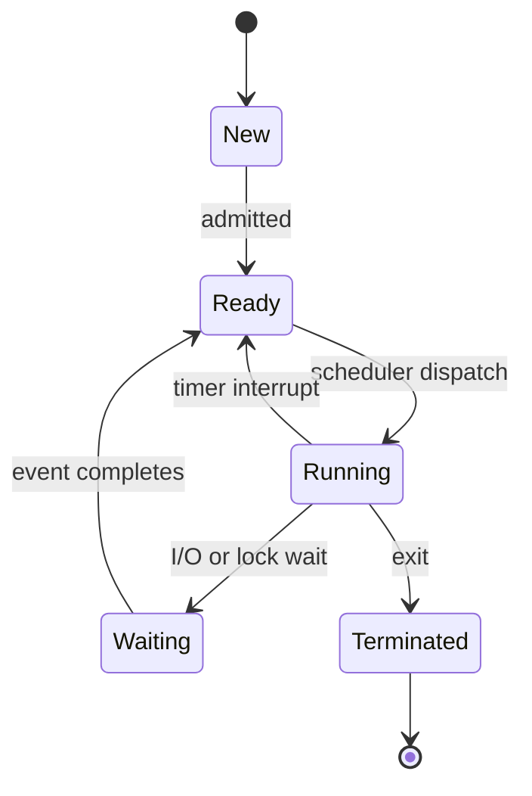

# Process Management

프로세스 관리는 실행 중인 프로그램을 운영체제가 어떤 단위로 만들고, 멈추고, 다시 실행하고, 종료시키는지 설명하는 운영체제의 출발점이다.

## 1. 왜 필요한가? (Pain Point & Motivation)

프로그램 파일은 디스크에 있는 정적인 데이터다. 사용자가 실행하는 순간 운영체제는 주소 공간, 열린 파일, 레지스터 상태, 권한, 스케줄링 정보를 가진 프로세스를 만든다.

프로세스를 이해하지 못하면 CPU 스케줄링, 시그널, IPC, `fork`, `exec`, 컨테이너 격리를 모두 따로 외우게 된다. 핵심은 "실행 중인 작업의 상태를 커널이 기록하고 전이시킨다"는 점이다.

## 2. 현재 나의 상태 (Baseline)

흔한 출발점은 다음과 같다.

- 프로세스와 프로그램을 같은 말처럼 사용한다.
- `fork()`가 프로그램을 처음부터 다시 실행한다고 착각한다.
- 부모와 자식 프로세스의 가상 주소가 같아 보이는 이유를 설명하지 못한다.
- `exec()`가 새 프로세스를 만든다고 오해한다.
- wait, zombie, orphan 프로세스의 차이를 상태 전이로 설명하지 못한다.

## 3. 도달하고 싶은 목표 (Target State)

목표는 프로세스를 커널이 관리하는 실행 컨텍스트로 설명하는 것이다.

- PCB(Process Control Block)에 들어가는 정보를 말할 수 있다.
- `new`, `ready`, `running`, `waiting`, `terminated` 상태 전이를 설명한다.
- `fork()` 이후 부모와 자식이 같은 지점부터 실행되는 이유를 이해한다.
- copy-on-write가 실제 메모리 복사를 늦추는 최적화임을 설명한다.
- `fork`와 `exec`의 역할을 분리해서 설명한다.
- 부모가 `wait`하지 않을 때 zombie가 생기는 이유를 안다.

## 4. 시스템 번역 (Data Flow)

프로그램 실행은 다음 흐름으로 번역된다.

```text
executable file
  -> loader
  -> process address space
  -> PCB 등록
  -> ready queue
  -> scheduler dispatch
  -> CPU에서 실행
  -> I/O, signal, exit, wait에 따라 상태 전이
```

`fork()`가 들어가면 흐름은 한 번 갈라진다.

```text
parent running
  -> fork system call
  -> child PCB 생성
  -> 부모 주소 공간을 copy-on-write로 공유
  -> parent는 child pid를 받음
  -> child는 0을 받음
  -> 둘 다 fork 다음 명령부터 실행
```

## 5. 핵심 구성요소 (Building Blocks)

- Program: 실행 가능한 파일과 정적 코드.
- Process: 프로그램 실행 인스턴스. 주소 공간, 레지스터, 열린 파일, 권한, 상태를 가진다.
- PCB: 커널이 프로세스를 추적하기 위해 보관하는 구조. PID, 상태, PC, 레지스터, 스케줄링 정보, 파일 정보 등을 담는다.
- Address Space: code, data, heap, stack, memory mapping으로 구성되는 가상 메모리 공간.
- System Call: 프로세스가 커널 기능을 요청하는 경계.
- `fork`: 현재 프로세스와 거의 같은 자식 프로세스를 만든다.
- `exec`: 현재 프로세스의 주소 공간을 새 프로그램 이미지로 교체한다.
- `wait`: 부모가 자식의 종료 상태를 수거한다.

## 6. 상태 전이 (State Transition)

프로세스의 기본 상태 전이는 다음과 같다.



프로세스 생성과 종료에는 부모-자식 관계도 함께 생긴다.

```text
parent forks child
child exits
child becomes zombie until parent waits
parent calls wait
kernel releases child's remaining process table entry
```

## 7. 불변식 (Invariant: 절대 깨지면 안 되는 규칙)

- 각 프로세스는 자기 가상 주소 공간만 직접 접근해야 한다.
- 커널은 runnable 프로세스를 ready queue에서 잃어버리면 안 된다.
- context switch는 이전 프로세스의 레지스터 상태를 복원 가능하게 저장해야 한다.
- `fork()` 이후 부모와 자식의 쓰기 변경은 서로의 주소 공간을 오염시키면 안 된다.
- 종료된 자식의 exit status는 부모가 수거할 때까지 보존되어야 한다.

## 8. 가장 작은 예제 (Minimal Viable Example)

```c
#include <stdio.h>
#include <sys/wait.h>
#include <unistd.h>

int main(void) {
    int value = 5;
    pid_t pid = fork();

    if (pid == 0) {
        value = 10;
        printf("child value=%d\n", value);
        return 0;
    }

    value = 20;
    wait(NULL);
    printf("parent value=%d\n", value);
    return 0;
}
```

이 코드에서 부모와 자식은 `fork()` 다음 줄부터 실행된다. 같은 변수 이름과 같은 가상 주소를 보더라도 쓰기가 발생하면 copy-on-write 때문에 서로 다른 물리 페이지를 보게 된다.

## 9. 실패 사례 (What could go wrong?)

- 부모가 `wait()`하지 않으면 종료된 자식이 zombie로 남을 수 있다.
- `fork()` 직후 양쪽 프로세스가 같은 파일 디스크립터를 공유한다는 점을 놓치면 출력 순서나 파일 위치가 예상과 달라진다.
- `exec()` 뒤에는 이전 주소 공간의 코드와 데이터가 사라진다.
- multi-threaded process에서 `fork()`를 호출하면 자식에는 호출한 스레드만 남기 때문에 lock 상태가 꼬일 수 있다.
- 프로세스 수 제한, 메모리 부족, 권한 제한 때문에 `fork()`는 실패할 수 있다.

## 10. 뇌 확장하기 (Evolution & Variants)

- `fork` + `exec`가 shell의 명령 실행 모델을 어떻게 만드는지 추적한다.
- `posix_spawn`이 어떤 환경에서 `fork` + `exec`보다 유리한지 비교한다.
- copy-on-write와 page fault의 관계를 메모리 관리 문서와 연결한다.
- pipe, socket, shared memory 같은 IPC가 프로세스 격리를 어떻게 우회해 통신을 제공하는지 비교한다.
- 컨테이너가 PID namespace로 프로세스의 관찰 범위를 바꾸는 방식을 가상화 문서와 연결한다.

## 11. 최종 체크리스트 (Definition of Done)

- [ ] 프로그램과 프로세스의 차이를 설명할 수 있다.
- [ ] PCB에 필요한 최소 정보를 말할 수 있다.
- [ ] 프로세스 상태 전이를 예제로 설명할 수 있다.
- [ ] `fork()`의 부모/자식 반환값 차이를 설명할 수 있다.
- [ ] copy-on-write가 언제 실제 복사를 만드는지 설명할 수 있다.
- [ ] zombie 프로세스가 생기는 조건을 설명할 수 있다.

## 12. 뇌에 새기는 복습 문장 (TL;DR Blank)

프로세스는 `실행 중인 프로그램`이 아니라, 커널이 상태와 자원을 기록하며 스케줄링하는 `실행 컨텍스트`다.
