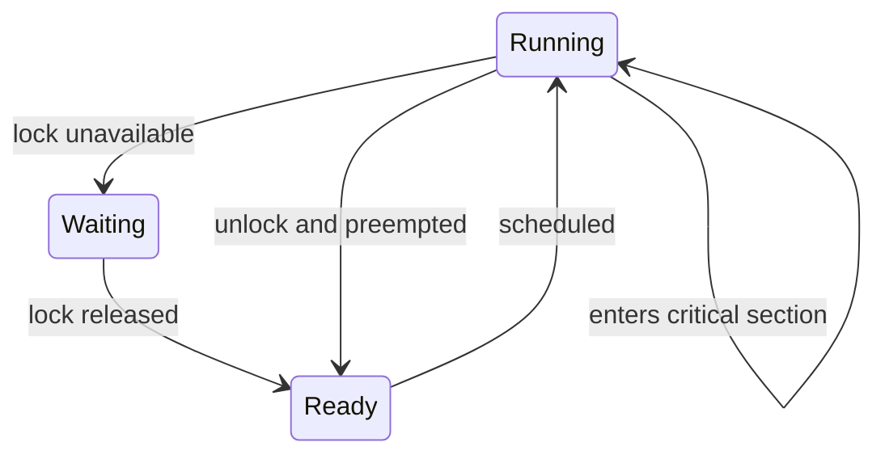

# Synchronization Tools

동기화는 여러 실행 흐름이 같은 데이터나 자원에 접근할 때, 가능한 실행 순서를 제한해 불변식이 깨지지 않도록 만드는 기술이다.

## 문서 범위와 검증 기준

- **범위**: 임계 구역과 mutex/semaphore/monitor를 설명하는 교과서 의사 코드입니다. 표시된 C 함수는 완전한 POSIX 구현이 아니며 원자성·메모리 순서·오류 처리가 생략될 수 있습니다.
- **전제**: Peterson 증명은 두 참여자, sequential consistency와 원자적 load/store 모델을 전제로 합니다. 실제 C/C++의 비원자 공유 접근은 data race이며 단순히 fence 하나를 추가하는 것으로 이식성이 자동 확보되지 않습니다.
- **근거 상태와 환경**: mutex blocking, fairness, condition-variable wakeup과 atomic ordering은 언어·라이브러리·OS 버전의 계약으로 확인합니다. “빠름/짧음”은 고정 기준이 아니며 hold time, contention과 tail latency로 측정합니다.
- **실패/재시도**: lock/condition wait에는 timeout·취소·spurious wakeup·owner failure 정책을 둡니다. 실패 뒤 lock 소유 여부를 확인하지 않은 재시도나 무한 spin은 허용하지 않습니다.
- **완료 증거**: 상호 배제뿐 아니라 progress, bounded waiting 또는 명시한 fairness 수준, 취소·예외 경로의 unlock과 종료를 stress trace/검사로 입증해야 완료입니다.

## 1. 왜 필요한가? (Pain Point & Motivation)

동시 실행은 성능과 응답성을 높이지만, 공유 상태를 잘못 다루면 결과가 실행 순서에 따라 달라진다. 두 스레드가 같은 카운터를 동시에 증가시키면 `read -> add -> write` 단계가 서로 끼어들 수 있고, 최종 값은 예상보다 작아질 수 있다.

동기화는 보호해야 하는 공유 접근 사이에 언어 메모리 모델에 맞는 happens-before·원자성 계약을 세운다. 소스 코드의 순서나 동시에 실행되지 않을 것이라는 기대만으로는 보장되지 않으며 필요한 구간에 적합한 primitive를 선택한다.

## 2. 현재 나의 상태 (Baseline)

흔한 출발점은 다음과 같다.

- race condition을 "가끔 생기는 버그" 정도로만 이해한다.
- mutex와 semaphore를 모두 lock처럼 사용한다.
- critical section 조건인 mutual exclusion, progress, bounded waiting을 구분하지 못한다.
- condition variable을 이벤트 저장소처럼 착각한다.
- deadlock, starvation, livelock을 같은 문제로 본다.

## 3. 도달하고 싶은 목표 (Target State)

목표는 동기화 도구를 보호하려는 불변식에 맞춰 선택하는 것이다.

- race condition이 생기는 interleaving을 단계별로 설명한다.
- 임계 구역 문제의 세 조건을 설명한다.
- mutex, spinlock, semaphore, monitor, condition variable의 용도를 구분한다.
- busy waiting과 blocking의 trade-off를 이해한다.
- lock 순서, hold time, wake-up 조건을 점검할 수 있다.
- 동기화가 교착 상태와 성능 병목을 만들 수 있음을 함께 고려한다.

## 4. 시스템 번역 (Data Flow)

공유 데이터 접근은 다음 흐름으로 번역된다.

```text
thread wants shared state
  -> acquire synchronization primitive
  -> enter critical section
  -> read and update shared state
  -> preserve invariant
  -> release primitive
  -> wake waiting threads if needed
```

condition variable은 별도 흐름을 가진다.

```text
lock mutex
while condition is false:
  wait atomically releases mutex and begins waiting
  before returning, wait reacquires mutex
condition is true
modify shared state
unlock mutex
```

## 5. 핵심 구성요소 (Building Blocks)

- Race condition: 실행 순서에 따라 결과가 달라지는 상태.
- Critical section: 공유 상태의 불변식을 깨뜨릴 수 있는 코드 구간.
- Mutex: 소유권이 있는 상호 배제 도구. 구현별 user-space fast path, adaptive spin과 kernel blocking을 조합할 수 있으며 fairness는 별도 계약이다.
- Spinlock: lock을 얻을 때까지 CPU를 쓰며 반복 확인하는 lock.
- Semaphore: 정수 카운터로 사용 가능한 자원 수나 이벤트 순서를 표현하는 도구.
- Binary semaphore: 값이 0 또는 1인 semaphore. mutex처럼 쓸 수 있지만 소유권 의미가 다르다.
- Monitor: 공유 데이터와 해당 데이터를 다루는 동기화 절차를 묶은 추상화.
- Condition variable: 특정 조건이 참이 될 때까지 mutex와 함께 기다리는 도구.
- Atomic operation: 대상 언어 계약에서 다른 실행 흐름이 중간 상태를 관찰하지 않는 조작. 다른 메모리 접근의 가시성·순서는 선택한 memory order가 결정하며 전체 실행 중 interrupt가 금지된다는 뜻은 아니다.

## 6. 상태 전이 (State Transition)

아래는 mutex 경합 시 blocking을 사용하는 경로의 상태 예시다. 실제 구현은 먼저 spin할 수도 있고 wakeup이 즉시 소유권 획득을 보장하지 않는다.



condition variable은 "조건 검사"와 "대기"가 원자적으로 연결되어야 한다.

```text
mutex locked
condition false
wait releases mutex and sleeps
another thread changes state
another thread signals
waiter wakes and reacquires mutex
condition checked again
```

## 7. 불변식 (Invariant: 절대 깨지면 안 되는 규칙)

- 공유 상태를 읽고 쓰는 임계 구역은 같은 규칙으로 보호되어야 한다.
- lock을 잡은 뒤에는 모든 경로에서 해제되어야 한다.
- condition variable 대기는 `if`가 아니라 조건을 다시 확인하는 반복문으로 감싸야 한다.
- semaphore의 카운트는 실제 자원 수나 허용 가능한 진행 수와 일치해야 한다.
- 여러 lock을 잡아야 한다면 전역 lock 순서를 지켜야 한다.
- 임계 구역 안에서 오래 걸리는 I/O나 외부 호출을 최소화해야 한다.

## 8. 가장 작은 예제 (Minimal Viable Example)

다음은 read/add/write로 추상화한 lost-update interleaving이다. 일반 C/C++ 비원자 count를 실제로 동시에 수정하면 data race로 undefined behavior가 되므로 결과가 단지 1이 된다고 제한할 수 없다.

```text
Thread A reads count = 0
Thread B reads count = 0
Thread A writes count = 1
Thread B writes count = 1
expected count = 2
actual count = 1
```

mutex로 보호한 흐름:

```c
pthread_mutex_lock(&lock);
count = count + 1;
pthread_mutex_unlock(&lock);
```

핵심은 count 증가가 사용하는 언어·타입·연산의 계약에서 원자적으로 보장되는지다. count = count + 1은 일반 C 공유 정수에 대해 원자성을 보장하지 않으며 기계 명령 개수만으로 판단할 수 없다. 위 pthread 조각은 성공한 lock과 모든 접근의 같은 mutex 사용을 전제로 한다.

## 9. 실패 사례 (What could go wrong?)

- lock을 해제하지 않는 경로가 있으면 모든 대기자가 멈춘다.
- 서로 다른 순서로 여러 lock을 잡으면 교착 상태가 생긴다.
- spinlock을 긴 작업에 사용하면 CPU를 낭비한다.
- semaphore를 mutex처럼 쓰면서 소유권을 추적하지 않으면 release 주체가 흐려진다.
- condition variable을 신호 저장소로 착각하면 lost wake-up이나 spurious wake-up에 취약하다.
- 임계 구역이 너무 넓으면 병렬성이 사라지고 latency가 커진다.

## 10. 뇌 확장하기 (Evolution & Variants)

- Peterson 알고리즘을 통해 상호 배제 조건을 증명해 본 뒤 현대 CPU memory ordering 한계를 확인한다.
- compare-and-swap, test-and-set, fetch-and-add 같은 atomic instruction을 lock 구현과 연결한다.
- readers-writers lock, barrier, latch, countdown event 같은 고수준 동기화 도구를 비교한다.
- producer-consumer, dining philosophers, readers-writers 문제를 같은 불변식 관점으로 다시 푼다.
- lock-free 구조가 "lock이 없다"와 "대기가 없다"를 항상 의미하지 않는다는 점을 비교한다.

## 11. 최종 체크리스트 (Definition of Done)

- [ ] race condition을 interleaving으로 설명할 수 있다.
- [ ] 임계 구역 문제의 세 조건을 설명할 수 있다.
- [ ] mutex와 semaphore의 의미 차이를 설명할 수 있다.
- [ ] condition variable을 mutex와 함께 써야 하는 이유를 설명할 수 있다.
- [ ] deadlock을 만드는 lock 순서 위반을 찾을 수 있다.
- [ ] 임계 구역을 줄여야 하는 이유를 성능 관점에서 말할 수 있다.

## 12. 뇌에 새기는 복습 문장 (TL;DR Blank)

동기화는 공유 상태를 보호하는 규칙이며, 좋은 동기화는 필요한 실행 순서만 제한해서 정확성과 병렬성을 함께 지킨다.
