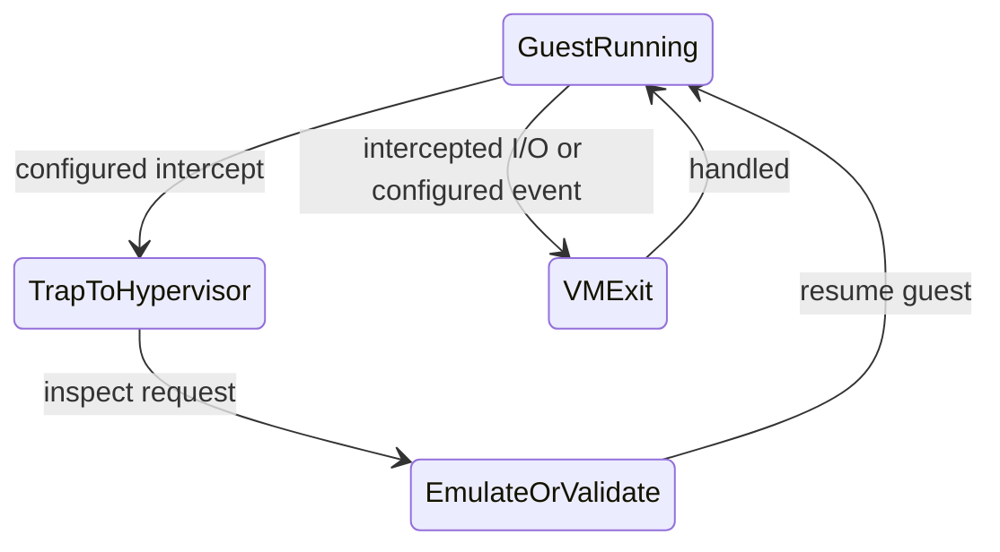

# Virtualization

가상화는 하나의 물리 시스템을 여러 격리된 실행 환경처럼 보이게 만드는 기술이다. VM은 하드웨어를 가상화하고, 컨테이너는 운영체제 커널의 관찰 범위와 자원 사용량을 제한한다.

## 문서 범위와 검증 기준

- **범위**: 하드웨어 지원 VM과 일반적인 Linux host container의 개념 비교입니다. Xen split driver는 별도 구현 예이며 이 노트는 모든 hypervisor, Docker Desktop/비Linux host와 VM-backed container runtime을 같은 구조로 가정하지 않습니다.
- **전제**: 격리와 성능은 hypervisor 유형, VT-x/AMD-V·IOMMU 설정, device passthrough, namespace/user mapping, seccomp/LSM, kernel 버전과 workload에 좌우됩니다.
- **근거 상태와 환경**: ring·page-table·I/O 경로는 대상 CPU와 제품 버전의 공식 문서로 확인합니다. “높음/낮음/베어메탈 근접”은 측정과 위협 모델이 없는 정량 결론이 아닙니다.
- **실패/재시도**: VM exit, device/backend 오류, cgroup OOM과 container restart는 서로 다른 상태입니다. 재시작 정책은 멱등성·영속 volume·backoff·상한을 포함하고 격리 위반 의심은 재시도 대신 격리·조사합니다.
- **완료 증거**: 비교에는 CPU/메모리/I/O workload와 p95/p99, host/runtime/kernel 버전, 활성화된 격리 제어를 기록합니다. 권한·resource-limit 거부 테스트와 guest/container 종료·복구 결과까지 확인해야 완료입니다.

## 1. 왜 필요한가? (Pain Point & Motivation)

하나의 서버에서 여러 워크로드를 실행하려면 서로의 파일, 프로세스, 네트워크, 메모리, 권한이 섞이지 않아야 한다. 동시에 물리 자원은 효율적으로 나눠 써야 한다.

VM과 컨테이너는 격리 경계가 다르다. VM은 별도 guest kernel과 하드웨어 지원 경계를 제공하지만 hypervisor·shared microarchitecture·emulated device·passthrough 공격면은 남는다. Linux container도 user namespace·seccomp·LSM·capability와 실제 runtime 설정을 기준으로 위협 모델을 평가해야 한다.

## 2. 현재 나의 상태 (Baseline)

흔한 출발점은 다음과 같다.

- VM과 컨테이너를 모두 "가상 서버"로만 이해한다.
- 하이퍼바이저가 CPU 특권 명령을 어떻게 처리하는지 모른다.
- 게스트 물리 주소와 실제 머신 물리 주소를 구분하지 못한다.
- namespace와 cgroup의 역할을 섞어서 말한다.
- 컨테이너 이미지 계층과 런타임 격리를 같은 개념으로 본다.

## 3. 도달하고 싶은 목표 (Target State)

목표는 격리 단위를 기준으로 VM과 컨테이너를 비교하는 것이다.

- type 1 하이퍼바이저와 type 2 하이퍼바이저를 구분한다.
- CPU 가상화에서 trap, hypercall, hardware-assisted virtualization의 역할을 설명한다.
- 메모리 가상화에서 guest physical address와 host physical address를 구분한다.
- I/O 가상화에서 에뮬레이션, paravirtual driver, passthrough의 trade-off를 이해한다.
- 컨테이너가 namespace로 view를 격리하고 cgroup으로 자원 사용량을 제한한다는 점을 설명한다.
- VM과 컨테이너의 보안 경계를 현실적으로 비교한다.

## 4. 시스템 번역 (Data Flow)

VM 실행 흐름은 다음과 같다.

```text
guest application
  -> guest kernel
  -> virtual hardware interface
  -> hypervisor
  -> physical CPU, memory, device
```

컨테이너 실행 흐름은 다음과 같다.

```text
containerized process
  -> host kernel system call
  -> namespace controls what the process can see
  -> cgroup controls how much resource it can use
  -> host kernel schedules real process
```

이 비교에서 VM은 별도 guest kernel을, 일반적인 Linux host container는 runtime host kernel 공유를 전제로 한다. Docker Desktop이나 VM-backed runtime은 container 바깥에 VM 계층을 둘 수 있다.

## 5. 핵심 구성요소 (Building Blocks)

- Hypervisor: 물리 자원을 가상 머신에 배분하고 격리하는 계층.
- Guest OS: VM 안에서 실행되는 운영체제.
- Virtual CPU: 하이퍼바이저가 물리 CPU 시간을 나눠 제공하는 CPU 추상화.
- Trap/VM exit: 설정된 event나 민감한 동작에서 guest 제어가 hypervisor로 넘어가는 경로. 모든 명령·특권 동작이 반드시 exit를 일으키는 것은 아니다.
- Hypercall: 게스트가 하이퍼바이저에게 명시적으로 요청하는 호출.
- EPT/NPT: guest physical address를 host physical address로 변환하는 하드웨어 지원.
- Virtio: VM I/O 성능을 높이기 위한 paravirtualized device 인터페이스 계열.
- Namespace: PID, mount, network, user, IPC, UTS 같은 리소스 view를 격리하는 Linux 기능.
- Cgroup: CPU, 메모리, I/O 같은 자원 사용량을 제한하고 계측하는 Linux 기능.
- Image layer: 컨테이너 파일시스템을 구성하는 읽기 전용 계층과 쓰기 계층.

## 6. 상태 전이 (State Transition)

아래는 하드웨어 가상화에서 설정상 intercept가 필요한 동작의 예시다. guest kernel은 non-root의 Ring 0에서 실행될 수 있고 ring과 root/non-root는 별도 축이다. 안전하게 직접 실행되는 명령도 있어 모든 특권 명령이 trap되는 것은 아니다.



컨테이너는 별도 커널로 전이하지 않는다. 호스트 커널이 일반 프로세스처럼 스케줄링하되 namespace와 cgroup 규칙을 적용한다.

```text
process calls kernel
kernel applies namespace/resource context and permission/capability/LSM checks
kernel performs allowed operation
process continues
```

## 7. 불변식 (Invariant: 절대 깨지면 안 되는 규칙)

- VM의 게스트 커널은 호스트 하드웨어를 임의로 직접 제어하면 안 된다.
- 게스트 메모리 주소 변환은 다른 VM이나 호스트 메모리를 침범하면 안 된다.
- passthrough 장치는 IOMMU 같은 격리 장치 없이 다른 메모리에 DMA하면 안 된다.
- 컨테이너가 공유하도록 설정한 namespace·mount·device와 격리할 자원을 구분하고, 권한·user mapping·seccomp·LSM 정책으로 허용 범위를 검증해야 한다.
- cgroup은 활성화한 controller와 설정한 한도에 따라 자원을 제어한다. CPU·memory·I/O 한도와 host 여유 용량을 검증해야 하며 cgroup 존재만으로 독점 방지가 보장되지 않는다.
- 컨테이너 격리는 호스트 커널 공유를 전제로 하므로 커널 취약점 위험을 별도로 고려해야 한다.

## 8. 가장 작은 예제 (Minimal Viable Example)

VM과 컨테이너의 차이를 한 줄씩 비교하면 다음과 같다.

| 항목 | VM | 컨테이너 |
| --- | --- | --- |
| 격리 대상 | 하드웨어 추상화 | 프로세스 view와 자원 |
| 커널 | 게스트별 별도 커널 | 호스트 커널 공유 |
| 시작 비용 | guest boot·image·복구 정책에 따라 측정 | image 준비·runtime·네트워크·애플리케이션 초기화에 따라 측정 |
| 보안 경계 | 별도 guest kernel·하드웨어 지원; hypervisor/device 공격면 존재 | host kernel 공유; namespace·권한·seccomp/LSM·runtime 정책에 의존 |
| 대표 기능 | 하이퍼바이저, 가상 장치 | namespace, cgroup, overlay filesystem |

가장 작은 판단 기준은 다음과 같다.

```text
다른 커널이 필요하면 VM을 검토한다.
같은 커널에서 프로세스 격리와 배포 단위가 필요하면 컨테이너를 검토한다.
```

## 9. 실패 사례 (What could go wrong?)

- 컨테이너를 VM과 같은 보안 경계로 가정하면 host kernel 공격면을 놓친다.
- privileged container나 host namespace 공유는 격리 수준을 크게 낮춘다.
- VM에서 에뮬레이션 I/O만 사용하면 성능 병목이 생길 수 있다.
- device passthrough를 잘못 설정하면 DMA 격리 문제가 생길 수 있다.
- overcommit을 과하게 잡으면 여러 VM이 동시에 자원을 요구할 때 성능이 급락한다.
- 컨테이너의 메모리 제한을 빼면 단일 워크로드가 host 전체를 압박할 수 있다.

## 10. 뇌 확장하기 (Evolution & Variants)

- KVM, Xen, VMware ESXi 같은 하이퍼바이저 모델을 비교한다.
- microVM, sandboxed container, gVisor, Kata Containers처럼 VM과 컨테이너 사이의 선택지를 살펴본다.
- SR-IOV, virtio, device passthrough의 성능과 격리 trade-off를 비교한다.
- user namespace와 rootless container가 권한 경계를 어떻게 바꾸는지 확인한다.
- Kubernetes의 Pod가 컨테이너 namespace를 어떻게 공유하거나 분리하는지 연결한다.

## 11. 최종 체크리스트 (Definition of Done)

- [ ] VM과 컨테이너의 커널 공유 여부를 설명할 수 있다.
- [ ] 하이퍼바이저가 특권 명령을 처리하는 흐름을 말할 수 있다.
- [ ] guest physical address와 host physical address를 구분할 수 있다.
- [ ] namespace와 cgroup의 역할 차이를 설명할 수 있다.
- [ ] 컨테이너 격리가 약해지는 설정을 예로 들 수 있다.
- [ ] VM이 필요한 경우와 컨테이너가 충분한 경우를 구분할 수 있다.

## 12. 뇌에 새기는 복습 문장 (TL;DR Blank)

VM은 하드웨어를 가상화해 별도 커널을 실행하고, 컨테이너는 호스트 커널을 공유한 채 namespace와 cgroup으로 프로세스의 관찰 범위와 자원 사용을 제한한다.
