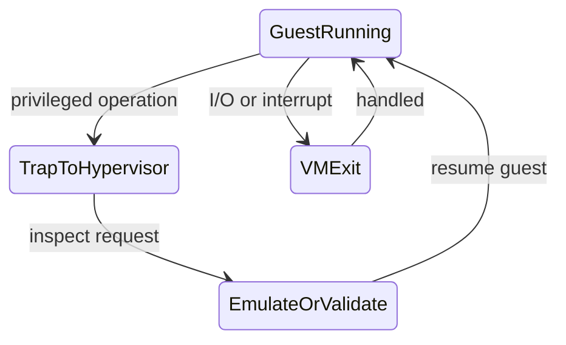

# Virtualization

가상화는 하나의 물리 시스템을 여러 격리된 실행 환경처럼 보이게 만드는 기술이다. VM은 하드웨어를 가상화하고, 컨테이너는 운영체제 커널의 관찰 범위와 자원 사용량을 제한한다.

## 1. 왜 필요한가? (Pain Point & Motivation)

하나의 서버에서 여러 워크로드를 실행하려면 서로의 파일, 프로세스, 네트워크, 메모리, 권한이 섞이지 않아야 한다. 동시에 물리 자원은 효율적으로 나눠 써야 한다.

VM과 컨테이너는 둘 다 격리를 제공하지만 격리 경계가 다르다. 이 차이를 모르면 컨테이너를 VM만큼 강한 보안 경계로 착각하거나, VM이 필요한 환경에 컨테이너만 배치하는 실수를 할 수 있다.

## 2. 현재 나의 상태 (Baseline)

흔한 출발점은 다음과 같다.

- VM과 컨테이너를 모두 "가상 서버"로만 이해한다.
- 하이퍼바이저가 CPU 특권 명령을 어떻게 처리하는지 모른다.
- 게스트 물리 주소와 실제 머신 물리 주소를 구분하지 못한다.
- namespace와 cgroup의 역할을 섞어서 말한다.
- 컨테이너 이미지 계층과 런타임 격리를 같은 개념으로 본다.

## 3. 도달하고 싶은 목표 (Target State)

목표는 격리 단위를 기준으로 VM과 컨테이너를 비교하는 것이다.

- type 1 하이퍼바이저와 type 2 하이퍼바이저를 구분한다.
- CPU 가상화에서 trap, hypercall, hardware-assisted virtualization의 역할을 설명한다.
- 메모리 가상화에서 guest physical address와 host physical address를 구분한다.
- I/O 가상화에서 에뮬레이션, paravirtual driver, passthrough의 trade-off를 이해한다.
- 컨테이너가 namespace로 view를 격리하고 cgroup으로 자원 사용량을 제한한다는 점을 설명한다.
- VM과 컨테이너의 보안 경계를 현실적으로 비교한다.

## 4. 시스템 번역 (Data Flow)

VM 실행 흐름은 다음과 같다.

```text
guest application
  -> guest kernel
  -> virtual hardware interface
  -> hypervisor
  -> physical CPU, memory, device
```

컨테이너 실행 흐름은 다음과 같다.

```text
containerized process
  -> host kernel system call
  -> namespace controls what the process can see
  -> cgroup controls how much resource it can use
  -> host kernel schedules real process
```

핵심 차이는 VM에는 게스트 커널이 있고, 컨테이너는 호스트 커널을 공유한다는 점이다.

## 5. 핵심 구성요소 (Building Blocks)

- Hypervisor: 물리 자원을 가상 머신에 배분하고 격리하는 계층.
- Guest OS: VM 안에서 실행되는 운영체제.
- Virtual CPU: 하이퍼바이저가 물리 CPU 시간을 나눠 제공하는 CPU 추상화.
- Trap: 게스트가 특권 동작을 수행할 때 하이퍼바이저로 제어가 넘어가는 사건.
- Hypercall: 게스트가 하이퍼바이저에게 명시적으로 요청하는 호출.
- EPT/NPT: guest physical address를 host physical address로 변환하는 하드웨어 지원.
- Virtio: VM I/O 성능을 높이기 위한 paravirtualized device 인터페이스 계열.
- Namespace: PID, mount, network, user, IPC, UTS 같은 리소스 view를 격리하는 Linux 기능.
- Cgroup: CPU, 메모리, I/O 같은 자원 사용량을 제한하고 계측하는 Linux 기능.
- Image layer: 컨테이너 파일시스템을 구성하는 읽기 전용 계층과 쓰기 계층.

## 6. 상태 전이 (State Transition)

VM의 특권 명령 처리 흐름은 다음과 같다.



컨테이너는 별도 커널로 전이하지 않는다. 호스트 커널이 일반 프로세스처럼 스케줄링하되 namespace와 cgroup 규칙을 적용한다.

```text
process calls kernel
kernel checks namespace and cgroup context
kernel performs allowed operation
process continues
```

## 7. 불변식 (Invariant: 절대 깨지면 안 되는 규칙)

- VM의 게스트 커널은 호스트 하드웨어를 임의로 직접 제어하면 안 된다.
- 게스트 메모리 주소 변환은 다른 VM이나 호스트 메모리를 침범하면 안 된다.
- passthrough 장치는 IOMMU 같은 격리 장치 없이 다른 메모리에 DMA하면 안 된다.
- 컨테이너 프로세스는 설정된 namespace 밖의 리소스를 볼 수 없어야 한다.
- cgroup 제한은 컨테이너가 호스트 전체 자원을 독점하지 못하게 해야 한다.
- 컨테이너 격리는 호스트 커널 공유를 전제로 하므로 커널 취약점 위험을 별도로 고려해야 한다.

## 8. 가장 작은 예제 (Minimal Viable Example)

VM과 컨테이너의 차이를 한 줄씩 비교하면 다음과 같다.

| 항목 | VM | 컨테이너 |
| --- | --- | --- |
| 격리 대상 | 하드웨어 추상화 | 프로세스 view와 자원 |
| 커널 | 게스트별 별도 커널 | 호스트 커널 공유 |
| 시작 비용 | 상대적으로 큼 | 상대적으로 작음 |
| 보안 경계 | 강함 | 커널 공유 때문에 더 약함 |
| 대표 기능 | 하이퍼바이저, 가상 장치 | namespace, cgroup, overlay filesystem |

가장 작은 판단 기준은 다음과 같다.

```text
다른 커널이 필요하면 VM을 검토한다.
같은 커널에서 프로세스 격리와 배포 단위가 필요하면 컨테이너를 검토한다.
```

## 9. 실패 사례 (What could go wrong?)

- 컨테이너를 VM과 같은 보안 경계로 가정하면 host kernel 공격면을 놓친다.
- privileged container나 host namespace 공유는 격리 수준을 크게 낮춘다.
- VM에서 에뮬레이션 I/O만 사용하면 성능 병목이 생길 수 있다.
- device passthrough를 잘못 설정하면 DMA 격리 문제가 생길 수 있다.
- overcommit을 과하게 잡으면 여러 VM이 동시에 자원을 요구할 때 성능이 급락한다.
- 컨테이너의 메모리 제한을 빼면 단일 워크로드가 host 전체를 압박할 수 있다.

## 10. 뇌 확장하기 (Evolution & Variants)

- KVM, Xen, VMware ESXi 같은 하이퍼바이저 모델을 비교한다.
- microVM, sandboxed container, gVisor, Kata Containers처럼 VM과 컨테이너 사이의 선택지를 살펴본다.
- SR-IOV, virtio, device passthrough의 성능과 격리 trade-off를 비교한다.
- user namespace와 rootless container가 권한 경계를 어떻게 바꾸는지 확인한다.
- Kubernetes의 Pod가 컨테이너 namespace를 어떻게 공유하거나 분리하는지 연결한다.

## 11. 최종 체크리스트 (Definition of Done)

- [ ] VM과 컨테이너의 커널 공유 여부를 설명할 수 있다.
- [ ] 하이퍼바이저가 특권 명령을 처리하는 흐름을 말할 수 있다.
- [ ] guest physical address와 host physical address를 구분할 수 있다.
- [ ] namespace와 cgroup의 역할 차이를 설명할 수 있다.
- [ ] 컨테이너 격리가 약해지는 설정을 예로 들 수 있다.
- [ ] VM이 필요한 경우와 컨테이너가 충분한 경우를 구분할 수 있다.

## 12. 뇌에 새기는 복습 문장 (TL;DR Blank)

VM은 하드웨어를 가상화해 별도 커널을 실행하고, 컨테이너는 호스트 커널을 공유한 채 namespace와 cgroup으로 프로세스의 관찰 범위와 자원 사용을 제한한다.
