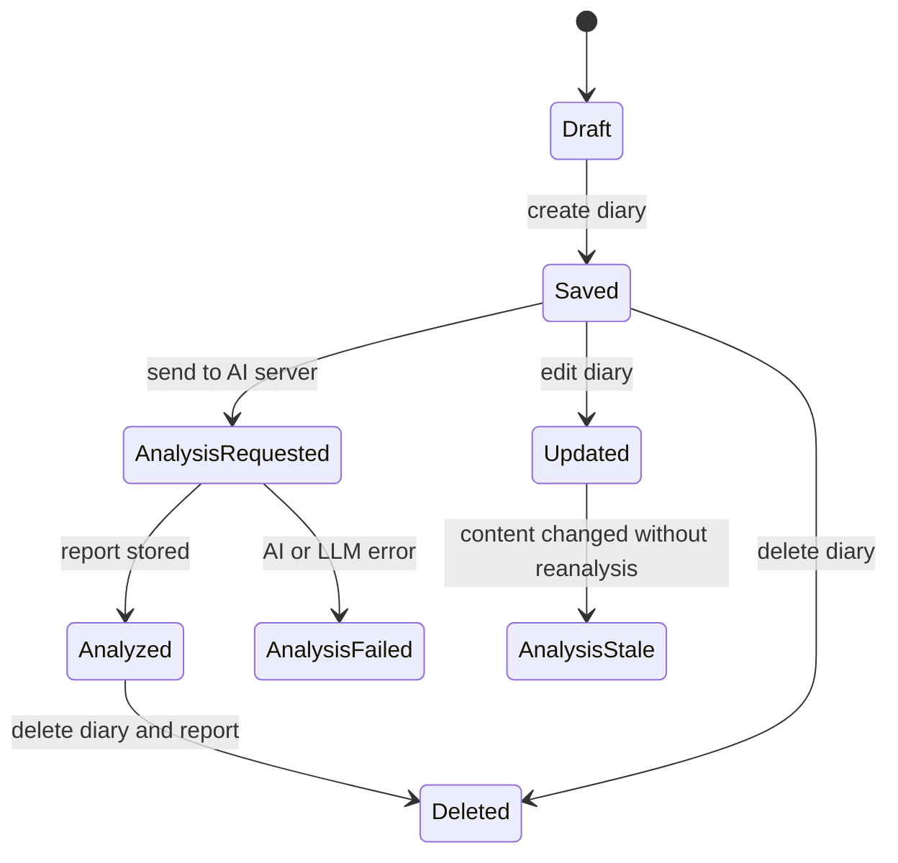

# CBT Diary System

CBT Diary System은 사용자가 모바일 앱에서 일기를 작성하면 Spring Boot 인증 서버가 데이터를 저장하고, Python AI 서버가 감정 분석 결과를 생성해 MariaDB에 연결하는 감정 기록 시스템이다.

## 1. 왜 필요한가? (Pain Point & Motivation)

감정 일기 서비스는 단순 CRUD로 끝나지 않는다. 사용자 인증, 토큰 관리, 일기 저장, AI 분석 요청, 분석 결과 저장, 캘린더 조회, 소유자 검증이 서로 연결된다.

이 문서의 목적은 기능 목록보다 데이터 흐름을 명확히 잡는 것이다. 어떤 요청이 어떤 서버를 거치고, 어떤 저장소에 기록되며, 어떤 처리가 동기 또는 비동기로 일어나는지 알면 구현과 디버깅 기준이 생긴다.

## 2. 현재 나의 상태 (Baseline)

현재 문서 기준 시스템 구성은 다음과 같다.

- Client: `CBT-front` React Native 앱.
- Auth server: Spring Boot 기반 API 서버.
- AI server: Python/FastAPI 기반 분석 서버.
- Database: MariaDB가 사용자, 일기, 분석 결과의 주 저장소.
- Cache: Redis가 refresh token 등 인증 관련 캐시 저장소로 사용됨.
- External AI: LLM API가 감정 분석 결과 생성에 사용됨.

## 3. 도달하고 싶은 목표 (Target State)

목표는 각 기능의 책임 경계를 분명히 하는 것이다.

- 인증 흐름에서 MariaDB와 Redis의 역할을 구분한다.
- 일기 저장과 AI 분석 저장을 하나의 데이터 흐름으로 설명한다.
- 일기 조회, 수정, 삭제에서 소유자 검증이 필요한 지점을 표시한다.
- AI 분석 실패가 일기 저장 성공을 뒤집을지, 별도 실패 상태로 남길지 결정한다.
- 모바일 클라이언트가 access token과 refresh token을 어떻게 다루는지 정리한다.
- 기능별 응답 지연과 비동기 처리 경계를 관찰 가능하게 만든다.

## 4. 시스템 번역 (Data Flow)

전체 흐름은 다음과 같다.

```text
React Native client
  -> Spring Boot auth/API server
  -> MariaDB for users, diaries, reports
  -> Redis for refresh token cache
  -> FastAPI AI server for diary analysis
  -> external LLM for analysis generation
```

일기 작성 흐름은 다음과 같다.

```text
client sends diary create request
  -> API server validates access token
  -> API server stores diary in MariaDB
  -> API server responds with created diary
  -> AI analysis is requested
  -> AI server calls LLM
  -> report JSON returns to API server
  -> report is stored and linked to diary
```

## 5. 핵심 구성요소 (Building Blocks)

- User: 이메일, 암호화된 비밀번호, 이름 같은 인증 기본 정보.
- Auth token: access token은 API 인증에, refresh token은 재발급에 사용된다.
- Diary: 제목, 본문, 날씨, 작성일, 작성자 정보를 가진 핵심 도메인 데이터.
- Report: AI 분석 결과. 감정, 요약, 피드백, 점수 같은 JSON 구조를 가질 수 있다.
- Auth server: 사용자 인증, 일기 CRUD, 소유자 검증, AI 결과 저장을 담당한다.
- AI server: 일기 텍스트를 분석 요청으로 변환하고 결과 JSON을 반환한다.
- MariaDB: 영속 데이터의 기준 저장소.
- Redis: 토큰이나 짧은 수명의 인증 상태를 저장하는 캐시.

## 6. 상태 전이 (State Transition)

일기의 상태는 AI 분석 여부에 따라 나눠 볼 수 있다.



기존 문서 기준으로는 수정 시 AI 재분석을 수행하지 않는다. 따라서 수정 후 기존 report가 최신 본문과 맞는지 `AnalysisStale` 상태를 명시적으로 다루는 것이 좋다.

## 7. 불변식 (Invariant: 절대 깨지면 안 되는 규칙)

- 사용자는 자기 일기만 조회, 수정, 삭제할 수 있어야 한다.
- 비밀번호는 평문으로 저장되면 안 되며 BCrypt 같은 단방향 해시로 저장해야 한다.
- refresh token은 사용자와 연결되어 재발급 시 검증 가능해야 한다.
- AI 분석 결과는 어떤 diary에서 생성되었는지 추적 가능해야 한다.
- 일기 삭제 시 연결된 report를 남길지 함께 삭제할지 정책이 일관되어야 한다.
- AI 분석 실패가 발생해도 diary 저장 상태는 명확해야 한다.

## 8. 가장 작은 예제 (Minimal Viable Example)

회원가입과 일기 작성의 최소 흐름은 다음과 같다.

```text
POST /api/users/join
  request: email, password, name
  server: email duplicate check
  server: hash password
  server: insert user into MariaDB
  response: 201 Created
```

```text
POST /api/diary
  request: title, content, weather
  server: validate token
  server: insert diary into MariaDB
  response: 201 Created
  async: request AI analysis
  async: insert report and link diary
```

이 최소 흐름만 구현되어도 인증된 사용자가 일기를 저장하고 분석 결과를 나중에 확인하는 핵심 사용자 여정이 성립한다.

## 9. 실패 사례 (What could go wrong?)

- Redis에 저장된 refresh token과 클라이언트 토큰 상태가 어긋나면 재로그인이 반복될 수 있다.
- 일기 저장은 성공했지만 AI 분석이 실패하면 사용자에게 분석 대기, 실패, 재시도 상태를 보여줘야 한다.
- 수정 시 재분석하지 않으면 report가 이전 본문을 설명하는 stale 상태가 된다.
- 삭제 시 report cascade 정책이 없으면 고아 데이터가 남는다.
- 소유자 검증 없이 `diaryId`만 조회하면 다른 사용자의 일기에 접근할 수 있다.
- 외부 LLM 응답 지연을 동기 요청에 묶으면 일기 저장 응답이 느려진다.

## 10. 뇌 확장하기 (Evolution & Variants)

- AI 분석을 HTTP 동기 호출 대신 queue 기반 비동기 작업으로 분리한다.
- report에 `pending`, `completed`, `failed`, `stale` 상태 컬럼을 둔다.
- 일기 수정 시 자동 재분석, 수동 재분석, 기존 분석 폐기 중 하나를 정책으로 정한다.
- refresh token rotation과 재사용 탐지 정책을 추가한다.
- 사용자별 월간 감정 통계 테이블을 별도로 materialize할지 검토한다.
- 모바일 로컬 저장소에는 토큰과 민감 데이터 저장 정책을 분리한다.

## 11. 최종 체크리스트 (Definition of Done)

- [ ] 회원가입, 로그인, 토큰 재발급 흐름이 문서화되어 있다.
- [ ] 일기 생성 후 AI 분석 저장 흐름이 동기/비동기로 구분되어 있다.
- [ ] 일기 조회, 수정, 삭제에서 소유자 검증 지점이 명시되어 있다.
- [ ] AI 분석 실패와 stale report 상태 처리 정책이 있다.
- [ ] MariaDB와 Redis에 저장되는 데이터 책임이 분리되어 있다.
- [ ] 외부 LLM 지연과 실패를 사용자 경험에 어떻게 반영할지 정해져 있다.

## 12. 뇌에 새기는 복습 문장 (TL;DR Blank)

CBT Diary System의 핵심은 일기 저장을 기준 데이터로 삼고, AI 분석은 실패와 지연을 견딜 수 있는 별도 상태로 연결하는 것이다.
