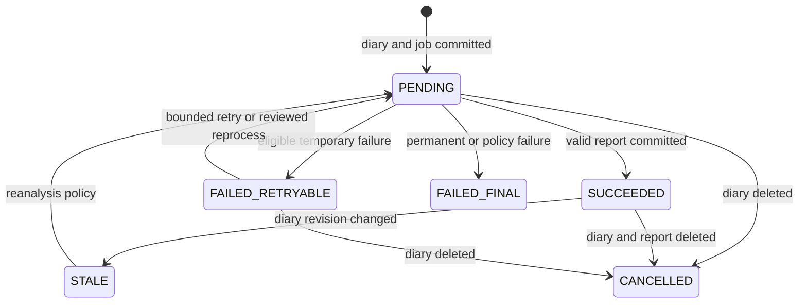

# CBT Diary System

CBT Diary System은 모바일 일기, Spring Boot API, FastAPI 분석 서비스, MariaDB와 Redis를 연결하는 감정 기록 시스템의 설계 초안이다. 아래 흐름의 구현 여부는 코드·migration·실행 증거로 각각 확인해야 한다.

## 문서 상태와 흐름 계약

- **범위**: React Native client, Spring Boot auth/application server, FastAPI AI server, MariaDB, Redis와 외부 LLM 사이의 논리 흐름입니다. 다이어그램은 현재 구현 증거가 아니라 검증할 architecture snapshot입니다.
- **전제와 버전/환경**: endpoint, token 형식·TTL, DB constraint, Redis key/TTL, model과 API 정책은 배포 버전·환경별로 기록합니다. 개발·staging·production 구성을 섞지 않습니다.
- **근거 상태**: 각 흐름은 controller/route, migration, transaction 경계, queue/outbox 설정과 contract test 링크가 있을 때만 “구현됨”으로 표시합니다. 확인하지 않은 단계와 성능은 가정 또는 미측정 상태입니다.
- **실패/재시도**: 외부 LLM·AI server·Redis 실패는 diary 저장 성공과 분리해 `PENDING`, `SUCCEEDED`, `FAILED_RETRYABLE`, `FAILED_FINAL` 상태로 기록합니다. idempotency key, 제한 재시도·backoff와 운영자 재처리 경로 없이 자동 재시도하지 않습니다.
- **완료 증거**: 요청 ID를 통해 client 응답, DB commit, 분석 job과 report를 추적하고 소유권 거부·중복·timeout·부분 실패 contract test를 남깁니다. diary 분석은 report 연결까지 완료된 경우에만 완료이며, 201 diary 응답은 분석 완료를 의미하지 않습니다.
- **민감정보 경계**: 일기와 감정 분석은 민감 데이터로 취급합니다. 최소 수집, 전송·저장 암호화, 보존/삭제, 로그 redaction, 외부 LLM 전송 동의·정책과 접근 감사를 명시합니다.

## 1. 왜 필요한가? (Pain Point & Motivation)

감정 일기 서비스는 단순 CRUD로 끝나지 않는다. 사용자 인증, 토큰 관리, 일기 저장, AI 분석 요청, 분석 결과 저장, 캘린더 조회, 소유자 검증이 서로 연결된다.

이 문서의 목적은 기능 목록보다 데이터 흐름을 명확히 잡는 것이다. 어떤 요청이 어떤 서버를 거치고, 어떤 저장소에 기록되며, 어떤 처리가 동기 또는 비동기로 일어나는지 알면 구현과 디버깅 기준이 생긴다.

## 2. 현재 나의 상태 (Baseline)

현재 문서 기준 시스템 구성은 다음과 같다.

- Client: `CBT-front` React Native 앱.
- Auth server: Spring Boot 기반 API 서버.
- AI server: Python/FastAPI 기반 분석 서버.
- Database: MariaDB가 사용자, 일기, 분석 결과의 주 저장소.
- Auth state: Redis에 refresh credential 검증 상태를 두는 설계라면 인증의 기준 저장소 역할을 한다. 손실·장애 시 재발급을 거부할지 재로그인을 요구할지 명시한다.
- External AI: LLM API가 감정 분석 결과 생성에 사용됨.

## 3. 도달하고 싶은 목표 (Target State)

목표는 각 기능의 책임 경계를 분명히 하는 것이다.

- 인증 흐름에서 MariaDB와 Redis의 역할을 구분한다.
- 일기 저장과 AI 분석 저장을 하나의 데이터 흐름으로 설명한다.
- 일기 조회, 수정, 삭제에서 소유자 검증이 필요한 지점을 표시한다.
- AI 분석 실패가 일기 저장 성공을 뒤집을지, 별도 실패 상태로 남길지 결정한다.
- 모바일 클라이언트가 access token과 refresh token을 어떻게 다루는지 정리한다.
- 기능별 응답 지연과 비동기 처리 경계를 관찰 가능하게 만든다.

## 4. 시스템 번역 (Data Flow)

전체 흐름은 다음과 같다.

```text
React Native client
  -> Spring Boot auth/API server
  -> MariaDB for users, diaries, reports
  -> Redis for refresh credential verification state
  -> FastAPI AI server for diary analysis
  -> external LLM for analysis generation
```

일기 작성 흐름은 다음과 같다.

```text
client sends diary create request
  -> API validates user, input and request idempotency key
  -> one DB transaction inserts diary revision and PENDING analysis job/outbox
  -> commit succeeds
  -> API responds 201 with diary id and analysis status
  -> durable dispatcher/worker obtains the committed job
  -> AI server calls the authorized LLM with a bounded timeout
  -> validate result schema and diary ownership/revision/deletion state
  -> idempotently upsert report and mark job SUCCEEDED in a transaction
```

## 5. 핵심 구성요소 (Building Blocks)

- User: 이메일, 단방향 해시로 저장한 비밀번호, 이름 같은 인증 기본 정보.
- Auth token: access token은 API 인증에, refresh token은 재발급에 사용된다.
- Diary: 제목, 본문, 날씨, 작성일, 작성자 정보를 가진 핵심 도메인 데이터.
- Report: AI 분석 결과. 감정, 요약, 피드백, 점수 같은 JSON 구조를 가질 수 있다.
- Auth server: 사용자 인증, 일기 CRUD, 소유자 검증, AI 결과 저장을 담당한다.
- AI server: 일기 텍스트를 분석 요청으로 변환하고 결과 JSON을 반환한다.
- MariaDB: 영속 데이터의 기준 저장소.
- Redis: 사용자·JTI 또는 credential hash·TTL과 연결된 refresh 검증 상태. raw token 로그를 남기지 않으며 장애·유실 시 재발급 정책을 정한다.

## 6. 상태 전이 (State Transition)

일기 저장과 분석 job은 별도 상태다. DB commit 전에 durable job/outbox를 함께 저장하고 분석 상태를 응답한다.



수정 시 재분석하지 않는 설계라면 기존 report를 `STALE`로 표시한다. report와 job은 diary revision을 참조하고 늦게 도착한 이전 revision 결과는 최신 분석으로 반영하지 않는다. 삭제 transaction은 report 삭제와 job 취소 또는 tombstone을 함께 기록하며 worker는 commit 직전에 이를 재확인한다.

## 7. 불변식 (Invariant: 절대 깨지면 안 되는 규칙)

- 모든 일기·report·날짜 조회는 인증된 소유자로 범위를 제한한다. 날짜는 사용자 timezone의 시작과 다음 날 시작을 UTC로 변환해 `[start, end)`로 조회한다.
- 회원가입 email 중복은 DB `UNIQUE` constraint로 최종 보장하고 경쟁하는 insert의 중복 오류를 `409 Conflict`로 매핑한다. 사전 조회만으로 보장하지 않는다.
- 비밀번호는 BCrypt 등 단방향 해시로 저장한다. refresh credential은 사용자·JTI/hash·TTL과 연결하고 rotation/reuse 탐지 및 Redis 장애 시 정책을 정한다.
- 모바일 refresh token은 OS Keychain/Keystore 같은 보호 저장소에 두며 AsyncStorage나 로그에 평문으로 남기지 않는다.
- diary와 `PENDING` job/outbox를 같은 transaction에서 commit한 뒤에만 `201`을 반환한다. `201`은 분석 성공이 아니다.
- job id와 diary revision을 이용해 중복 처리·재전달의 report 저장을 idempotent하게 만든다. 외부 LLM 호출 자체의 중복 비용 가능성도 구분한다.
- 일시 장애만 상한이 있는 backoff로 재시도하고 영구 오류·정책 거절은 `FAILED_FINAL`로 남긴다.
- 삭제는 diary/report와 job 취소·tombstone을 일관되게 처리하고 늦은 결과로 데이터를 다시 만들지 못하게 한다. 외부 LLM·로그·backup의 삭제 범위와 보존 한계도 설명한다.
- 일기와 분석의 외부 전송 동의·최소화·암호화·접근 감사가 필요하며 분석 결과를 진단·치료나 위기 대응으로 제공하지 않는다.

## 8. 가장 작은 예제 (Minimal Viable Example)

회원가입과 일기 생성의 endpoint 이름은 설계 예시다. route와 contract test로 실제 계약을 확인한다.

```text
POST /api/users/join
  request: email, password, name
  server: validate and hash password
  transaction: insert user; UNIQUE(email) enforces concurrency
  response: committed -> 201 Created; duplicate -> 409 Conflict
```

```text
POST /api/diary
  request: idempotency key, title, content, weather
  server: validate token, ownership and input
  transaction: insert diary revision + PENDING analysis job/outbox
  response: committed -> 201 Created with diaryId and analysisStatus=PENDING
  worker: bounded authorized AI request; validate schema and current revision
  transaction: idempotent report upsert + job SUCCEEDED, unless deleted/stale
```

일기 저장 직후 worker가 중단되더라도 job을 복구할 수 있어야 한다. 중복 요청·중복 메시지·분석 timeout·삭제 후 늦은 응답·timezone 경계와 타 사용자 접근 거부를 시험한 뒤 핵심 사용자 흐름이 성립했다고 판정한다.

## 9. 실패 사례 (What could go wrong?)

- Redis에 저장된 refresh token과 클라이언트 토큰 상태가 어긋나면 재로그인이 반복될 수 있다.
- 일기 저장은 성공했지만 AI 분석이 실패하면 사용자에게 분석 대기, 실패, 재시도 상태를 보여줘야 한다.
- 수정 시 재분석하지 않으면 report가 이전 본문을 설명하는 stale 상태가 된다.
- 삭제 시 report cascade 정책이 없으면 고아 데이터가 남는다.
- 소유자 검증 없이 `diaryId`만 조회하면 다른 사용자의 일기에 접근할 수 있다.
- 외부 LLM 응답 지연을 동기 요청에 묶으면 일기 저장 응답이 느려진다.

## 10. 뇌 확장하기 (Evolution & Variants)

- AI 분석을 HTTP 동기 호출 대신 queue 기반 비동기 작업으로 분리한다.
- job의 재시도·최종 실패와 report의 revision·stale 상태를 구분하고 상태 이름을 API와 DB에서 일치시킨다.
- 일기 수정 시 자동 재분석, 수동 재분석, 기존 분석 폐기 중 하나를 정책으로 정한다.
- refresh token rotation과 재사용 탐지 정책을 추가한다.
- 사용자별 월간 감정 통계 테이블을 별도로 materialize할지 검토한다.
- 모바일 로컬 저장소에는 토큰과 민감 데이터 저장 정책을 분리한다.

## 11. 최종 체크리스트 (Definition of Done)

- [ ] 회원가입, 로그인, 토큰 재발급 흐름이 문서화되어 있다.
- [ ] 일기 생성 후 AI 분석 저장 흐름이 동기/비동기로 구분되어 있다.
- [ ] 일기 조회, 수정, 삭제에서 소유자 검증 지점이 명시되어 있다.
- [ ] AI 분석 실패와 stale report 상태 처리 정책이 있다.
- [ ] MariaDB와 Redis에 저장되는 데이터 책임이 분리되어 있다.
- [ ] 외부 LLM 지연과 실패를 사용자 경험에 어떻게 반영할지 정해져 있다.

## 12. 뇌에 새기는 복습 문장 (TL;DR Blank)

CBT Diary System의 핵심은 일기 저장을 기준 데이터로 삼고, AI 분석은 실패와 지연을 견딜 수 있는 별도 상태로 연결하는 것이다.
