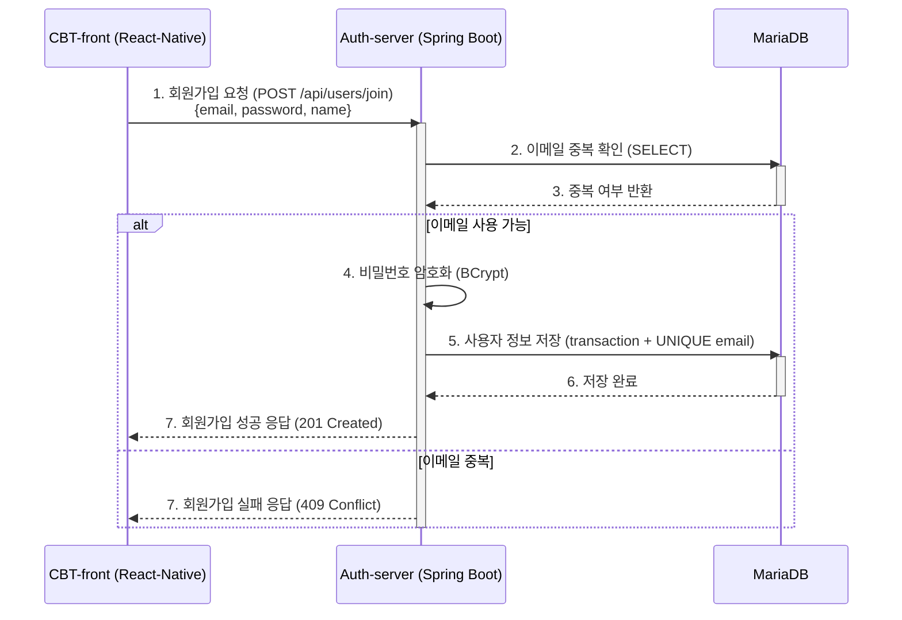
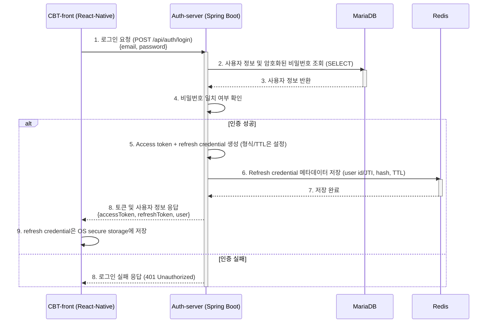
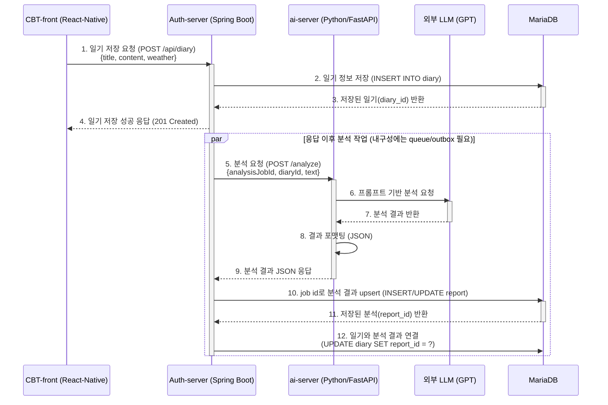
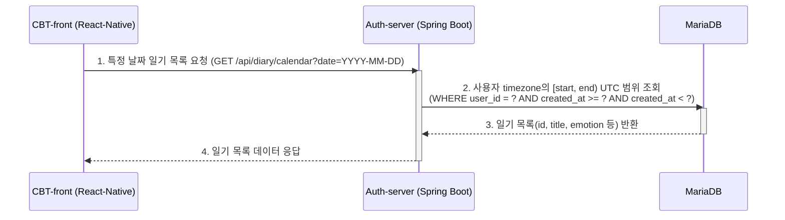
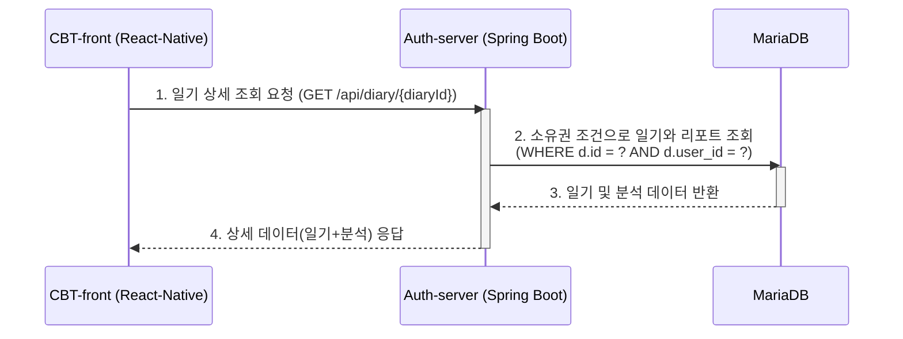
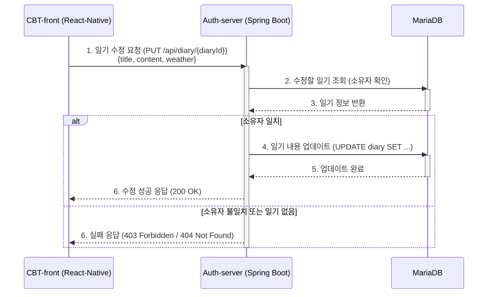
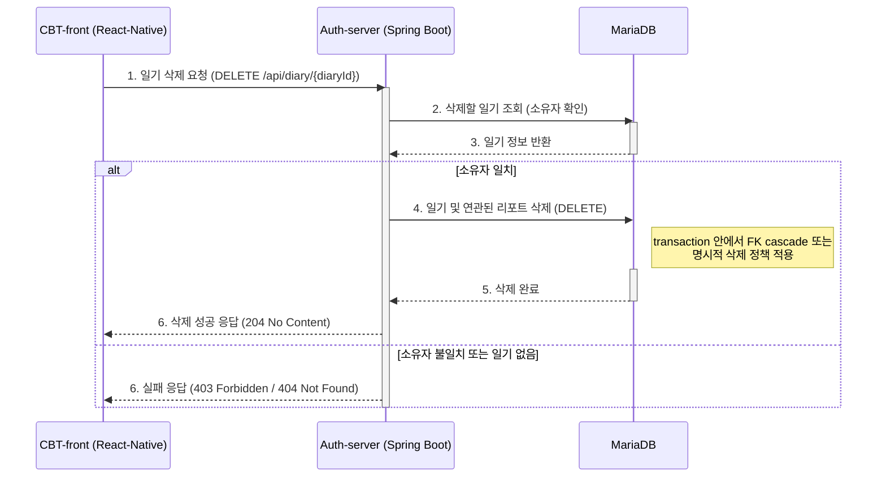
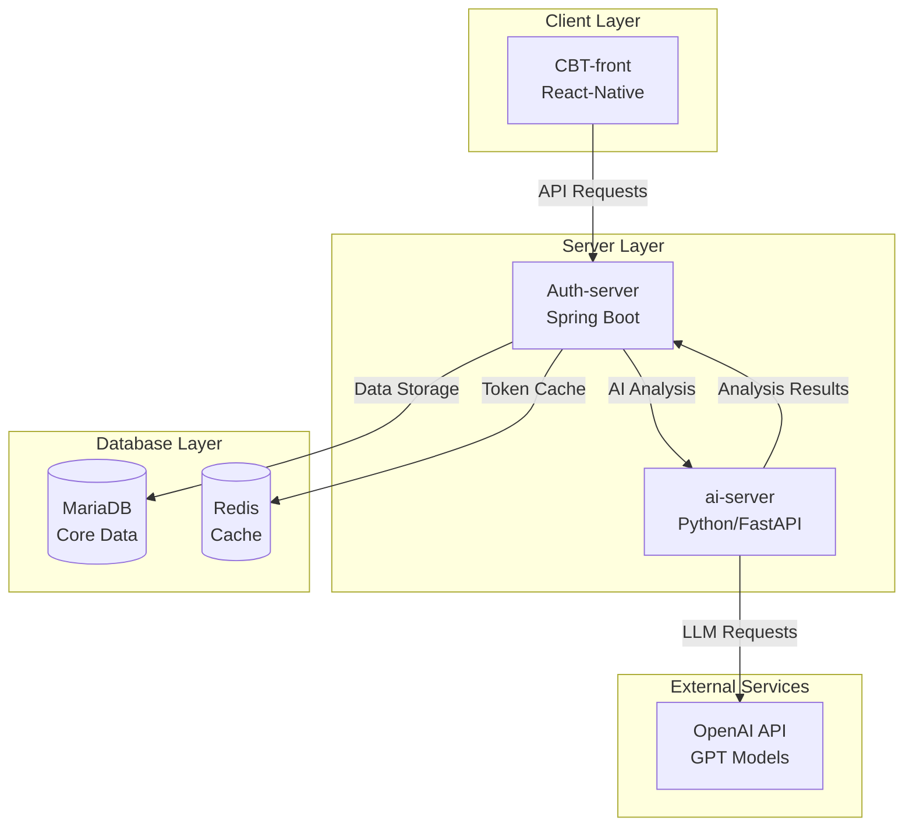
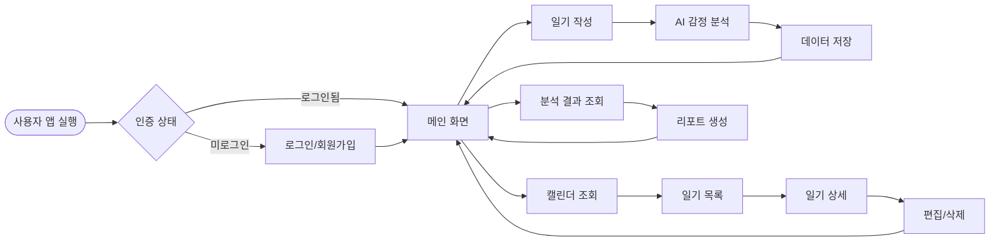

# CBT Diary: 전체 기능별 비즈니스 흐름도

본 문서는 사용자가 React-Native 클라이언트에서 특정 작업을 수행했을 때, Auth-server(Spring Boot), ai-server(Python), 그리고 데이터베이스(MariaDB, Redis) 간에 데이터가 어떻게 흐르는지 시퀀스 다이어그램으로 시각화한 것입니다.

> **참고**: 이 문서가 가정하는 주 데이터베이스는 MariaDB입니다. 실제 배포 상태는 해당 릴리스의 migration, 환경 설정과 실행 중인 schema로 확인해야 합니다.

## 문서 상태와 흐름 계약

- **범위**: React Native client, Spring Boot auth/application server, FastAPI AI server, MariaDB, Redis와 외부 LLM 사이의 논리 흐름입니다. 다이어그램은 현재 구현 증거가 아니라 검증할 architecture snapshot입니다.
- **전제와 버전/환경**: endpoint, token 형식·TTL, DB constraint, Redis key/TTL, model과 API 정책은 배포 버전·환경별로 기록합니다. 개발·staging·production 구성을 섞지 않습니다.
- **근거 상태**: 각 흐름은 controller/route, migration, transaction 경계, queue/outbox 설정과 contract test 링크가 있을 때만 “구현됨”으로 표시합니다. 확인하지 않은 단계와 아래 latency 값은 가정 또는 미측정 상태입니다.
- **실패/재시도**: 외부 LLM·AI server·Redis 실패는 diary 저장 성공과 분리해 `PENDING`, `SUCCEEDED`, `FAILED_RETRYABLE`, `FAILED_FINAL` 상태로 기록합니다. idempotency key, 제한 재시도·backoff와 운영자 재처리 경로 없이 자동 재시도하지 않습니다.
- **완료 증거**: 요청 ID를 통해 client 응답, DB commit, 분석 job과 report를 추적하고 소유권 거부·중복·timeout·부분 실패 contract test를 남깁니다. diary 분석은 report 연결까지 완료된 경우에만 완료이며, 201 diary 응답은 분석 완료를 의미하지 않습니다.
- **민감정보 경계**: 일기와 감정 분석은 민감 데이터로 취급합니다. 최소 수집, 전송·저장 암호화, 보존/삭제, 로그 redaction, 외부 LLM 전송 동의·정책과 접근 감사를 명시합니다.

## 1. 사용자 인증 (Authentication)

### 1.1. 사용자 회원가입

사용자가 앱에서 이메일, 비밀번호, 이름 등 정보를 입력하고 '회원가입'을 요청했을 때의 흐름입니다.

사전 중복 조회만으로는 동시 가입 경쟁을 막지 못합니다. DB unique constraint 위반을 동일한 409 계약으로 변환하고, 저장 실패 시 비밀번호 hash나 개인정보를 로그에 남기지 않아야 합니다.

### 1.2. 사용자 로그인 및 토큰 관리

사용자가 이메일과 비밀번호로 '로그인'을 요청했을 때의 인증 및 토큰 발급/저장 흐름입니다.

Redis 저장이 실패했는데 refresh credential을 성공 응답할지, 로그인을 실패시킬지 정책을 고정해야 합니다. 원문처럼 email과 원문 token을 key/value로 저장하지 말고 최소 식별자와 검증용 hash·만료를 사용합니다. React Native `AsyncStorage`는 일반 저장소이므로 장기 credential 보관에는 Keychain/Keystore 기반 secure storage를 사용하고 로그아웃·rotation·reuse 탐지 상태를 정의합니다.

## 2. 일기 관리 (Diary Management)

### 2.1. 일기 작성 및 AI 감정 분석

사용자가 일기를 작성하고 '저장'을 요청했을 때, 일기 저장과 AI 분석이 함께 이루어지는 비동기 흐름입니다.

HTTP 응답 뒤 메모리 내 background 작업만 시작하면 process crash 시 요청이 유실될 수 있습니다. DB transaction과 outbox/queue를 사용해 `PENDING` job을 내구성 있게 만들고, `analysisJobId`로 중복 결과를 upsert합니다. LLM timeout, rate limit, schema 오류와 안전성 거부를 서로 다른 실패 상태로 저장하며 client는 조회/push로 상태를 확인합니다. 분석 결과는 임상 진단이 아니며 사용자에게 불확실성과 실패 상태를 표시합니다.

### 2.2. 특정 날짜의 일기 목록 조회

사용자가 캘린더에서 특정 날짜를 선택했을 때, 해당 날짜에 작성된 모든 일기의 요약 정보를 가져오는 흐름입니다.

### 2.3. 일기 상세 내용 조회

사용자가 목록에서 특정 일기를 선택했을 때, 일기의 전체 내용과 AI 분석 결과를 함께 조회하는 흐름입니다.

### 2.4. 일기 수정

사용자가 기존 일기를 수정하는 흐름입니다. 이 snapshot은 수정 시 AI 재분석을 수행하지 않는다고 가정하므로 기존 report가 새 본문과 불일치하는 **STALE** 상태가 될 수 있습니다. report를 숨기거나 stale 표시할 제품 정책이 필요합니다.

### 2.5. 일기 삭제

사용자가 특정 일기를 삭제하는 흐름입니다.

삭제 완료는 diary/report transaction commit, 분석 job 취소 또는 tombstone 처리까지 포함합니다. 이미 외부 LLM으로 전송된 데이터와 backup/log의 보존·삭제 가능 범위는 별도 privacy 정책과 감사 기록으로 다룹니다.

---

## 📊 프로젝트 아키텍처 개요

## 🔄 전체 시스템 플로우

## ⚡ 주요 기능별 처리 시간 상태

기존 숫자는 측정 환경과 표본이 없어 예상값으로 사용할 수 없습니다. 아래 항목은 production-like 부하에서 route별 p50/p95/p99와 오류율을 채운 뒤 SLO 후보가 됩니다.

| 기능 | 현재 근거 상태 | 측정에 포함할 조건 |
| ---- | -------------- | ------------------ |
| 회원가입 | 미측정 | password cost, unique 충돌, DB commit |
| 로그인 | 미측정 | password 검증, Redis write, token signing |
| 일기 저장 | 미측정 | DB commit까지; AI 완료와 분리 |
| AI 감정 분석 | 미측정 | model/version, token 수, queue wait, retry |
| 일기 목록 조회 | 미측정 | 사용자별 cardinality, range index, page size |
| 일기 상세 조회 | 미측정 | 소유권 조건, report 유무, DB cache 상태 |

## 🛠️ 기술 스택 상세

### Frontend

- **React Native**: 크로스 플랫폼 모바일 앱
- **AsyncStorage**: 비민감 설정 저장 후보. 장기 인증 credential은 OS secure storage 사용

### Backend

- **Spring Boot**: RESTful API 서버
- **Spring Security**: 인증/인가 처리
- **Token contract**: access token과 refresh credential의 형식·TTL·rotation은 배포 설정으로 확인

### AI Server

- **FastAPI**: AI service HTTP framework. “빠름”은 route별 측정으로 판단
- **OpenAI API**: GPT 모델을 활용한 감정 분석

### Database

- **MariaDB**: 주 데이터베이스 (사용자, 일기, 분석 결과)
- **Redis**: 캐시 및 세션 관리

---

_이 문서는 CBT Diary의 검증 대상 데이터 흐름을 정리한 architecture snapshot입니다. 각 다이어그램의 구현 상태는 릴리스별 endpoint, schema/migration, 설정과 contract-test 증거로 확인합니다._
