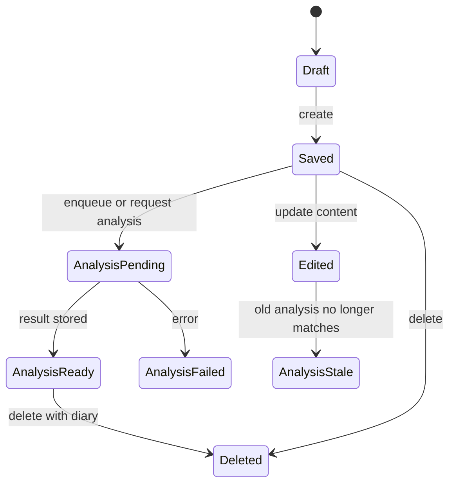

# Emotion Diary

Emotion Diary는 사용자가 일상의 감정을 기록하고, 감정 분석과 시각화를 통해 자기 패턴을 돌아볼 수 있게 하는 감정 일기 애플리케이션이다.

## 1. 왜 필요한가? (Pain Point & Motivation)

감정 기록 앱은 "일기를 저장한다"에서 끝나지 않는다. 사용자는 날짜별 기록, 감정 추세, 반복되는 단어, AI 피드백, 데이터 내보내기 같은 흐름을 기대한다.

프로젝트 문서의 목적은 기능 아이디어를 구현 가능한 경계로 나누는 것이다. 프론트엔드 상태, 서버 상태, AI 분석 상태, 통계 집계를 분리해야 기능이 늘어나도 구조가 흔들리지 않는다.

## 2. 현재 나의 상태 (Baseline)

기존 문서 기준 프로젝트 구상은 다음과 같다.

- Frontend: React, TypeScript, Tailwind CSS, Vite.
- Client state: Zustand.
- Server state: React Query.
- Backend: Spring Boot, Spring Security, Spring Data JPA.
- Database: MySQL.
- AI/ML: sentiment analysis API, GPT 기반 피드백, TensorFlow.js 가능성.
- 주요 기능: 일기 작성, 감정 선택, 이미지 첨부, 태그, 대시보드, 주간 리포트.

## 3. 도달하고 싶은 목표 (Target State)

목표는 감정 기록의 핵심 루프를 안정적으로 만드는 것이다.

- 사용자는 날짜별로 일기를 작성하고 수정할 수 있다.
- 일기에는 감정, 태그, 이미지, 본문이 연결된다.
- 분석 결과는 일기와 분리된 상태로 저장되어 실패와 재시도를 표현한다.
- 대시보드는 주간/월간 감정 추세를 보여준다.
- AI 피드백은 원문과 분석 근거를 추적할 수 있어야 한다.
- 인증과 권한 검증은 모든 개인 데이터 접근에 적용된다.

## 4. 시스템 번역 (Data Flow)

기본 시스템 흐름은 다음과 같다.

```text
React client
  -> API client
  -> Spring Boot controller
  -> service layer
  -> JPA repository
  -> MySQL
```

감정 분석이 포함된 흐름은 다음과 같다.

```text
user writes diary
  -> client sends diary request
  -> server stores diary
  -> server requests sentiment analysis
  -> analysis result is stored
  -> dashboard reads diary and aggregated emotion data
```

## 5. 핵심 구성요소 (Building Blocks)

- User: 이메일, 비밀번호, 닉네임, 생성일을 가진 사용자.
- Diary: 사용자, 날짜, 본문, 이미지 URL, 생성일을 가진 감정 기록.
- Emotion: 일기별 감정 유형과 점수.
- Tag: 일기를 검색하고 묶기 위한 사용자 정의 라벨.
- EmotionStat: 일별, 주별, 월별 집계 결과.
- Dashboard: 캘린더, 트렌드, 분포, 워드 클라우드를 보여주는 화면.
- AI feedback: 감정 분석과 사용자에게 보여줄 해석 문구.
- Export: 사용자가 자기 데이터를 PDF나 CSV로 가져갈 수 있는 기능.

## 6. 상태 전이 (State Transition)

일기와 분석의 상태 전이는 분리해서 본다.



대시보드는 `Saved` 데이터만으로도 동작해야 하며, `AnalysisReady`가 되면 분석 기반 위젯을 갱신한다.

## 7. 불변식 (Invariant: 절대 깨지면 안 되는 규칙)

- 사용자는 자기 일기와 통계만 조회할 수 있어야 한다.
- 일기 본문과 분석 결과는 같은 diary id로 추적 가능해야 한다.
- 분석 실패가 일기 저장 실패로 둔갑하면 안 된다.
- 감정 점수의 범위와 감정 유형 목록은 서버와 클라이언트가 같은 기준을 써야 한다.
- 이미지 첨부는 소유자, 크기, MIME type, 저장 위치 정책을 가져야 한다.
- 통계 집계는 원본 일기 삭제나 수정 후 stale 상태로 남으면 안 된다.

## 8. 가장 작은 예제 (Minimal Viable Example)

MVP는 다음 API만으로도 성립한다.

```text
POST /api/auth/register
POST /api/auth/login
POST /api/diary
GET /api/diary?date=YYYY-MM-DD
GET /api/diary/{id}
PUT /api/diary/{id}
DELETE /api/diary/{id}
GET /api/stats/weekly
```

최소 데이터 모델은 다음과 같다.

```text
User 1 -> N Diary
Diary 1 -> N Emotion
Diary 1 -> N Tag
User 1 -> N EmotionStat
```

이 단계에서는 화려한 AI 피드백보다 인증, CRUD, 날짜별 조회, 기본 감정 집계가 먼저 안정되어야 한다.

## 9. 실패 사례 (What could go wrong?)

- 감정 분석 API가 느리면 일기 저장 화면이 멈춘 것처럼 보일 수 있다.
- 분석 결과를 즉시 필수값으로 만들면 외부 AI 장애가 핵심 기록 기능을 막는다.
- 클라이언트와 서버의 감정 유형 목록이 다르면 통계가 깨진다.
- 이미지 업로드 정책이 없으면 저장 비용과 개인정보 위험이 커진다.
- 월간 통계를 매번 원본 전체에서 계산하면 데이터가 늘수록 응답이 느려진다.
- AI 피드백을 단정적인 조언처럼 표시하면 사용자에게 부적절한 해석을 줄 수 있다.

## 10. 뇌 확장하기 (Evolution & Variants)

- 분석 결과를 즉시 생성하지 않고 background job으로 처리한다.
- `EmotionStat`을 materialized aggregate로 둘지, 요청 시 계산할지 결정한다.
- 태그 추천, 감정 알림, 데이터 내보내기, PWA, 모바일 앱을 단계별 확장으로 둔다.
- AI 피드백에는 의료적 진단이 아니라 자기 성찰 보조라는 제품 경계를 명확히 둔다.
- 소셜 로그인, 계정 삭제, 데이터 다운로드 같은 개인정보 권리를 별도 요구사항으로 관리한다.

## 11. 최종 체크리스트 (Definition of Done)

- [ ] 인증된 사용자만 개인 일기와 통계에 접근할 수 있다.
- [ ] 일기 CRUD와 날짜별 조회가 안정적으로 동작한다.
- [ ] 분석 상태가 pending, ready, failed, stale 중 하나로 표현된다.
- [ ] 대시보드는 분석 결과가 없어도 기본 기록을 보여줄 수 있다.
- [ ] 감정 유형과 점수 범위가 서버/클라이언트에서 일치한다.
- [ ] 데이터 내보내기와 삭제 정책의 방향이 정해져 있다.

## 12. 뇌에 새기는 복습 문장 (TL;DR Blank)

Emotion Diary의 핵심은 감정 기록을 먼저 안전하게 저장하고, AI 분석과 통계는 실패와 지연을 견딜 수 있는 별도 상태로 연결하는 것이다.
