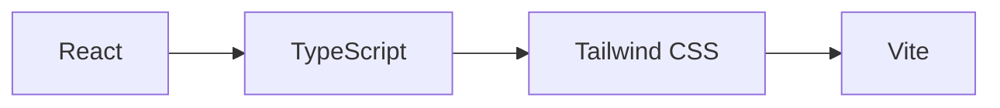
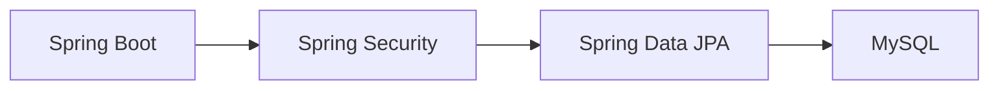
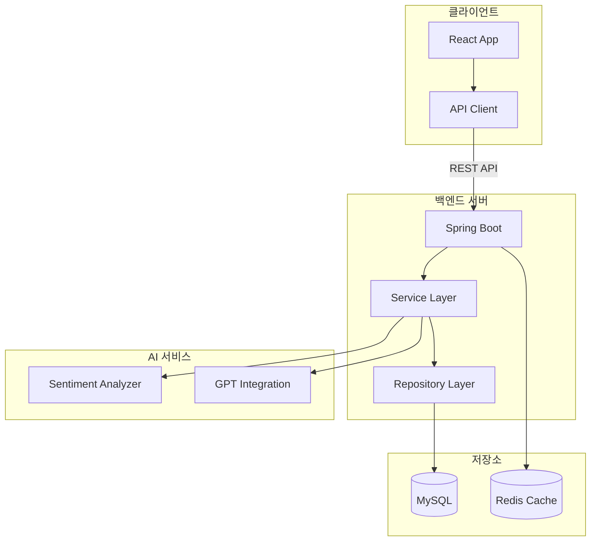
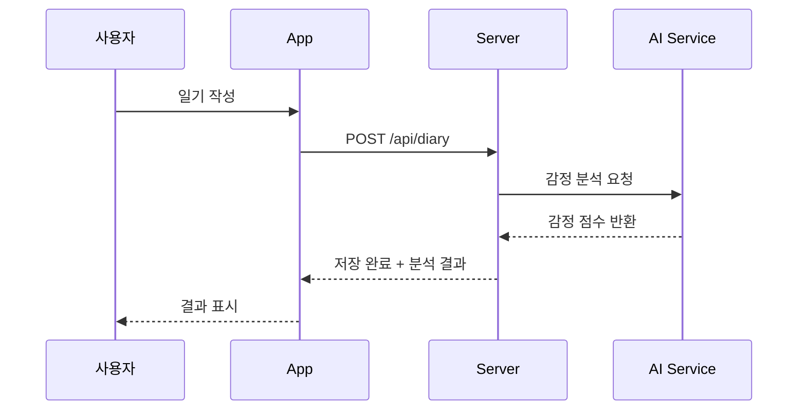
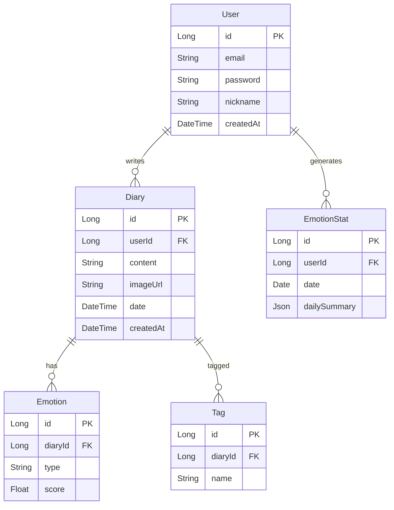
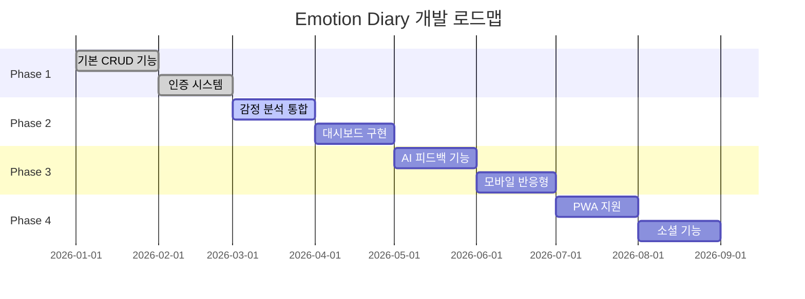

# Emotion Diary 프로젝트

감정 기록 및 분석 애플리케이션 프로젝트 문서입니다.

---

## 📋 프로젝트 개요

**Emotion Diary**는 사용자가 일상의 감정을 기록하고 AI를 활용하여 감정 패턴을 분석하는 웹 애플리케이션입니다.

| 항목 | 내용 |
|------|------|
| **프로젝트명** | Emotion Diary (감정 일기) |
| **목적** | 일상 감정 기록 및 패턴 분석 |
| **대상 사용자** | 자기 성찰 및 정서 관리에 관심있는 사용자 |
| **개발 기간** | 진행중 |

---

## 🛠️ 기술 스택

### Frontend



| 기술 | 버전 | 용도 |
|------|------|------|
| React | 18.x | UI 컴포넌트 |
| TypeScript | 5.x | 타입 안정성 |
| Tailwind CSS | 3.x | 스타일링 |
| Vite | 5.x | 빌드 도구 |
| React Query | 5.x | 서버 상태 관리 |
| Zustand | 4.x | 클라이언트 상태 관리 |

### Backend



| 기술 | 버전 | 용도 |
|------|------|------|
| Spring Boot | 3.x | 애플리케이션 프레임워크 |
| Spring Security | 6.x | 인증/인가 |
| Spring Data JPA | 3.x | 데이터 액세스 |
| MySQL | 8.x | 데이터 저장소 |

### AI/ML

| 기술 | 용도 |
|------|------|
| Sentiment Analysis API | 감정 분석 |
| OpenAI GPT | 일기 피드백 생성 |
| TensorFlow.js | 클라이언트 사이드 분석 |

---

## 🏗️ 시스템 아키텍처



---

## ✨ 주요 기능

### 1. 감정 기록 (Emotion Logging)



**기능 상세:**
- 📝 일기 작성 (마크다운 지원)
- 🎨 감정 선택 (8가지 기본 감정)
- 📷 이미지 첨부
- 🏷️ 태그 추가

### 2. 감정 분석 (Sentiment Analysis)

```
입력: "오늘 정말 힘든 하루였지만, 친구를 만나서 기분이 좋아졌다."

분석 결과:
┌─────────────────────────────────────────────┐
│  전반적 감정: 긍정적 (0.65)                 │
├─────────────────────────────────────────────┤
│  감정 분포:                                 │
│  ██████████████████░░ 행복 (72%)           │
│  ████████░░░░░░░░░░░░ 피로 (40%)           │
│  ██████░░░░░░░░░░░░░░ 안도 (32%)           │
└─────────────────────────────────────────────┘
```

### 3. 시각화 대시보드

| 차트 유형 | 설명 |
|-----------|------|
| 감정 캘린더 | 월별 감정 히트맵 |
| 감정 트렌드 | 주간/월간 감정 변화 그래프 |
| 감정 분포 | 파이 차트로 감정 비율 표시 |
| 워드 클라우드 | 자주 사용하는 단어 시각화 |

### 4. AI 피드백

```
📊 주간 리포트

이번 주 감정 요약:
- 월~화: 스트레스 지수 높음 (업무 관련)
- 수~목: 점진적 회복
- 금~일: 긍정적 감정 우세

💡 AI 제안:
"이번 주 수요일부터 감정이 회복되기 시작했네요. 
수요일에 어떤 일이 있었는지 돌아보면 
스트레스 해소 방법을 찾는 데 도움이 될 수 있습니다."
```

---

## 📊 데이터 모델



---

## 🔌 API 엔드포인트

### 인증 API

| Method | Endpoint | 설명 |
|--------|----------|------|
| POST | `/api/auth/register` | 회원가입 |
| POST | `/api/auth/login` | 로그인 |
| POST | `/api/auth/refresh` | 토큰 갱신 |

### 일기 API

| Method | Endpoint | 설명 |
|--------|----------|------|
| GET | `/api/diary` | 일기 목록 조회 |
| GET | `/api/diary/{id}` | 일기 상세 조회 |
| POST | `/api/diary` | 일기 작성 |
| PUT | `/api/diary/{id}` | 일기 수정 |
| DELETE | `/api/diary/{id}` | 일기 삭제 |

### 분석 API

| Method | Endpoint | 설명 |
|--------|----------|------|
| GET | `/api/stats/weekly` | 주간 통계 |
| GET | `/api/stats/monthly` | 월간 통계 |
| GET | `/api/stats/emotions` | 감정 분포 |

---

## 📁 프로젝트 구조

### Frontend

```
frontend/
├── src/
│   ├── components/
│   │   ├── diary/           # 일기 관련 컴포넌트
│   │   ├── emotion/         # 감정 선택/표시
│   │   ├── chart/           # 차트 컴포넌트
│   │   └── common/          # 공통 컴포넌트
│   ├── pages/
│   │   ├── Home.tsx
│   │   ├── DiaryWrite.tsx
│   │   ├── DiaryDetail.tsx
│   │   └── Dashboard.tsx
│   ├── hooks/               # 커스텀 훅
│   ├── stores/              # Zustand 스토어
│   ├── services/            # API 서비스
│   └── utils/               # 유틸리티 함수
└── package.json
```

### Backend

```
backend/
├── src/main/java/com/emotion/diary/
│   ├── controller/          # REST 컨트롤러
│   ├── service/             # 비즈니스 로직
│   ├── repository/          # JPA 레포지토리
│   ├── entity/              # JPA 엔티티
│   ├── dto/                 # 데이터 전송 객체
│   ├── config/              # 설정 클래스
│   └── security/            # 보안 설정
└── pom.xml
```

---

## 🚀 로드맵



### 향후 계획

- [ ] 소셜 로그인 (Google, Kakao)
- [ ] 감정 알림 기능
- [ ] 데이터 내보내기 (PDF, CSV)
- [ ] 다국어 지원
- [ ] 모바일 앱 (React Native)

---

## 🔗 관련 문서

- [JPA 관계 매핑](../databases/jpa/relationships.md)
- [Spring Boot Redis 통합](../databases/redis/springboot-integration.md)
- [Docker 설치 가이드](../development/docker/installation.md)

---

*프로젝트 관련 문의는 이슈 트래커를 이용해주세요.*
