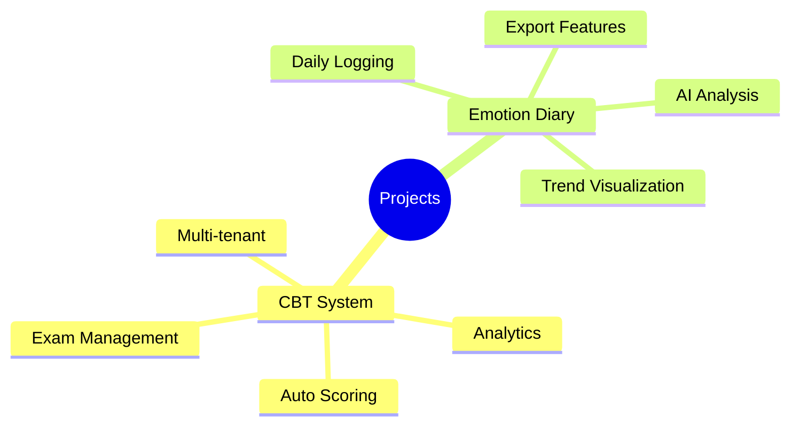

# Projects Documentation

> Project planning, architecture, and implementation documents

## Index contract

- "Active" means the project has a maintained planning or implementation document; it does not imply production availability.
- Each project page should distinguish proposed, implemented, validated, deployed, and deprecated features.
- Completion evidence belongs in the project page and should name the environment, acceptance path, known failures, owner, and next decision.
- Update this index when a project changes status or path so the card and project document do not contradict each other.

---

## Active Projects

-   :material-school:{ .lg .middle } **CBT System**

    ---

    Computer-Based Testing platform for exam management and automated scoring.

    [:octicons-arrow-right-24: View Documentation](cbt-system.md)

-   :material-emoticon-happy:{ .lg .middle } **Emotion Diary**

    ---

    Emotional tracking application with AI-powered analysis and insights.

    [:octicons-arrow-right-24: View Documentation](emotion-diary.md)

---

## Project Overview

---

## Quick Links

| Project | Stack | Status |
|---------|-------|--------|
| [CBT System](cbt-system.md) | Spring Boot, React, PostgreSQL | Active |
| [Emotion Diary](emotion-diary.md) | React, TypeScript, Spring Boot, MySQL | Active |

---

## Project Templates

Looking to start a new project? Check out:

- [Architecture Design Prompts](../prompts/architecture.md)
- [Database Schema Guide](../prompts/database.md)
