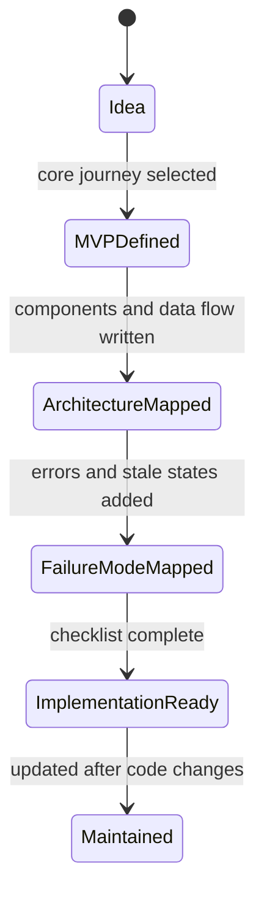

# Projects

이 영역은 개인 프로젝트의 기능 흐름, 시스템 경계, 데이터 모델, 실패 상태를 정리하는 문서 모음이다.

## 1. 왜 필요한가? (Pain Point & Motivation)

프로젝트 문서가 기능 목록만 담고 있으면 구현 중에 책임 경계가 흐려진다. 어떤 서버가 어떤 데이터를 저장하는지, AI 분석 실패가 어떤 상태로 남는지, 사용자가 어떤 흐름으로 기능을 경험하는지 따로 추적해야 한다.

프로젝트 인덱스의 목적은 각 프로젝트가 어떤 문제를 풀고, 어느 문서를 먼저 읽어야 하는지 빠르게 안내하는 것이다.

## 2. 현재 나의 상태 (Baseline)

현재 프로젝트 문서는 다음 두 개를 포함한다.

- [CBT Diary System](cbt-system.md): React Native, Spring Boot, FastAPI, MariaDB, Redis 기반 감정 일기/AI 분석 시스템 흐름.
- [Emotion Diary](emotion-diary.md): React, TypeScript, Spring Boot, MySQL 기반 감정 기록과 대시보드 프로젝트 설계.

두 문서는 모두 감정 기록과 분석을 다루지만, 하나는 모바일/서버 간 데이터 흐름에 초점이 있고 다른 하나는 웹 앱 기능과 제품 구조에 초점이 있다.

## 3. 도달하고 싶은 목표 (Target State)

프로젝트 문서는 다음 수준까지 정리되어야 한다.

- 핵심 사용자 여정이 한눈에 보인다.
- 프론트엔드, 백엔드, AI 서버, 데이터베이스 책임이 구분된다.
- 저장 성공, 분석 대기, 분석 실패, 분석 stale 같은 상태가 드러난다.
- 권한 검증과 개인정보 보호 지점이 명시된다.
- MVP와 확장 기능이 섞이지 않는다.
- 구현 전 체크리스트로 사용할 수 있다.

## 4. 시스템 번역 (Data Flow)

공통 흐름은 다음과 같다.

```text
user action
  -> client state update
  -> API request
  -> authentication and authorization
  -> domain service
  -> database write or read
  -> optional AI analysis
  -> response and UI state update
```

문서를 읽을 때는 기능명이 아니라 데이터가 어디에서 생성되고 어디에 저장되는지를 따라간다.

## 5. 핵심 구성요소 (Building Blocks)

- Project overview: 프로젝트가 해결하려는 문제와 대상 사용자.
- User journey: 사용자가 실제로 밟는 화면과 요청 흐름.
- Architecture: 클라이언트, 서버, AI, 저장소의 책임 분리.
- Domain model: User, Diary, Emotion, Report, Stat 같은 핵심 데이터.
- API contract: 요청, 응답, 인증, 오류 상태.
- State model: draft, saved, pending, completed, failed, stale 같은 상태.
- Risk list: 외부 API 장애, 권한 누락, 데이터 불일치, 성능 병목.

## 6. 상태 전이 (State Transition)

프로젝트 문서 자체의 성숙도도 상태로 관리할 수 있다.



문서는 구현보다 앞서거나 뒤처질 수 있다. 중요한 것은 현재 코드와 다른 부분을 명시적으로 갱신하는 것이다.

## 7. 불변식 (Invariant: 절대 깨지면 안 되는 규칙)

- 프로젝트 문서는 실제 시스템 흐름과 충돌하는 설명을 남기면 안 된다.
- 인증과 소유자 검증은 개인 데이터 프로젝트에서 생략하면 안 된다.
- 외부 AI 호출은 실패 가능성을 전제로 상태를 설계해야 한다.
- MVP 기능과 향후 기능은 분리해서 써야 한다.
- 데이터 모델은 삭제, 수정, 재분석 시 일관성 정책을 포함해야 한다.
- 인덱스 설명은 각 프로젝트 본문과 같은 의미를 가져야 한다.

## 8. 가장 작은 예제 (Minimal Viable Example)

새 프로젝트 문서를 추가할 때 최소 구조는 다음과 같다.

```text
Project name
target user
core user journey
system components
main data model
minimum API list
state transitions
failure modes
definition of done
```

예를 들어 감정 일기 프로젝트라면 `일기 작성 -> 저장 -> 분석 대기 -> 분석 완료 -> 대시보드 반영` 흐름이 먼저 있어야 한다.

## 9. 실패 사례 (What could go wrong?)

- 프로젝트 인덱스가 본문과 다른 제품을 설명하면 이후 구현 판단이 흔들린다.
- 기능 아이디어가 MVP와 섞이면 우선순위가 사라진다.
- 데이터 모델 없이 화면부터 나열하면 API와 상태 관리가 뒤늦게 꼬인다.
- AI 분석을 항상 성공한다고 가정하면 장애 시 사용자 기록 기능까지 멈춘다.
- 개인정보 데이터를 다루면서 삭제, 내보내기, 접근 권한을 문서화하지 않으면 나중에 구조 변경 비용이 커진다.

## 10. 뇌 확장하기 (Evolution & Variants)

- 프로젝트별 ADR을 추가해 큰 설계 결정을 추적한다.
- API 문서를 OpenAPI 스키마로 분리하고 이 문서에서는 흐름과 의도를 관리한다.
- 데이터 모델 변경은 migration 문서와 연결한다.
- AI 기능은 prompt, 입력 데이터, 출력 JSON, 실패 정책을 별도 문서로 분리한다.
- 운영 단계에서는 로그, 메트릭, 백업, 배포, 롤백 문서를 연결한다.

## 11. 최종 체크리스트 (Definition of Done)

- [ ] 인덱스의 프로젝트 설명이 각 본문과 일치한다.
- [ ] 각 프로젝트는 핵심 사용자 여정을 가진다.
- [ ] 각 프로젝트는 시스템 구성요소와 데이터 흐름을 설명한다.
- [ ] 각 프로젝트는 실패 상태와 권한 검증 지점을 포함한다.
- [ ] MVP와 향후 확장 기능이 분리되어 있다.
- [ ] 관련 아키텍처와 데이터베이스 문서로 이동할 수 있다.

## 12. 뇌에 새기는 복습 문장 (TL;DR Blank)

프로젝트 문서는 기능 목록이 아니라, 사용자 행동이 시스템 구성요소와 데이터 상태로 어떻게 번역되는지 기록하는 설계 기준이다.
