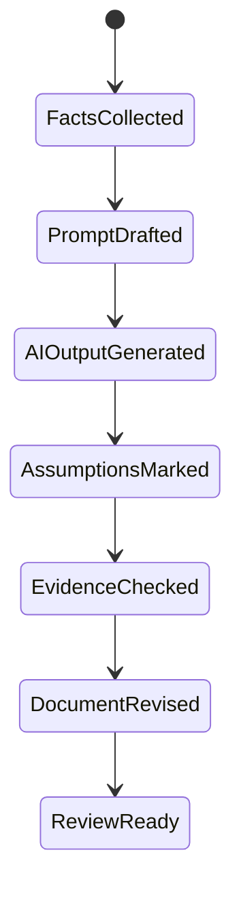

# Architecture Design Prompts

이 문서는 AI에게 소프트웨어 아키텍처 문서 초안을 요청할 때 사용할 프롬프트 구조와 검증 기준을 정리한다.

## 1. 왜 필요한가? (Pain Point & Motivation)

아키텍처 문서는 시스템의 실제 책임 경계와 런타임 흐름을 설명해야 한다. 하지만 AI에게 막연히 "아키텍처 문서 써줘"라고 요청하면 화려한 다이어그램과 일반론은 나오지만, 실제 서비스와 맞지 않는 추측이 섞이기 쉽다.

좋은 프롬프트는 AI에게 역할만 주는 것이 아니라 입력 범위, 모르는 정보의 처리 방식, 산출물 구조, 검증 기준을 함께 준다.

## 2. 현재 나의 상태 (Baseline)

흔한 출발점은 다음과 같다.

- 시스템 이름과 기술 스택만 주고 아키텍처 문서를 요청한다.
- 데이터 흐름과 실패 경로를 빼고 컴포넌트 목록만 만든다.
- C4 수준을 섞어 System Context, Container, Component 설명이 뒤엉킨다.
- 인증, 배포, 외부 시스템, 저장소 책임을 추측으로 채운다.
- 모르는 부분을 질문하지 않고 그럴듯한 내용으로 메운다.

## 3. 도달하고 싶은 목표 (Target State)

목표는 검증 가능한 아키텍처 문서 초안을 얻는 것이다.

- AI가 확인된 정보와 추정을 구분한다.
- C4 수준별로 설명 범위를 나눈다.
- 핵심 workflow의 trigger, data flow, failure point를 포함한다.
- API와 데이터 저장소의 책임이 명확하다.
- 누락된 정보는 `[CLARIFICATION_NEEDED]`로 남긴다.
- 산출물이 구현자와 리뷰어가 바로 확인할 수 있는 구조를 가진다.

## 4. 시스템 번역 (Data Flow)

프롬프트 사용 흐름은 다음과 같다.

```text
collect project facts
  -> provide constraints and known unknowns
  -> request C4 level output
  -> request workflow and failure paths
  -> review assumptions
  -> revise with actual code or config evidence
```

AI 출력은 설계 결정을 확정하는 증거가 아니다. 초안 생성 후 실제 코드, 설정, 배포 구조와 비교해야 한다.

## 5. 핵심 구성요소 (Building Blocks)

- Role: AI가 맡을 역할. 예: senior software architect and technical writer.
- Context: 시스템 목적, 사용자, 기술 스택, 배포 환경, 현재 제약.
- Scope: 이번에 문서화할 C4 수준과 제외할 영역.
- Evidence: 실제 코드 경로, API 목록, DB 스키마, 배포 파일, 운영 로그 등 근거.
- Output format: 원하는 섹션, 표, 다이어그램, 체크리스트.
- Unknown handling: 모르는 정보는 질문이나 TODO로 남기게 하는 규칙.
- Review checklist: 추정, 누락, 위험, 불일치를 확인하는 기준.

## 6. 상태 전이 (State Transition)

아키텍처 문서 작성은 다음 상태로 진행한다.



`EvidenceChecked`를 건너뛰면 문서가 실제 시스템이 아니라 AI가 상상한 시스템을 설명할 수 있다.

## 7. 불변식 (Invariant: 절대 깨지면 안 되는 규칙)

- 확인되지 않은 기술, API, 데이터베이스, 메시지 큐를 사실처럼 쓰면 안 된다.
- C4 Level 1은 사용자와 외부 시스템, Level 2는 실행 가능한 컨테이너, Level 3은 내부 컴포넌트에 집중해야 한다.
- 핵심 workflow에는 성공 경로뿐 아니라 실패 경로가 포함되어야 한다.
- 아키텍처 문서는 구현체와 충돌하는 책임 분리를 제안하면 안 된다.
- 모르는 정보는 추측하지 말고 질문이나 TODO로 남겨야 한다.
- 보안, 데이터 소유권, 운영 경계는 "나중에"로 밀면 안 된다.

## 8. 가장 작은 예제 (Minimal Viable Example)

기본 프롬프트는 다음처럼 시작할 수 있다.

```markdown
Role: senior software architect and technical writer.

Use only the provided facts. If information is missing, write
[CLARIFICATION_NEEDED: specific missing question] instead of inventing details.

Document this system using C4 Level 1 and Level 2:
- System name:
- Primary purpose:
- Users:
- External systems:
- Containers:
- Datastores:
- Authentication:
- Deployment environment:

For each critical workflow, include:
- Trigger
- Steps
- Components involved
- Data read and written
- Failure points
- Observability signals
```

산출물에 API가 필요하다면 다음 항목을 추가한다.

```markdown
For each endpoint, document method, path, auth requirement, request body,
success response, error responses, side effects, and data ownership checks.
```

## 9. 실패 사례 (What could go wrong?)

- AI가 일반적인 "React + Spring + PostgreSQL" 구조를 실제 시스템처럼 써 버릴 수 있다.
- 다이어그램이 컴포넌트 이름은 많지만 데이터 흐름과 실패 지점이 없을 수 있다.
- API 문서가 인증과 권한 검증을 생략할 수 있다.
- 캐시, 큐, 외부 API 같은 운영상 중요한 의존성이 빠질 수 있다.
- C4 Level 3에서 내부 클래스까지 과도하게 내려가 문서가 유지보수 불가능해질 수 있다.
- 문서가 실제 코드 변경 후 갱신되지 않아 오래된 설계가 된다.

## 10. 뇌 확장하기 (Evolution & Variants)

- ADR 템플릿을 추가해 "왜 이 구조를 선택했는가"를 따로 기록한다.
- threat model prompt를 붙여 인증, 권한, 데이터 노출 위험을 점검한다.
- production readiness prompt를 붙여 로그, 메트릭, 알림, 롤백을 점검한다.
- database prompt와 연결해 schema ownership과 migration 순서를 문서화한다.
- 코드 기반 문서화가 필요하면 파일 경로와 실제 엔트리포인트를 입력으로 제공한다.

## 11. 최종 체크리스트 (Definition of Done)

- [ ] 확인된 사실과 추정이 분리되어 있다.
- [ ] C4 수준별 범위가 섞이지 않는다.
- [ ] 사용자, 외부 시스템, 컨테이너, 저장소가 명확하다.
- [ ] 핵심 workflow에 데이터 흐름과 실패 지점이 포함되어 있다.
- [ ] 인증, 권한, 데이터 소유권 검사가 문서에 있다.
- [ ] 누락 정보는 `[CLARIFICATION_NEEDED]`로 남아 있다.

## 12. 뇌에 새기는 복습 문장 (TL;DR Blank)

아키텍처 프롬프트의 핵심은 AI에게 그럴듯한 구조를 만들게 하는 것이 아니라, 확인된 사실과 모르는 정보를 분리해 검증 가능한 문서 초안을 만들게 하는 것이다.
